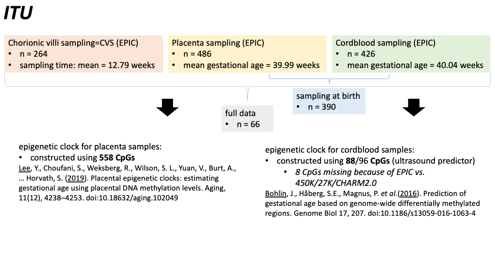
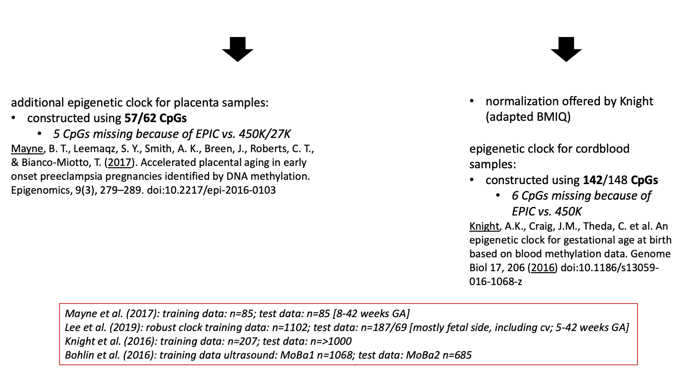
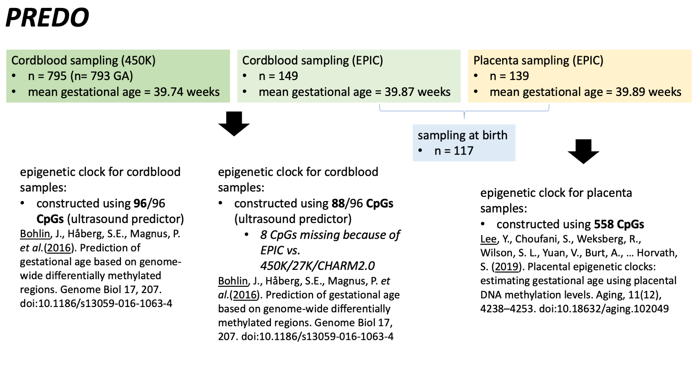

<style type="text/css">
.main-container {
  max-width: 2000px;
  margin-left: auto;
  margin-right: auto;
}
</style>


***
##### **Jump to sections** {#top}  
***

**General**  
[start with loading packages & functions](#loadpacks)  
[loading data & Sample Overview](#loadData)  

Prepare data for elastic net models:  
[CVS: data preparation for models](#dataprepCVSITU)  
[Cord blood: data preparation](#dataprepCordITU)  
[Placenta: data preparation](#dataprepPlacentaITU)  
[Cord blood EPIC: data preparation](#dataprepCordPREDO)   
[Cord blood 450K: data preparation](#dataprepCord450KPREDO)  
[Placenta: data preparation](#dataprepPlacentaPREDO)  

[SampleVisualization](#Samples)  

**Basics & Descriptive Statistics:**  
[ITU](#ITUDescriptive)  
[PREDO](#PREDODescriptive)  

[comparison PREDO & ITU in predictors](#predictorsITUPREDO)  

[ITU: look at predictors (& correlations), in full data (all persons)](#PredictorsITUAll)  
[PREDO: look at predictors (& correlations), in full data (all persons)](#PredictorsPREDOAll)  

[ITU: correlation DNAmGA & GA for clocks](#corDNAmGAGAITU)  
[PREDO: correlation DNAmGA & GA for clocks](#corDNAmGAGAPREDO)  
[Plots correlation DNAmGA & GA](#PlotcorDNAmGAGA)  

[Clocks: correlation cord blood clocks](#corCordClocks)  
[Clocks: correlation placenta clocks](#corPlacentaClocks)  

[ITU: Visualization EAAR](#plotsEAARITU)  
[PREDO: Visualization EAAR](#plotsEAARPREDO)  

**Single Tissues Analyses**  
*ITU*  
[Cord blood: elastic net main](#elasticnetCVSITU)  
[Cord blood: elastic net including maternal alcohol use](#elasticnetCordITU_a)  
[CVS: elastic net main](#elasticnetCVSITU)  
[CVS: elastic net including maternal alcohol use](#elasticnetCVSITU_a)  
[Placenta: elastic net main](#elasticnetPlacentaITU)  
[Placenta: elastic net including maternal alcohol use](#elasticnetPlacentaITU_a)  
[Placenta: elastic net splitted by sex](#elasticnetPlacentaITU_s)  
*PREDO*  
[Placenta: elastic net main](#elasticnetPlacentaPREDO)  
[Placenta: elastic net including maternal alcohol use](#elasticnetPlacentaPREDO_a)  
[Placenta: elastic net splitted by sex](#elasticnetPlacentaPREDO_s)  
[Cord blood: prediction](#predictionCordPREDO)  
[Cord blood: elastic net main](#elasticnetCordPREDO)  
[Cord blood: elastic net main](#elasticnetCordPREDO450)  

**Cross-Tissue Analyses**  
[DNAmGA between tissues](#corTissuesDNAmGA)  
[EAAR between tissues](#corTissuesEAAR)  
[Difference in EAAR between Tissues](#DifferenceEAARTissues)  


***

# load packages {#loadpacks}  


<!-- ```{r} -->
<!-- # critical to do this whenever using new R/computer (otherwise problems with replicate, bootstrapping): -->

<!-- if ( !("ensr" %in% rownames(installed.packages())) || (packageVersion("ensr") < "0.1.0.9001" ) ) { -->
<!--   remotes::install_github('dewittpe/ensr') -->
<!-- } -->
<!-- ``` -->

<!-- ```{r} -->
<!-- install.packages("psych") -->
<!-- install.packages("corrplot") -->
<!-- install.packages("Rmisc") -->
<!-- install.packages("pastecs") -->
<!-- install.packages("reshape2") -->
<!-- install.packages("ggpubr") -->
<!-- install.packages("ggplot2") -->
<!-- install.packages("Hmisc") -->
<!-- install.packages("cowplot") -->
<!-- install.packages("tibble") -->
<!-- install.packages("dplyr") -->
<!-- install.packages("gridExtra") -->
<!-- install.packages("car") -->
<!-- install.packages("tidyverse") -->
<!-- #install.packages("caret") -->
<!-- install.packages("leaps") -->
<!-- #install.packages("AppliedPredictiveModeling") -->
<!-- install.packages("pairsD3") -->
<!-- install.packages("rgl") -->
<!-- install.packages("plot3D") -->
<!-- install.packages("plot3Drgl") -->
<!-- install.packages("glmnet") -->
<!-- install.packages("MASS") -->
<!-- install.packages("sjPlot") -->
<!-- install.packages("sjlabelled") -->
<!-- install.packages("skimr") -->
<!-- install.packages("ggforce") -->
<!-- install.packages("doMC", repos="http://R-Forge.R-project.org") -->
<!-- install.packages("qwraps2") -->
<!-- install.packages("knitr") -->
<!-- install.packages("magrittr") -->
<!-- install.packages("remotes") -->
<!-- install.packages("qwraps2") -->
<!-- install.packages("rmarkdown") -->
<!-- install.packages("data.table") -->
<!-- install.packages("qgraph") -->
<!-- install.packages("miscTools") -->
<!-- install.packages("akmedoids") -->
<!-- install.packages("stargazer") -->
<!-- install.packages("ppcor") -->
<!-- install.packages("IsingSampler") -->
<!-- ``` -->


```r
# outlier function for descriptive graphs
is_outlier <- function(x) {
  return(x < quantile(x, 0.25) - 1.5 * IQR(x) | x > quantile(x, 0.75) + 1.5 * IQR(x))}

# elbow finder for number of nzero coefficients
elbow_finder <- function(x_values, y_values) {
  # Max values to create line
  max_x_x <- max(x_values)
  max_x_y <- y_values[which.max(x_values)]
  max_y_y <- max(y_values)
  max_y_x <- x_values[which.max(y_values)]
  max_df <- data.frame(x = c(max_y_x, max_x_x), y = c(max_y_y, max_x_y))
  
  # Creating straight line between the max values
  fit <- lm(max_df$y ~ max_df$x)
  
  # Distance from point to line
  distances <- c()
  for(i in 1:length(x_values)) {
    distances <- c(distances, abs(coef(fit)[2]*x_values[i] - y_values[i] + coef(fit)[1]) / sqrt(coef(fit)[2]^2 + 1^2))
  }
  
  # Max distance point
  x_max_dist <- x_values[which.max(distances)]
  y_max_dist <- y_values[which.max(distances)]
  
  return(c(x_max_dist, y_max_dist))
}
```


```r
options(scipen=999)
```


```r
writeLines(capture.output(sessionInfo()), "sessionInfo.txt")
```

# Load saved data to start from here {#loadData}  
Note that the working directory is the directory where the Script is located

Here I provide the prepared Data:

```r
load(file= "InputData/ClockCalculationsInput/Data_CVS_ITU.Rdata")
load(file= "InputData/ClockCalculationsInput/Data_Cord_ITU.Rdata")
load(file= "InputData/ClockCalculationsInput/Data_Placenta_ITU.Rdata")
load(file="InputData/ClockCalculationsInput/Data_Full_ITU.Rdata") # data persons with all measurement points available
load(file="InputData/ClockCalculationsInput/Data_Cord_Placenta_ITU.Rdata")
load(file="InputData/ClockCalculationsInput/Data_CVS_Placenta_ITU.Rdata")
load(file="InputData/ClockCalculationsInput/Data_CVS_Cord_ITU.Rdata")
load(file="InputData/ClockCalculationsInput/Data_ITU_all.Rdata") # all persons together in one data frame

load(file= "InputData/ClockCalculationsInput/Data_Placenta_male_ITU.Rdata")
load(file= "InputData/ClockCalculationsInput/Data_Placenta_female_ITU.Rdata")

load(file="InputData/ClockCalculationsInput/Data_PREDO_450Kcord.Rdata")
load(file="InputData/ClockCalculationsInput/Data_PREDO_EPICcord.Rdata")
load(file="InputData/ClockCalculationsInput/Data_PREDO_EPICplacenta.Rdata")
load(file="InputData/ClockCalculationsInput/Data_PREDO_EPIC_Cord_Placenta.Rdata")
load(file="InputData/ClockCalculationsInput/Data_PREDO_EPIC_all.Rdata") # all persons with EPIC data together in one data frame

load(file="InputData/ClockCalculationsInput/Data_PREDO_Placenta_male.Rdata")
load(file="InputData/ClockCalculationsInput/Data_PREDO_Placenta_female.Rdata")
```


<div class="alert alert-info">
  <strong>This is how I calculated measures of age acceleration/deceleration:</strong>  
  
* **EAAR <- as.numeric(residuals(lm(DNAmGA_Lee ~ Gestational_Age_Weeks + Trophoblasts + Stromal + Hofbauer + Endothelial + nRBC + Syncytiotrophoblast + PC1_ethnicity + PC2_ethnicity, data=X, na.action=na.exclude)))**  
= a positive value means acceleration, a negative value deceleration 
</div>


**Sample overview**





[to the top](#top)

**General Comments**

<strong>note on the influence of missing CpGs:</strong>  
  
* for the clock of placenta (Lee): not all CpGs included in the clock would have been included *after* our QC, however they were used here because they are needed for the clock (discussed with Steve Horvath).    
* for the clock of placenta (Mayne): not all CpGs of the clock are available, because the clock was again trained on 450K/27K data. Although the authors here did not report the comparability between the reduced and full clock, we excluded the 5 missing CpGs (that are in the clock, but not in our data) and predicted age.  
* for the clock of Bohlin et al. (cordblood), 8 CpGs are missing in the EPIC data (clock designed on Illumina 450K/27K/CHARM data). Again, the authors did not report a correlation between a reduced and full clock.  
* for the clock of Knight et al. (cordblood), 6 CpGs are missing in the EPIC data, because the clock was designed on Illumina 450K/27K data. Here, Knight et al. claimed that the clock would work anyways (tested correlation between estimates from reduced predictor and full predictor).
  
* the correlation between the estimated DNAmGA of the full and reduced **Bohlin clock** is r= .99 p < 2.2e-16 (tested with PREDO 450K)    
* the mean of the weights of the missing CpGS of the Bohlin clock is -2.159  
* the *reported* correlation between the estimated DNAmGA of the full and reduced **Knight clock** is r=.995  
* in our data the correlation is r=.97 p < 2.2e-16  
* the estimation from the reduced clock is again on average higher than the estimation from the full clock  
* the mean of the weights of the missing CpGS of the Bohlin clock is -0.767  
-> overall, both the reduced and full clock come to quite similar results, but the mean DNAm GA estimate differs (account for by using residuals)  

McEwen et al. (2018) tested if the 19 CpGs from the Horvath and the 6 CpGs from the Hannum Clock missing on the EPIC array have a great impact on the performance of the Clocks. They had data from both 450K and EPIC. Additionally, they tested the influence of different preprocessing strategies.  

https://pubmed.ncbi.nlm.nih.gov/30326963/

Dhingra et al. (2019) also evaluated the influence of missing CpGs of the Horvath clock by comparing 450K/EPIC data.  

https://pubmed.ncbi.nlm.nih.gov/31002714/

In summary, it is better to use age-adjusted residuals as a measure of age acceleration/deceleration, compared to the raw difference between estimated and chronological age.


### Data Preparation
## CVS, data preparation for models {#dataprepCVSITU}  

*regression input*

```r
# EAAR, without alcohol
Reg_Input_Data_CVS_ITU_EAAR_n <- Data_CVS_ITU[, c("EAAR_Lee", "Child_Sex", "Gestational_Age_Weeks", "Maternal_Age_Years", "smoking_dichotom", "Delivery_mode_dichotom", "Maternal_Body_Mass_Index_in_Early_Pregnancy", "Child_Birth_Weight","Child_Birth_Length", "Child_Head_Circumference_At_Birth","Parity_dichotom", "Induced_Labour", "Maternal_Hypertension_dichotom", "Maternal_Diabetes_dichotom", "Maternal_Mental_Disorders")]

# EAAR, with alcohol
Reg_Input_Data_CVS_ITU_EAAR_wa <- Data_CVS_ITU[, c("EAAR_Lee", "Child_Sex", "Gestational_Age_Weeks", "Maternal_Age_Years", "smoking_dichotom", "Delivery_mode_dichotom", "Maternal_Body_Mass_Index_in_Early_Pregnancy", "Child_Birth_Weight","Child_Birth_Length", "Child_Head_Circumference_At_Birth","Parity_dichotom", "Induced_Labour", "Maternal_Hypertension_dichotom", "Maternal_Diabetes_dichotom", "Maternal_Mental_Disorders", "maternal_alcohol_use")]
```


```r
sapply(Reg_Input_Data_CVS_ITU_EAAR_n, function(x) sum(is.na(x)))
sapply(Reg_Input_Data_CVS_ITU_EAAR_wa, function(x) sum(is.na(x)))
```

data frame without missings


```r
Reg_Input_Data_CVS_ITU_EAAR_n_noNa <- na.omit(Reg_Input_Data_CVS_ITU_EAAR_n) 
dim(Reg_Input_Data_CVS_ITU_EAAR_n_noNa)
```


```r
Reg_Input_Data_CVS_ITU_EAAR_wa_noNa <- na.omit(Reg_Input_Data_CVS_ITU_EAAR_wa) 
dim(Reg_Input_Data_CVS_ITU_EAAR_wa_noNa)
```


```r
skimr::skim(Reg_Input_Data_CVS_ITU_EAAR_n_noNa)
```


```r
save(Reg_Input_Data_CVS_ITU_EAAR_n_noNa, file="InputData/ClockCalculationsInput/Reg_Input_Data_CVS_ITU_EAAR_n_noNa.Rdata")
save(Reg_Input_Data_CVS_ITU_EAAR_wa_noNa, file="InputData/ClockCalculationsInput/Reg_Input_Data_CVS_ITU_EAAR_wa_noNa.Rdata")
```

[to the top](#top) 

## Cord blood, data preparation for models {#dataprepCordITU}

*regression input*


```r
# EAAR without alcohol
Reg_Input_Data_Cord_ITU_EAAR_n <- Data_Cord_ITU[, c("EAAR_Bohlin", "Child_Sex", "Maternal_Age_Years", "smoking_dichotom", "Delivery_mode_dichotom", "Maternal_Body_Mass_Index_in_Early_Pregnancy", "Child_Birth_Weight","Child_Birth_Length", "Child_Head_Circumference_At_Birth","Parity_dichotom", "Induced_Labour", "Maternal_Hypertension_dichotom", "Maternal_Diabetes_dichotom", "Maternal_Mental_Disorders")]

# EAAR with alcohol
Reg_Input_Data_Cord_ITU_EAAR_wa <- Data_Cord_ITU[, c("EAAR_Bohlin", "Child_Sex", "Maternal_Age_Years", "smoking_dichotom",  "Delivery_mode_dichotom", "Maternal_Body_Mass_Index_in_Early_Pregnancy", "Child_Birth_Weight","Child_Birth_Length", "Child_Head_Circumference_At_Birth","Parity_dichotom", "Induced_Labour", "Maternal_Hypertension_dichotom", "Maternal_Diabetes_dichotom", "Maternal_Mental_Disorders", "maternal_alcohol_use")]
```


```r
sapply(Data_Cord_ITU, function(x) sum(is.na(x)))
```

data frame without missings

```r
Reg_Input_Data_Cord_ITU_EAAR_noNa_n <- na.omit(Reg_Input_Data_Cord_ITU_EAAR_n) 
dim(Reg_Input_Data_Cord_ITU_EAAR_noNa_n)
Reg_Input_Data_Cord_ITU_EAAR_noNa_wa <- na.omit(Reg_Input_Data_Cord_ITU_EAAR_wa) 
dim(Reg_Input_Data_Cord_ITU_EAAR_noNa_wa)
```


```r
skimr::skim(Reg_Input_Data_Cord_ITU_EAAR_noNa_n)
```


```r
save(Reg_Input_Data_Cord_ITU_EAAR_noNa_wa, file="InputData/ClockCalculationsInput/Reg_Input_Data_Cord_ITU_EAAR_noNa_wa.Rdata")
save(Reg_Input_Data_Cord_ITU_EAAR_noNa_n, file="InputData/ClockCalculationsInput/Reg_Input_Data_Cord_ITU_EAAR_noNa_n.Rdata")
```

[to the top](#top)

## Placenta, data preparation for model {#dataprepPlacentaITU}  

*regression input*

```r
# without alcohol
Reg_Input_Data_Placenta_ITU_EAAR_n <- Data_Placenta_ITU[, c("EAAR_Lee", "Child_Sex", "Maternal_Age_Years", "smoking_dichotom",  "Delivery_mode_dichotom", "Maternal_Body_Mass_Index_in_Early_Pregnancy", "Child_Birth_Weight","Child_Birth_Length", "Child_Head_Circumference_At_Birth","Parity_dichotom", "Induced_Labour", "Maternal_Hypertension_dichotom", "Maternal_Diabetes_dichotom", "Maternal_Mental_Disorders")]

# with alcohol
Reg_Input_Data_Placenta_ITU_EAAR_wa <- Data_Placenta_ITU[, c("EAAR_Lee", "Child_Sex", "Maternal_Age_Years", "smoking_dichotom",  "Delivery_mode_dichotom", "Maternal_Body_Mass_Index_in_Early_Pregnancy", "Child_Birth_Weight","Child_Birth_Length", "Child_Head_Circumference_At_Birth","Parity_dichotom", "Induced_Labour", "Maternal_Hypertension_dichotom", "Maternal_Diabetes_dichotom", "Maternal_Mental_Disorders", "maternal_alcohol_use")]
```


```r
# for split by sex
# with alcohol
Reg_Input_Data_Placenta_male_ITU_EAAR_wa <- Data_Placenta_male_ITU[, c("EAAR_Lee", "Child_Sex", "Maternal_Age_Years", "smoking_dichotom",  "Delivery_mode_dichotom", "Maternal_Body_Mass_Index_in_Early_Pregnancy", "Child_Birth_Weight","Child_Birth_Length", "Child_Head_Circumference_At_Birth","Parity_dichotom", "Induced_Labour", "Maternal_Hypertension_dichotom", "Maternal_Diabetes_dichotom", "Maternal_Mental_Disorders", "maternal_alcohol_use")]

# without alcohol
Reg_Input_Data_Placenta_male_ITU_EAAR_n <- Data_Placenta_male_ITU[, c("EAAR_Lee", "Child_Sex", "Maternal_Age_Years", "smoking_dichotom",  "Delivery_mode_dichotom", "Maternal_Body_Mass_Index_in_Early_Pregnancy", "Child_Birth_Weight","Child_Birth_Length", "Child_Head_Circumference_At_Birth","Parity_dichotom", "Induced_Labour", "Maternal_Hypertension_dichotom", "Maternal_Diabetes_dichotom", "Maternal_Mental_Disorders")]


# with alcohol
Reg_Input_Data_Placenta_female_ITU_EAAR_wa <- Data_Placenta_female_ITU[, c("EAAR_Lee", "Child_Sex", "Maternal_Age_Years", "smoking_dichotom",  "Delivery_mode_dichotom", "Maternal_Body_Mass_Index_in_Early_Pregnancy", "Child_Birth_Weight","Child_Birth_Length", "Child_Head_Circumference_At_Birth","Parity_dichotom", "Induced_Labour", "Maternal_Hypertension_dichotom", "Maternal_Diabetes_dichotom", "Maternal_Mental_Disorders", "maternal_alcohol_use")]

# without alcohol
Reg_Input_Data_Placenta_female_ITU_EAAR_n <- Data_Placenta_female_ITU[, c("EAAR_Lee", "Child_Sex", "Maternal_Age_Years", "smoking_dichotom",  "Delivery_mode_dichotom", "Maternal_Body_Mass_Index_in_Early_Pregnancy", "Child_Birth_Weight","Child_Birth_Length", "Child_Head_Circumference_At_Birth","Parity_dichotom", "Induced_Labour", "Maternal_Hypertension_dichotom", "Maternal_Diabetes_dichotom", "Maternal_Mental_Disorders")]
```


```r
sapply(Data_Placenta_ITU, function(x) sum(is.na(x)))
```


data frame without missings

```r
Reg_Input_Data_Placenta_ITU_EAAR_noNa_n <- na.omit(Reg_Input_Data_Placenta_ITU_EAAR_n) 
dim(Reg_Input_Data_Placenta_ITU_EAAR_noNa_n)

Reg_Input_Data_Placenta_ITU_EAAR_noNa_wa <- na.omit(Reg_Input_Data_Placenta_ITU_EAAR_wa) 
dim(Reg_Input_Data_Placenta_ITU_EAAR_noNa_wa)
```


```r
# for split by sex
Reg_Input_Data_Placenta_male_ITU_EAAR_noNa_wa <- na.omit(Reg_Input_Data_Placenta_male_ITU_EAAR_wa) 
dim(Reg_Input_Data_Placenta_male_ITU_EAAR_noNa_wa)

Reg_Input_Data_Placenta_male_ITU_EAAR_noNa_n <- na.omit(Reg_Input_Data_Placenta_male_ITU_EAAR_n) 
dim(Reg_Input_Data_Placenta_male_ITU_EAAR_noNa_n)


Reg_Input_Data_Placenta_female_ITU_EAAR_noNa_wa <- na.omit(Reg_Input_Data_Placenta_female_ITU_EAAR_wa) 
dim(Reg_Input_Data_Placenta_female_ITU_EAAR_noNa_wa)

Reg_Input_Data_Placenta_female_ITU_EAAR_noNa_n <- na.omit(Reg_Input_Data_Placenta_female_ITU_EAAR_n) 
dim(Reg_Input_Data_Placenta_female_ITU_EAAR_noNa_n)
```


```r
skimr::skim(Reg_Input_Data_Placenta_ITU_EAAR_noNa_n)
```


```r
save(Reg_Input_Data_Placenta_ITU_EAAR_noNa_wa, file="InputData/ClockCalculationsInput/Reg_Input_Data_Placenta_ITU_EAAR_noNa_wa.Rdata")

save(Reg_Input_Data_Placenta_ITU_EAAR_noNa_n, file="InputData/ClockCalculationsInput/Reg_Input_Data_Placenta_ITU_EAAR_noNa_n.Rdata")
```


```r
save(Reg_Input_Data_Placenta_male_ITU_EAAR_noNa_wa, file="InputData/ClockCalculationsInput/Reg_Input_Data_Placenta_male_ITU_EAAR_noNa_wa.Rdata")
save(Reg_Input_Data_Placenta_male_ITU_EAAR_noNa_n, file="InputData/ClockCalculationsInput/Reg_Input_Data_Placenta_male_ITU_EAAR_noNa_n.Rdata")

save(Reg_Input_Data_Placenta_female_ITU_EAAR_noNa_wa, file="InputData/ClockCalculationsInput/Reg_Input_Data_Placenta_female_ITU_EAAR_noNa_wa.Rdata")
save(Reg_Input_Data_Placenta_female_ITU_EAAR_noNa_n, file="InputData/ClockCalculationsInput/Reg_Input_Data_Placenta_female_ITU_EAAR_noNa_n.Rdata")
```


[to the top](#top) 


## cord blood data preparation for model {#dataprepCordPREDO}  
*EPIC*

*regression input*


```r
# EAAR without alcohol
Reg_Input_Data_Cordblood_PREDO_EAAR_n <- Data_PREDO_EPICcord[, c("EAAR_Bohlin", "Child_Sex", "Gestational_Age", "Maternal_Age_18PopRegandBR", "smoking_dichotom", "Delivery_Mode_dichotom", "Maternal_PrepregnancyBMI18oct28new", "Birth_Weight","Birth_Length", "Head_Circumference_at_Birth","Parity_dichotom",  "inducedlabour", "maternal_diabetes_dichotom", "maternal_hypertension_dichotom", "Maternal_Mental_Disorders_By_Childbirth")]

# EAAR with alcohol
Reg_Input_Data_Cordblood_PREDO_EAAR_wa <- Data_PREDO_EPICcord[, c("EAAR_Bohlin", "Child_Sex", "Gestational_Age", "Maternal_Age_18PopRegandBR", "smoking_dichotom", "Alcohol_Use_In_Early_Pregnancy_19Oct", "Delivery_Mode_dichotom", "Maternal_PrepregnancyBMI18oct28new", "Birth_Weight","Birth_Length", "Head_Circumference_at_Birth","Parity_dichotom",  "inducedlabour", "maternal_diabetes_dichotom", "maternal_hypertension_dichotom", "Maternal_Mental_Disorders_By_Childbirth")]
```


data frame without missings

```r
Reg_Input_Data_Cordblood_PREDO_EAAR_noNa_n <- na.omit(Reg_Input_Data_Cordblood_PREDO_EAAR_n) 
dim(Reg_Input_Data_Cordblood_PREDO_EAAR_noNa_n)

Reg_Input_Data_Cordblood_PREDO_EAAR_noNa_wa <- na.omit(Reg_Input_Data_Cordblood_PREDO_EAAR_wa) 
dim(Reg_Input_Data_Cordblood_PREDO_EAAR_noNa_wa)
```


```r
skimr::skim(Reg_Input_Data_Cordblood_PREDO_EAAR_noNa_n)
```


```r
save(Reg_Input_Data_Cordblood_PREDO_EAAR_noNa_wa, file="InputData/ClockCalculationsInput/Reg_Input_Data_Cordblood_PREDO_EAAR_noNa_wa.Rdata")

save(Reg_Input_Data_Cordblood_PREDO_EAAR_noNa_n, file="InputData/ClockCalculationsInput/Reg_Input_Data_Cordblood_PREDO_EAAR_noNa_n.Rdata")
```

[to the top](#top) 


## cord blood data preparation for model {#dataprepCord450KPREDO}  
*450K*

*regression input*


```r
# EAAR without alcohol
Reg_Input_Data_Cordblood_PREDO450K_EAAR_n <- Data_PREDO_450Kcord[, c("EAAR_Bohlin", "Child_Sex", "Gestational_Age", "Maternal_Age_18PopRegandBR", "smoking_dichotom", "Delivery_Mode_dichotom", "Maternal_PrepregnancyBMI18oct28new", "Birth_Weight","Birth_Length", "Head_Circumference_at_Birth","Parity_dichotom",  "inducedlabour", "maternal_diabetes_dichotom", "maternal_hypertension_dichotom", "Maternal_Mental_Disorders_By_Childbirth")]

#EAAR with alcohol
Reg_Input_Data_Cordblood_PREDO450K_EAAR_wa <- Data_PREDO_450Kcord[, c("EAAR_Bohlin", "Child_Sex", "Gestational_Age", "Maternal_Age_18PopRegandBR", "smoking_dichotom", "Alcohol_Use_In_Early_Pregnancy_19Oct", "Delivery_Mode_dichotom", "Maternal_PrepregnancyBMI18oct28new", "Birth_Weight","Birth_Length", "Head_Circumference_at_Birth","Parity_dichotom",  "inducedlabour", "maternal_diabetes_dichotom", "maternal_hypertension_dichotom", "Maternal_Mental_Disorders_By_Childbirth")]
```


```r
sapply(Reg_Input_Data_Cordblood_PREDO450K_EAAR_wa, function(x) sum(is.na(x)))
```


data frame without missings

```r
Reg_Input_Data_Cordblood_PREDO450K_EAAR_noNa_wa <- na.omit(Reg_Input_Data_Cordblood_PREDO450K_EAAR_wa) 
dim(Reg_Input_Data_Cordblood_PREDO450K_EAAR_noNa_wa)

Reg_Input_Data_Cordblood_PREDO450K_EAAR_noNa_n <- na.omit(Reg_Input_Data_Cordblood_PREDO450K_EAAR_n) 
dim(Reg_Input_Data_Cordblood_PREDO450K_EAAR_noNa_n)
```


```r
skimr::skim(Reg_Input_Data_Cordblood_PREDO_EAAR_noNa_n)
```


```r
save(Reg_Input_Data_Cordblood_PREDO450K_EAAR_noNa_wa, file="InputData/ClockCalculationsInput/Reg_Input_Data_Cordblood_PREDO450K_EAAR_noNa_wa.Rdata")

save(Reg_Input_Data_Cordblood_PREDO450K_EAAR_noNa_n, file="InputData/ClockCalculationsInput/Reg_Input_Data_Cordblood_PREDO450K_EAAR_noNa_n.Rdata")
```

[to the top](#top) 

## placenta: data preparation for model {#dataprepPlacentaPREDO}  
*Placenta EPIC*

*regression input*


```r
# EAAR (with ethnicity) without alcohol
Reg_Input_Data_Placenta_PREDO_EAAR_n <- Data_PREDO_EPICplacenta[, c("EAAR_Lee", "Child_Sex", "Maternal_Age_18PopRegandBR", "smoking_dichotom", "Delivery_Mode_dichotom", "Maternal_PrepregnancyBMI18oct28new", "Birth_Weight","Birth_Length", "Head_Circumference_at_Birth","Parity_dichotom",  "inducedlabour", "maternal_diabetes_dichotom", "maternal_hypertension_dichotom", "Maternal_Mental_Disorders_By_Childbirth")]

# EAAR (with ethnicity) with alcohol
Reg_Input_Data_Placenta_PREDO_EAAR_wa <- Data_PREDO_EPICplacenta[, c("EAAR_Lee", "Child_Sex", "Maternal_Age_18PopRegandBR", "smoking_dichotom", "Alcohol_Use_In_Early_Pregnancy_19Oct", "Delivery_Mode_dichotom", "Maternal_PrepregnancyBMI18oct28new", "Birth_Weight","Birth_Length", "Head_Circumference_at_Birth","Parity_dichotom",  "inducedlabour", "maternal_diabetes_dichotom", "maternal_hypertension_dichotom", "Maternal_Mental_Disorders_By_Childbirth")]
```


```r
# for split by sex
# with alcohol
Reg_Input_Data_Placenta_male_PREDO_EAAR_wa <- Data_PREDO_Placenta_male[, c("EAAR_Lee", "Child_Sex", "Maternal_Age_18PopRegandBR", "smoking_dichotom", "Alcohol_Use_In_Early_Pregnancy_19Oct", "Delivery_Mode_dichotom", "Maternal_PrepregnancyBMI18oct28new", "Birth_Weight","Birth_Length", "Head_Circumference_at_Birth","Parity_dichotom",  "inducedlabour", "maternal_diabetes_dichotom", "maternal_hypertension_dichotom", "Maternal_Mental_Disorders_By_Childbirth")]

# without alcohol
Reg_Input_Data_Placenta_male_PREDO_EAAR_n <- Data_PREDO_Placenta_male[, c("EAAR_Lee", "Child_Sex", "Maternal_Age_18PopRegandBR", "smoking_dichotom", "Delivery_Mode_dichotom", "Maternal_PrepregnancyBMI18oct28new", "Birth_Weight","Birth_Length", "Head_Circumference_at_Birth","Parity_dichotom",  "inducedlabour", "maternal_diabetes_dichotom", "maternal_hypertension_dichotom", "Maternal_Mental_Disorders_By_Childbirth")]


# with alcohol
Reg_Input_Data_Placenta_female_PREDO_EAAR_wa <- Data_PREDO_Placenta_female[, c("EAAR_Lee", "Child_Sex", "Maternal_Age_18PopRegandBR", "smoking_dichotom", "Alcohol_Use_In_Early_Pregnancy_19Oct", "Delivery_Mode_dichotom", "Maternal_PrepregnancyBMI18oct28new", "Birth_Weight","Birth_Length", "Head_Circumference_at_Birth","Parity_dichotom",  "inducedlabour", "maternal_diabetes_dichotom", "maternal_hypertension_dichotom", "Maternal_Mental_Disorders_By_Childbirth")]

# without alcohol
Reg_Input_Data_Placenta_female_PREDO_EAAR_n <- Data_PREDO_Placenta_female[, c("EAAR_Lee", "Child_Sex", "Maternal_Age_18PopRegandBR", "smoking_dichotom", "Delivery_Mode_dichotom", "Maternal_PrepregnancyBMI18oct28new", "Birth_Weight","Birth_Length", "Head_Circumference_at_Birth","Parity_dichotom",  "inducedlabour", "maternal_diabetes_dichotom", "maternal_hypertension_dichotom", "Maternal_Mental_Disorders_By_Childbirth")]
```

data frame without missings

```r
Reg_Input_Data_Placenta_PREDO_EAAR_noNa_n <- na.omit(Reg_Input_Data_Placenta_PREDO_EAAR_n) 
dim(Reg_Input_Data_Placenta_PREDO_EAAR_noNa_n)

Reg_Input_Data_Placenta_PREDO_EAAR_noNa_wa <- na.omit(Reg_Input_Data_Placenta_PREDO_EAAR_wa) 
dim(Reg_Input_Data_Placenta_PREDO_EAAR_noNa_wa)


Reg_Input_Data_Placenta_male_PREDO_EAAR_noNa_n <- na.omit(Reg_Input_Data_Placenta_male_PREDO_EAAR_n) 
dim(Reg_Input_Data_Placenta_male_PREDO_EAAR_noNa_n)

Reg_Input_Data_Placenta_male_PREDO_EAAR_noNa_wa <- na.omit(Reg_Input_Data_Placenta_male_PREDO_EAAR_wa) 
dim(Reg_Input_Data_Placenta_male_PREDO_EAAR_noNa_wa)

Reg_Input_Data_Placenta_female_PREDO_EAAR_noNa_n <- na.omit(Reg_Input_Data_Placenta_female_PREDO_EAAR_n) 
dim(Reg_Input_Data_Placenta_female_PREDO_EAAR_noNa_n)

Reg_Input_Data_Placenta_female_PREDO_EAAR_noNa_wa <- na.omit(Reg_Input_Data_Placenta_female_PREDO_EAAR_wa) 
dim(Reg_Input_Data_Placenta_female_PREDO_EAAR_noNa_wa)
```


```r
skimr::skim(Reg_Input_Data_Placenta_PREDO_EAAR_noNa_n)
```


```r
save(Reg_Input_Data_Placenta_PREDO_EAAR_noNa_wa, file="InputData/ClockCalculationsInput/Reg_Input_Data_Placenta_PREDO_EAAR_noNa_wa.Rdata")
save(Reg_Input_Data_Placenta_PREDO_EAAR_noNa_n, file="InputData/ClockCalculationsInput/Reg_Input_Data_Placenta_PREDO_EAAR_noNa_n.Rdata")
```


```r
save(Reg_Input_Data_Placenta_male_PREDO_EAAR_noNa_wa, file="InputData/ClockCalculationsInput/Reg_Input_Data_Placenta_male_PREDO_EAAR_noNa_wa.Rdata")
save(Reg_Input_Data_Placenta_male_PREDO_EAAR_noNa_n, file="InputData/ClockCalculationsInput/Reg_Input_Data_Placenta_male_PREDO_EAAR_noNa_n.Rdata")

save(Reg_Input_Data_Placenta_female_PREDO_EAAR_noNa_wa, file="InputData/ClockCalculationsInput/Reg_Input_Data_Placenta_female_PREDO_EAAR_noNa_wa.Rdata")
save(Reg_Input_Data_Placenta_female_PREDO_EAAR_noNa_n, file="InputData/ClockCalculationsInput/Reg_Input_Data_Placenta_female_PREDO_EAAR_noNa_n.Rdata")
```


[to the top](#top)  

***
# Sample visualization {#Samples}  
Fig. 1

```r
Venn_ITU <- euler(c("CVS"=264, "Placenta \n(fetal side)"=486, "Cord blood"=426, "CVS&Placenta \n(fetal side)"=86, "Placenta \n(fetal side)&Cord blood"=390, "CVS&Cord blood"=73, "CVS&Placenta \n(fetal side)&Cord blood"=66))

Venn_PREDO <- euler(c("Placenta \n(decidual \nside)"=139, "Cord \nblood \n(EPIC)"=149, "Cord blood (450K)"=795, "Placenta \n(decidual \nside)&Cord \nblood \n(EPIC)"=117))

plot(Venn_ITU, counts=TRUE, font=1, cex=2, alpha=0.5, fill=c("grey", "lightgrey", "darkgrey"), labels=F)
grid::grid.text("CVS \nn = 264", x=0.3, y=0.3, gp=gpar(col="black", fontsize=11, font="Arial")) #CVS
grid::grid.text("Placenta \n(fetal side)\nn = 486", x=0.6, y=0.2, gp=gpar(col="black", fontsize=11, font="Arial")) #placenta
grid::grid.text("Cord blood\nn = 426", x=0.5, y=0.8, gp=gpar(col="black", fontsize=11, font="Arial")) #cord
grid::grid.text("73", x=0.35, y=0.55, gp=gpar(col="black", fontsize=10, font="Arial")) #cvs cord
grid::grid.text("86", x=0.43, y=0.26, gp=gpar(col="black", fontsize=10, font="Arial")) #cvs placenta
grid::grid.text("390", x=0.6, y=0.5, gp=gpar(col="black", fontsize=10, font="Arial")) #cord placenta
grid::grid.text("66", x=0.43, y=0.45, gp=gpar(col="black", fontsize=10, font="Arial")) #all

plot(Venn_PREDO, counts=TRUE, font=1, cex=1, alpha=0.5, fill=c("grey", "lightgrey", "darkgrey"), labels=F)
grid::grid.text("Placenta\n(decidual side) \nn = 139", x=0.08, y=0.3, gp=gpar(col="black", fontsize=11, font="Arial")) # placenta
grid::grid.text("Cord blood\n(EPIC) \nn = 149", x=0.37, y=0.3, gp=gpar(col="black", fontsize=11, font="Arial")) # cord epic
grid::grid.text("Cord blood\n(450K) \nn = 795", x=0.72, y=0.5, gp=gpar(col="black", fontsize=11, font="Arial")) # cord 450k
grid::grid.text("117", x=0.23, y=0.3, gp=gpar(col="black", fontsize=10, font="Arial")) # overlap
```

```r
ifelse(!dir.exists(file.path(getwd(), "Results/")), dir.create(file.path(getwd(), "Results/")), FALSE)
```


```r
ifelse(!dir.exists(file.path(getwd(), "Results/Figures/")), dir.create(file.path(getwd(), "Results/Figures/")), FALSE)
```


```r
png(filename="Results/Figures/ITU_sample.png", width=2300, height=1500, res=300)
plot(Venn_ITU, counts=TRUE, font=1, cex=2, alpha=0.5, fill=c("grey", "lightgrey", "darkgrey"), labels=F)
grid::grid.text("CVS \nn = 264", x=0.3, y=0.3, gp=gpar(col="black", fontsize=11, font="Arial")) #CVS
grid::grid.text("Placenta \n(fetal side)\nn = 486", x=0.6, y=0.2, gp=gpar(col="black", fontsize=11, font="Arial")) #placenta
grid::grid.text("Cord blood\nn = 426", x=0.5, y=0.8, gp=gpar(col="black", fontsize=11, font="Arial")) #cord
grid::grid.text("73", x=0.35, y=0.55, gp=gpar(col="black", fontsize=10, font="Arial")) #cvs cord
grid::grid.text("86", x=0.43, y=0.26, gp=gpar(col="black", fontsize=10, font="Arial")) #cvs placenta
grid::grid.text("390", x=0.6, y=0.5, gp=gpar(col="black", fontsize=10, font="Arial")) #cord placenta
grid::grid.text("66", x=0.43, y=0.45, gp=gpar(col="black", fontsize=10, font="Arial")) #all
dev.off()
```


```r
png(filename="Results/Figures/PREDO_sample.png", width=2300, height=1500, res=300)
plot(Venn_PREDO, counts=TRUE, font=1, cex=1, alpha=0.5, fill=c("grey", "lightgrey", "darkgrey"), labels=F)
grid::grid.text("Placenta\n(decidual side) \nn = 139", x=0.08, y=0.3, gp=gpar(col="black", fontsize=11, font="Arial")) # placenta
grid::grid.text("Cord blood\n(EPIC) \nn = 149", x=0.37, y=0.3, gp=gpar(col="black", fontsize=11, font="Arial")) # cord epic
grid::grid.text("Cord blood\n(450K) \nn = 795", x=0.72, y=0.5, gp=gpar(col="black", fontsize=11, font="Arial")) # cord 450k
grid::grid.text("117", x=0.23, y=0.3, gp=gpar(col="black", fontsize=10, font="Arial")) # overlap
dev.off()
```


# ITU Descriptives {#ITUDescriptive}  

*Table 1 & 2*


```r
ifelse(!dir.exists(file.path(getwd(), "Results/Figures/diffTissues")), dir.create(file.path(getwd(), "Results/Figures/diffTissues")), FALSE)
```

## ITU CVS
Clock

```r
knitr::kable(
  psych::describe(Data_CVS_ITU[ ,c("Gestational_Age_Weeks", "gestage_at_CVS_weeks","DNAmGA_Lee","delta_Lee","zdelta_Lee", "EAAR_Lee", "DNAmGA_Mayne","delta_Mayne","zdelta_Mayne","EAAR_Mayne")])
)
```

Cell types

```r
knitr::kable(
  psych::describe(Data_CVS_ITU[ ,c("Trophoblasts", "Stromal", "Hofbauer", "Endothelial", "nRBC", "Syncytiotrophoblast")])
)

Data_cells_cvs_itu <- Data_CVS_ITU[ ,c("Trophoblasts", "Stromal", "Hofbauer", "Endothelial", "nRBC", "Syncytiotrophoblast")]

cells_cvs <- data.frame(psych::describe(Data_CVS_ITU[ ,c("Trophoblasts", "Stromal", "Hofbauer", "Endothelial", "nRBC", "Syncytiotrophoblast")]))
cells_cvs_ <- cells_cvs[ ,c("mean", "sd")]

plot_cells_cvs <- ggplot(cells_cvs, aes(x=as.factor(rownames(cells_cvs)), y=mean)) +
  geom_bar(position=position_dodge(), stat="identity", colour='black') +
  geom_errorbar(aes(ymin=mean-sd, ymax=mean+sd), width=.2,position=position_dodge(.9))+
  theme(axis.text.x = element_text(angle = 90, vjust = 0.5, hjust=1))+
  labs(x ="\nCVS (ITU)")

png(filename="Results/Figures/diffTissues/cvs_cells_itu.png", width=2300, height=1500, res=400)
plot_cells_cvs
dev.off()
```

predictors descriptive

```r
CVS_Preds_ITU <- Data_CVS_ITU[,c("Child_Sex", "Delivery_mode_dichotom", "Induced_Labour", "Parity_dichotom", "Maternal_Hypertension_dichotom", "Maternal_Diabetes_dichotom", "Maternal_Mental_Disorders", "smoking_dichotom", "maternal_alcohol_use", "Maternal_Age_Years", "Maternal_Body_Mass_Index_in_Early_Pregnancy", "Child_Birth_Weight", "Child_Birth_Length", "Child_Head_Circumference_At_Birth")]
colnames(CVS_Preds_ITU) <- c("child_sex", "delivery_mode", "induced_labor", "parity", "hypertension", "diabetes", "mental_disorders", "smoking", "alcohol", "maternal_age", "maternal_BMI", "birth_weight", "birth_length", "head_circumference")
CVS_Preds_ITU$group <- "ITU"
```


```r
CVS_Preds_ITU %>%  
select_if(is.factor) %>% 
Hmisc::describe()
```


```r
CVS_Preds_ITU %>%
select_if(is.numeric) %>% 
psych::describe()
```

- model without alcohol

<!-- ```{r} -->
<!-- load("InputData/ClockCalculationsInput/Reg_Input_Data_CVS_ITU_EAAR_n_noNa.Rdata") -->
<!-- ``` -->


```r
Reg_Input_Data_CVS_ITU_EAAR_n_noNa %>%
  select_if(is.factor) %>%
  Hmisc::describe()

Reg_Input_Data_CVS_ITU_EAAR_n_noNa %>%
  select_if(is.numeric) %>%
  Hmisc::describe()
```

- model with alcohol
<!-- with alcohol -->
<!-- ```{r} -->
<!-- load("InputData/ClockCalculationsInput/Reg_Input_Data_CVS_ITU_EAAR_wa_noNa.Rdata") -->
<!-- ``` -->


```r
Reg_Input_Data_CVS_ITU_EAAR_wa_noNa %>%
  select_if(is.factor) %>%
  Hmisc::describe()

#alcohol use 14.3%
```


```r
Reg_Input_Data_CVS_ITU_EAAR_wa_noNa %>%
  select_if(is.numeric) %>%
  Hmisc::describe()
```


## ITU Cord blood
Clocks

```r
knitr::kable(
psych::describe(Data_Cord_ITU[ ,c("Gestational_Age_Weeks","DNAmGA_Knight","delta_Knight","zdelta_Knight", "EAAR_Knight", "DNAmGA_Bohlin","delta_Bohlin","zdelta_Bohlin", "EAAR_Bohlin")])
)
```

cell types

```r
knitr::kable(
  psych::describe(Data_Cord_ITU[ ,c("CD8T", "CD4T", "NK", "Bcell", "Mono", "Gran", "nRBC")])
)

Data_cells_cord <- Data_Cord_ITU[ ,c("Sample_Name", "CD8T", "CD4T", "NK", "Bcell", "Mono", "Gran", "nRBC")]

cells_cord <- data.frame(psych::describe(Data_Cord_ITU[ ,c("CD8T", "CD4T", "NK", "Bcell", "Mono", "Gran", "nRBC")]))
cells_cord <- cells_cord[ ,c("mean", "sd")]
rownames(cells_cord) <- c("CD8T", "CD46", "NK", "Bcell", "Monocytes", "Granulocytes", "nRBC")

plot_cells_cord <- ggplot(cells_cord, aes(x=as.factor(rownames(cells_cord)), y=mean)) +
  geom_bar(position=position_dodge(), stat="identity", colour='black') +
  geom_errorbar(aes(ymin=mean-sd, ymax=mean+sd), width=.2,position=position_dodge(.9))+
  labs(x ="\nCord blood (ITU)")+
  theme(axis.text.x = element_text(angle = 90, vjust = 0.5, hjust=1))

png(filename="Results/Figures/diffTissues/cord_cells_itu.png", width=2300, height=1500, res=400)
plot_cells_cord
dev.off()
```

predictors descriptive

```r
Cordblood_Preds_ITU <- Data_Cord_ITU[,c("Child_Sex", "Delivery_mode_dichotom", "Induced_Labour", "Parity_dichotom", "Maternal_Hypertension_dichotom", "Maternal_Diabetes_dichotom", "Maternal_Mental_Disorders", "smoking_dichotom", "maternal_alcohol_use", "Maternal_Age_Years", "Maternal_Body_Mass_Index_in_Early_Pregnancy", "Child_Birth_Weight", "Child_Birth_Length", "Child_Head_Circumference_At_Birth")]
colnames(Cordblood_Preds_ITU) <- c("child_sex", "delivery_mode", "induced_labor", "parity", "hypertension", "diabetes", "mental_disorders", "smoking", "alcohol", "maternal_age", "maternal_BMI", "birth_weight", "birth_length", "head_circumference")
Cordblood_Preds_ITU$group <- "ITU"
```


```r
Cordblood_Preds_ITU %>%  
select_if(is.factor) %>% 
Hmisc::describe()
```


```r
Cordblood_Preds_ITU %>%  
select_if(is.numeric) %>% 
Hmisc::describe()
```

- model without alcohol

<!-- ```{r} -->
<!-- load("InputData/ClockCalculationsInput/Reg_Input_Data_Cord_ITU_EAAR_noNa_n.Rdata") -->
<!-- ``` -->


```r
Reg_Input_Data_Cord_ITU_EAAR_noNa_n %>%
  select_if(is.factor) %>%
  Hmisc::describe()

Reg_Input_Data_Cord_ITU_EAAR_noNa_n %>%
  select_if(is.numeric) %>%
  Hmisc::describe()
```

- model with alcohol

<!-- ```{r} -->
<!-- load("InputData/ClockCalculationsInput/Reg_Input_Data_Cord_ITU_EAAR_noNa_wa.Rdata") -->
<!-- ``` -->


```r
Reg_Input_Data_Cord_ITU_EAAR_noNa_wa %>%
  select_if(is.factor) %>%
  Hmisc::describe()

Reg_Input_Data_Cord_ITU_EAAR_noNa_wa %>%
  select_if(is.numeric) %>%
  Hmisc::describe()

#10.4% maternal alcohol use
```

## ITU Placenta
Clocks

```r
knitr::kable(
psych::describe(Data_Placenta_ITU[ ,c("Gestational_Age_Weeks","DNAmGA_Lee","delta_Lee","zdelta_Lee", "EAAR_Lee", "DNAmGA_Mayne","delta_Mayne","zdelta_Mayne","EAAR_Mayne", "TimeDifferencePlacenta_birth_sampling")])
)
```

cell types

```r
knitr::kable(
  psych::describe(Data_Placenta_ITU[ ,c("Trophoblasts", "Stromal", "Hofbauer", "Endothelial", "nRBC", "Syncytiotrophoblast")])
)

Data_cells_placenta_itu <- Data_Placenta_ITU[ ,c("Trophoblasts", "Stromal", "Hofbauer", "Endothelial", "nRBC", "Syncytiotrophoblast")]

cells_placenta <- data.frame(psych::describe(Data_Placenta_ITU[ ,c("Trophoblasts", "Stromal", "Hofbauer", "Endothelial", "nRBC", "Syncytiotrophoblast")]))
cells_placenta <- cells_placenta[ ,c("mean", "sd")]

plot_cells_placenta <- ggplot(cells_placenta, aes(x=as.factor(rownames(cells_placenta)), y=mean)) +
  geom_bar(position=position_dodge(), stat="identity", colour='black') +
  geom_errorbar(aes(ymin=mean-sd, ymax=mean+sd), width=.2,position=position_dodge(.9))+
  theme(axis.text.x = element_text(angle = 90, vjust = 0.5, hjust=1))+
  labs(x ="\nfetal Placenta (ITU)")

png(filename="Results/Figures/diffTissues/placenta_cells_itu.png", width=2300, height=1500, res=400)
plot_cells_placenta
dev.off()
plot_cells_placenta
```

predictors descriptive

```r
Placenta_Preds_ITU <- Data_Placenta_ITU[,c("Child_Sex", "Delivery_mode_dichotom", "Induced_Labour", "Parity_dichotom", "Maternal_Hypertension_dichotom", "Maternal_Diabetes_dichotom", "Maternal_Mental_Disorders", "smoking_dichotom", "maternal_alcohol_use", "Maternal_Age_Years", "Maternal_Body_Mass_Index_in_Early_Pregnancy", "Child_Birth_Weight", "Child_Birth_Length", "Child_Head_Circumference_At_Birth")]
colnames(Placenta_Preds_ITU) <- c("child_sex", "delivery_mode", "induced_labor", "parity", "hypertension", "diabetes", "mental_disorders", "smoking", "alcohol", "maternal_age", "maternal_BMI", "birth_weight", "birth_length", "head_circumference")
Placenta_Preds_ITU$group <- "ITU"
```


```r
Placenta_Preds_ITU %>%  
select_if(is.factor) %>% 
Hmisc::describe()
```


```r
Placenta_Preds_ITU %>%  
select_if(is.numeric) %>% 
Hmisc::describe()
```

- model without alcohol

<!-- ```{r} -->
<!-- load("InputData/ClockCalculationsInput/Reg_Input_Data_Placenta_ITU_EAAR_noNa_n.Rdata") -->
<!-- ``` -->


```r
Reg_Input_Data_Placenta_ITU_EAAR_noNa_n %>%
  select_if(is.factor) %>%
  Hmisc::describe()

Reg_Input_Data_Placenta_ITU_EAAR_noNa_n %>%
  select_if(is.numeric) %>%
  Hmisc::describe()
```

- model with alcohol

<!-- ```{r} -->
<!-- load("InputData/ClockCalculationsInput/Reg_Input_Data_Placenta_ITU_EAAR_noNa_wa.Rdata") -->
<!-- ``` -->


```r
Reg_Input_Data_Placenta_ITU_EAAR_noNa_wa %>%
  select_if(is.factor) %>%
  Hmisc::describe()

Reg_Input_Data_Placenta_ITU_EAAR_noNa_wa %>%
  select_if(is.numeric) %>%
  Hmisc::describe()

# alcohol use 10.2%
```


[to the top](#top) 


# PREDO Descriptives {#PREDODescriptive}  

## Cord blood EPIC
Clocks

```r
knitr::kable(
  psych::describe(Data_PREDO_EPICcord[,c("Gestational_Age","DNAmGA_Knight","delta_Knight","zdelta_Knight", "EAAR_Knight","DNAmGA_Bohlin","delta_Bohlin","zdelta_Bohlin",  "EAAR_Bohlin")])
)
```

cell types

```r
knitr::kable(
  psych::describe(Data_PREDO_EPICcord[ ,c("CD8T", "CD4T", "NK", "Bcell", "Mono", "Gran", "nRBC")])
)

Data_cells_cord_epic <- Data_PREDO_EPICcord[ ,c("Sample_Name", "CD8T", "CD4T", "NK", "Bcell", "Mono", "Gran", "nRBC")]
  

cells_cord_epic <- data.frame(psych::describe(Data_PREDO_EPICcord[ ,c("CD8T", "CD4T", "NK", "Bcell", "Mono", "Gran", "nRBC")]))
cells_cord_epic <- cells_cord_epic[ ,c("mean", "sd")]
rownames(cells_cord_epic) <- c("CD8T", "CD4T", "NK", "Bcell", "Monocytes", "Granulocytes", "nRBC")
  

plot_cells_cord_epic <- ggplot(cells_cord_epic, aes(x=as.factor(rownames(cells_cord_epic)), y=mean)) +
  geom_bar(position=position_dodge(), stat="identity", colour='black') +
  geom_errorbar(aes(ymin=mean-sd, ymax=mean+sd), width=.2,position=position_dodge(.9))+
  theme(axis.text.x = element_text(angle = 90, vjust = 0.5, hjust=1))+
  labs(x ="\nCord blood EPIC (PREDO)")

png(filename="Results/Figures/diffTissues/cordepic_cells_predo.png", width=2300, height=1500, res=400)
plot_cells_cord_epic
dev.off()
plot_cells_cord_epic
```

predictors descriptive

```r
Cordblood_Preds_PREDO <- Data_PREDO_EPICcord[,c("Child_Sex","Delivery_Mode_dichotom","inducedlabour","Parity_dichotom", "maternal_hypertension_dichotom", "maternal_diabetes_dichotom", "Maternal_Mental_Disorders_By_Childbirth","smoking_dichotom","Alcohol_Use_In_Early_Pregnancy_19Oct","Maternal_Age_18PopRegandBR",   "Maternal_PrepregnancyBMI18oct28new", "Birth_Weight", "Birth_Length", "Head_Circumference_at_Birth")]
colnames(Cordblood_Preds_PREDO) <- c("child_sex", "delivery_mode", "induced_labor", "parity", "hypertension", "diabetes", "mental_disorders", "smoking", "alcohol", "maternal_age", "maternal_BMI", "birth_weight", "birth_length", "head_circumference")
Cordblood_Preds_PREDO$group <- "PREDO"
levels(Cordblood_Preds_PREDO$induced_labor)[levels(Cordblood_Preds_PREDO$induced_labor)=="Yes"] <- "yes"
levels(Cordblood_Preds_PREDO$induced_labor)[levels(Cordblood_Preds_PREDO$induced_labor)=="No"] <- "no"
levels(Cordblood_Preds_PREDO$diabetes)[levels(Cordblood_Preds_PREDO$diabetes)=="no diabetes in current pregnancy"] <- "no diabetes this pregnancy"
```


```r
Cordblood_Preds_PREDO %>%  
select_if(is.factor) %>% 
Hmisc::describe()
```


```r
Cordblood_Preds_PREDO %>%
select_if(is.numeric) %>% 
psych::describe()
```


## Cord blood 450K
Clocks

```r
knitr::kable(
  psych::describe(Data_PREDO_450Kcord[ ,c("Gestational_Age","DNAmGA_Knight","delta_Knight","zdelta_Knight", "EAAR_Knight", "DNAmGA_Bohlin","delta_Bohlin","zdelta_Bohlin", "EAAR_Bohlin")])
)
```

cell types

```r
knitr::kable(
  psych::describe(Data_PREDO_450Kcord[ ,c("CD8T", "CD4T", "NK", "Bcell", "Mono", "Gran", "nRBC")])
)

Data_cells_cord_450 <- Data_PREDO_450Kcord[ ,c("Sample_Name", "CD8T", "CD4T", "NK", "Bcell", "Mono", "Gran", "nRBC")]
  
cells_cord_450K <- data.frame(psych::describe(Data_PREDO_450Kcord[ ,c("CD8T", "CD4T", "NK", "Bcell", "Mono", "Gran", "nRBC")]))
cells_cord_450K <- cells_cord_450K[ ,c("mean", "sd")]
rownames(cells_cord_450K) <- c("CD8T", "CD4T", "NK", "Bcell", "Monocytes", "Granulocytes", "nRBC")
  
plot_cells_cord_450K <- ggplot(cells_cord_450K, aes(x=as.factor(rownames(cells_cord_450K)), y=mean)) +
  geom_bar(position=position_dodge(), stat="identity", colour='black') +
  geom_errorbar(aes(ymin=mean-sd, ymax=mean+sd), width=.2,position=position_dodge(.9))+
  theme(axis.text.x = element_text(angle = 90, vjust = 0.5, hjust=1))+
  labs(x ="\nCord blood 450K (PREDO)")

png(filename="Results/Figures/diffTissues/cord450k_cells_predo.png", width=2300, height=1500, res=400)
plot_cells_cord_450K
dev.off()
plot_cells_cord_450K
```

predictors descriptive

```r
Cordblood_Preds450K_PREDO <- Data_PREDO_450Kcord[,c("Child_Sex","Delivery_Mode_dichotom","inducedlabour","Parity_dichotom", "maternal_hypertension_dichotom", "maternal_diabetes_dichotom", "Maternal_Mental_Disorders_By_Childbirth","smoking_dichotom","Alcohol_Use_In_Early_Pregnancy_19Oct","Maternal_Age_18PopRegandBR",   "Maternal_PrepregnancyBMI18oct28new", "Birth_Weight", "Birth_Length", "Head_Circumference_at_Birth")]
colnames(Cordblood_Preds450K_PREDO) <- c("child_sex", "delivery_mode", "induced_labor", "parity", "hypertension", "diabetes", "mental_disorders", "smoking", "alcohol", "maternal_age", "maternal_BMI", "birth_weight", "birth_length", "head_circumference")
Cordblood_Preds450K_PREDO$group <- "PREDO"
levels(Cordblood_Preds450K_PREDO$induced_labor)[levels(Cordblood_Preds450K_PREDO$induced_labor)=="Yes"] <- "yes"
levels(Cordblood_Preds450K_PREDO$induced_labor)[levels(Cordblood_Preds450K_PREDO$induced_labor)=="No"] <- "no"
levels(Cordblood_Preds450K_PREDO$diabetes)[levels(Cordblood_Preds450K_PREDO$diabetes)=="no diabetes in current pregnancy"] <- "no diabetes this pregnancy"
```


```r
Cordblood_Preds450K_PREDO %>%  
select_if(is.factor) %>% 
Hmisc::describe()
```


```r
Cordblood_Preds450K_PREDO %>%
select_if(is.numeric) %>% 
psych::describe()
```

## Placenta EPIC
Clocks

```r
knitr::kable(
  psych::describe(Data_PREDO_EPICplacenta[,c("Gestational_Age","DNAmGA_Lee","delta_Lee","zdelta_Lee", "EAAR_Lee", "DNAmGA_Mayne","delta_Mayne","zdelta_Mayne", "EAAR_Mayne")])
)
```

cell types

```r
knitr::kable(
  psych::describe(Data_PREDO_EPICplacenta[ ,c("Trophoblasts", "Stromal", "Hofbauer", "Endothelial", "nRBC", "Syncytiotrophoblast")])
)

Data_cells_placenta_pred <- Data_PREDO_EPICplacenta[ ,c("Trophoblasts", "Stromal", "Hofbauer", "Endothelial", "nRBC", "Syncytiotrophoblast")]

cells_placenta_predo <- data.frame(psych::describe(Data_PREDO_EPICplacenta[ ,c("Trophoblasts", "Stromal", "Hofbauer", "Endothelial", "nRBC", "Syncytiotrophoblast")]))
cells_cvs <- cells_cvs[ ,c("mean", "sd")]

plot_cells_placenta_predo <- ggplot(cells_placenta_predo, aes(x=as.factor(rownames(cells_placenta_predo)), y=mean)) +
  geom_bar(position=position_dodge(), stat="identity", colour='black') +
  geom_errorbar(aes(ymin=mean-sd, ymax=mean+sd), width=.2,position=position_dodge(.9))+
  theme(axis.text.x = element_text(angle = 90, vjust = 0.5, hjust=1))+
  labs(x ="\ndecidual Placenta (PREDO)")

png(filename="Results/Figures/diffTissues/placenta_cells_predo.png", width=2300, height=1500, res=400)
plot_cells_placenta_predo
dev.off()
plot_cells_placenta_predo
```

predictors descriptive

```r
Placenta_Preds_PREDO <- Data_PREDO_EPICplacenta[,c("Child_Sex","Delivery_Mode_dichotom","inducedlabour","Parity_dichotom", "maternal_hypertension_dichotom", "maternal_diabetes_dichotom", "Maternal_Mental_Disorders_By_Childbirth","smoking_dichotom","Alcohol_Use_In_Early_Pregnancy_19Oct","Maternal_Age_18PopRegandBR",   "Maternal_PrepregnancyBMI18oct28new", "Birth_Weight", "Birth_Length", "Head_Circumference_at_Birth")]
colnames(Placenta_Preds_PREDO) <- c("child_sex", "delivery_mode", "induced_labor", "parity", "hypertension", "diabetes", "mental_disorders", "smoking", "alcohol", "maternal_age", "maternal_BMI", "birth_weight", "birth_length", "head_circumference")
Placenta_Preds_PREDO$group <- "PREDO"
levels(Placenta_Preds_PREDO$induced_labor)[levels(Placenta_Preds_PREDO$induced_labor)=="Yes"] <- "yes"
levels(Placenta_Preds_PREDO$induced_labor)[levels(Placenta_Preds_PREDO$induced_labor)=="No"] <- "no"
levels(Placenta_Preds_PREDO$diabetes)[levels(Placenta_Preds_PREDO$diabetes)=="no diabetes in current pregnancy"] <- "no diabetes this pregnancy"
```


```r
Placenta_Preds_PREDO %>%  
select_if(is.factor) %>% 
Hmisc::describe()
```


```r
Placenta_Preds_PREDO %>%
select_if(is.numeric) %>% 
psych::describe()
```

- model without alcohol

<!-- ```{r} -->
<!-- load("InputData/ClockCalculationsInput/Reg_Input_Data_Placenta_PREDO_EAAR_noNa_n.Rdata") -->
<!-- ``` -->


```r
Reg_Input_Data_Placenta_PREDO_EAAR_noNa_n %>%
  select_if(is.factor) %>%
  Hmisc::describe()

Reg_Input_Data_Placenta_PREDO_EAAR_noNa_n %>%
  select_if(is.numeric) %>%
  Hmisc::describe()
```

- model with alcohol

<!-- ```{r} -->
<!-- load("InputData/ClockCalculationsInput/Reg_Input_Data_Placenta_PREDO_EAAR_noNa_wa.Rdata") -->
<!-- ``` -->


```r
Reg_Input_Data_Placenta_PREDO_EAAR_noNa_wa %>%
  select_if(is.factor) %>%
  Hmisc::describe()

Reg_Input_Data_Placenta_PREDO_EAAR_noNa_wa %>%
  select_if(is.numeric) %>%
  Hmisc::describe()

#12.3% maternal alcohol use
```

[to the top](#top) 

# Cell Type Overview
**Cell Type Overview ITU & PREDO**

```r
#grid.arrange(plot_cells_cord, plot_cells_cord_epic, plot_cells_cord_450K, ncol=3)

ggarrange(plot_cells_cord +
               theme(axis.ticks.y = element_blank(),
                     plot.margin = margin(r = 1) ), 
          plot_cells_cord_epic + 
               theme(axis.text.y = element_blank(),
                     axis.ticks.y = element_blank(),
                     axis.title.y = element_blank(),
                     plot.margin = margin(r = 1, l = 1) ), 
          plot_cells_cord_450K + 
               theme(axis.text.y = element_blank(),
                     axis.ticks.y = element_blank(),
                     axis.title.y = element_blank(),
                     plot.margin = margin(l = 1)  ),
          nrow = 1)

ggarrange(plot_cells_cvs +
               theme(axis.ticks.y = element_blank(),
                     plot.margin = margin(r = 1) ), 
          plot_cells_placenta + 
               theme(axis.text.y = element_blank(),
                     axis.ticks.y = element_blank(),
                     axis.title.y = element_blank(),
                     plot.margin = margin(r = 1, l = 1) ), 
          plot_cells_placenta_predo + 
               theme(axis.text.y = element_blank(),
                     axis.ticks.y = element_blank(),
                     axis.title.y = element_blank(),
                     plot.margin = margin(l = 1)  ),
          nrow = 1)
```

[to the top](#top) 

# comparison PREDO & ITU in predictors {#predictorsITUPREDO}  
## placenta

```r
Placenta_Preds <- rbind(Placenta_Preds_ITU, Placenta_Preds_PREDO)
```

continuous predictors, t-test

```r
placenta_pred_t <- Placenta_Preds %>% 
  select_if(is.numeric) %>%
  map_df(~ broom::tidy(t.test(. ~ Placenta_Preds$group)), .id = 'var')

placenta_pred_t 
```


```r
t.test(maternal_age ~ group, data=Placenta_Preds)$estimate
t.test(maternal_BMI ~ group, data=Placenta_Preds)$estimate
t.test(birth_weight ~ group, data=Placenta_Preds)$estimate
t.test(birth_length ~ group, data=Placenta_Preds)$estimate
```


```r
p.adjust(placenta_pred_t$p.value, method = "bonferroni", n = 15)
```

categorical

```r
placenta_pred_chi <- Placenta_Preds %>% 
  select_if(is.factor) %>%
  map_df(~ broom::tidy(chisq.test(. ,Placenta_Preds$group, correct=F)), .id = 'var')

placenta_pred_chi
```


```r
p.adjust(placenta_pred_chi$p.value, method = "bonferroni", n = 15)
```


```r
table(Placenta_Preds$delivery_mode, Placenta_Preds$group)
table(Placenta_Preds$hypertension, Placenta_Preds$group)
table(Placenta_Preds$diabetes, Placenta_Preds$group)
table(Placenta_Preds$smoking, Placenta_Preds$group)
```

## cordblood EPIC


```r
Cordblood_Preds <- rbind(Cordblood_Preds_ITU, Cordblood_Preds_PREDO)
```

continuous predictors, t-test

```r
cordblood_pred_t <- Cordblood_Preds %>% 
  select_if(is.numeric) %>%
  map_df(~ broom::tidy(t.test(. ~ Cordblood_Preds$group)), .id = 'var')

cordblood_pred_t 
# maternal age, maternal BMI
```

```r
t.test(maternal_age ~ group, data=Cordblood_Preds)$estimate
t.test(maternal_BMI ~ group, data=Cordblood_Preds)$estimate
```


```r
p.adjust(cordblood_pred_t$p.value, method = "bonferroni", n = 15)
# only maternal age
```

categorical

```r
cordblood_pred_chi <- Cordblood_Preds %>% 
  select_if(is.factor) %>%
  map_df(~ broom::tidy(chisq.test(. ,Cordblood_Preds$group, correct=F)), .id = 'var')

cordblood_pred_chi
# parity, hypertension, smoking
```


```r
p.adjust(cordblood_pred_chi$p.value, method = "bonferroni", n = 15)
# only hypertension
```


```r
table(Cordblood_Preds$delivery_mode, Cordblood_Preds$group)
table(Cordblood_Preds$hypertension, Cordblood_Preds$group)
table(Cordblood_Preds$diabetes, Cordblood_Preds$group)
table(Cordblood_Preds$smoking, Cordblood_Preds$group)
```

## cordblood 450K

```r
Cordblood_Preds450K <- rbind(Cordblood_Preds_ITU, Cordblood_Preds450K_PREDO)
```

continuous predictors, t-test

```r
cordblood_pred450K_t <- Cordblood_Preds450K %>% 
  select_if(is.numeric) %>%
  map_df(~ broom::tidy(t.test(. ~ Cordblood_Preds450K$group)), .id = 'var')

cordblood_pred450K_t 
# maternal age and BMI
```


```r
t.test(maternal_age ~ group, data=Cordblood_Preds450K)$estimate
t.test(maternal_BMI ~ group, data=Cordblood_Preds450K)$estimate
```


```r
p.adjust(cordblood_pred450K_t$p.value, method = "bonferroni", n = 15)
```

categorical

```r
cordblood_pred450K_chi <- Cordblood_Preds450K %>% 
  select_if(is.factor) %>%
  map_df(~ broom::tidy(chisq.test(. ,Cordblood_Preds450K$group, correct=F)), .id = 'var')

cordblood_pred450K_chi
# parity, hypertension, diabetes, alcohol
```


```r
p.adjust(cordblood_pred450K_chi$p.value, method = "bonferroni", n = 15)
# only parity, hypertension
```


```r
table(Cordblood_Preds450K$parity, Cordblood_Preds450K$group)
table(Cordblood_Preds450K$hypertension, Cordblood_Preds450K$group)
table(Cordblood_Preds450K$diabetes, Cordblood_Preds450K$group)
table(Cordblood_Preds450K$alcohol, Cordblood_Preds450K$group)
```
[to the top](#top)

# Predictors correlations
Fig. 2   

## ITU: look at predictors, in full data (all persons) {#PredictorsITUAll}  


```r
ifelse(!dir.exists(file.path(getwd(), "Results/Figures/predictors_cors")), dir.create(file.path(getwd(), "Results/Figures/predictors_cors")), FALSE)
```


```r
Input_ITU_all <- Data_ITU_all[ ,!(names(Data_ITU_all) %in% c("Sample_Name", "PC1_ethnicity", "PC2_ethnicity"))]
names(Input_ITU_all) <- c("child sex", "maternal age", "maternal smooking", "delivery mode", "maternal BMI", "birth weight", "birth length", "head circumference", "Parity", "induced labor", "maternal hypertension", "maternal diabetes", "maternal mental disorders", "maternal alcohol use")
```


```r
Input_M_all <- model.matrix(~0+., data=Input_ITU_all)
colnames(Input_M_all) <- c("male","female", "maternal age", "maternal smoking", "delivery mode", "maternal BMI", "birth weight", "birth length", "head circumference", "parity", "induced labor", "maternal hypertension", "maternal diabetes", "maternal mental disorders", "maternal alcohol use")
```


```r
Input_M_all %>%
  cor(use="pairwise.complete.obs") %>% 
  corrplot(type="upper", tl.col="black")
```


```r
png("Results/Figures/predictors_cors/ITU_all.png", width=1600, height= 1500, res=350)
Input_M_all %>%
  cor(use="pairwise.complete.obs") %>% 
  corrplot(type="upper", tl.col="black")
  theme(plot.margin=unit(c(-0.30,0,0,0), "null")) # remove margin around plot
dev.off()
```


```r
corr.test(Input_ITU_all[6:8])
```

[to the top](#top)

## PREDO: look at predictors, in full data (all persons) {#PredictorsPREDOAll}


```r
Input_PREDO_EPIC_all <- Data_PREDO_EPIC_all[ ,!(names(Data_PREDO_EPIC_all) %in% c("Sample_Name", "PC1", "PC2"))]
names(Input_PREDO_EPIC_all) <- c("child sex", "maternal age", "maternal smooking", "delivery mode", "maternal BMI", "birth weight", "birth length", "head circumference", "parity", "induced labor", "maternal hypertension", "maternal diabetes", "maternal mental disorders", "maternal alcohol use")
```


```r
Input_M_PREDO_EPIC_all <- model.matrix(~0+., data=Input_PREDO_EPIC_all)
colnames(Input_M_PREDO_EPIC_all) <- c("male","female", "maternal age", "maternal smoking", "delivery mode", "maternal BMI", "birth weight", "birth length", "head circumference", "parity", "induced labor", "maternal hypertension", "maternal diabetes", "maternal mental disorders", "maternal alcohol use")
```


```r
Input_M_PREDO_EPIC_all %>%
  cor(use="pairwise.complete.obs") %>% 
  corrplot(type="upper", tl.col="black")
```


```r
png("Results/Figures/predictors_cors/PREDO_EPIC_all.png", width=1600, height= 1500, res=350)
Input_M_PREDO_EPIC_all %>%
  cor(use="pairwise.complete.obs") %>% 
  corrplot(type="upper", tl.col="black")
dev.off()
# mar = c(0, 0, 0, 2)
```


```r
corr.test(Input_PREDO_EPIC_all[6:8])
```

# correlation DNAmGA-GA
Additional file 7, Table 2

## ITU: gestational age epigenetic age correlation (separate for every tissue) {#corDNAmGAGAITU}


```r
ifelse(!dir.exists(file.path(getwd(), "Results/Figures/corDNAmGAGA")), dir.create(file.path(getwd(), "Results/Figures/corDNAmGAGA")), FALSE)
```

**CVS**  
*Lee clock*

```r
cor.test(Data_CVS_ITU$DNAmGA_Lee, Data_CVS_ITU$gestage_at_CVS_weeks, method="pearson")


corCVSGA_Lee <- ggscatter(Data_CVS_ITU, x = "gestage_at_CVS_weeks", y = "DNAmGA_Lee", 
          add = "reg.line", conf.int = TRUE, 
          cor.coef = TRUE, cor.method = "pearson",
          xlab = "gestational age at sampling (weeks)", ylab = "predicted gestational age from DNAm (weeks)", title="CVS", subtitle="Lee clock")

plotCVSGA_Lee <- ggplot(Data_CVS_ITU, aes(x =gestage_at_CVS_weeks, y =DNAmGA_Lee))+ 
  geom_point(shape=1)+
  xlab("gestational age at sampling (weeks)")+
  ylab("predicted gestational age from DNAm (weeks)")+
  geom_abline(intercept = 0, slope = 1)+
  ggtitle("CVS \nLee clock")

grid.arrange(corCVSGA_Lee, plotCVSGA_Lee, ncol=2)

tiff("Results/Figures/corDNAmGAGA/DNAmGAGA_cor_Lee_CVS_ITU.tiff", units="in", width=8, height=5, res=300)
corCVSGA_Lee
dev.off()

tiff("Results/Figures/corDNAmGAGA/DNAmGAGA_plot_Lee_CVS_ITU.tiff", units="in", width=8, height=5, res=300)
plotCVSGA_Lee
dev.off()
```


*Mayne clock:*

```r
cor.test(Data_CVS_ITU$DNAmGA_Mayne, Data_CVS_ITU$gestage_at_CVS_weeks, method="pearson")

corCVSGA_Mayne <- ggscatter(Data_CVS_ITU, x = "gestage_at_CVS_weeks", y = "DNAmGA_Mayne", 
          add = "reg.line", conf.int = TRUE, 
          cor.coef = TRUE, cor.method = "pearson",
          xlab = "gestational age at sampling (weeks)", ylab = "predicted gestational age from DNAm (weeks)", title=" CVS", subtitle="Mayne clock")

plotCVSGA_Mayne <- ggplot(Data_CVS_ITU, aes(x =gestage_at_CVS_weeks, y =DNAmGA_Mayne))+ 
  geom_point(shape=1)+
  xlab("gestational age at sampling (weeks)")+
  ylab("predicted gestational age from DNAm (weeks)")+
  geom_abline(intercept = 0, slope = 1)+
  ggtitle("CVS \nMayne clock")

grid.arrange(corCVSGA_Mayne, plotCVSGA_Mayne, ncol=2)

tiff("Results/Figures/corDNAmGAGA/DNAmGAGA_cor_Mayne_CVS_ITU.tiff", units="in", width=8, height=5, res=300)
corCVSGA_Mayne
dev.off()

tiff("Results/Figures/corDNAmGAGA/DNAmGAGA_plot_Mayne_CVS_ITU.tiff", units="in", width=8, height=5, res=300)
plotCVSGA_Mayne
dev.off()
```

**Cordblood**  
*Knight clock*

```r
cor.test(Data_Cord_ITU$DNAmGA_Knight, Data_Cord_ITU$Gestational_Age_Weeks, method="pearson")

corCordGA_Knight <- ggscatter(Data_Cord_ITU, x = "Gestational_Age_Weeks", y = "DNAmGA_Knight", 
          add = "reg.line", conf.int = TRUE, 
          cor.coef = TRUE, cor.method = "pearson",
          xlab = "gestational age at birth (weeks)", ylab = "predicted gestational age from DNAm (weeks)", title="Cordblood", subtitle="Knight clock")

plotCordGA_Knight <- ggplot(Data_Cord_ITU, aes(x =Gestational_Age_Weeks, y =DNAmGA_Knight))+ 
  geom_point(shape=1)+
  xlab("gestational age at birth (weeks)")+
  ylab("predicted gestational age from DNAm (weeks)")+
  geom_abline(intercept = 0, slope = 1)+
  ggtitle("Cordblood \nKnight clock")

grid.arrange(corCordGA_Knight, plotCordGA_Knight, ncol=2)

tiff("Results/Figures/corDNAmGAGA/DNAmGAGA_cor_Cord_Knight_ITU.tiff", units="in", width=8, height=5, res=300)
corCordGA_Knight
dev.off()

tiff("Results/Figures/corDNAmGAGA/DNAmGAGA_plot_Cord_Knight_ITU.tiff", units="in", width=8, height=5, res=300)
plotCordGA_Knight
dev.off()

## Knight Testing Data set correlation: r=0.91; individual test sets r=0.52 & 0.65)
## Girchenko correlation r=0.51
## Palma-Gudiel: r=0.76
## Suarez: r=.0.52
```


*Bohlin Clock*

```r
cor.test(Data_Cord_ITU$DNAmGA_Bohlin, Data_Cord_ITU$Gestational_Age_Weeks, method="pearson")

corCordGA_Bohlin <- ggscatter(Data_Cord_ITU, x = "Gestational_Age_Weeks", y = "DNAmGA_Bohlin", 
          add = "reg.line", conf.int = TRUE, 
          cor.coef = TRUE, cor.method = "pearson",
          xlab = "gestational age at birth (weeks)", ylab = "predicted gestational age from DNAm (weeks)", title="Cordblood", subtitle="Bohlin clock")

plotCordGA_Bohlin <- ggplot(Data_Cord_ITU, aes(x = Gestational_Age_Weeks, y =DNAmGA_Bohlin))+ 
  geom_point(shape=1)+
  xlab("gestational age at birth (weeks)")+
  ylab("predicted gestational age from DNAm (weeks)")+
  geom_abline(intercept = 0, slope = 1)+
  ggtitle("Cordblood \nBohlin clock")

grid.arrange(corCordGA_Bohlin, plotCordGA_Bohlin, ncol=2)

tiff("Results/Figures/corDNAmGAGA/DNAmGAGA_cor_Cord_Bohlin_ITU.tiff", units="in", width=8, height=5, res=300)
corCordGA_Bohlin
dev.off()

tiff("Results/Figures/corDNAmGAGA/DNAmGAGA_plot_Cord_Bohlin_ITU.tiff", units="in", width=8, height=5, res=300)
plotCordGA_Bohlin
dev.off()

## Simpkin correlation in ALSPAC r=0.65
```

**Placenta**  
*Lee Clock*

```r
cor.test(Data_Placenta_ITU$DNAmGA_Lee, Data_Placenta_ITU$Gestational_Age_Weeks, method="pearson")

corPlacentaGA_Lee <- ggscatter(Data_Placenta_ITU, x = "Gestational_Age_Weeks", y = "DNAmGA_Lee", 
          add = "reg.line", conf.int = TRUE, 
          cor.coef = TRUE, cor.method = "pearson",
          xlab = "gestational age at birth (weeks)", ylab = "predicted gestational age from DNAm (weeks)", title="Placenta", subtitle="Lee clock")

plotPlacentaGA_Lee <- ggplot(Data_Placenta_ITU, aes(x =Gestational_Age_Weeks, y=DNAmGA_Lee))+ 
  geom_point(shape=1)+
  xlab("gestational age at birth (weeks)")+
  ylab("predicted gestational age from DNAm (weeks)")+
  geom_abline(intercept = 0, slope = 1)+
  ggtitle("Placenta \nLee clock")

grid.arrange(corPlacentaGA_Lee, plotPlacentaGA_Lee, ncol=2)

tiff("Results/Figures/corDNAmGAGA/DNAmGAGA_cor_Placenta_Lee_ITU.tiff", units="in", width=8, height=5, res=300)
corPlacentaGA_Lee
dev.off()

tiff("Results/Figures/corDNAmGAGA/DNAmGAGA_plot_Placenta_Lee_ITU.tiff", units="in", width=8, height=5, res=300)
plotPlacentaGA_Lee
dev.off()
```


*Mayne Clock*

```r
cor.test(Data_Placenta_ITU$DNAmGA_Mayne, Data_Placenta_ITU$Gestational_Age_Weeks, method="pearson")

corPlacentaGA_Mayne <- ggscatter(Data_Placenta_ITU, x = "Gestational_Age_Weeks", y = "DNAmGA_Mayne", 
          add = "reg.line", conf.int = TRUE, 
          cor.coef = TRUE, cor.method = "pearson",
          xlab = "gestational age at birth (weeks)", ylab = "predicted gestational age from DNAm (weeks)", title="Placenta", subtitle="Mayne clock")

plotPlacentaGA_Mayne <- ggplot(Data_Placenta_ITU, aes(x =Gestational_Age_Weeks, y =DNAmGA_Mayne))+ 
  geom_point(shape=1)+
  xlab("gestational age at birth (weeks)")+
  ylab("predicted gestational age from DNAm (weeks)")+
  geom_abline(intercept = 0, slope = 1)+
  ggtitle("Placenta \nMayne")

grid.arrange(corPlacentaGA_Mayne, plotPlacentaGA_Mayne, ncol=2)

tiff("Results/Figures/corDNAmGAGA/DNAmGAGA_cor_Placenta_Mayne_ITU.tiff", units="in", width=8, height=5, res=300)
corPlacentaGA_Mayne
dev.off()

tiff("Results/Figures/corDNAmGAGA/DNAmGAGA_plot_Placenta_Mayne_ITU.tiff", units="in", width=8, height=5, res=300)
plotPlacentaGA_Mayne 
dev.off()
```

[to the top](#top) 

## PREDO: gestational age epigenetic age correlation (separate for every tissue) {#corDNAmGAGAPREDO}  

**450K Cordblood**
*Knight*
with the full estimator, Knight

```r
cor.test(Data_PREDO_450Kcord$DNAmGA_Knight, Data_PREDO_450Kcord$Gestational_Age, method="pearson")

corCord_Knight_P450 <- ggscatter(Data_PREDO_450Kcord, x = "Gestational_Age", y = "DNAmGA_Knight", 
          add = "reg.line", conf.int = TRUE, 
          cor.coef = TRUE, cor.method = "pearson",
          xlab = "gestational age at sampling (weeks)", ylab = "predicted gestational age from DNAm (weeks)", title="Cordblood (450K)", subtitle="Knight clock")

plotCord_Knight_P450 <- ggplot(Data_PREDO_450Kcord, aes(x =Gestational_Age, y =DNAmGA_Knight))+ 
  geom_point(shape=1)+
  xlab("gestational age at sampling (weeks)")+
  ylab("predicted gestational age from DNAm (weeks)")+
  geom_abline(intercept = 0, slope = 1)+
  ggtitle("Cordblood (450K) \nKnight clock")

grid.arrange(corCord_Knight_P450, plotCord_Knight_P450, ncol=2)

tiff("Results/Figures/corDNAmGAGA/DNAmGAGA_cor_Cord450K_Knight_PREDO.tiff", units="in", width=8, height=5, res=300)
corCord_Knight_P450
dev.off()

tiff("Results/Figures/corDNAmGAGA/DNAmGAGA_plot_Cord450K_Knight_PREDO.tiff", units="in", width=8, height=5, res=300)
plotCord_Knight_P450 
dev.off()
```


```r
#Data_PREDO_450Kcord[which.min(Data_PREDO_450Kcord$Gestational_Age),] #(visual) outlier, row 70
# exclude this outlier to see what correlation would be then
cor.test(Data_PREDO_450Kcord$DNAmGA_Knight[-70], Data_PREDO_450Kcord$Gestational_Age[-70], method="pearson")

Data_PREDO_450Kcord_outout <- Data_PREDO_450Kcord[-70, ]
ggscatter(Data_PREDO_450Kcord_outout, x = "Gestational_Age", y = "DNAmGA_Knight", 
         add = "reg.line", conf.int = TRUE, 
         cor.coef = TRUE, cor.method = "pearson",
         xlab = "gestational age at sampling (weeks)", ylab = "predicted gestational age from DNAm (weeks)", title="Cordblood (450K)", subtitle="with outlier removed")
```


*Bohlin*
with the full estimator

```r
cor.test(Data_PREDO_450Kcord$DNAmGA_Bohlin, Data_PREDO_450Kcord$Gestational_Age, method="pearson")

corCord_Bohlin_P450 <- ggscatter(Data_PREDO_450Kcord, x = "Gestational_Age", y = "DNAmGA_Bohlin", 
          add = "reg.line", conf.int = TRUE, 
          cor.coef = TRUE, cor.method = "pearson",
          xlab = "gestational age at sampling (weeks)", ylab = "predicted gestational age from DNAm (weeks)", title="Cordblood (450K)", subtitle="Bohlin clock")

plotCord_Bohlin_P450 <- ggplot(Data_PREDO_450Kcord, aes(x =Gestational_Age, y =DNAmGA_Bohlin))+ 
  geom_point(shape=1)+
  xlab("gestational age at sampling (weeks)")+
  ylab("predicted gestational age from DNAm (weeks)")+
  geom_abline(intercept = 0, slope = 1)+
  ggtitle("Cordblood (450K) \nBohlin")

grid.arrange(corCord_Bohlin_P450, plotCord_Bohlin_P450, ncol=2)

tiff("Results/Figures/corDNAmGAGA/DNAmGAGA_cor_Cord450K_Bohlin_PREDO.tiff", units="in", width=10, height=5, res=300)
corCord_Bohlin_P450
dev.off()

tiff("Results/Figures/corDNAmGAGA/DNAmGAGA_plot_Cord450K_Bohlin_PREDO.tiff", units="in", width=10, height=5, res=300)
plotCord_Bohlin_P450
dev.off()
```

**EPIC Cordblood**  
*Knight*

```r
cor.test(Data_PREDO_EPICcord$DNAmGA_Knight, Data_PREDO_EPICcord$Gestational_Age, method="pearson")

corCord_Knight_P <- ggscatter(Data_PREDO_EPICcord, x = "Gestational_Age", y = "DNAmGA_Knight", 
          add = "reg.line", conf.int = TRUE, 
          cor.coef = TRUE, cor.method = "pearson",
          xlab = "gestational age at sampling (weeks)", ylab = "predicted gestational age from DNAm (weeks)", title="Cordblood (EPIC)", subtitle="Knight clock")

plotCord_Knight_P <- ggplot(Data_PREDO_EPICcord, aes(x =Gestational_Age, y =DNAmGA_Knight))+ 
  geom_point(shape=1)+
  xlab("gestational age at sampling (weeks)")+
  ylab("predicted gestational age from DNAm (weeks)")+
  geom_abline(intercept = 0, slope = 1)+
  ggtitle("Cordblood (EPIC) \nKnight clock")

grid.arrange(corCord_Knight_P, plotCord_Knight_P, ncol=2)

tiff("Results/Figures/corDNAmGAGA/DNAmGAGA_cor_Cord_Knight_PREDO.tiff", units="in", width=10, height=5, res=300)
corCord_Knight_P
dev.off()

tiff("Results/Figures/corDNAmGAGA/DNAmGAGA_plot_Cord_Knight_PREDO.tiff", units="in", width=10, height=5, res=300)
plotCord_Knight_P
dev.off()
```

*Bohlin*:

```r
cor.test(Data_PREDO_EPICcord$DNAmGA_Bohlin, Data_PREDO_EPICcord$Gestational_Age, method="pearson")

corCord_Bohlin_P <- ggscatter(Data_PREDO_EPICcord, x = "Gestational_Age", y = "DNAmGA_Bohlin", 
          add = "reg.line", conf.int = TRUE, 
          cor.coef = TRUE, cor.method = "pearson",
          xlab = "gestational age at sampling (weeks)", ylab = "predicted gestational age from DNAm (weeks)", title="Cordblood (EPIC)", subtitle="Bohlin clock")

plotCord_Bohlin_P <- ggplot(Data_PREDO_EPICcord, aes(x =Gestational_Age, y =DNAmGA_Bohlin))+ 
  geom_point(shape=1)+
  xlab("gestational age at sampling (weeks)")+
  ylab("predicted gestational age from DNAm (weeks)")+
  geom_abline(intercept = 0, slope = 1)+
  ggtitle("Cordblood (EPIC) \nBohlin")

grid.arrange(corCord_Bohlin_P, plotCord_Bohlin_P, ncol=2)

tiff("Results/Figures/corDNAmGAGA/DNAmGAGA_cor_Cord_Bohlin_PREDO.tiff", units="in", width=10, height=5, res=300)
corCord_Bohlin_P
dev.off()

tiff("Results/Figures/corDNAmGAGA/DNAmGAGA_plot_Cord_Bohlin_PREDO.tiff", units="in", width=10, height=5, res=300)
plotCord_Bohlin_P
dev.off()
```

**EPIC Placenta**  
*Lee*

```r
cor.test(Data_PREDO_EPICplacenta$DNAmGA_Lee, Data_PREDO_EPICplacenta$Gestational_Age, method="pearson")

corPlacenta_Lee_P <- ggscatter(Data_PREDO_EPICplacenta, x = "Gestational_Age", y = "DNAmGA_Lee", 
          add = "reg.line", conf.int = TRUE, 
          cor.coef = TRUE, cor.method = "pearson",
          xlab = "gestational age at sampling (weeks)", ylab = "predicted gestational age from DNAm (weeks)", title="Placenta (EPIC)", subtitle="Lee clock")

plotPlacenta_Lee_P <- ggplot(Data_PREDO_EPICplacenta, aes(x =Gestational_Age, y =DNAmGA_Lee))+ 
  geom_point(shape=1)+
  xlab("gestational age at sampling (weeks)")+
  ylab("predicted gestational age from DNAm (weeks)")+
  geom_abline(intercept = 0, slope = 1)+
  ggtitle("Placenta (EPIC) \nLee clock")

grid.arrange(corPlacenta_Lee_P, plotPlacenta_Lee_P, ncol=2)

tiff("Results/Figures/corDNAmGAGA/DNAmGAGA_cor_Placenta_Lee_PREDO.tiff", units="in", width=10, height=5, res=300)
corPlacenta_Lee_P
dev.off()

tiff("Results/Figures/corDNAmGAGA/DNAmGAGA_plot_Placenta_Lee_PREDO.tiff", units="in", width=10, height=5, res=300)
plotPlacenta_Lee_P
dev.off()
```

*Mayne*

```r
cor.test(Data_PREDO_EPICplacenta$DNAmGA_Mayne, Data_PREDO_EPICplacenta$Gestational_Age, method="pearson")

corPlacenta_Mayne_P <- ggscatter(Data_PREDO_EPICplacenta, x = "Gestational_Age", y = "DNAmGA_Mayne", 
          add = "reg.line", conf.int = TRUE, 
          cor.coef = TRUE, cor.method = "pearson",
          xlab = "gestational age at sampling (weeks)", ylab = "predicted gestational age from DNAm (weeks)", title="Placenta (EPIC)", subtitle="Mayne clock")

plotPlacenta_Mayne_P <- ggplot(Data_PREDO_EPICplacenta, aes(x =Gestational_Age, y =DNAmGA_Mayne))+ 
  geom_point(shape=1)+
  xlab("gestational age at sampling (weeks)")+
  ylab("predicted gestational age from DNAm (weeks)")+
  geom_abline(intercept = 0, slope = 1)+
  ggtitle("Placenta (EPIC) \nMayne")

grid.arrange(corPlacenta_Mayne_P, plotPlacenta_Mayne_P, ncol=2)

tiff("Results/Figures/corDNAmGAGA/DNAmGAGA_cor_Placenta_Mayne_PREDO.tiff", units="in", width=10, height=5, res=300)
corPlacenta_Mayne_P
dev.off()

tiff("Results/Figures/corDNAmGAGA/DNAmGAGA_plot_Placenta_Mayne_PREDO.tiff", units="in", width=10, height=5, res=300)
plotPlacenta_Mayne_P
dev.off()
```


[to the top](#top) 


### DNAmGA GA correlation plots {#PlotcorDNAmGAGA}  
for Additional File 7

```r
cor_bohlin_itu <- ggscatter(Data_Cord_ITU, x = "Gestational_Age_Weeks", y = "DNAmGA_Bohlin", 
          add = "reg.line", conf.int = TRUE, 
         # cor.coef = TRUE, cor.method = "pearson",
          xlab = "Gestational Age (weeks)", ylab = "DNAmGA Bohlin (weeks)", subtitle="ITU (n=426)")+
   stat_cor(label.x = 28, label.y=43,p.accuracy = 0.001, r.accuracy = 0.01)+
  theme(axis.text.x = element_text(size=9), axis.text.y=element_text(size=9), axis.title.y = element_text(size=12), axis.title.x=element_blank(),
  panel.grid.major = element_blank(),
  panel.grid.minor = element_blank())+
  scale_y_continuous(limits = c(32,44), breaks = seq(32,44, by=2))+
 scale_x_continuous(limits = c(28,44), breaks = seq(28,44, by=2))


cor_bohlin_predo <- ggscatter(Data_PREDO_EPICcord, x = "Gestational_Age", y = "DNAmGA_Bohlin", 
          add = "reg.line", conf.int = TRUE, 
          #cor.coef = TRUE, cor.method = "pearson",
          xlab = "Gestational Age (weeks)", ylab = "DNAmGA Bohlin Clock (weeks)", subtitle="PREDO 450K (n=149)")+
   stat_cor(label.x = 30, label.y=43,p.accuracy = 0.001, r.accuracy = 0.01)+
  theme(axis.text.x = element_text(size=9), axis.text.y=element_text(size=9), axis.title.y = element_text(size=12), axis.title.x=element_blank(),
  panel.grid.major = element_blank(),
  panel.grid.minor = element_blank()) +
  scale_y_continuous(limits = c(32,44), breaks = seq(32,44, by=2))+
  scale_x_continuous(limits = c(30,44), breaks = seq(30,44, by=2))
  
cor_bohlin_predo_450k <- ggscatter(Data_PREDO_450Kcord, x = "Gestational_Age", y = "DNAmGA_Bohlin", 
          add = "reg.line", conf.int = TRUE, 
          #cor.coef = TRUE, cor.method = "pearson",
          xlab = "Gestational Age (weeks)", ylab = "DNAmGA Bohlin Clock (weeks)", subtitle="PREDO EPIC (n=793)")+
   stat_cor(label.x = 26, label.y=43,p.accuracy = 0.001, r.accuracy = 0.01)+
  theme(axis.text.x = element_text(size=9), axis.text.y=element_text(size=9), axis.title.y = element_text(size=12), axis.title.x=element_blank(),
  panel.grid.major = element_blank(),
  panel.grid.minor = element_blank()) +
  scale_y_continuous(limits = c(32,44), breaks = seq(32,44, by=2))+
  scale_x_continuous(limits = c(26,44), breaks = seq(26,44, by=2))

Bohlin_DNAmGA_GA <- ggarrange(
          cor_bohlin_itu +
           theme(plot.margin = margin(r = 0.2)),
          cor_bohlin_predo +
               theme(axis.text.y = element_blank(),
                     axis.ticks.y = element_blank(), axis.title.y = element_blank(), plot.margin = margin(r = 0.2, l = 0.2)),
          cor_bohlin_predo_450k +
               theme(axis.text.y = element_blank(),
                     axis.ticks.y = element_blank(), axis.title.y = element_blank(), plot.margin = margin(r = 0.2, l = 0.2)),
          nrow = 1,
          align = c("hv"))

# Annotate the figure by adding a common labels
annotate_figure(Bohlin_DNAmGA_GA,
                bottom = text_grob("Gestational Age (weeks)", size = 12))
```


```r
png(file="Results/Figures/corDNAmGAGA/Bohlin.png", width= 3600, height=2100, res=480)
annotate_figure(Bohlin_DNAmGA_GA,
                bottom = text_grob("Gestational Age (weeks)", size = 12))
dev.off()
```


```r
cor_knight_itu <- ggscatter(Data_Cord_ITU, x = "Gestational_Age_Weeks", y = "DNAmGA_Knight", 
          add = "reg.line", conf.int = TRUE, 
         # cor.coef = TRUE, cor.method = "pearson",
          xlab = "Gestational Age (weeks)", ylab = "DNAmGA Knight Clock (weeks)", subtitle="ITU (n=426)")+
   stat_cor(label.x = 28, label.y=48,p.accuracy = 0.001, r.accuracy = 0.01)+
  theme(axis.text.x = element_text(size=9), axis.text.y=element_text(size=9), axis.title.y = element_text(size=12), axis.title.x=element_blank(),
  panel.grid.major = element_blank(),
  panel.grid.minor = element_blank())+
  scale_y_continuous(limits = c(28,48), breaks = seq(28,48, by=2))+
 scale_x_continuous(limits = c(28,44), breaks = seq(28,44, by=2))


cor_knight_predo <- ggscatter(Data_PREDO_EPICcord, x = "Gestational_Age", y = "DNAmGA_Knight", 
          add = "reg.line", conf.int = TRUE, 
          #cor.coef = TRUE, cor.method = "pearson",
          xlab = "Gestational Age (weeks)", ylab = "DNAmGA Knight Clock (weeks)", subtitle="PREDO EPIC (n=149)")+
   stat_cor(label.x = 30, label.y=48,p.accuracy = 0.001, r.accuracy = 0.01)+
  theme(axis.text.x = element_text(size=9), axis.text.y=element_text(size=9), axis.title.y = element_text(size=12), axis.title.x=element_blank(),
  panel.grid.major = element_blank(),
  panel.grid.minor = element_blank()) +
  scale_y_continuous(limits = c(28,48), breaks = seq(28,48, by=2))+
  scale_x_continuous(limits = c(30,44), breaks = seq(30,44, by=2))
  
cor_knight_predo_450k <- ggscatter(Data_PREDO_450Kcord, x = "Gestational_Age", y = "DNAmGA_Knight", 
          add = "reg.line", conf.int = TRUE, 
          #cor.coef = TRUE, cor.method = "pearson",
          xlab = "Gestational Age (weeks)", ylab = "DNAmGA Knight Clock (weeks)", subtitle="PREDO 450K (n=793)")+
   stat_cor(label.x = 26, label.y=48,p.accuracy = 0.001, r.accuracy = 0.01)+
  theme(axis.text.x = element_text(size=9), axis.text.y=element_text(size=9), axis.title.y = element_text(size=12), axis.title.x=element_blank(),
  panel.grid.major = element_blank(),
  panel.grid.minor = element_blank()) +
  scale_y_continuous(limits = c(28,48), breaks = seq(28,48, by=2))+
  scale_x_continuous(limits = c(26,44), breaks = seq(26,44, by=2))

Knight_DNAmGA_GA <- ggarrange(
          cor_knight_itu +
           theme(legend.position="none", plot.margin = margin(r = 0.2) ),
          cor_knight_predo +
               theme(axis.text.y = element_blank(),
                     axis.ticks.y = element_blank(), axis.title.y = element_blank(), plot.margin = margin(r = 0.2, l = 0.2)),
          cor_knight_predo_450k +
               theme(axis.text.y = element_blank(),
                     axis.ticks.y = element_blank(), axis.title.y = element_blank(), plot.margin = margin(r = 0.2, l = 0.2)),
          nrow = 1,
          align = c("hv"))

# Annotate the figure by adding a common labels
annotate_figure(Knight_DNAmGA_GA,
                bottom = text_grob("Gestational Age (weeks)", size = 12))
```


```r
png(file="Results/Figures/corDNAmGAGA/Knight.png", width= 3600, height=2100, res=480)
annotate_figure(Knight_DNAmGA_GA,
                bottom = text_grob("Gestational Age (weeks)", size = 12))
dev.off()
```


```r
cor_mayne_itu_cvs <- ggscatter(Data_CVS_ITU, x = "gestage_at_CVS_weeks", y = "DNAmGA_Mayne", 
          add = "reg.line", conf.int = TRUE, 
         # cor.coef = TRUE, cor.method = "pearson",
          xlab = "Gestational Age (weeks)", ylab = "DNAmGA Mayne Clock (weeks)", subtitle="ITU CVS (n=264)")+
   stat_cor(label.x = 10, label.y=20,p.accuracy = 0.001, r.accuracy = 0.01)+
  theme(axis.text.x = element_text(size=9), axis.text.y=element_text(size=9), axis.title.y = element_text(size=12), axis.title.x=element_text(size=12),
  panel.grid.major = element_blank(),
  panel.grid.minor = element_blank())+
  scale_y_continuous(limits = c(4,20), breaks = seq(4,20, by=2))+
 scale_x_continuous(limits = c(10,16), breaks = seq(10,16, by=2))


cor_mayne_itu <- ggscatter(Data_Placenta_ITU, x = "Gestational_Age_Weeks", y = "DNAmGA_Mayne", 
          add = "reg.line", conf.int = TRUE, 
          #cor.coef = TRUE, cor.method = "pearson",
          xlab = "Gestational Age (weeks)", ylab = "DNAmGA Mayne Clock (weeks)", subtitle="ITU (n=486)")+
   stat_cor(label.x = 28, label.y=38,p.accuracy = 0.001, r.accuracy = 0.01)+
  theme(axis.text.x = element_text(size=9), axis.text.y=element_text(size=9), axis.title.y = element_text(size=12), axis.title.x=element_blank(),
  panel.grid.major = element_blank(),
  panel.grid.minor = element_blank()) +
  scale_y_continuous(limits = c(25,38), breaks = seq(26,38, by=2))+
  scale_x_continuous(limits = c(28,44), breaks = seq(28,44, by=2))
  
cor_mayne_predo <- ggscatter(Data_PREDO_EPICplacenta, x = "Gestational_Age", y = "DNAmGA_Mayne", 
          add = "reg.line", conf.int = TRUE, 
          #cor.coef = TRUE, cor.method = "pearson",
          xlab = "Gestational Age (weeks)", ylab = "DNAmGA Mayne Clock (weeks)", subtitle="PREDO (n=139)")+
   stat_cor(label.x = 32, label.y=38,p.accuracy = 0.001, r.accuracy = 0.01)+
  theme(axis.text.x = element_text(size=9), axis.text.y=element_text(size=9), axis.title.y = element_text(size=12), axis.title.x=element_blank(),
  panel.grid.major = element_blank(),
  panel.grid.minor = element_blank()) +
  scale_y_continuous(limits = c(25,38), breaks = seq(26,38, by=2))+
  scale_x_continuous(limits = c(32,44), breaks = seq(32,44, by=2))

Mayne_DNAmGA_GA <- ggarrange(
          cor_mayne_itu +
           theme(legend.position="none", plot.margin = margin(r = 0.2) ),
          cor_mayne_predo +
               theme(axis.text.y = element_blank(),
                     axis.ticks.y = element_blank(), axis.title.y = element_blank(), plot.margin = margin(r = 0.2, l = 0.2)),
          nrow = 1,
          align = c("hv"))

# Annotate the figure by adding a common labels
annotate_figure(Mayne_DNAmGA_GA,
                bottom = text_grob("Gestational Age (weeks)", size = 12))
```


```r
png(file="Results/Figures/corDNAmGAGA/Mayne.png", width= 2400, height=2100, res=480)
annotate_figure(Mayne_DNAmGA_GA,
                bottom = text_grob("Gestational Age (weeks)", size = 12))
dev.off()

png(file="Results/Figures/corDNAmGAGA/Mayne_CVS.png", width= 800, height=1400, res=320)
cor_mayne_itu_cvs
dev.off()
```


```r
cor_lee_itu_cvs <- ggscatter(Data_CVS_ITU, x = "gestage_at_CVS_weeks", y = "DNAmGA_Lee", 
          add = "reg.line", conf.int = TRUE, 
         # cor.coef = TRUE, cor.method = "pearson",
          xlab = "Gestational Age (weeks)", ylab = "DNAmGA Lee Clock (weeks)", subtitle="ITU CVS (n=264)")+
   stat_cor(label.x = 10, label.y=20,p.accuracy = 0.001, r.accuracy = 0.01)+
  theme(axis.text.x = element_text(size=9), axis.text.y=element_text(size=9), axis.title.y = element_text(size=12), axis.title.x=element_text(size=12),
  panel.grid.major = element_blank(),
  panel.grid.minor = element_blank())+
  scale_y_continuous(limits = c(4,20), breaks = seq(4,20, by=2))+
 scale_x_continuous(limits = c(10,16), breaks = seq(10,16, by=2))


cor_lee_itu <- ggscatter(Data_Placenta_ITU, x = "Gestational_Age_Weeks", y = "DNAmGA_Lee", 
          add = "reg.line", conf.int = TRUE, 
          #cor.coef = TRUE, cor.method = "pearson",
          xlab = "Gestational Age (weeks)", ylab = "DNAmGA Lee Clock (weeks)", subtitle="ITU (n=486)")+
   stat_cor(label.x = 28, label.y=44,p.accuracy = 0.001, r.accuracy = 0.01)+
  theme(axis.text.x = element_text(size=9), axis.text.y=element_text(size=9), axis.title.y = element_text(size=12), axis.title.x=element_blank(),
  panel.grid.major = element_blank(),
  panel.grid.minor = element_blank()) +
  scale_y_continuous(limits = c(30,44), breaks = seq(30,44, by=2))+
  scale_x_continuous(limits = c(28,44), breaks = seq(28,44, by=2))
  
cor_lee_predo <- ggscatter(Data_PREDO_EPICplacenta, x = "Gestational_Age", y = "DNAmGA_Lee", 
          add = "reg.line", conf.int = TRUE, 
          #cor.coef = TRUE, cor.method = "pearson",
          xlab = "Gestational Age (weeks)", ylab = "DNAmGA Lee Clock (weeks)", subtitle="PREDO (n=139)")+
   stat_cor(label.x = 32, label.y=44,p.accuracy = 0.001, r.accuracy = 0.01)+
  theme(axis.text.x = element_text(size=9), axis.text.y=element_text(size=9), axis.title.y = element_text(size=12), axis.title.x=element_blank(),
  panel.grid.major = element_blank(),
  panel.grid.minor = element_blank()) +
  scale_y_continuous(limits = c(30,44), breaks = seq(30,44, by=2))+
  scale_x_continuous(limits = c(32,44), breaks = seq(32,44, by=2))

Lee_DNAmGA_GA <- ggarrange(
          cor_lee_itu +
           theme(legend.position="none", plot.margin = margin(r = 0.2) ),
          cor_lee_predo +
               theme(axis.text.y = element_blank(),
                     axis.ticks.y = element_blank(), axis.title.y = element_blank(), plot.margin = margin(r = 0.2, l = 0.2)),
          nrow = 1,
          align = c("hv"))

# Annotate the figure by adding a common labels
annotate_figure(Lee_DNAmGA_GA,
                bottom = text_grob("Gestational Age (weeks)", size = 12))
```


```r
png(file="Results/Figures/corDNAmGAGA/Lee.png", width= 2400, height=2100, res=480)
annotate_figure(Lee_DNAmGA_GA,
                bottom = text_grob("Gestational Age (weeks)", size = 12))
dev.off()

png(file="Results/Figures/corDNAmGAGA/Lee_CVS.png", width= 800, height=1400, res=320)
cor_lee_itu_cvs
dev.off()
```

# Correlation Clocks
## correlation cordblood clocks {#corCordClocks}  


```r
ifelse(!dir.exists(file.path(getwd(), "Results/Figures/corClocks")), dir.create(file.path(getwd(), "Results/Figures/corClocks")), FALSE)
```


```r
cor_cord_clocks_itu <- 
  ggscatter(Data_Cord_ITU, x = "DNAmGA_Knight", y = "DNAmGA_Bohlin", 
          add = "reg.line", conf.int = TRUE, 
          #cor.coef = TRUE, cor.method = "pearson",
          xlab = "DNAmGA estimated by the Knight Clock", ylab = "DNAmGA estimated by the Bohlin Clock (weeks)", subtitle="ITU (n=426)")+
   stat_cor(label.x = 30, label.y=43,p.accuracy = 0.001, r.accuracy = 0.01)+
  theme(axis.text.x = element_text(size=9), axis.text.y=element_text(size=9), axis.title.y = element_text(size=12), axis.title.x=element_blank(),
  panel.grid.major = element_blank(),
  panel.grid.minor = element_blank()) +
  scale_y_continuous(limits = c(32,44), breaks = seq(32, 44, by=2))+
  scale_x_continuous(limits = c(30,44), breaks = seq(30, 44, by=2))
  #coord_cartesian(ylim = c(32,43))

cor_cord_clocks_predo <-ggscatter(Data_PREDO_EPICcord, x = "DNAmGA_Knight", y = "DNAmGA_Bohlin", 
          add = "reg.line", conf.int = TRUE, 
          #cor.coef = TRUE, cor.method = "pearson",
          xlab = "DNAmGA estimated by the Knight Clock", ylab = "DNAmGA estimated by the Bohlin Clock", subtitle="PREDO EPIC (n=149)")+
   stat_cor(label.x = 30,label.y=43, p.accuracy = 0.001, r.accuracy = 0.01)+
  theme(axis.text.x = element_text(size=9), axis.text.y=element_text(size=9), axis.title.y = element_blank(), axis.title.x=element_blank(),
  panel.grid.major = element_blank(),
  panel.grid.minor = element_blank()) +
  scale_y_continuous(limits = c(32,44), breaks = seq(32, 44, by=2))+
  scale_x_continuous(limits = c(30,44), breaks = seq(30, 44, by=2))
 # coord_cartesian(ylim = c(32,43))

cor_cord_clocks_predo_450k <- ggscatter(Data_PREDO_450Kcord, x = "DNAmGA_Knight", y = "DNAmGA_Bohlin",
          add = "reg.line", conf.int = TRUE, 
         # cor.coef = TRUE, cor.method = "pearson",
          xlab = "DNAmGA estimated by the Knight Clock", ylab = "DNAmGA estimated by the Bohlin Clock", subtitle="PREDO 450K (n=795)")+
   stat_cor(label.x = 30, label.y=43,p.accuracy = 0.001, r.accuracy = 0.01)+
  theme(axis.text.x = element_text(size=9), axis.text.y=element_text(size=9), axis.title.y = element_blank(), axis.title.x=element_blank(), legend.title = element_blank(),
  panel.grid.major = element_blank(),
  panel.grid.minor = element_blank()) +
  scale_y_continuous(limits = c(32,44), breaks = seq(32, 44, by=2))+
  scale_x_continuous(breaks = seq(30, 44, by=2))
 # coord_cartesian(ylim = c(32,43))

#ggarrange(grobs=cor_cord_clocks_itu, cor_cord_clocks_predo, cor_cord_clocks_predo_450k, nrow=1, align=c("hv"), top="Correlation Cord blood Clocks")

clock_cord_cor_gg <- ggarrange(
          cor_cord_clocks_itu +
           theme(legend.position="none", plot.margin = margin(r = 0.2) ),
          cor_cord_clocks_predo +
               theme(axis.text.y = element_blank(),
                     axis.ticks.y = element_blank(), axis.title.y = element_blank(), plot.margin = margin(r = 0.2, l = 0.2)),
          cor_cord_clocks_predo_450k +
               theme(axis.text.y = element_blank(),
                     axis.ticks.y = element_blank(),
                     plot.margin = margin(l = 0.2)),
          nrow = 1,
          align = c("hv"))

# Annotate the figure by adding a common labels
cor_clock_cor <- annotate_figure(clock_cord_cor_gg,
                bottom = text_grob("DNAmGA estimated by the Knight Clock (weeks)", size = 12), top = text_grob("Correlation Cord blood Clocks \n", size = 14))
```


```r
png(file="Results/Figures/corClocks/cord.png", width= 3600, height=2100, res=480)
annotate_figure(clock_cord_cor_gg,
                bottom = text_grob("DNAmGA estimated by the Knight Clock (weeks)", size = 12))
dev.off()
```

[to the top](#top)  

## correlation placenta clocks {#corPlacentaClocks}  


```r
cor_placenta_clocks_itu <- ggscatter(Data_Placenta_ITU, x = "DNAmGA_Mayne", y = "DNAmGA_Lee", 
          add = "reg.line", conf.int = TRUE, 
         # cor.coef = TRUE, cor.method = "pearson",
          xlab = "DNAmGA estimated by the Mayne Clock", ylab = "DNAmGA estimated by the Lee Clock (weeks)", subtitle="ITU (n=486)")+
   stat_cor(label.x = 25, label.y=43,p.accuracy = 0.001, r.accuracy = 0.01)+
  theme(axis.text.x = element_text(size=9), axis.text.y=element_text(size=9), axis.title.y = element_text(size=12), axis.title.x=element_blank(),
  panel.grid.major = element_blank(),
  panel.grid.minor = element_blank()) +
  scale_y_continuous(limits = c(30,44), breaks = seq(30,44, by=2))+
  scale_x_continuous(limits = c(25,40), breaks = seq(26,40, by=2))


cor_placenta_clocks_predo <- ggscatter(Data_PREDO_EPICplacenta, x = "DNAmGA_Mayne", y = "DNAmGA_Lee", 
          add = "reg.line", conf.int = TRUE, 
          #cor.coef = TRUE, cor.method = "pearson",
          xlab = "DNAmGA estimated by the Lee Clock", ylab = "DNAmGA estimated by the Mayne Clock", subtitle="PREDO (n=139)")+
   stat_cor(label.x = 26, label.y=43,p.accuracy = 0.001, r.accuracy = 0.01)+
  theme(axis.text.x = element_text(size=9), axis.text.y=element_text(size=9), axis.title.y = element_text(size=12), axis.title.x=element_blank(),
  panel.grid.major = element_blank(),
  panel.grid.minor = element_blank()) +
  scale_y_continuous(limits = c(30,44), breaks = seq(30,44, by=2))+
  scale_x_continuous(limits = c(26,36), breaks = seq(26,36, by=2))

clock_placenta_cor_gg <- ggarrange(
          cor_placenta_clocks_itu +
           theme(legend.position="none", plot.margin = margin(r = 0.2) ),
          cor_placenta_clocks_predo +
               theme(axis.text.y = element_blank(),
                     axis.ticks.y = element_blank(), axis.title.y = element_blank(), plot.margin = margin(r = 0.2, l = 0.2)),
          nrow = 1,
          align = c("hv"))

# Annotate the figure by adding a common labels
pla_clock_cor <- annotate_figure(clock_placenta_cor_gg,
                bottom = text_grob("DNAmGA estimated by the Mayne Clock (weeks)", size = 12), top = text_grob("Correlation Placenta Clocks \n", size = 14))
```


```r
png(file="Results/Figures/corClocks/placenta.png", width= 2400, height=1400, res=320)
annotate_figure(clock_placenta_cor_gg,
                bottom = text_grob("DNAmGA estimated by the Mayne Clock (weeks)", size = 12))
dev.off()
```


```r
ggscatter(Data_CVS_ITU, x = "Gestational_Age_Weeks", y = "delta_Lee", 
          add = "reg.line", conf.int = TRUE, 
          cor.coef = TRUE, cor.method = "pearson",
          xlab = "gestational age (weeks)", ylab = "delta Lee", title="Correlation CVS gestational age deviance (ITU)")
```

[to the top](#top)

# EAAR Descriptive
## ITU: Visualization EAAR {#plotsEAARITU}  


```r
ifelse(!dir.exists(file.path(getwd(), "Results/Figures/EAAR_descriptive")), dir.create(file.path(getwd(), "Results/Figures/EAAR_descriptive")), FALSE)
```

**CVS**

```r
EAARCVS <- ggplot(Data_CVS_ITU, aes(x= gestage_at_CVS_weeks, y= EAAR_Lee, label=Sample_Name))+
  geom_point() +geom_text(aes(label=Sample_Name),hjust=0, vjust=0)+
  xlab("gestational age at sampling (weeks)")+
  xlim(5,20)+
  ylim(-10,10)+
  geom_line(y=0, linetype="dashed")+
  ylab("epigenetic age acceleration residuals \n(Lee clock)")

EAARCVS_sex <- Data_CVS_ITU[!is.na(Data_CVS_ITU$EAAR_Lee), ] %>%
  group_by(Child_Sex) %>%
  mutate(outlier = ifelse(is_outlier(EAAR_Lee), Sample_Name, as.numeric(NA))) %>%
  ggplot(., aes(x = Child_Sex, y = EAAR_Lee)) +
    geom_boxplot() +
    geom_text(size=2.5, aes(label = outlier), na.rm = TRUE, hjust=-0.3)+
  xlab("Child sex")+
  ylab("epigenetic age acceleration residuals \n(Lee clock)")+
  geom_hline(aes(yintercept=0))

EAARCVS_boxplot <- ggplot(Data_CVS_ITU, aes(x=EAAR_Lee))+ geom_histogram(binwidth=0.1)+ labs(x="epigenetic age acceleration residuals (Lee clock)", y = "Count (N = 200)")

cowplot::plot_grid(EAARCVS, EAARCVS_sex, EAARCVS_boxplot)

length(na.omit(Data_CVS_ITU$EAAR_Lee))
# note that 65 rows were removed because they are NA in EAARVS (no ethnicity info)
```


```r
deltaCVS_boxplot <- ggplot(Data_CVS_ITU, aes(x=delta_Lee))+ geom_histogram(binwidth=0.1)+ labs(x="epigenetic age acceleration delta (Lee clock)", y = "Count (N = 200)")
#deltaCVS_boxplot
```


```r
png(file="Results/Figures/EAAR_descriptive/CVS.png",width=2200, height=1400, res=300)
ggplot(Data_CVS_ITU, aes(x=EAAR_Lee))+ geom_histogram(binwidth=0.1)+ labs(x="EAAR (Lee clock)", y = "Count (n = 200)")+
theme(text = element_text(size = 15), axis.title.x= element_text(size=15), axis.title.y= element_text(size=15))
dev.off()
```

**Cordblood**

```r
EAARCord <- ggplot(Data_Cord_ITU, aes(x= Gestational_Age_Weeks, y= EAAR_Bohlin, label=Sample_Name))+
  geom_point() +geom_text(aes(label=Sample_Name),hjust=0, vjust=0)+
  xlab("gestational age at birth (weeks)")+
  xlim(25,50)+
  ylim(-10,10)+
  geom_line(y=0, linetype="dashed")+
  ylab("epigenetic age acceleration residuals \nBohlin clock")

EAARCord_sex <- Data_Cord_ITU[!is.na(Data_Cord_ITU$EAAR_Bohlin), ] %>%
  group_by(Child_Sex) %>%
  mutate(outlier = ifelse(is_outlier(EAAR_Bohlin), Sample_Name, as.numeric(NA))) %>%
  ggplot(., aes(x =Child_Sex, y = EAAR_Bohlin)) +
    geom_boxplot() +
    geom_text(size=2.5,aes(label = outlier), na.rm = TRUE, hjust = -0.3)+
  xlab("Child sex")+
  ylab("epigenetic age acceleration residuals \nBohlin clock")+
  geom_hline(aes(yintercept=0))

EAARCord_boxplot <- ggplot(Data_Cord_ITU, aes(x=EAAR_Bohlin))+ geom_histogram(binwidth=0.1)+ labs(x="EAAR (Bohlin clock)", y = "Count (N = 395)")

cowplot::plot_grid(EAARCord, EAARCord_sex, EAARCord_boxplot)
length(na.omit(Data_Cord_ITU$EAAR_Bohlin))
```


```r
png(file="Results/Figures/EAAR_descriptive/Cord.png",width=2200, height=1400, res=300)
ggplot(Data_Cord_ITU, aes(x=EAAR_Bohlin))+ geom_histogram(binwidth=0.1)+ labs(x="EAAR (Bohlin clock)", y = "Count (n = 395)")+
theme(text = element_text(size = 15), axis.title.x= element_text(size=15), axis.title.y= element_text(size=15))
dev.off()
```

```r
deltaCord_boxplot <- ggplot(Data_Cord_ITU, aes(x=delta_Bohlin))+ geom_histogram(binwidth=0.1)+ labs(x="delta (Bohlin clock)", y = "Count (N = 395)")
#deltaCord_boxplot
```


**Placenta**

```r
EAARPlacenta <- ggplot(Data_Placenta_ITU, aes(x= Gestational_Age_Weeks, y= EAAR_Lee, label=Sample_Name))+
  geom_point() +geom_text(aes(label=Sample_Name),hjust=0, vjust=0)+
  xlab("gestational age at birth (weeks)")+
  xlim(25,50)+
  ylim(-10,10)+
  geom_line(y=0, linetype="dashed")+
  ylab("epigenetic age acceleration residuals \nLee clock")

EAARPlacenta_sex <- Data_Placenta_ITU[!is.na(Data_Placenta_ITU$EAAR_Lee), ] %>%
  group_by(Child_Sex) %>%
  mutate(outlier = ifelse(is_outlier(EAAR_Lee), Sample_Name, as.numeric(NA))) %>%
  ggplot(., aes(x = Child_Sex, y = EAAR_Lee)) +
    geom_boxplot() +
    geom_text(size=2.5,aes(label = outlier), na.rm = TRUE, hjust = -0.3)+
  xlab("Child sex")+
  ylab("epigenetic age acceleration residuals \nLee clock")+
  geom_hline(aes(yintercept=0))

EAARPlacenta_boxplot <- ggplot(Data_Placenta_ITU, aes(x=EAAR_Lee))+ geom_histogram(binwidth=0.1)+ labs(x="EAAR (Lee clock)", y = "Count (N = 439)")

cowplot::plot_grid(EAARPlacenta, EAARPlacenta_sex, EAARPlacenta_boxplot)
length(na.omit(Data_Placenta_ITU$EAAR_Lee))
```


```r
png("Results/Figures/EAAR_descriptive/Placenta.png", width=2200, height=1400, res=300)
ggplot(Data_Placenta_ITU, aes(x=EAAR_Lee))+ geom_histogram(binwidth=0.1)+ labs(x="EAAR (Lee clock)", y = "Count (n = 439)")+
theme(text = element_text(size = 15), axis.title.x= element_text(size=15), axis.title.y= element_text(size=15))
dev.off()
```

```r
deltaPlacenta_boxplot <- ggplot(Data_Placenta_ITU, aes(x=delta_Lee))+ geom_histogram(binwidth=0.1)+ labs(x="delta (Lee clock)", y = "Count (N = 486)")
deltaPlacenta_boxplot 
```

[to the top](#top)  

## PREDO: Visualization EAAR {#plotsEAARPREDO}  

**450K Cordblood**

```r
EAARCord450K <- ggplot(Data_PREDO_450Kcord, aes(x= Gestational_Age, y= EAAR_Bohlin, label=Sample_Name))+
  geom_point() +geom_text(aes(label=Sample_Name),hjust=0, vjust=0)+
  xlab("gestational age at birth (weeks)")+
  xlim(25,50)+
  ylim(-15,15)+
  geom_line(y=0, linetype="dashed")+
  ylab("epigenetic age acceleration residuals \nBohlin clock")

EAARCord450K_sex <- Data_PREDO_450Kcord[!is.na(Data_PREDO_450Kcord$EAAR_Bohlin), ] %>%
  group_by(Child_Sex) %>%
  mutate(outlier = ifelse(is_outlier(EAAR_Bohlin), Sample_Name, as.numeric(NA))) %>%
  ggplot(., aes(x = Child_Sex, y = EAAR_Bohlin)) +
    geom_boxplot() +
    geom_text(size=2.5,aes(label = outlier), na.rm = TRUE, hjust = -0.3)+
  xlab("Child sex")+
  ylab("epigenetic age acceleration residuals \nBohlin clock")+
  geom_hline(aes(yintercept=0))

EAARCord450K_boxplot <- ggplot(Data_PREDO_450Kcord, aes(x=EAAR_Bohlin))+ geom_histogram(binwidth=0.1)+ labs(x="EAAR (Bohlin clock)", y = "Count (N = 785)")

#cowplot::plot_grid(EAARCord450K, EAARCord450K_sex, EAARCord450K_boxplot)
length(na.omit(Data_PREDO_450Kcord$EAAR_Bohlin))
```


```r
png("Results/Figures/EAAR_descriptive/Cord450K_PREDO.png", width=2200, height=1400, res=300)
ggplot(Data_PREDO_450Kcord, aes(x=EAAR_Bohlin))+ geom_histogram(binwidth=0.1)+ labs(x="EAAR (Bohlin clock)", y = "Count (n = 785)")+
theme(text = element_text(size = 15), axis.title.x= element_text(size=15), axis.title.y= element_text(size=15))
dev.off()
```


**EPIC Cordblood**

```r
EAARCordEPIC <- ggplot(Data_PREDO_EPICcord, aes(x= Gestational_Age, y= EAAR_Bohlin, label=Sample_Name))+
  geom_point() +geom_text(aes(label=Sample_Name),hjust=0, vjust=0)+
  xlab("gestational age at birth (weeks)")+
  xlim(30,45)+
  ylim(-15,15)+
  geom_line(y=0, linetype="dashed")+
  ylab("epigenetic age acceleration residuals \nBohlin clock")

EAARCordEPIC_sex <- Data_PREDO_EPICcord[!is.na(Data_PREDO_EPICcord$EAAR_Bohlin), ] %>%
  group_by(Child_Sex) %>%
  mutate(outlier = ifelse(is_outlier(EAAR_Bohlin), Sample_Name, as.numeric(NA))) %>%
  ggplot(., aes(x = Child_Sex, y = EAAR_Bohlin)) +
    geom_boxplot() +
    geom_text(aes(label = outlier), na.rm = TRUE, hjust = -0.3)+
  xlab("Child sex")+
  ylab("epigenetic age acceleration residuals \nBohlin clock")+
  geom_hline(aes(yintercept=0))

EAARCordEPIC_boxplot <- ggplot(Data_PREDO_EPICcord, aes(x=EAAR_Bohlin))+ geom_histogram(binwidth=0.1)+ labs(x="EAAR (Bohlin clock)", y = "Count (N = 146)")

#cowplot::plot_grid(EAARCordEPIC, EAARCordEPIC_sex, EAARCordEPIC_boxplot)
length(na.omit(Data_PREDO_EPICcord$EAAR_Bohlin))
```


```r
png("Results/Figures/EAAR_descriptive/CordEPIC_PREDO.png", width=2200, height=1400, res=300)
ggplot(Data_PREDO_EPICcord, aes(x=EAAR_Bohlin))+ geom_histogram(binwidth=0.1)+ labs(x="EAAR (Bohlin clock)", y = "Count (n = 146)")+
theme(text = element_text(size = 15), axis.title.x= element_text(size=15), axis.title.y= element_text(size=15))
dev.off()
```

**EPIC Placenta**

```r
EAARPlacentaEPIC <- ggplot(Data_PREDO_EPICplacenta, aes(x= Gestational_Age, y= EAAR_Lee, label=Sample_Name))+
  geom_point() +geom_text(aes(label=Sample_Name),hjust=0, vjust=0)+
  xlab("gestational age at birth (weeks)")+
  xlim(30,45)+
  ylim(-15,15)+
  geom_line(y=0, linetype="dashed")+
  ylab("epigenetic age acceleration residuals \nLee clock")

EAARPlacentaEPIC_sex <- Data_PREDO_EPICplacenta[!is.na(Data_PREDO_EPICplacenta$EAAR_Lee),] %>%
  group_by(Child_Sex) %>%
  #mutate(outlier = ifelse(is_outlier(EAAR_Lee), Sample_Name, as.numeric(NA))) %>%
  ggplot(., aes(x = Child_Sex, y = EAAR_Lee)) +
    geom_boxplot() +
    #geom_text(size=2.5, aes(label = outlier), na.rm = TRUE, hjust = -0.3)+
  xlab("Child sex")+
  ylab("epigenetic age acceleration residuals \nLee clock")+
  geom_hline(aes(yintercept=0))

EAARPlacentaEPIC_boxplot <- ggplot(Data_PREDO_EPICplacenta, aes(x=EAAR_Lee))+ geom_histogram(binwidth=0.1)+ labs(x="EAAR (Lee clock)", y = "Count (N = 118)")

#cowplot::plot_grid(EAARPlacentaEPIC, EAARPlacentaEPIC_sex, EAARPlacentaEPIC_boxplot)
length(na.omit(Data_PREDO_EPICplacenta$EAAR_Lee))
```


```r
png("Results/Figures/EAAR_descriptive/PlacentaEPIC_PREDO.png", width=2200, height=1400, res=300)
ggplot(Data_PREDO_EPICplacenta, aes(x=EAAR_Lee))+ geom_histogram(binwidth=0.1)+ labs(x="EAAR (Lee clock)", y = "Count (n = 118)")+
theme(text = element_text(size = 15), axis.title.x= element_text(size=15), axis.title.y= element_text(size=15))
dev.off()
```

[to the top](#top)

# Single Tissue Models


```r
ifelse(!dir.exists(file.path(getwd(), "InputData/Data_ElasticNets/")), dir.create(file.path(getwd(), "InputData/Data_ElasticNets/")), FALSE)
```


```r
ifelse(!dir.exists(file.path(getwd(), "Results/Figures/elasticNet_singleTissues/")), dir.create(file.path(getwd(), "Results/Figures/elasticNet_singleTissues/")), FALSE)
```


```r
ifelse(!dir.exists(file.path(getwd(), "Results/Figures/elasticNet_singleTissues/Outcome_main/")), dir.create(file.path(getwd(), "Results/Figures/elasticNet_singleTissues/Outcome_main/")), FALSE)
```


```r
ifelse(!dir.exists(file.path(getwd(), "Results/Figures/elasticNet_singleTissues/Outcome_add/")), dir.create(file.path(getwd(), "Results/Figures/elasticNet_singleTissues/Outcome_add/")), FALSE)
```


```r
ifelse(!dir.exists(file.path(getwd(), "Results/Figures/elasticNet_singleTissues/Outcome_add/alcohol")), dir.create(file.path(getwd(), "Results/Figures/elasticNet_singleTissues/Outcome_add/alcohol")), FALSE)
```


```r
ifelse(!dir.exists(file.path(getwd(), "Results/Figures/elasticNet_singleTissues/Outcome_add/sex_split")), dir.create(file.path(getwd(), "Results/Figures/elasticNet_singleTissues/Outcome_add/sex_split")), FALSE)
```


```r
ifelse(!dir.exists(file.path(getwd(), "Results/Tables/")), dir.create(file.path(getwd(), "Results/Tables/")), FALSE)
```


```r
rm(list = setdiff(ls(), lsf.str()))
```


**ITU**

## Cord blood elastic net {#elasticnetCordITU}  
main model, without alcohol variable


```r
# in case you want to start from here
load("InputData/ClockCalculationsInput/Reg_Input_Data_Cord_ITU_EAAR_noNa_n.Rdata")
```


```r
yrc_mat_ITU_Cord_n <- matrix(Reg_Input_Data_Cord_ITU_EAAR_noNa_n$EAAR_Bohlin)
xrc_mat_ITU_Cord_n <- model.matrix( ~ . - EAAR_Bohlin, data = Reg_Input_Data_Cord_ITU_EAAR_noNa_n)[, -1]
yrc_mat_ITU_scaled_Cord_n <- scale(yrc_mat_ITU_Cord_n)
xrc_mat_ITU_scaled_Cord_n <- scale(xrc_mat_ITU_Cord_n)
```

<!-- set seed -->
<!-- ```{r} -->
<!-- set.seed(2020) -->
<!-- ``` -->


<!-- ```{r, warning=F} -->
<!--   nboot = 1000 -->

<!--   start_time <- Sys.time() -->
<!--   bootstraps_Cord_ITU_n <- replicate(nboot, { -->
<!--     rws <- sample(1:nrow(xrc_mat_ITU_scaled_Cord_n), replace = TRUE) -->
<!--     ensr(xrc_mat_ITU_scaled_Cord_n[rws, ], yrc_mat_ITU_scaled_Cord_n[rws, ], standardized = FALSE, family="gaussian", nlambda=100, nfolds=10, alpha=c(0.0,0.1,0.2,0.3,0.4,0.5,0.6,0.7,0.8,0.9,1.0)) -->
<!--   }, -->
<!--   simplify = FALSE) -->

<!--   end_time <- Sys.time() -->
<!--   end_time - start_time -->

<!-- ``` -->

<!-- ```{r} -->
<!-- save(bootstraps_Cord_ITU_n, file="InputData/Data_ElasticNets/bootstraps_Cord_ITU_n_1000.Rdata") -->
<!-- ``` -->


```r
load("InputData/Data_ElasticNets/bootstraps_Cord_ITU_n_1000.Rdata")
```

first get a summary of all ensr objects

```r
summaries_Cord_ITU_n <-
  bootstraps_Cord_ITU_n %>%
  lapply(summary) %>%
  rbindlist(idcol = "bootstrap")

summaries_Cord_ITU_n
```

The summary method for ensr objects returns a data.table with values of λ, α, the mean cross-validation error cvm, and the number of non-zero coefficients. The l_index is the list index of the ensr object associated with the noted α value.

For each bootstrap, look at the number of non-zero coefficients and the minimum cvm for this number of non-zero coefficients:

```r
summaries_Cord_ITU_n[, .SD[cvm == min(cvm)], by = c("bootstrap", "nzero")] %>%
  ggplot2::ggplot(data = .) +
  ggplot2::aes(x = nzero, y = cvm, group = bootstrap) +
  ggplot2::geom_point() +
  ggplot2::geom_line()+
  ggplot2::labs(x="\nnzero", y="cvm\n")+
  ggplot2::theme(text = element_text(size = 15), axis.title.x= element_text(size=15), axis.title.y= element_text(size=15))+
  ggplot2::theme_bw()
```
in the "standard" procedure, the preferable model is defined as the model with the minimum cvm (nzero, alpha, lambda etc. are selected from this)


```r
png(filename="Results/Figures/elasticNet_singleTissues/Outcome_main/bootstraps_Cord.png", width=2200, height=1400, res=400)
summaries_Cord_ITU_n[, .SD[cvm == min(cvm)], by = c("bootstrap", "nzero")] %>%
  ggplot2::ggplot(data = .) +
  ggplot2::aes(x = nzero, y = cvm, group = bootstrap) +
  ggplot2::geom_point() +
  ggplot2::geom_line()+
  ggplot2::labs(x="\nnzero", y="cvm\n")+
  ggplot2::theme(text = element_text(size = 18), axis.title.x= element_text(size=20), axis.title.y= element_text(size=20))+
  ggplot2::theme_bw()
dev.off()
```

Now a look at the coefficients
build a data.table with columns to store the coefficient values for the models with smallest cvm by number of non-zero coefficients (and bootstrap).

<!-- ```{r, warning=FALSE} -->
<!-- # lowest cvm by bootstrap and nzero -->
<!-- pm_Cord_ITU_n <- summaries_Cord_ITU_n[, .SD[cvm == min(cvm)], by = c("bootstrap", "nzero")] -->
<!-- pm2_Cord_ITU_n <- NULL -->

<!-- for(i in as.integer(seq(1, nrow(pm_Cord_ITU_n), by = 1))) { -->
<!--   pm2_Cord_ITU_n <- rbind(pm2_Cord_ITU_n, -->
<!--                cbind(pm_Cord_ITU_n[i, ], -->
<!--                t(as.matrix(coef(bootstraps_Cord_ITU_n[[pm_Cord_ITU_n[i, bootstrap]]][[pm_Cord_ITU_n[i, l_index]]], s = pm_Cord_ITU_n[i, lambda]))) -->
<!--                ) -->
<!--   ) -->
<!-- } -->

<!-- pm2_Cord_ITU_n -->
<!-- ``` -->


<!-- ```{r} -->
<!-- # save "preferable models" -->
<!-- save(pm2_Cord_ITU_n, file="InputData/Data_ElasticNets/pm2_Cord_ITU_n.Rdata") -->
<!-- ``` -->


```r
load("InputData/Data_ElasticNets/pm2_Cord_ITU_n.Rdata")
# coefficient values for the models with smallest cvm by number of non-erzo coefficients and bootstrap
```

look how often a particular variable is associated with a non-zero coefficient in a model with a given number of non-zero coefficients (over all bootstraps)


```r
csummary_Cord_ITU_n <- Reduce(function(x,y) merge(x = x, y = y, by = "nzero"), 
                               list(pm2_Cord_ITU_n[, lapply(.SD, function(x) {mean(x != 0)}), .SDcols = c("Child_Sexfemale", "Child_Birth_Weight", "Child_Birth_Length", "Child_Head_Circumference_At_Birth", "Delivery_mode_dichotomaided", "Induced_Labouryes", "Parity_dichotomgiven birth before", "Maternal_Age_Years", "Maternal_Body_Mass_Index_in_Early_Pregnancy", "Maternal_Hypertension_dichotomhypertension in current pregnancy", "Maternal_Diabetes_dichotomdiabetes in current pregnancy", "Maternal_Mental_DisordersYes", "smoking_dichotomyes"), by = nzero]
                                    ,
                                    pm2_Cord_ITU_n[, .(mean_cvm = mean(cvm)), by = nzero],
                                    pm2_Cord_ITU_n[, .(median_cvm = median(cvm)), by = nzero]
                               ))[order(nzero)]

csummary_Cord_ITU_n
```


plot the results, in the following graphic the size and color of the points in the top plot indicate how often the variable is in the model with nzero non-zero coefficents


```r
g1_Cord_ITU_n <-
  csummary_Cord_ITU_n %>%
  melt(id.vars = c("nzero", "mean_cvm", "median_cvm")) %>%
  ggplot2::ggplot(.) +
  ggplot2::theme_bw() +
  ggplot2::aes(x = nzero) +
  ggplot2::geom_point(mapping = ggplot2::aes(y = variable, size = value, alpha = value, color = value*100)) +
  ggplot2::scale_color_gradient2(high = 'green', mid = "purple", low = "black", midpoint =50)+
  ggplot2::scale_alpha(guide = 'none')+
  ggplot2::scale_size(guide = 'none')+
  ggplot2::scale_y_discrete(labels= c("child sex", "birth weight", "birth length", "head circumference", "delivery mode", "induced labor", "parity", "maternal age", "maternal BMI", "maternal hypertension", "maternal diabetes", "maternal mental disorders", "maternal smoking"))+
  ggplot2::scale_x_continuous(breaks=0:14, labels=)+
  ggplot2::labs(y="predictor\n", x = "\nnumber of non-zero coefficients", color="%")+
  ggplot2::theme(text = element_text(size = 15), axis.title.x= element_text(size=15), axis.title.y= element_text(size=15))
  

g2_Cord_ITU_n <-
  csummary_Cord_ITU_n %>%
  ggplot2::ggplot(.) +
  ggplot2::theme_bw() +
  ggplot2::aes(x = nzero, y = median_cvm) +
  ggplot2::geom_point() + ggplot2::geom_line()+
  ggplot2::labs(y="median cvm", x = "nzero")+
  ggplot2::scale_x_continuous(breaks=0:14, labels=)+
  ggplot2::theme(axis.text=element_text(size=15),axis.title=element_text(size=18))

gridExtra::grid.arrange(g1_Cord_ITU_n, g2_Cord_ITU_n, ncol = 1)
```


```r
png(filename="Results/Figures/elasticNet_singleTissues/Outcome_main/bootstrapModels_Cord.png", width=2400, height=1800, res=300)
gridExtra::grid.arrange(g1_Cord_ITU_n, g2_Cord_ITU_n, ncol = 1)
dev.off()
```

```r
png(filename="Results/Figures/elasticNet_singleTissues/Outcome_main/Model_Cord.png", width=2800, height=1400, res=400)
g1_Cord_ITU_n
dev.off()
```


```r
elbow_finder(csummary_Cord_ITU_n$nzero, csummary_Cord_ITU_n$median_cvm)

nzero_indices_Cord <- data.frame(t(elbow_finder(csummary_Cord_ITU_n$nzero, csummary_Cord_ITU_n$median_cvm)))
colnames(nzero_indices_Cord) <- c("x", "y")
rownames(nzero_indices_Cord) <- NULL
```

```r
nzero_final_cord_itu <- 9
```

look at models with 9 non-zero coefficient.

```r
csummary_Cord_ITU_n[nzero %in% nzero_final_cord_itu]
```


```r
nonzero_choose_Cord <- ggplot2::ggplot(csummary_Cord_ITU_n) +
  ggplot2::theme_bw()+
  ggplot2::aes(x = nzero, y = median_cvm) +
  ggplot2::scale_x_continuous(breaks=c(0:17))+
  ggplot2::geom_point() + ggplot2::geom_line()+
  ggplot2::geom_point(data=nzero_indices_Cord, aes(x=x, y=y), colour="red", size=2)+
  ggplot2::ylab("median cvm over bootstraps\n")+
  ggplot2::xlab("\nnumber of non-zero coefficients")+
  ggplot2::geom_segment(aes(x = nzero[1], y = median_cvm[1], xend = nzero[14], yend = median_cvm[14], colour = "segment"), data = csummary_Cord_ITU_n, show.legend = F)+
  ggplot2::theme(text = element_text(size = 15), axis.title.x= element_text(size=15), axis.title.y= element_text(size=15))
  
nonzero_choose_Cord
```


```r
png(filename="Results/Figures/elasticNet_singleTissues/Outcome_main/nzero_choose_Cord.png", width=2200, height=1400, res=400)
nonzero_choose_Cord
dev.off()
```
look at models with 9 non-zero coefficients.
filter for cut-off 75% -> which variables occur in more than 75% of models.


```r
summary_Cord_ITU_n_finalnzero <- csummary_Cord_ITU_n[nzero %in% nzero_final_cord_itu]
sig_var_names_Cord_ITU_n_finalnzero <- Filter(function(x) any(x > 0.75), summary_Cord_ITU_n_finalnzero[,!c("nzero", "mean_cvm", "median_cvm")]) %>% colnames()
colnames(summary_Cord_ITU_n_finalnzero) <- c("non-zero", "child sex (female)", "birth weight", "birth length", "head circumference", "delivery mode (aided)", "induced labor (yes)", "parity (birth before)", "maternal age", "maternal BMI", "maternal hypertension (yes)", "maternal diabetes (yes)", "maternal mental disorders (yes)", "maternal smoking (yes)", "mean cvm", "median cvm")
summary_Cord_ITU_n_finalnzeroT <- as.data.frame(t(summary_Cord_ITU_n_finalnzero[,-c("non-zero", "median cvm", "mean cvm")]))
summary_Cord_ITU_n_finalnzeroT$variable <- rownames(summary_Cord_ITU_n_finalnzeroT)
rownames(summary_Cord_ITU_n_finalnzeroT) <- NULL
names(summary_Cord_ITU_n_finalnzeroT)[names(summary_Cord_ITU_n_finalnzeroT) == 'V1'] <- 'percent'
summary_Cord_ITU_n_finalnzeroT <- summary_Cord_ITU_n_finalnzeroT[order(summary_Cord_ITU_n_finalnzeroT$percent),]

summary_Cord_ITU_n_finalnzeroT$number <- seq(1, length(summary_Cord_ITU_n_finalnzeroT$variable))
```


```r
perc_vars_Cord_ITU_n <- 
  ggplot(summary_Cord_ITU_n_finalnzeroT, aes(reorder(variable, percent), percent, group=1))+
  geom_point()+ geom_line()+
  ylab("\n% occurence in models with nzero coefficients = 9    ")+
  scale_y_continuous(breaks=c(0.1,0.2,0.3,0.4,0.5,0.6,0.7,0.8,0.9))+
  xlab("predictor\n")+
  coord_flip()+
  geom_hline(yintercept=0.75, linetype="dotted")+
  theme_bw()+
  theme(text = element_text(size = 15), axis.title.x= element_text(size=15), axis.title.y= element_text(size=15))

perc_vars_Cord_ITU_n

# decide for cut-off % -> here .75

Filter(function(x) any(x > 0.75), summary_Cord_ITU_n_finalnzero[,!c("non-zero", "mean cvm", "median cvm")])
```


```r
png(filename="Results/Figures/elasticNet_singleTissues/Outcome_main/varsPercent_Cord.png", width=2900, height=1400, res=400)
perc_vars_Cord_ITU_n
dev.off()
```

A metric of interest could be the width of the confidence intervals about a bootstrapped estimate of the coefficient, when the coefficient is non-zero:
  

```r
pm2_Cord_ITU_n_coef <-
  dcast(pm2_Cord_ITU_n[,
                       as.list(unlist(
                         lapply(.SD,
                                function(x) {
                                  y <- unname(quantile(x[x != 0], probs = c(0.025, 0.975)))
                                  list("non_zero" = 100 * mean(x != 0),
                                       lcl = y[1],
                                       ucl = y[2],
                                       width = diff(y),
                                       median = median(x[x!= 0]))
                                }))),
                       .SDcols = c("Child_Sexfemale", "Child_Birth_Weight", "Child_Birth_Length", "Child_Head_Circumference_At_Birth", "Delivery_mode_dichotomaided", "Induced_Labouryes", "Parity_dichotomgiven birth before", "Maternal_Age_Years", "Maternal_Body_Mass_Index_in_Early_Pregnancy", "Maternal_Hypertension_dichotomhypertension in current pregnancy", "Maternal_Diabetes_dichotomdiabetes in current pregnancy", "Maternal_Mental_DisordersYes", "smoking_dichotomyes"),
                       by = nzero][order(nzero)] %>%
          melt(id.var = "nzero") %>%
          .[, metric := sub("^.+\\.(.+)$", "\\1", variable)] %>%
          .[, variable := sub("^(.+)\\..+$", "\\1", variable)] %>%
          .[nzero ==nzero_final_cord_itu], nzero+ variable ~ metric, value.var="value")

# get desired order of predictors
pm2_Cord_ITU_n_coef <-
  pm2_Cord_ITU_n_coef[match(c("Child_Sexfemale", "Child_Birth_Weight", "Child_Birth_Length", "Child_Head_Circumference_At_Birth", "Delivery_mode_dichotomaided", "Induced_Labouryes", "Parity_dichotomgiven birth before", "Maternal_Age_Years", "Maternal_Body_Mass_Index_in_Early_Pregnancy", "Maternal_Hypertension_dichotomhypertension in current pregnancy", "Maternal_Diabetes_dichotomdiabetes in current pregnancy", "Maternal_Mental_DisordersYes", "smoking_dichotomyes"), pm2_Cord_ITU_n_coef$variable),]
pm2_Cord_ITU_n_coef$variable <- factor(pm2_Cord_ITU_n_coef$variabl, levels=unique(pm2_Cord_ITU_n_coef$variable))

## NOTE: median is used here instead of mean
# make frame for only significant variables:
pm2_Cord_ITU_n_datable <- dcast(pm2_Cord_ITU_n[,
                                               as.list(unlist(
                                                 lapply(.SD,
                                                        function(x) {
                                                          y <- unname(quantile(x[x != 0], probs = c(0.025, 0.975)))
                                                          list("non_zero" = 100 * mean(x != 0),
                                                               lcl = y[1],
                                                               ucl = y[2],
                                                               width = diff(y),
                                                               median = median(x[x!= 0]))
                                                        }))),
                                               .SDcols = c("Child_Sexfemale", "Child_Birth_Weight", "Child_Birth_Length", "Child_Head_Circumference_At_Birth", "Delivery_mode_dichotomaided", "Induced_Labouryes", "Parity_dichotomgiven birth before", "Maternal_Age_Years", "Maternal_Body_Mass_Index_in_Early_Pregnancy", "Maternal_Hypertension_dichotomhypertension in current pregnancy", "Maternal_Diabetes_dichotomdiabetes in current pregnancy", "Maternal_Mental_DisordersYes", "smoking_dichotomyes"),
                                               by = nzero][order(nzero)] %>%
                                  melt(id.var = "nzero") %>%
                                  .[, metric := sub("^.+\\.(.+)$", "\\1", variable)] %>%
                                  .[, variable := sub("^(.+)\\..+$", "\\1", variable)] %>%
                                  # print %>%
                                  .[nzero == nzero_final_cord_itu & variable %in% sig_var_names_Cord_ITU_n_finalnzero], nzero+ variable ~ metric, value.var="value")

pm2_Cord_ITU_n_datable
```


```r
write_xlsx(pm2_Cord_ITU_n_coef,"Results/Tables/CoefficientsModel_Cord.xlsx")
```


```r
sig_vars_Cord_ITU_n <-
  pm2_Cord_ITU_n_coef %>%
  ggplot2::ggplot(.) +
  ggplot2::theme_bw() +
  ggplot2::theme(axis.text.x=element_blank())+
  ggplot2::aes(x="nzero")+
  ggplot2::geom_point(mapping = ggplot2::aes(y = variable, size =non_zero, alpha = non_zero, color = non_zero)) +
  ggplot2::geom_text(aes(y=variable, label=sprintf("%0.2f", round(median, digits=2)), size=50),hjust=0, vjust=0.5, nudge_x = 0.1)+
  ggplot2::scale_color_gradient2(high = 'green', mid = "purple", low = "black", midpoint =50)+
  ggplot2::scale_alpha(guide = 'none')+
  ggplot2::scale_size(guide = 'none')+
  ggplot2::scale_y_discrete(labels= c("child sex (female)", "birth weight", "birth length", "head circumference", "delivery mode (aided)", "induced labor (yes)", "parity (birth before)", "maternal age", "maternal BMI", "maternal hypertension (yes)", "maternal diabetes (yes)", "maternal mental disorders (yes)", "maternal smoking (yes)"))+
  ggplot2::labs(y="predictor", x = "number of non-zero coefficients = 9", color="%")
```


```r
coef_Cord_ITU_n <- 
  ggplot(pm2_Cord_ITU_n_coef, aes(y = variable, x=median))+
  geom_point(mapping = ggplot2::aes(y = variable, size =non_zero, alpha = non_zero, color = non_zero))+
  scale_color_gradient2(high = 'green', mid = "purple", low = "black", midpoint =50, limits=c(0,100))+
  scale_alpha(guide = 'none')+
  scale_size(guide = 'none')+
  geom_point()+
  geom_errorbar(aes(y = variable, xmin = lcl, xmax = ucl), width = 0.2)+
  labs(y="predictor", x = "\nmedian & 95% CI of coefficient (over bootstraps)", color="%")+
  scale_x_continuous(limits=c(-0.4,0.4), breaks=c(-.4,-.3,-.2, -.1, 0, .1, .2, .3, .4))+
  scale_y_discrete(labels= c("child sex (female)", "birth weight", "birth length", "head circumference", "delivery mode (aided)", "induced labor (yes)", "parity (birth before)", "maternal age", "maternal BMI", "maternal hypertension (yes)", "maternal diabetes (yes)", "maternal mental disorders (yes)", "maternal smoking (yes)"))+
  geom_vline(xintercept=0, linetype="dashed")+
  theme_bw()+
  theme(text = element_text(size = 15), axis.title.x= element_text(size=15), axis.title.y= element_text(size=15))


coef_Cord_ITU_n 
```


```r
png(filename="Results/Figures/elasticNet_singleTissues/Outcome_main/coef_Cord.png", width=2800, height=1400, res=400)
coef_Cord_ITU_n 
dev.off()
```


```r
p1 <-
  csummary_Cord_ITU_n %>%
  melt(id.vars = c("nzero", "mean_cvm", "median_cvm")) %>%
  ggplot2::ggplot(.) +
  ggplot2::theme_bw() +
  ggplot2::aes(x = nzero) +
  ggplot2::geom_point(mapping = ggplot2::aes(y = variable, size = value, alpha = value, color = value*100)) +
  ggplot2::scale_color_gradient2(high = 'green', mid = "purple", low = "black", midpoint =50)+
  ggplot2::scale_alpha(guide = 'none')+
  ggplot2::scale_size(guide = 'none')+
  ggplot2::scale_y_discrete(labels= c("child sex (female)", "birth weight", "birth length", "head circumference", "delivery mode (aided)", "induced labor (yes)", "parity (birth before)", "maternal age", "maternal BMI", "maternal hypertension (yes)", "maternal diabetes (yes)", "maternal mental disorders (yes)", "maternal smoking (yes)"))+
  ggplot2::scale_x_continuous(breaks=0:14, labels=)+
  ggplot2::labs(y="predictor\n", x = "\nnumber of non-zero coefficients", color="%")+
  ggplot2::theme(text = element_text(size = 17), axis.title.x= element_text(size=15), axis.title.y= element_text(size=15), legend.position = "none")
  
p2 <- 
  ggplot(pm2_Cord_ITU_n_coef, aes(y = variable, x=median))+
  geom_point(mapping = ggplot2::aes(y = variable, size =non_zero, alpha = non_zero, color = non_zero))+
  scale_color_gradient2(high = 'green', mid = "purple", low = "black", midpoint =50, limits=c(0,100))+
  scale_alpha(guide = 'none')+
  scale_size(guide = 'none')+
  geom_point()+
  geom_errorbar(aes(y = variable, xmin = lcl, xmax = ucl), width = 0.2)+
  labs(y="", x = "\nmedian & 95% CI of coefficient (over bootstraps)", color="%")+
  scale_x_continuous(limits=c(-0.4,0.4), breaks=c(-.4,-.3,-.2, -.1, 0, .1, .2, .3, .4))+
  scale_y_discrete(labels= c("child sex (female)", "birth weight", "birth length", "head circumference", "delivery mode (aided)", "induced labor (yes)", "parity (birth before)", "maternal age", "maternal BMI", "maternal hypertension (yes)", "maternal diabetes (yes)", "maternal mental disorders (yes)", "maternal smoking (yes)"))+
  geom_vline(xintercept=0, linetype="dashed")+
   ggtitle("nzero = 9")+
  theme_bw()+
 theme(text = element_text(size = 17), axis.title.x= element_text(size=15), axis.title.y= element_text(size=15), plot.title = element_text(size=15), axis.text.y=element_blank())

g1 <- ggplotGrob(p1)
g2 <- ggplotGrob(p2)
g <- cbind(g1, g2, size = "last")
g$heights <- unit.pmax(g1$heights, g2$heights)

png(filename="Results/Figures/elasticNet_singleTissues/Outcome_main/Model_coef_Cord.png", width=5800, height=1600, res=400)
grid.draw(g)
dev.off()
```


get the beta values


```r
### Code for only including "significant variables" in the beta vector, based on VIP (>75% not-zero in bootstraps)

# get median beta values of the 1000 bootstraps for the model with 9 non-zero coefficients
Beta_hat_s_cord_n <- matrix(miscTools::colMedians(pm2_Cord_ITU_n[nzero == nzero_final_cord_itu, .SD, .SDcols = c("(Intercept)",sig_var_names_Cord_ITU_n_finalnzero)]), ncol = 1)
# intenept and variable beta values
# NOTE that median is used here
rownames(Beta_hat_s_cord_n) <- c("Intercept", sig_var_names_Cord_ITU_n_finalnzero)

Beta_Cord_ITU_n <- Beta_hat_s_cord_n
```


```r
save(Beta_Cord_ITU_n, file="InputData/Data_ElasticNets/Beta_Cord_ITU_n.Rdata")
```

[to the top](#top)

## Cord blood elastic net {#elasticnetCordITU_a}  
additional model, with alcohol variable


```r
# in case you want to start from here
load("InputData/ClockCalculationsInput/Reg_Input_Data_Cord_ITU_EAAR_noNa_wa.Rdata")
```


```r
yrc_mat_ITU_Cord_wa <- matrix(Reg_Input_Data_Cord_ITU_EAAR_noNa_wa$EAAR_Bohlin)
xrc_mat_ITU_Cord_wa <- model.matrix( ~ . - EAAR_Bohlin, data = Reg_Input_Data_Cord_ITU_EAAR_noNa_wa)[, -1]
yrc_mat_ITU_scaled_Cord_wa <- scale(yrc_mat_ITU_Cord_wa)
xrc_mat_ITU_scaled_Cord_wa <- scale(xrc_mat_ITU_Cord_wa)
```

<!-- set seed -->
<!-- ```{r} -->
<!-- set.seed(2020) -->
<!-- ``` -->


<!-- ```{r, warning=F} -->
<!--   nboot = 1000 -->

<!--   start_time <- Sys.time() -->
<!--   bootstraps_Cord_ITU_wa <- replicate(nboot, { -->
<!--     rws <- sample(1:nrow(xrc_mat_ITU_scaled_Cord_wa), replace = TRUE) -->
<!--     ensr(xrc_mat_ITU_scaled_Cord_wa[rws, ], yrc_mat_ITU_scaled_Cord_wa[rws, ], standardized = FALSE, family="gaussian", nlambda=100, nfolds=10, alpha=c(0.0,0.1,0.2,0.3,0.4,0.5,0.6,0.7,0.8,0.9,1.0)) -->
<!--   }, -->
<!--   simplify = FALSE) -->

<!--   end_time <- Sys.time() -->
<!--   end_time - start_time -->

<!-- ``` -->

<!-- ```{r} -->
<!-- save(bootstraps_Cord_ITU_wa, file="InputData/Data_ElasticNets/bootstraps_Cord_ITU_wa_1000.Rdata") -->
<!-- ``` -->


```r
load("InputData/Data_ElasticNets/bootstraps_Cord_ITU_wa_1000.Rdata")
```


```r
summaries_Cord_ITU_wa <-
  bootstraps_Cord_ITU_wa %>%
  lapply(summary) %>%
  rbindlist(idcol = "bootstrap")

summaries_Cord_ITU_wa
```


```r
summaries_Cord_ITU_wa[, .SD[cvm == min(cvm)], by = c("bootstrap", "nzero")] %>%
  ggplot2::ggplot(data = .) +
  ggplot2::aes(x = nzero, y = cvm, group = bootstrap) +
  ggplot2::geom_point() +
  ggplot2::geom_line()
```


```r
png(filename="Results/Figures/elasticNet_singleTissues/Outcome_add/alcohol/bootstraps_Cord.png", width=800, height=600)
summaries_Cord_ITU_wa[, .SD[cvm == min(cvm)], by = c("bootstrap", "nzero")] %>%
  ggplot2::ggplot(data = .) +
  ggplot2::aes(x = nzero, y = cvm, group = bootstrap) +
  ggplot2::geom_point() +
  ggplot2::geom_line()
dev.off()
```


<!-- ```{r, warning=FALSE} -->
<!-- # lowest cvm by bootstrap and nzero -->
<!-- pm_Cord_ITU_wa <- summaries_Cord_ITU_wa[, .SD[cvm == min(cvm)], by = c("bootstrap", "nzero")] -->
<!-- pm2_Cord_ITU_wa <- NULL -->

<!-- for(i in as.integer(seq(1, nrow(pm_Cord_ITU_wa), by = 1))) { -->
<!--   pm2_Cord_ITU_wa <- rbind(pm2_Cord_ITU_wa, -->
<!--                cbind(pm_Cord_ITU_wa[i, ], -->
<!--                t(as.matrix(coef(bootstraps_Cord_ITU_wa[[pm_Cord_ITU_wa[i, bootstrap]]][[pm_Cord_ITU_wa[i, l_index]]], s = pm_Cord_ITU_wa[i, lambda]))) -->
<!--                ) -->
<!--   ) -->
<!-- } -->

<!-- pm2_Cord_ITU_wa -->
<!-- ``` -->


<!-- ```{r} -->
<!-- # save "preferable models" -->
<!-- save(pm2_Cord_ITU_wa, file="InputData/Data_ElasticNets/pm2_Cord_ITU_wa.Rdata") -->
<!-- ``` -->


```r
load("InputData/Data_ElasticNets/pm2_Cord_ITU_wa.Rdata")
# coefficient values for the models with smallest cvm by number of non-erzo coefficients and bootstrap
```


```r
csummary_Cord_ITU_wa <- Reduce(function(x,y) merge(x = x, y = y, by = "nzero"), 
                               list(pm2_Cord_ITU_wa[, lapply(.SD, function(x) {mean(x != 0)}), .SDcols = c("Child_Sexfemale", "Child_Birth_Weight", "Child_Birth_Length", "Child_Head_Circumference_At_Birth", "Delivery_mode_dichotomaided", "Induced_Labouryes", "Parity_dichotomgiven birth before", "Maternal_Age_Years", "Maternal_Body_Mass_Index_in_Early_Pregnancy", "Maternal_Hypertension_dichotomhypertension in current pregnancy", "Maternal_Diabetes_dichotomdiabetes in current pregnancy", "Maternal_Mental_DisordersYes", "smoking_dichotomyes", "maternal_alcohol_useyes"), by = nzero]
                                    ,
                                    pm2_Cord_ITU_wa[, .(mean_cvm = mean(cvm)), by = nzero],
                                    pm2_Cord_ITU_wa[, .(median_cvm = median(cvm)), by = nzero]
                               ))[order(nzero)]

csummary_Cord_ITU_wa
```


```r
g1_Cord_ITU_wa <-
  csummary_Cord_ITU_wa %>%
  melt(id.vars = c("nzero", "mean_cvm", "median_cvm")) %>%
  ggplot2::ggplot(.) +
  ggplot2::theme_bw() +
  ggplot2::aes(x = nzero) +
  ggplot2::geom_point(mapping = ggplot2::aes(y = variable, size = value, alpha = value, color = value*100)) +
  ggplot2::scale_color_gradient2(high = 'green', mid = "purple", low = "black", midpoint =50)+
  ggplot2::scale_alpha(guide = 'none')+
  ggplot2::scale_size(guide = 'none')+
  ggplot2::scale_y_discrete(labels= c("child sex", "birth weight", "birth length", "head circumference", "delivery mode", "induced labor", "parity", "maternal age", "maternal BMI", "maternal hypertension", "maternal diabetes", "maternal mental disorders", "maternal smoking", "maternal alcohol use"))+
  ggplot2::scale_x_continuous(breaks=0:14, labels=)+
  ggplot2::labs(y="predictor", x = "number of non-zero coefficients", color="%")+
  ggplot2::theme(text = element_text(size = 15), axis.title.x= element_text(size=15), axis.title.y= element_text(size=15))

g2_Cord_ITU_wa <-
  csummary_Cord_ITU_wa %>%
  ggplot2::ggplot(.) +
  ggplot2::theme_bw() +
  ggplot2::aes(x = nzero, y = median_cvm) +
  ggplot2::geom_point() + ggplot2::geom_line()+
  ggplot2::labs(y="median cvm", x = "number of non-zero coefficients")+
  ggplot2::scale_x_continuous(breaks=0:14, labels=)+
  ggplot2::theme(axis.text=element_text(size=15),axis.title=element_text(size=18))

gridExtra::grid.arrange(g1_Cord_ITU_wa, g2_Cord_ITU_wa, ncol = 1)
```


```r
png(filename="Results/Figures/elasticNet_singleTissues/Outcome_add/alcohol/bootstrapModels_Cord.png", width=2400, height=1800, res=300)
gridExtra::grid.arrange(g1_Cord_ITU_wa, g2_Cord_ITU_wa, ncol = 1)
dev.off()
```


```r
png(filename="Results/Figures/elasticNet_singleTissues/Outcome_add/alcohol/Model_Cord.png", width=2800, height=1400, res=400)
g1_Cord_ITU_wa
dev.off()
```


```r
elbow_finder(csummary_Cord_ITU_wa$nzero, csummary_Cord_ITU_wa$median_cvm)

nzero_indices_Cord <- data.frame(t(elbow_finder(csummary_Cord_ITU_wa$nzero, csummary_Cord_ITU_wa$median_cvm)))
colnames(nzero_indices_Cord) <- c("x", "y")
rownames(nzero_indices_Cord) <- NULL
```

```r
nzero_final_cord_wa <- 7
```

look at models with final non-zero coefficient.

```r
csummary_Cord_ITU_wa[nzero %in% nzero_final_cord_wa]
```


```r
nonzero_choose_Cord <- ggplot2::ggplot(csummary_Cord_ITU_wa) +
  ggplot2::theme_bw()+
  ggplot2::aes(x = nzero, y = median_cvm) +
  ggplot2::scale_x_continuous(breaks=c(0:17))+
  ggplot2::geom_point() + ggplot2::geom_line()+
  ggplot2::geom_point(data=nzero_indices_Cord, aes(x=x, y=y), colour="red", size=2)+
  ggplot2::ylab("median of minimum cross-validation errors over bootstraps")+
  ggplot2::xlab("number of non-zero coefficients")+
  ggplot2::geom_segment(aes(x = nzero[1], y = median_cvm[1], xend = nzero[15], yend = median_cvm[15], colour = "segment"), data = csummary_Cord_ITU_wa, show.legend = F)

nonzero_choose_Cord
```


```r
png(filename="Results/Figures/elasticNet_singleTissues/Outcome_add/alcohol/nzero_choose_Cord.png", width=1600, height=1400, res=300)
nonzero_choose_Cord
dev.off()
```


```r
summary_Cord_ITU_wa_finalnzero <- csummary_Cord_ITU_wa[nzero %in% nzero_final_cord_wa]
sig_var_names_Cord_ITU_wa_finalnzero <- Filter(function(x) any(x > 0.75), summary_Cord_ITU_wa_finalnzero[,!c("nzero", "mean_cvm", "median_cvm")]) %>% colnames()
colnames(summary_Cord_ITU_wa_finalnzero) <- c("non-zero", "child sex (female)", "birth weight", "birth length", "head circumference", "delivery mode (aided)", "induced labor (yes)", "parity (birth before)", "maternal age", "maternal BMI", "maternal hypertension (yes)", "maternal diabetes (yes)", "maternal mental disorders (yes)", "maternal smoking (yes)", "maternal alcohol use (yes)", "mean cvm", "median cvm")
summary_Cord_ITU_wa_finalnzeroT <- as.data.frame(t(summary_Cord_ITU_wa_finalnzero[,-c("non-zero", "median cvm", "mean cvm")]))
summary_Cord_ITU_wa_finalnzeroT$variable <- rownames(summary_Cord_ITU_wa_finalnzeroT)
rownames(summary_Cord_ITU_wa_finalnzeroT) <- NULL
names(summary_Cord_ITU_wa_finalnzeroT)[names(summary_Cord_ITU_wa_finalnzeroT) == 'V1'] <- 'percent'
summary_Cord_ITU_wa_finalzeroT <- summary_Cord_ITU_wa_finalnzeroT[order(summary_Cord_ITU_wa_finalnzeroT$percent),]

summary_Cord_ITU_wa_finalnzeroT$number <- seq(1, length(summary_Cord_ITU_wa_finalnzeroT$variable))
```


```r
perc_vars_Cord_ITU_wa <- 
  ggplot(summary_Cord_ITU_wa_finalnzeroT, aes(reorder(variable, percent), percent, group=1))+
  geom_point()+ geom_line()+
  ylab("% occurence in models with nzero coefficients = 8")+
  scale_y_continuous(breaks=c(0.1,0.2,0.3,0.4,0.5,0.6,0.7,0.8,0.9))+
  xlab("variable")+
  coord_flip()+
  geom_hline(yintercept=0.75, linetype="dotted")+
  theme_bw()

perc_vars_Cord_ITU_wa

# decide for cut-off % -> here .75

Filter(function(x) any(x > 0.75), summary_Cord_ITU_wa_finalnzero[,!c("non-zero", "mean cvm", "median cvm")])
```


```r
png(filename="Results/Figures/elasticNet_singleTissues/Outcome_add/alcohol/varsPercent_Cord.png", width=1100, height=1400, res=300)
perc_vars_Cord_ITU_wa
dev.off()
```

  

```r
pm2_Cord_ITU_wa_coef <-
  dcast(pm2_Cord_ITU_wa[,
                       as.list(unlist(
                         lapply(.SD,
                                function(x) {
                                  y <- unname(quantile(x[x != 0], probs = c(0.025, 0.975)))
                                  list("non_zero" = 100 * mean(x != 0),
                                       lcl = y[1],
                                       ucl = y[2],
                                       width = diff(y),
                                       median = median(x[x!= 0]))
                                }))),
                       .SDcols = c("Child_Sexfemale", "Child_Birth_Weight", "Child_Birth_Length", "Child_Head_Circumference_At_Birth", "Delivery_mode_dichotomaided", "Induced_Labouryes", "Parity_dichotomgiven birth before", "Maternal_Age_Years", "Maternal_Body_Mass_Index_in_Early_Pregnancy", "Maternal_Hypertension_dichotomhypertension in current pregnancy", "Maternal_Diabetes_dichotomdiabetes in current pregnancy", "Maternal_Mental_DisordersYes", "smoking_dichotomyes", "maternal_alcohol_useyes"),
                       by = nzero][order(nzero)] %>%
          melt(id.var = "nzero") %>%
          .[, metric := sub("^.+\\.(.+)$", "\\1", variable)] %>%
          .[, variable := sub("^(.+)\\..+$", "\\1", variable)] %>%
          .[nzero ==nzero_final_cord_wa], nzero+ variable ~ metric, value.var="value")

# get desired order of predictors
pm2_Cord_ITU_wa_coef <-
  pm2_Cord_ITU_wa_coef[match(c("Child_Sexfemale", "Child_Birth_Weight", "Child_Birth_Length", "Child_Head_Circumference_At_Birth", "Delivery_mode_dichotomaided", "Induced_Labouryes", "Parity_dichotomgiven birth before", "Maternal_Age_Years", "Maternal_Body_Mass_Index_in_Early_Pregnancy", "Maternal_Hypertension_dichotomhypertension in current pregnancy", "Maternal_Diabetes_dichotomdiabetes in current pregnancy", "Maternal_Mental_DisordersYes", "smoking_dichotomyes", "maternal_alcohol_useyes"), pm2_Cord_ITU_wa_coef$variable),]
pm2_Cord_ITU_wa_coef$variable <- factor(pm2_Cord_ITU_wa_coef$variabl, levels=unique(pm2_Cord_ITU_wa_coef$variable))

## NOTE: median is used here instead of mean
# make frame for only significant variables:
pm2_Cord_ITU_wa_datable <- dcast(pm2_Cord_ITU_wa[,
                                               as.list(unlist(
                                                 lapply(.SD,
                                                        function(x) {
                                                          y <- unname(quantile(x[x != 0], probs = c(0.025, 0.975)))
                                                          list("non_zero" = 100 * mean(x != 0),
                                                               lcl = y[1],
                                                               ucl = y[2],
                                                               width = diff(y),
                                                               median = median(x[x!= 0]))
                                                        }))),
                                               .SDcols = c("Child_Sexfemale", "Child_Birth_Weight", "Child_Birth_Length", "Child_Head_Circumference_At_Birth", "Delivery_mode_dichotomaided", "Induced_Labouryes", "Parity_dichotomgiven birth before", "Maternal_Age_Years", "Maternal_Body_Mass_Index_in_Early_Pregnancy", "Maternal_Hypertension_dichotomhypertension in current pregnancy", "Maternal_Diabetes_dichotomdiabetes in current pregnancy", "Maternal_Mental_DisordersYes", "smoking_dichotomyes", "maternal_alcohol_useyes"),
                                               by = nzero][order(nzero)] %>%
                                  melt(id.var = "nzero") %>%
                                  .[, metric := sub("^.+\\.(.+)$", "\\1", variable)] %>%
                                  .[, variable := sub("^(.+)\\..+$", "\\1", variable)] %>%
                                  # print %>%
                                  .[nzero == nzero_final_cord_wa & variable %in% sig_var_names_Cord_ITU_wa_finalnzero], nzero+ variable ~ metric, value.var="value")

pm2_Cord_ITU_wa_datable
```


```r
sig_vars_Cord_ITU_wa <-
  pm2_Cord_ITU_wa_coef %>%
  ggplot2::ggplot(.) +
  ggplot2::theme_bw() +
  ggplot2::theme(axis.text.x=element_blank())+
  ggplot2::aes(x="nzero")+
  ggplot2::geom_point(mapping = ggplot2::aes(y = variable, size =non_zero, alpha = non_zero, color = non_zero)) +
  ggplot2::geom_text(aes(y=variable, label=sprintf("%0.2f", round(median, digits=2)), size=50),hjust=0, vjust=0.5, nudge_x = 0.1)+
  ggplot2::scale_color_gradient2(high = 'green', mid = "purple", low = "black", midpoint =50)+
  ggplot2::scale_alpha(guide = 'none')+
  ggplot2::scale_size(guide = 'none')+
  ggplot2::scale_y_discrete(labels= c("child sex (female)", "birth weight", "birth length", "head circumference", "delivery mode (aided)", "induced labor (yes)", "parity (birth before)", "maternal age", "maternal BMI", "maternal hypertension (yes)", "maternal diabetes (yes)", "maternal mental disorders (yes)", "maternal smoking (yes)", "maternal alcohol use (yes)"))+
  ggplot2::labs(y="predictor", x = "number of non-zero coefficients = 8", color="%")
```


```r
coef_Cord_ITU_wa <- 
  ggplot(pm2_Cord_ITU_wa_coef, aes(y = variable, x=median))+
  geom_point(mapping = ggplot2::aes(y = variable, size =non_zero, alpha = non_zero, color = non_zero))+
  scale_color_gradient2(high = 'green', mid = "purple", low = "black", midpoint =50, limits=c(0,100))+
  scale_alpha(guide = 'none')+
  scale_size(guide = 'none')+
  geom_point()+
  geom_errorbar(aes(y = variable, xmin = lcl, xmax = ucl), width = 0.2)+
  labs(y="predictor", x = "\nmedian & 95% CI of coefficient (over bootstraps)", color="%")+
  scale_x_continuous(limits=c(-0.4,0.4), breaks=c(-.4,-.3,-.2, -.1, 0, .1, .2, .3, .4))+
  scale_y_discrete(labels= c("child sex (female)", "birth weight", "birth length", "head circumference", "delivery mode (aided)", "induced labor (yes)", "parity (birth before)", "maternal age", "maternal BMI", "maternal hypertension (yes)", "maternal diabetes (yes)", "maternal mental disorders (yes)", "maternal smoking (yes)", "maternal alcohol use (yes)"))+
  geom_vline(xintercept=0, linetype="dashed")+
  theme_bw()+
  theme(text = element_text(size = 15), axis.title.x= element_text(size=15), axis.title.y= element_text(size=15))


coef_Cord_ITU_wa 
```


```r
png(filename="Results/Figures/elasticNet_singleTissues/Outcome_add/alcohol/coef_Cord.png", width=2800, height=1400, res=400)
coef_Cord_ITU_wa 
dev.off()
```


```r
p1 <-
  csummary_Cord_ITU_wa %>%
  melt(id.vars = c("nzero", "mean_cvm", "median_cvm")) %>%
  ggplot2::ggplot(.) +
  ggplot2::theme_bw() +
  ggplot2::aes(x = nzero) +
  ggplot2::geom_point(mapping = ggplot2::aes(y = variable, size = value, alpha = value, color = value*100)) +
  ggplot2::scale_color_gradient2(high = 'green', mid = "purple", low = "black", midpoint =50)+
  ggplot2::scale_alpha(guide = 'none')+
  ggplot2::scale_size(guide = 'none')+
  ggplot2::scale_y_discrete(labels= c("child sex (female)", "birth weight", "birth length", "head circumference", "delivery mode (aided)", "induced labor (yes)", "parity (birth before)", "maternal age", "maternal BMI", "maternal hypertension (yes)", "maternal diabetes (yes)", "maternal mental disorders (yes)", "maternal smoking (yes)", "maternal alcohol use (yes)"))+
  ggplot2::scale_x_continuous(breaks=0:14, labels=)+
  ggplot2::labs(y="predictor", x = "\nnumber of non-zero coefficients", color="%")+
  ggplot2::theme(text = element_text(size = 17), axis.title.x= element_text(size=15), axis.title.y= element_text(size=15), legend.position = "none")
  
p2 <- 
  ggplot(pm2_Cord_ITU_wa_coef, aes(y = variable, x=median))+
  geom_point(mapping = ggplot2::aes(y = variable, size =non_zero, alpha = non_zero, color = non_zero))+
  scale_color_gradient2(high = 'green', mid = "purple", low = "black", midpoint =50, limits=c(0,100))+
  scale_alpha(guide = 'none')+
  scale_size(guide = 'none')+
  geom_point()+
  geom_errorbar(aes(y = variable, xmin = lcl, xmax = ucl), width = 0.2)+
  labs(y="", x = "\nmedian & 95% CI of coefficient (over bootstraps)", color="%")+
  scale_x_continuous(limits=c(-0.4,0.4), breaks=c(-.4,-.3,-.2, -.1, 0, .1, .2, .3, .4))+
  scale_y_discrete(labels= c("child sex (female)", "birth weight", "birth length", "head circumference", "delivery mode (aided)", "induced labor (yes)", "parity (birth before)", "maternal age", "maternal BMI", "maternal hypertension (yes)", "maternal diabetes (yes)", "maternal mental disorders (yes)", "maternal smoking (yes)", "maternal alcohol use (yes)"))+
  geom_vline(xintercept=0, linetype="dashed")+
  theme_bw()+
  ggtitle("nzero = 7")+
  theme(text = element_text(size = 17), axis.title.x= element_text(size=15), axis.title.y= element_text(size=15), plot.title = element_text(size=15), axis.text.y=element_blank())

g1 <- ggplotGrob(p1)
g2 <- ggplotGrob(p2)
g <- cbind(g1, g2, size = "last")
g$heights <- unit.pmax(g1$heights, g2$heights)

png(filename="Results/Figures/elasticNet_singleTissues/Outcome_add/alcohol/Model_coef_Cord.png", width=5800, height=1600, res=400)
grid.draw(g)
dev.off()
```

get the beta values


```r
### Code for only including "significant variables" in the beta vector, based on VIP (>75% not-zero in bootstraps)

# get median beta values of the 1000 bootstraps for the model with 7 non-zero coefficients
Beta_hat_s_cord_wa <- matrix(miscTools::colMedians(pm2_Cord_ITU_wa[nzero == nzero_final_cord_wa, .SD, .SDcols = c("(Intercept)",sig_var_names_Cord_ITU_wa_finalnzero)]), ncol = 1)
# intenept and variable beta values
# NOTE that median is used here
rownames(Beta_hat_s_cord_wa) <- c("Intercept", sig_var_names_Cord_ITU_wa_finalnzero)

Beta_Cord_ITU_wa <- Beta_hat_s_cord_wa
```


```r
save(Beta_Cord_ITU_wa, file="InputData/Data_ElasticNets/Beta_Cord_ITU_wa.Rdata")
```

[to the top](#top)


## CVS elastic net {#elasticnetCVSITU}  
main model, without alcohol variable


```r
# in case you want to start from here
load("InputData/ClockCalculationsInput/Reg_Input_Data_CVS_ITU_EAAR_n_noNa.Rdata")
```


```r
yrc_mat_ITU_CVS_n <- matrix(Reg_Input_Data_CVS_ITU_EAAR_n_noNa$EAAR_Lee)
xrc_mat_ITU_CVS_n <- model.matrix( ~ . - EAAR_Lee, data = Reg_Input_Data_CVS_ITU_EAAR_n_noNa)[, -1]
yrc_mat_ITU_scaled_CVS_n <- scale(yrc_mat_ITU_CVS_n)
xrc_mat_ITU_scaled_CVS_n <- scale(xrc_mat_ITU_CVS_n)
```


<!-- set seed -->

<!-- ```{r} -->
<!-- set.seed(2020) -->
<!-- ``` -->


<!-- ```{r, warning=FALSE} -->
<!-- nboot = 1000 -->

<!-- bootstraps_CVS_ITU_n <- replicate(nboot,{ -->
<!--   rws <- sample(1:nrow(xrc_mat_ITU_scaled_CVS_n), replace = TRUE); -->
<!--   ensr(xrc_mat_ITU_scaled_CVS_n[rws, ], yrc_mat_ITU_scaled_CVS_n[rws, ], standardized = FALSE, family="gaussian", nlambda=100,nfolds=10,alpha=c(0.0,0.1,0.2,0.3,0.4,0.5,0.6,0.7,0.8,0.9,1.0))}, simplify = FALSE) -->

<!-- ``` -->


<!-- ```{r} -->
<!-- # save bootstrap object -->
<!-- save(bootstraps_CVS_ITU_n, file="InputData/Data_ElasticNets/bootstraps_CVS_ITU_n_1000.Rdata") -->
<!-- ``` -->


```r
load("InputData/Data_ElasticNets/bootstraps_CVS_ITU_n_1000.Rdata")
```


```r
summaries_CVS_ITU_n <-
  bootstraps_CVS_ITU_n %>%
  lapply(summary) %>%
  rbindlist(idcol = "bootstrap")

summaries_CVS_ITU_n
```


```r
summaries_CVS_ITU_n[, .SD[cvm == min(cvm)], by = c("bootstrap", "nzero")] %>%
  ggplot2::ggplot(data = .) +
  ggplot2::aes(x = nzero, y = cvm, group = bootstrap) +
  ggplot2::geom_point() +
  ggplot2::geom_line()
```


```r
png(filename="Results/Figures/elasticNet_singleTissues/Outcome_main/bootstraps_CVS.png", width=800, height=600)
summaries_CVS_ITU_n[, .SD[cvm == min(cvm)], by = c("bootstrap", "nzero")] %>%
  ggplot2::ggplot(data = .) +
  ggplot2::aes(x = nzero, y = cvm, group = bootstrap) +
  ggplot2::geom_point() +
  ggplot2::geom_line()
dev.off()
```


<!-- ```{r, warning=FALSE} -->
<!-- # lowest cvm by bootstrap and nzero -->
<!-- pm_CVS_ITU_n <- summaries_CVS_ITU_n[, .SD[cvm == min(cvm)], by = c("bootstrap", "nzero")] -->
<!-- pm2_CVS_ITU_n <- NULL -->

<!-- for(i in as.integer(seq(1, nrow(pm_CVS_ITU_n), by = 1))) { -->
<!--   pm2_CVS_ITU_n <- rbind(pm2_CVS_ITU_n, -->
<!--                cbind(pm_CVS_ITU_n[i, ], -->
<!--                t(as.matrix(coef(bootstraps_CVS_ITU_n[[pm_CVS_ITU_n[i, bootstrap]]][[pm_CVS_ITU_n[i, l_index]]], s = pm_CVS_ITU_n[i, lambda]))) -->
<!--                ) -->
<!--   ) -->
<!-- } -->

<!-- pm2_CVS_ITU_n -->
<!-- ``` -->


<!-- ```{r} -->
<!-- # save "preferable models" -->
<!-- save(pm2_CVS_ITU_n, file="InputData/Data_ElasticNets/pm2_CVS_ITU_n.Rdata") -->
<!-- ``` -->


```r
load("InputData/Data_ElasticNets/pm2_CVS_ITU_n.Rdata")
```


```r
csummary_CVS_ITU_n <- Reduce(function(x,y) merge(x = x, y = y, by = "nzero"), 
                              list(pm2_CVS_ITU_n[, lapply(.SD, function(x) {mean(x != 0)}), .SDcols = c("Gestational_Age_Weeks", "Child_Sexfemale", "Child_Birth_Weight", "Child_Birth_Length", "Child_Head_Circumference_At_Birth", "Delivery_mode_dichotomaided", "Induced_Labouryes", "Parity_dichotomgiven birth before", "Maternal_Age_Years", "Maternal_Body_Mass_Index_in_Early_Pregnancy", "Maternal_Hypertension_dichotomhypertension in current pregnancy", "Maternal_Diabetes_dichotomdiabetes in current pregnancy", "Maternal_Mental_DisordersYes", "smoking_dichotomyes"), by = nzero]
                                   ,
                                   pm2_CVS_ITU_n[, .(mean_cvm = mean(cvm)), by = nzero],
                                   pm2_CVS_ITU_n[, .(median_cvm = median(cvm)), by = nzero]
                              ))[order(nzero)]

csummary_CVS_ITU_n
```


```r
g1_CVS_ITU_n <-
  csummary_CVS_ITU_n %>%
  melt(id.vars = c("nzero", "mean_cvm", "median_cvm")) %>%
  ggplot2::ggplot(.) +
  ggplot2::theme_bw() +
  ggplot2::aes(x = nzero) +
  ggplot2::geom_point(mapping = ggplot2::aes(y = variable, size = value, alpha = value, color = value*100)) +
  ggplot2::scale_color_gradient2(high = 'green', mid = "purple", low = "black", midpoint =50)+
  ggplot2::scale_alpha(guide = 'none')+
  ggplot2::scale_size(guide = 'none')+
  ggplot2::scale_y_discrete(labels= c("gestage at birth", "child sex (female)", "birth weight", "birth length", "head circumference", "delivery mode (aided)", "induced labor (yes)", "parity (birth before)", "maternal age", "maternal BMI", "maternal hypertension (yes)", "maternal diabetes (yes)", "maternal mental disorders (yes)", "maternal smoking (yes)"))+
  ggplot2::scale_x_continuous(breaks=0:14, labels=)+
  ggplot2::labs(y="predictor", x = "number of non-zero coefficients", color="%")+
  ggplot2::theme(text = element_text(size = 15), axis.title.x= element_text(size=15), axis.title.y= element_text(size=15))

g2_CVS_ITU_n <-
  csummary_CVS_ITU_n %>%
  ggplot2::ggplot(.) +
  ggplot2::theme_bw() +
  ggplot2::aes(x = nzero, y = median_cvm) +
  ggplot2::geom_point() + ggplot2::geom_line()+
  ggplot2::labs(y="median cvm", x = "number of non-zero coefficients")+
  ggplot2::scale_x_continuous(breaks=0:14, labels=)+
  ggplot2::theme(axis.text=element_text(size=15),axis.title=element_text(size=18))


gridExtra::grid.arrange(g1_CVS_ITU_n, g2_CVS_ITU_n, ncol = 1)

# note: not a big difference if mean/median cvm is used
```


```r
png(filename="Results/Figures/elasticNet_singleTissues/Outcome_main/bootstrapModels_CVS.png", width=2400, height=1800, res=300)
gridExtra::grid.arrange(g1_CVS_ITU_n, g2_CVS_ITU_n, ncol = 1)
dev.off()
```

```r
png(filename="Results/Figures/elasticNet_singleTissues/Outcome_main/Model_CVS.png", width=2800, height=1400, res=400)
g1_CVS_ITU_n
dev.off()
```


```r
elbow_finder(csummary_CVS_ITU_n$nzero[-1], csummary_CVS_ITU_n$median_cvm[-1])
nzero_indices_CVS <- data.frame(t(elbow_finder(csummary_CVS_ITU_n$nzero[-1], csummary_CVS_ITU_n$median_cvm[-1])))
colnames(nzero_indices_CVS) <- c("x", "y")
rownames(nzero_indices_CVS) <- NULL
```

```r
nzero_final_CVS <- 8
```


```r
nonzero_choose_CVS <- ggplot2::ggplot(csummary_CVS_ITU_n) +
  ggplot2::theme_bw()+
  ggplot2::aes(x = nzero, y = median_cvm) +
  ggplot2::scale_x_continuous(breaks=c(0:17))+
  ggplot2::geom_point() + ggplot2::geom_line()+
  ggplot2::geom_point(data=nzero_indices_CVS, aes(x=x, y=y), colour="red", size=2)+
  ggplot2::ylab("median of minimum cross-validation errors over bootstraps")+
  ggplot2::xlab("number of non-zero coefficients")+
  ggplot2::geom_segment(aes(x = nzero[1], y = median_cvm[1], xend = nzero[15], yend = median_cvm[15], colour = "segment"), data = csummary_CVS_ITU_n, show.legend = F)

nonzero_choose_CVS
```


```r
png(filename="Results/Figures/elasticNet_singleTissues/Outcome_main/nzero_choose_CVS.png", width=1600, height=1400, res=300)
nonzero_choose_CVS
dev.off()
```


```r
summary_CVS_ITU_n_finalnzero <- csummary_CVS_ITU_n[nzero %in% nzero_final_CVS]
sig_var_names_CVS_ITU_n_finalnzero <- Filter(function(x) any(x > 0.75), summary_CVS_ITU_n_finalnzero[,!c("nzero", "mean_cvm", "median_cvm")]) %>% colnames()
colnames(summary_CVS_ITU_n_finalnzero) <- c("non-zero", "gestage at birth", "child sex (female)", "birth weight", "birth length", "head circumference", "delivery mode (aided)", "induced labor (yes)", "parity (birth before)", "maternal age", "maternal BMI", "maternal hypertension (yes)", "maternal diabetes (yes)", "maternal mental disorders (yes)", "maternal smoking (yes)", "mean cvm", "median cvm")
summary_CVS_ITU_n_finalnzeroT <- as.data.frame(t(summary_CVS_ITU_n_finalnzero[,-c("non-zero", "median cvm", "mean cvm")]))
summary_CVS_ITU_n_finalnzeroT$variable <- rownames(summary_CVS_ITU_n_finalnzeroT)
rownames(summary_CVS_ITU_n_finalnzeroT) <- NULL
names(summary_CVS_ITU_n_finalnzeroT)[names(summary_CVS_ITU_n_finalnzeroT) == 'V1'] <- 'percent'
summary_CVS_ITU_n_finalnzeroT <- summary_CVS_ITU_n_finalnzeroT[order(summary_CVS_ITU_n_finalnzeroT$percent),]

summary_CVS_ITU_n_finalnzeroT$number <- seq(1, length(summary_CVS_ITU_n_finalnzeroT$variable))
```


```r
perc_vars_CVS_ITU_n <- 
ggplot(summary_CVS_ITU_n_finalnzeroT, aes(reorder(variable, percent), percent, group=1))+
geom_point()+ geom_line()+
ylab("% occurence in models with nzero coefficients = 9")+
scale_y_continuous(breaks=c(0.1,0.2,0.3,0.4,0.5,0.6,0.7,0.8,0.9))+
xlab("variable")+
coord_flip()+
geom_hline(yintercept=0.75, linetype="dotted")+
theme_bw()

perc_vars_CVS_ITU_n

# decide for cut-off % -> here .75

Filter(function(x) any(x > 0.75), summary_CVS_ITU_n_finalnzero[,!c("non-zero", "mean cvm", "median cvm")])
```


```r
png(filename="Results/Figures/elasticNet_singleTissues/Outcome_main/varsPercent_CVS.png", width=1800, height=1400, res=300)
perc_vars_CVS_ITU_n
dev.off()
```


```r
pm2_CVS_ITU_n_coef <-
dcast(pm2_CVS_ITU_n[,
as.list(unlist(
lapply(.SD,
function(x) {
y <- unname(quantile(x[x != 0], probs = c(0.025, 0.975)))
list("non_zero" = 100 * mean(x != 0),
lcl = y[1],
ucl = y[2],
width = diff(y),
median = median(x[x!= 0]))
}))),
.SDcols = c("Gestational_Age_Weeks", "Child_Sexfemale", "Child_Birth_Weight", "Child_Birth_Length", "Child_Head_Circumference_At_Birth", "Delivery_mode_dichotomaided", "Induced_Labouryes", "Parity_dichotomgiven birth before", "Maternal_Age_Years", "Maternal_Body_Mass_Index_in_Early_Pregnancy", "Maternal_Hypertension_dichotomhypertension in current pregnancy", "Maternal_Diabetes_dichotomdiabetes in current pregnancy", "Maternal_Mental_DisordersYes", "smoking_dichotomyes"),
by = nzero][order(nzero)] %>%
melt(id.var = "nzero") %>%
.[, metric := sub("^.+\\.(.+)$", "\\1", variable)] %>%
.[, variable := sub("^(.+)\\..+$", "\\1", variable)] %>%
.[nzero ==nzero_final_CVS], nzero+ variable ~ metric, value.var="value")

# get desired order of predictors
pm2_CVS_ITU_n_coef <-
pm2_CVS_ITU_n_coef[match(c("Gestational_Age_Weeks", "Child_Sexfemale", "Child_Birth_Weight", "Child_Birth_Length", "Child_Head_Circumference_At_Birth", "Delivery_mode_dichotomaided", "Induced_Labouryes", "Parity_dichotomgiven birth before", "Maternal_Age_Years", "Maternal_Body_Mass_Index_in_Early_Pregnancy", "Maternal_Hypertension_dichotomhypertension in current pregnancy", "Maternal_Diabetes_dichotomdiabetes in current pregnancy", "Maternal_Mental_DisordersYes", "smoking_dichotomyes"), pm2_CVS_ITU_n_coef$variable),]
pm2_CVS_ITU_n_coef$variable <- factor(pm2_CVS_ITU_n_coef$variabl, levels=unique(pm2_CVS_ITU_n_coef$variable))
```


```r
write_xlsx(pm2_CVS_ITU_n_coef,"Results/Tables/CoefficientsModel_CVS.xlsx")
```


```r
sig_vars_CVS_ITU_n <-
pm2_CVS_ITU_n_coef %>%
  ggplot2::ggplot(.) +
  ggplot2::theme_bw() +
  ggplot2::theme(axis.text.x=element_blank())+
  ggplot2::aes(x="nzero")+
  ggplot2::geom_point(mapping = ggplot2::aes(y = variable, size =non_zero, alpha = non_zero, color = non_zero)) +
  ggplot2::geom_text(aes(y=variable, label=sprintf("%0.2f", round(median, digits=2)), size=50),hjust=0, vjust=0.5, nudge_x = 0.1)+
  ggplot2::scale_color_gradient2(high = 'green', mid = "purple", low = "black", midpoint =50)+
  ggplot2::scale_alpha(guide = 'none')+
  ggplot2::scale_size(guide = 'none')+
  ggplot2::scale_y_discrete(labels= c("gestage at birth", "child sex (female)", "birth weight", "birth length", "head circumference", "delivery mode (aided)", "induced labor (yes)", "parity (birth before)", "maternal age", "maternal BMI", "maternal hypertension (yes)", "maternal diabetes (yes)", "maternal mental disorders (yes)", "maternal smoking (yes)"))+
  ggplot2::labs(y="predictor", x = "number of non-zero coefficients = 9", color="%")
```


```r
coef_CVS_ITU_n <- 
ggplot(pm2_CVS_ITU_n_coef, aes(y = variable, x=median))+
geom_point(mapping = ggplot2::aes(y = variable, size =non_zero, alpha = non_zero, color = non_zero))+
scale_color_gradient2(high = 'green', mid = "purple", low = "black", midpoint =50, limits=c(0,100))+
scale_alpha(guide = 'none')+
scale_size(guide = 'none')+
geom_point()+
geom_errorbar(aes(y = variable, xmin = lcl, xmax = ucl), width = 0.2)+
labs(y="predictor", x = "\nmedian & 95% CI of coefficient (over bootstraps)", color="%")+
scale_x_continuous(limits=c(-0.4,0.4), breaks=c(-.4,-.3,-.2, -.1, 0, .1, .2, .3, .4))+
scale_y_discrete(labels= c("gestage at birth", "child sex (female)", "birth weight", "birth length", "head circumference", "delivery mode (aided)", "induced labor (yes)", "parity (birth before)", "maternal age", "maternal BMI", "maternal hypertension (yes)", "maternal diabetes (yes)", "maternal mental disorders (yes)", "maternal smoking (yes)"))+
geom_vline(xintercept=0, linetype="dashed")+
theme_bw()+
theme(text = element_text(size = 15), axis.title.x= element_text(size=15), axis.title.y= element_text(size=15))


coef_CVS_ITU_n 
```


```r
png(filename="Results/Figures/elasticNet_singleTissues/Outcome_main/coef_CVS.png", width=2800, height=1400, res=400)
coef_CVS_ITU_n 
dev.off()
```


```r
g1_CVS_ITU_n <-
  csummary_CVS_ITU_n %>%
  melt(id.vars = c("nzero", "mean_cvm", "median_cvm")) %>%
  ggplot2::ggplot(.) +
  ggplot2::theme_bw() +
  ggplot2::aes(x = nzero) +
  ggplot2::geom_point(mapping = ggplot2::aes(y = variable, size = value, alpha = value, color = value*100)) +
  ggplot2::scale_color_gradient2(high = 'green', mid = "purple", low = "black", midpoint =50)+
  ggplot2::scale_alpha(guide = 'none')+
  ggplot2::scale_size(guide = 'none')+
  ggplot2::scale_y_discrete(labels= c("gestage at birth", "child sex (female)", "birth weight", "birth length", "head circumference", "delivery mode (aided)", "induced labor (yes)", "parity (birth before)", "maternal age", "maternal BMI", "maternal hypertension (yes)", "maternal diabetes (yes)", "maternal mental disorders (yes)", "maternal smoking (yes)"))+
  ggplot2::scale_x_continuous(breaks=0:14, labels=)+
  ggplot2::labs(y="predictor", x = "number of non-zero coefficients", color="%")+
  ggplot2::theme(text = element_text(size = 20), axis.title.x= element_text(size=15), axis.title.y= element_text(size=15), legend.position = "none")

coef_CVS_ITU_n <- 
ggplot(pm2_CVS_ITU_n_coef, aes(y = variable, x=median))+
geom_point(mapping = ggplot2::aes(y = variable, size =non_zero, alpha = non_zero, color = non_zero))+
scale_color_gradient2(high = 'green', mid = "purple", low = "black", midpoint =50, limits=c(0,100))+
scale_alpha(guide = 'none')+
scale_size(guide = 'none')+
geom_point()+
geom_errorbar(aes(y = variable, xmin = lcl, xmax = ucl), width = 0.2)+
labs(y="", x = "median & 95% CI of coefficient (over bootstraps)", color="%")+
#ggtitle("nzero = 8")+
scale_x_continuous(limits=c(-0.4,0.4), breaks=c(-.4,-.3,-.2, -.1, 0, .1, .2, .3, .4))+
scale_y_discrete(labels= c("gestage at birth", "child sex (female)", "birth weight", "birth length", "head circumference", "delivery mode (aided)", "induced labor (yes)", "parity (birth before)", "maternal age", "maternal BMI", "maternal hypertension (yes)", "maternal diabetes (yes)", "maternal mental disorders (yes)", "maternal smoking (yes)"))+
geom_vline(xintercept=0, linetype="dashed")+
theme_bw()+
theme(text = element_text(size = 20), axis.title.x= element_text(size=15), axis.title.y= element_text(size=15))
#plot.title = element_text(size=15)
```

Plot:

```r
p1 <-
  csummary_CVS_ITU_n %>%
  melt(id.vars = c("nzero", "mean_cvm", "median_cvm")) %>%
  ggplot2::ggplot(.) +
  ggplot2::theme_bw() +
  ggplot2::aes(x = nzero) +
  ggplot2::geom_point(mapping = ggplot2::aes(y = variable, size = value, alpha = value, color = value*100)) +
  ggplot2::scale_color_gradient2(high = 'green', mid = "purple", low = "black", midpoint =50)+
  ggplot2::scale_alpha(guide = 'none')+
  ggplot2::scale_size(guide = 'none')+
  ggplot2::scale_y_discrete(labels= c("gestage at birth", "child sex (female)", "birth weight", "birth length", "head circumference", "delivery mode (aided)", "induced labor (yes)", "parity (birth before)", "maternal age", "maternal BMI", "maternal hypertension (yes)", "maternal diabetes (yes)", "maternal mental disorders (yes)", "maternal smoking (yes)"))+
  ggplot2::scale_x_continuous(breaks=0:14, labels=)+
  ggplot2::labs(y="predictor", x = "\nnumber of non-zero coefficients", color="%")+
  ggplot2::theme(text = element_text(size = 17), axis.title.x= element_text(size=15), axis.title.y= element_text(size=15), legend.position = "none")

p2 <- 
ggplot(pm2_CVS_ITU_n_coef, aes(y = variable, x=median))+
geom_point(mapping = ggplot2::aes(y = variable, size =non_zero, alpha = non_zero, color = non_zero))+
scale_color_gradient2(high = 'green', mid = "purple", low = "black", midpoint =50, limits=c(0,100))+
scale_alpha(guide = 'none')+
scale_size(guide = 'none')+
geom_point()+
geom_errorbar(aes(y = variable, xmin = lcl, xmax = ucl), width = 0.2)+
labs(y="", x = "\nmedian & 95% CI of coefficient (over bootstraps)", color="%")+
ggtitle("nzero = 8")+
scale_x_continuous(limits=c(-0.4,0.4), breaks=c(-.4,-.3,-.2, -.1, 0, .1, .2, .3, .4))+
scale_y_discrete(labels= c("gestage at birth", "child sex (female)", "birth weight", "birth length", "head circumference", "delivery mode (aided)", "induced labor (yes)", "parity (birth before)", "maternal age", "maternal BMI", "maternal hypertension (yes)", "maternal diabetes (yes)", "maternal mental disorders (yes)", "maternal smoking (yes)"))+
geom_vline(xintercept=0, linetype="dashed")+
theme_bw()+
theme(text = element_text(size = 17), axis.title.x= element_text(size=15), axis.title.y= element_text(size=15), plot.title = element_text(size=15), axis.text.y=element_blank())

g1 <- ggplotGrob(p1)
g2 <- ggplotGrob(p2)
g <- cbind(g1, g2, size = "last")
g$heights <- unit.pmax(g1$heights, g2$heights)

png(filename="Results/Figures/elasticNet_singleTissues/Outcome_main/Model_coef_CVS.png", width=5800, height=1600, res=400)
grid.draw(g)
dev.off()
```

[to the top](#top)

## CVS elastic net {#elasticnetCVSITU_a}  
additional model, with alcohol variable


```r
# in case you want to start from here
load("InputData/ClockCalculationsInput/Reg_Input_Data_CVS_ITU_EAAR_wa_noNa.Rdata")
```


```r
yrc_mat_ITU_CVS_wa <- matrix(Reg_Input_Data_CVS_ITU_EAAR_wa_noNa$EAAR_Lee)
xrc_mat_ITU_CVS_wa <- model.matrix( ~ . - EAAR_Lee, data = Reg_Input_Data_CVS_ITU_EAAR_wa_noNa)[, -1]
yrc_mat_ITU_scaled_CVS_wa <- scale(yrc_mat_ITU_CVS_wa)
xrc_mat_ITU_scaled_CVS_wa <- scale(xrc_mat_ITU_CVS_wa)
```


<!-- set seed -->
<!-- ```{r} -->
<!-- set.seed(2020) -->
<!-- ``` -->


<!-- ```{r, warning=FALSE} -->
<!-- nboot = 1000 -->

<!-- start_time <- Sys.time() -->
<!-- bootstraps_CVS_ITU_wa <- replicate(nboot, { -->
<!--   rws <- sample(1:nrow(xrc_mat_ITU_scaled_CVS_wa), replace = TRUE) -->
<!--   ensr(xrc_mat_ITU_scaled_CVS_wa[rws, ], yrc_mat_ITU_scaled_CVS_wa[rws, ], standardized = FALSE, family="gaussian", nlambda=100, nfolds=10, alpha=c(0.0,0.1,0.2,0.3,0.4,0.5,0.6,0.7,0.8,0.9,1.0)) -->
<!-- }, -->
<!-- simplify = FALSE) -->

<!-- end_time <- Sys.time() -->
<!-- end_time - start_time -->
<!-- # generates a list of length 100, each a unique call to ensr (= also a list of cv.glmnet objects, which is determined by the length of alphas) -->
<!-- # nlambda = number of lambda values, default 100 -->
<!-- # alpha: sequence of alphas to use, ensr will add length(alphas)-1 additional values (midpoints) in the construction of the alpha-lambda grid to search -->
<!-- # nfold= number of folds (default 10) for internal cv to fit hyperparameters -->

<!-- ``` -->


<!-- ```{r} -->
<!-- # save bootstrap object -->
<!-- save(bootstraps_CVS_ITU_wa, file="InputData/Data_ElasticNets/bootstraps_CVS_ITU_wa_1000.Rdata") -->
<!-- ``` -->


```r
load("InputData/Data_ElasticNets/bootstraps_CVS_ITU_wa_1000.Rdata")
```


```r
summaries_CVS_ITU_wa <-
  bootstraps_CVS_ITU_wa %>%
  lapply(summary) %>%
  rbindlist(idcol = "bootstrap")

summaries_CVS_ITU_wa
```


```r
summaries_CVS_ITU_wa[, .SD[cvm == min(cvm)], by = c("bootstrap", "nzero")] %>%
  ggplot2::ggplot(data = .) +
  ggplot2::aes(x = nzero, y = cvm, group = bootstrap) +
  ggplot2::geom_point() +
  ggplot2::geom_line()
```


```r
png(filename="Results/Figures/elasticNet_singleTissues/Outcome_add/alcohol/bootstraps_CVS.png", width=800, height=600)
summaries_CVS_ITU_wa[, .SD[cvm == min(cvm)], by = c("bootstrap", "nzero")] %>%
  ggplot2::ggplot(data = .) +
  ggplot2::aes(x = nzero, y = cvm, group = bootstrap) +
  ggplot2::geom_point() +
  ggplot2::geom_line()
dev.off()
```


<!-- ```{r, warning=FALSE} -->
<!-- # lowest cvm by bootstrap and nzero -->
<!-- pm_CVS_ITU_wa <- summaries_CVS_ITU_wa[, .SD[cvm == min(cvm)], by = c("bootstrap", "nzero")] -->
<!-- pm2_CVS_ITU_wa <- NULL -->

<!-- for(i in as.integer(seq(1, nrow(pm_CVS_ITU_wa), by = 1))) { -->
<!--   pm2_CVS_ITU_wa <- rbind(pm2_CVS_ITU_wa, -->
<!--                cbind(pm_CVS_ITU_wa[i, ], -->
<!--                t(as.matrix(coef(bootstraps_CVS_ITU_wa[[pm_CVS_ITU_wa[i, bootstrap]]][[pm_CVS_ITU_wa[i, l_index]]], s = pm_CVS_ITU_wa[i, lambda]))) -->
<!--                ) -->
<!--   ) -->
<!-- } -->

<!-- pm2_CVS_ITU_wa -->
<!-- ``` -->


<!-- ```{r} -->
<!-- # save "preferable models" -->
<!-- save(pm2_CVS_ITU_wa, file="InputData/Data_ElasticNets/pm2_CVS_ITU_wa.Rdata") -->
<!-- ``` -->


```r
load("InputData/Data_ElasticNets/pm2_CVS_ITU_wa.Rdata")
```


```r
csummary_CVS_ITU_wa <- Reduce(function(x,y) merge(x = x, y = y, by = "nzero"), 
                              list(pm2_CVS_ITU_wa[, lapply(.SD, function(x) {mean(x != 0)}), .SDcols = c("Gestational_Age_Weeks", "Child_Sexfemale", "Child_Birth_Weight", "Child_Birth_Length", "Child_Head_Circumference_At_Birth", "Delivery_mode_dichotomaided", "Induced_Labouryes", "Parity_dichotomgiven birth before", "Maternal_Age_Years", "Maternal_Body_Mass_Index_in_Early_Pregnancy", "Maternal_Hypertension_dichotomhypertension in current pregnancy", "Maternal_Diabetes_dichotomdiabetes in current pregnancy", "Maternal_Mental_DisordersYes", "smoking_dichotomyes"
, "maternal_alcohol_useyes"), by = nzero]
                                   ,
                                   pm2_CVS_ITU_wa[, .(mean_cvm = mean(cvm)), by = nzero],
                                   pm2_CVS_ITU_wa[, .(median_cvm = median(cvm)), by = nzero]
                              ))[order(nzero)]

csummary_CVS_ITU_wa
```


```r
g1_CVS_ITU_wa <-
  csummary_CVS_ITU_wa %>%
  melt(id.vars = c("nzero", "mean_cvm", "median_cvm")) %>%
  ggplot2::ggplot(.) +
  ggplot2::theme_bw() +
  ggplot2::aes(x = nzero) +
  ggplot2::geom_point(mapping = ggplot2::aes(y = variable, size = value, alpha = value, color = value*100)) +
  ggplot2::scale_color_gradient2(high = 'green', mid = "purple", low = "black", midpoint =50)+
  ggplot2::scale_alpha(guide = 'none')+
  ggplot2::scale_size(guide = 'none')+
  ggplot2::scale_y_discrete(labels= c("gestage at birth", "child sex", "birth weight", "birth length", "head circumference", "delivery mode", "induced labor", "parity", "maternal age", "maternal BMI", "maternal hypertension", "maternal diabetes", "maternal mental disorders", "maternal smoking", "maternal alcohol use"))+
  ggplot2::scale_x_continuous(breaks=0:14, labels=)+
  ggplot2::labs(y="predictor", x = "number of non-zero coefficients", color="%")+
  ggplot2::theme(text = element_text(size = 15), axis.title.x= element_text(size=15), axis.title.y= element_text(size=15))
  

g2_CVS_ITU_wa <-
  csummary_CVS_ITU_wa %>%
  ggplot2::ggplot(.) +
  ggplot2::theme_bw() +
  ggplot2::aes(x = nzero, y = median_cvm) +
  ggplot2::geom_point() + ggplot2::geom_line()+
  ggplot2::labs(y="median cvm", x = "number of non-zero coefficients")+
  ggplot2::scale_x_continuous(breaks=0:14, labels=)+
  ggplot2::theme(axis.text=element_text(size=15),axis.title=element_text(size=18))

gridExtra::grid.arrange(g1_CVS_ITU_wa, g2_CVS_ITU_wa, ncol = 1)

# note: not a big difference if mean/median cvm is used
```


```r
png(filename="Results/Figures/elasticNet_singleTissues/Outcome_add/alcohol/Model_CVS.png", width=2800, height=1400, res=400)
g1_CVS_ITU_wa
dev.off()
```


```r
png(filename="Results/Figures/elasticNet_singleTissues/Outcome_add/alcohol/bootstrapModels_CVS.png", width=2400, height=1800, res=300)
gridExtra::grid.arrange(g1_CVS_ITU_wa, g2_CVS_ITU_wa, ncol = 1)
dev.off()
```


```r
elbow_finder(csummary_CVS_ITU_wa$nzero, csummary_CVS_ITU_wa$median_cvm)
nzero_indices_CVS <- data.frame(t(elbow_finder(csummary_CVS_ITU_wa$nzero, csummary_CVS_ITU_wa$median_cvm)))
colnames(nzero_indices_CVS) <- c("x", "y")
rownames(nzero_indices_CVS) <- NULL
```


```r
nonzero_choose_CVS <- ggplot2::ggplot(csummary_CVS_ITU_wa) +
  ggplot2::theme_bw()+
  ggplot2::aes(x = nzero, y = median_cvm) +
  ggplot2::scale_x_continuous(breaks=c(0:17))+
  ggplot2::geom_point() + ggplot2::geom_line()+
  ggplot2::geom_point(data=nzero_indices_CVS, aes(x=x, y=y), colour="red", size=2)+
  ggplot2::ylab("median of minimum cross-validation errors over bootstraps")+
  ggplot2::xlab("number of non-zero coefficients")+
  ggplot2::geom_segment(aes(x = nzero[1], y = median_cvm[1], xend = nzero[16], yend = median_cvm[16], colour = "segment"), data = csummary_CVS_ITU_wa, show.legend = F)

nonzero_choose_CVS
```


```r
png(filename="Results/Figures/elasticNet_singleTissues/Outcome_add/alcohol/nzero_choose_CVS.png", width=1600, height=1400, res=300)
nonzero_choose_CVS
dev.off()
```


```r
nzero_final_CVS_wa <- 10
```


```r
csummary_CVS_ITU_wa[nzero %in% nzero_final_CVS_wa]
```


```r
summary_CVS_ITU_wa_finalnzero <- csummary_CVS_ITU_wa[nzero %in% nzero_final_CVS_wa]
sig_var_names_CVS_ITU_wa_finalnzero <- Filter(function(x) any(x > 0.75), summary_CVS_ITU_wa_finalnzero[,!c("nzero", "mean_cvm", "median_cvm")]) %>% colnames()
colnames(summary_CVS_ITU_wa_finalnzero) <- c("non-zero", "gestage at birth", "child sex (female)", "birth weight", "birth length", "head circumference", "delivery mode (aided)", "induced labor (yes)", "parity (birth before)", "maternal age", "maternal BMI", "maternal hypertension (yes)", "maternal diabetes (yes)", "maternal mental disorders (yes)", "maternal smoking (yes)", "maternal alcohol (yes)", "mean cvm", "median cvm")
summary_CVS_ITU_wa_finalnzeroT <- as.data.frame(t(summary_CVS_ITU_wa_finalnzero[,-c("non-zero", "median cvm", "mean cvm")]))
summary_CVS_ITU_wa_finalnzeroT$variable <- rownames(summary_CVS_ITU_wa_finalnzeroT)
rownames(summary_CVS_ITU_wa_finalnzeroT) <- NULL
names(summary_CVS_ITU_wa_finalnzeroT)[names(summary_CVS_ITU_wa_finalnzeroT) == 'V1'] <- 'percent'
summary_CVS_ITU_wa_finalnzeroT <- summary_CVS_ITU_wa_finalnzeroT[order(summary_CVS_ITU_wa_finalnzeroT$percent),]

summary_CVS_ITU_wa_finalnzeroT$number <- seq(1, length(summary_CVS_ITU_wa_finalnzeroT$variable))
```


```r
perc_vars_CVS_ITU_wa <- 
ggplot(summary_CVS_ITU_wa_finalnzeroT, aes(reorder(variable, percent), percent, group=1))+
geom_point()+ geom_line()+
ylab("% occurence in models with nzero coefficients = 8")+
scale_y_continuous(breaks=c(0.1,0.2,0.3,0.4,0.5,0.6,0.7,0.8,0.9))+
xlab("variable")+
coord_flip()+
geom_hline(yintercept=0.75, linetype="dotted")+
theme_bw()

perc_vars_CVS_ITU_wa

# decide for cut-off % -> here .75

Filter(function(x) any(x > 0.75), summary_CVS_ITU_wa_finalnzero[,!c("non-zero", "mean cvm", "median cvm")])
```


```r
png(filename="Results/Figures/elasticNet_singleTissues/Outcome_add/alcohol/varsPercent_CVS.png", width=1100, height=1400, res=300)
perc_vars_CVS_ITU_wa
dev.off()
```


```r
pm2_CVS_ITU_wa_coef <-
dcast(pm2_CVS_ITU_wa[,
as.list(unlist(
lapply(.SD,
function(x) {
y <- unname(quantile(x[x != 0], probs = c(0.025, 0.975)))
list("non_zero" = 100 * mean(x != 0),
lcl = y[1],
ucl = y[2],
width = diff(y),
median = median(x[x!= 0]))
}))),
.SDcols = c("Gestational_Age_Weeks", "Child_Sexfemale", "Child_Birth_Weight", "Child_Birth_Length", "Child_Head_Circumference_At_Birth", "Delivery_mode_dichotomaided", "Induced_Labouryes", "Parity_dichotomgiven birth before", "Maternal_Age_Years", "Maternal_Body_Mass_Index_in_Early_Pregnancy", "Maternal_Hypertension_dichotomhypertension in current pregnancy", "Maternal_Diabetes_dichotomdiabetes in current pregnancy", "Maternal_Mental_DisordersYes", "smoking_dichotomyes", "maternal_alcohol_useyes"),
by = nzero][order(nzero)] %>%
melt(id.var = "nzero") %>%
.[, metric := sub("^.+\\.(.+)$", "\\1", variable)] %>%
.[, variable := sub("^(.+)\\..+$", "\\1", variable)] %>%
.[nzero == nzero_final_CVS_wa], nzero+ variable ~ metric, value.var="value")

# get desired order of predictors
pm2_CVS_ITU_wa_coef <-
pm2_CVS_ITU_wa_coef[match(c("Gestational_Age_Weeks", "Child_Sexfemale", "Child_Birth_Weight", "Child_Birth_Length", "Child_Head_Circumference_At_Birth", "Delivery_mode_dichotomaided", "Induced_Labouryes", "Parity_dichotomgiven birth before", "Maternal_Age_Years", "Maternal_Body_Mass_Index_in_Early_Pregnancy", "Maternal_Hypertension_dichotomhypertension in current pregnancy", "Maternal_Diabetes_dichotomdiabetes in current pregnancy", "Maternal_Mental_DisordersYes", "smoking_dichotomyes", "maternal_alcohol_useyes"), pm2_CVS_ITU_wa_coef$variable),]
pm2_CVS_ITU_wa_coef$variable <- factor(pm2_CVS_ITU_wa_coef$variabl, levels=unique(pm2_CVS_ITU_wa_coef$variable))

## NOTE: median is used here instead of mean
# make frame for only significant variables:
pm2_CVS_ITU_wa_datable <- dcast(pm2_CVS_ITU_wa[,
as.list(unlist(
lapply(.SD,
function(x) {
y <- unname(quantile(x[x != 0], probs = c(0.025, 0.975)))
list("non_zero" = 100 * mean(x != 0),
lcl = y[1],
ucl = y[2],
width = diff(y),
median = median(x[x!= 0]))
}))),
.SDcols = c("Gestational_Age_Weeks", "Child_Sexfemale", "Child_Birth_Weight", "Child_Birth_Length", "Child_Head_Circumference_At_Birth", "Delivery_mode_dichotomaided", "Induced_Labouryes", "Parity_dichotomgiven birth before", "Maternal_Age_Years", "Maternal_Body_Mass_Index_in_Early_Pregnancy", "Maternal_Hypertension_dichotomhypertension in current pregnancy", "Maternal_Diabetes_dichotomdiabetes in current pregnancy", "Maternal_Mental_DisordersYes", "smoking_dichotomyes", "maternal_alcohol_useyes"),
by = nzero][order(nzero)] %>%
melt(id.var = "nzero") %>%
.[, metric := sub("^.+\\.(.+)$", "\\1", variable)] %>%
.[, variable := sub("^(.+)\\..+$", "\\1", variable)] %>%
# print %>%
.[nzero == nzero_final_CVS_wa & variable %in% sig_var_names_CVS_ITU_wa_finalnzero], nzero+ variable ~ metric, value.var="value")

pm2_CVS_ITU_wa_datable 
```


```r
sig_vars_CVS_ITU_wa <-
pm2_CVS_ITU_wa_coef %>%
  ggplot2::ggplot(.) +
  ggplot2::theme_bw() +
  ggplot2::theme(axis.text.x=element_blank())+
  ggplot2::aes(x="nzero")+
  ggplot2::geom_point(mapping = ggplot2::aes(y = variable, size =non_zero, alpha = non_zero, color = non_zero)) +
  ggplot2::geom_text(aes(y=variable, label=sprintf("%0.2f", round(median, digits=2)), size=30),hjust=0, vjust=0.5, nudge_x = 0.1)+
  ggplot2::scale_color_gradient2(high = 'green', mid = "purple", low = "black", midpoint =50)+
  ggplot2::scale_alpha(guide = 'none')+
  ggplot2::scale_size(guide = 'none')+
  ggplot2::scale_y_discrete(labels= c("gestage at birth", "child sex (female)", "birth weight", "birth length", "head circumference", "delivery mode (aided)", "induced labor (yes)", "parity (birth before)", "maternal age", "maternal BMI", "maternal hypertension (yes)", "maternal diabetes (yes)", "maternal mental disorders (yes)", "maternal smoking (yes)", "maternal alcohol use (yes)"))+
  ggplot2::labs(y="predictor", x = "number of non-zero coefficients = 8", color="%")
```


```r
coef_CVS_ITU_wa <- 
  ggplot(pm2_CVS_ITU_wa_coef, aes(y = variable, x=median))+
  geom_point(mapping = ggplot2::aes(y = variable, size =non_zero, alpha = non_zero, color = non_zero))+
  scale_color_gradient2(high = 'green', mid = "purple", low = "black", midpoint =50, limits=c(0,100))+
  scale_alpha(guide = 'none')+
  scale_size(guide = 'none')+
  geom_point()+
  geom_errorbar(aes(y = variable, xmin = lcl, xmax = ucl), width = 0.2)+
  labs(y="predictor", x = "\nmedian & 95% CI of coefficient (over bootstraps)", color="%")+
  scale_x_continuous(limits=c(-0.5,0.4), breaks=c(-.5, -.4,-.3,-.2, -.1, 0, .1, .2, .3, .4))+
  scale_y_discrete(labels= c("gestage at birth", "child sex (female)", "birth weight", "birth length", "head circumference", "delivery mode (aided)", "induced labor (yes)", "parity (birth before)", "maternal age", "maternal BMI", "maternal hypertension (yes)", "maternal diabetes (yes)", "maternal mental disorders (yes)", "maternal smoking (yes)", "maternal alcohol use (yes)"))+
  geom_vline(xintercept=0, linetype="dashed")+
  theme_bw()+
  theme(text = element_text(size = 15), axis.title.x= element_text(size=15), axis.title.y= element_text(size=15))

coef_CVS_ITU_wa
```


```r
png(filename="Results/Figures/elasticNet_singleTissues/Outcome_add/alcohol/coef_CVS.png", width=2800, height=1400, res=400)
coef_CVS_ITU_wa 
dev.off()
```


```r
p1 <-
  g1_CVS_ITU_wa <-
  csummary_CVS_ITU_wa %>%
  melt(id.vars = c("nzero", "mean_cvm", "median_cvm")) %>%
  ggplot2::ggplot(.) +
  ggplot2::theme_bw() +
  ggplot2::aes(x = nzero) +
  ggplot2::geom_point(mapping = ggplot2::aes(y = variable, size = value, alpha = value, color = value*100)) +
  ggplot2::scale_color_gradient2(high = 'green', mid = "purple", low = "black", midpoint =50)+
  ggplot2::scale_alpha(guide = 'none')+
  ggplot2::scale_size(guide = 'none')+
  ggplot2::scale_y_discrete(labels= c("gestage at birth", "child sex (female)", "birth weight", "birth length", "head circumference", "delivery mode (aided)", "induced labor (yes)", "parity (birth before)", "maternal age", "maternal BMI", "maternal hypertension (yes)", "maternal diabetes (yes)", "maternal mental disorders (yes)", "maternal smoking (yes)", "maternal alcohol use (yes)"))+
  ggplot2::scale_x_continuous(breaks=0:15, labels=)+
  ggplot2::labs(y="predictor", x = "\nnumber of non-zero coefficients", color="%")+
  ggplot2::theme(text = element_text(size = 17), axis.title.x= element_text(size=15), axis.title.y= element_text(size=15), legend.position = "none")
  
p2 <- 
  ggplot(pm2_CVS_ITU_wa_coef, aes(y = variable, x=median))+
  geom_point(mapping = ggplot2::aes(y = variable, size =non_zero, alpha = non_zero, color = non_zero))+
  scale_color_gradient2(high = 'green', mid = "purple", low = "black", midpoint =50, limits=c(0,100))+
  scale_alpha(guide = 'none')+
  scale_size(guide = 'none')+
  geom_point()+
  geom_errorbar(aes(y = variable, xmin = lcl, xmax = ucl), width = 0.2)+
  labs(y="", x = "\nmedian & 95% CI of coefficient (over bootstraps)", color="%")+
  ggtitle("nzero = 10")+
  scale_x_continuous(limits=c(-0.5,0.4), breaks=c(-.5, -.4,-.3,-.2, -.1, 0, .1, .2, .3, .4))+
  scale_y_discrete(labels= c("gestage at birth", "child sex (female)", "birth weight", "birth length", "head circumference", "delivery mode (aided)", "induced labor (yes)", "parity (birth before)", "maternal age", "maternal BMI", "maternal hypertension (yes)", "maternal diabetes (yes)", "maternal mental disorders (yes)", "maternal smoking (yes)", "maternal alcohol use (yes)"))+
  geom_vline(xintercept=0, linetype="dashed")+
  theme_bw()+
  theme(text = element_text(size = 17), axis.title.x= element_text(size=15), axis.title.y= element_text(size=15), , plot.title = element_text(size=15), axis.text.y=element_blank())

g1 <- ggplotGrob(p1)
g2 <- ggplotGrob(p2)
g <- cbind(g1, g2, size = "last")
g$heights <- unit.pmax(g1$heights, g2$heights)

png(filename="Results/Figures/elasticNet_singleTissues/Outcome_add/alcohol/Model_coef_CVS.png", width=5800, height=1600, res=400)
grid.draw(g)
dev.off()
```


## Placenta elastic net {#elasticnetPlacentaITU}  
main model, without alcohol variable


```r
# in case you want to start from here
load("InputData/ClockCalculationsInput/Reg_Input_Data_Placenta_ITU_EAAR_noNa_n.Rdata")
```


```r
yrc_mat_ITU_Placenta_n <- matrix(Reg_Input_Data_Placenta_ITU_EAAR_noNa_n$EAAR_Lee)
xrc_mat_ITU_Placenta_n <- model.matrix( ~ . - EAAR_Lee, data = Reg_Input_Data_Placenta_ITU_EAAR_noNa_n)[, -1]
yrc_mat_ITU_scaled_Placenta_n <- scale(yrc_mat_ITU_Placenta_n)
xrc_mat_ITU_scaled_Placenta_n <- scale(xrc_mat_ITU_Placenta_n)
```

<!-- set seed -->
<!-- ```{r} -->
<!-- set.seed(2020) -->
<!-- ``` -->


<!-- ```{r, warning=F} -->
<!--   nboot = 1000 -->

<!--   start_time <- Sys.time() -->
<!--   bootstraps_Placenta_ITU_n <- replicate(nboot, { -->
<!--     rws <- sample(1:nrow(xrc_mat_ITU_scaled_Placenta_n), replace = TRUE) -->
<!--     ensr(xrc_mat_ITU_scaled_Placenta_n[rws, ], yrc_mat_ITU_scaled_Placenta_n[rws, ], standardized = FALSE, family="gaussian", nlambda=100, nfolds=10, alpha=c(0.0,0.1,0.2,0.3,0.4,0.5,0.6,0.7,0.8,0.9,1.0)) -->
<!--   }, -->
<!--   simplify = FALSE) -->

<!--   end_time <- Sys.time() -->
<!--   end_time - start_time -->

<!--   #Time difference of 3.159319 hours -->

<!-- ``` -->

<!-- ```{r} -->
<!-- save(bootstraps_Placenta_ITU_n, file="InputData/Data_ElasticNets/bootstraps_Placenta_ITU_n_1000.Rdata") -->
<!-- ``` -->


```r
load("InputData/Data_ElasticNets/bootstraps_Placenta_ITU_n_1000.Rdata")
```


```r
summaries_Placenta_ITU_n <-
  bootstraps_Placenta_ITU_n %>%
  lapply(summary) %>%
  rbindlist(idcol = "bootstrap")

summaries_Placenta_ITU_n
```


```r
summaries_Placenta_ITU_n[, .SD[cvm == min(cvm)], by = c("bootstrap", "nzero")] %>%
  ggplot2::ggplot(data = .) +
  ggplot2::aes(x = nzero, y = cvm, group = bootstrap) +
  ggplot2::geom_point() +
  ggplot2::geom_line()
```


```r
png(filename="Results/Figures/elasticNet_singleTissues/Outcome_main/bootstraps_Placenta.png", width=800, height=600)
summaries_Placenta_ITU_n[, .SD[cvm == min(cvm)], by = c("bootstrap", "nzero")] %>%
  ggplot2::ggplot(data = .) +
  ggplot2::aes(x = nzero, y = cvm, group = bootstrap) +
  ggplot2::geom_point() +
  ggplot2::geom_line()
dev.off()
```


<!-- ```{r, warning=FALSE} -->
<!-- # lowest cvm by bootstrap and nzero -->
<!-- pm_Placenta_ITU_n <- summaries_Placenta_ITU_n[, .SD[cvm == min(cvm)], by = c("bootstrap", "nzero")] -->
<!-- pm2_Placenta_ITU_n <- NULL -->

<!-- for(i in as.integer(seq(1, nrow(pm_Placenta_ITU_n), by = 1))) { -->
<!--   pm2_Placenta_ITU_n <- rbind(pm2_Placenta_ITU_n, -->
<!--                cbind(pm_Placenta_ITU_n[i, ], -->
<!--                t(as.matrix(coef(bootstraps_Placenta_ITU_n[[pm_Placenta_ITU_n[i, bootstrap]]][[pm_Placenta_ITU_n[i, l_index]]], s = pm_Placenta_ITU_n[i, lambda]))) -->
<!--                ) -->
<!--   ) -->
<!-- } -->

<!-- pm2_Placenta_ITU_n -->
<!-- ``` -->


<!-- ```{r} -->
<!-- # save "preferable models" -->
<!-- save(pm2_Placenta_ITU_n, file="InputData/Data_ElasticNets/pm2_Placenta_ITU_n.Rdata") -->
<!-- ``` -->


```r
load("InputData/Data_ElasticNets/pm2_Placenta_ITU_n.Rdata")
# coefficient values for the models with smallest cvm by number of non-erzo coefficients and bootstrap
```


```r
csummary_Placenta_ITU_n <- Reduce(function(x,y) merge(x = x, y = y, by = "nzero"), 
                                   list(pm2_Placenta_ITU_n[, lapply(.SD, function(x) {mean(x != 0)}), .SDcols = c("Child_Sexfemale", "Child_Birth_Weight", "Child_Birth_Length", "Child_Head_Circumference_At_Birth", "Delivery_mode_dichotomaided", "Induced_Labouryes", "Parity_dichotomgiven birth before", "Maternal_Age_Years", "Maternal_Body_Mass_Index_in_Early_Pregnancy", "Maternal_Hypertension_dichotomhypertension in current pregnancy", "Maternal_Diabetes_dichotomdiabetes in current pregnancy", "Maternal_Mental_DisordersYes", "smoking_dichotomyes"), by = nzero]
                                        ,
                                        pm2_Placenta_ITU_n[, .(mean_cvm = mean(cvm)), by = nzero],
                                        pm2_Placenta_ITU_n[, .(median_cvm = median(cvm)), by = nzero]
                                   ))[order(nzero)]

csummary_Placenta_ITU_n
```


```r
g1_Placenta_ITU_n <-
  csummary_Placenta_ITU_n %>%
  melt(id.vars = c("nzero", "mean_cvm", "median_cvm")) %>%
  ggplot2::ggplot(.) +
  ggplot2::theme_bw() +
  ggplot2::aes(x = nzero) +
  ggplot2::geom_point(mapping = ggplot2::aes(y = variable, size = value, alpha = value, color = value*100)) +
  ggplot2::scale_color_gradient2(high = 'green', mid = "purple", low = "black", midpoint =50)+
  ggplot2::scale_alpha(guide = 'none')+
  ggplot2::scale_size(guide = 'none')+
  ggplot2::scale_y_discrete(labels= c("child sex", "birth weight", "birth length", "head circumference", "delivery mode", "induced labor", "parity", "maternal age", "maternal BMI", "maternal hypertension", "maternal diabetes", "maternal mental disorders", "maternal smoking"))+
  ggplot2::scale_x_continuous(breaks=0:14, labels=)+
  ggplot2::labs(y="predictor", x = "number of non-zero coefficients", color="%")+
  ggplot2::theme(text = element_text(size = 15), axis.title.x= element_text(size=15), axis.title.y= element_text(size=15))

g2_Placenta_ITU_n <-
  csummary_Placenta_ITU_n %>%
  ggplot2::ggplot(.) +
  ggplot2::theme_bw() +
  ggplot2::aes(x = nzero, y = median_cvm) +
  ggplot2::geom_point() + ggplot2::geom_line()+
  ggplot2::labs(y="median cvm", x = "number of non-zero coefficients")+
  ggplot2::scale_x_continuous(breaks=0:14, labels=)+
  ggplot2::theme(axis.text=element_text(size=15),axis.title=element_text(size=18))


gridExtra::grid.arrange(g1_Placenta_ITU_n, g2_Placenta_ITU_n, ncol = 1)
```


```r
png(filename="Results/Figures/elasticNet_singleTissues/Outcome_main/bootstrapModels_Placenta.png", width=2400, height=1800, res=300)
gridExtra::grid.arrange(g1_Placenta_ITU_n, g2_Placenta_ITU_n, ncol = 1)
dev.off()
```


```r
png(filename="Results/Figures/elasticNet_singleTissues/Outcome_main/Model_Placenta.png", width=2800, height=1400, res=400)
g1_Placenta_ITU_n
dev.off()
```


```r
elbow_finder(csummary_Placenta_ITU_n$nzero, csummary_Placenta_ITU_n$median_cvm)

nzero_indices_Placenta <- data.frame(t(elbow_finder(csummary_Placenta_ITU_n$nzero, csummary_Placenta_ITU_n$median_cvm)))
colnames(nzero_indices_Placenta) <- c("x", "y")
rownames(nzero_indices_Placenta) <- NULL
```


```r
nzero_final_placenta_itu <- 7
```


```r
summary_Placenta_ITU_n_finalnzero <- csummary_Placenta_ITU_n[nzero %in% nzero_final_placenta_itu]
sig_var_names_Placenta_ITU_n_finalnzero <- Filter(function(x) any(x > 0.75), summary_Placenta_ITU_n_finalnzero[,!c("nzero", "mean_cvm", "median_cvm")]) %>% colnames()
colnames(summary_Placenta_ITU_n_finalnzero) <- c("non-zero","child sex (female)", "birth weight", "birth length", "head circumference", "delivery mode (aided)", "induced labor (yes)", "parity (birth before)", "maternal age", "maternal BMI", "maternal hypertension (yes)", "maternal diabetes (yes)", "maternal mental disorders (yes)", "maternal smoking (yes)", "mean cvm", "median cvm")
summary_Placenta_ITU_n_finalnzeroT <- as.data.frame(t(summary_Placenta_ITU_n_finalnzero[,-c("non-zero", "median cvm", "mean cvm")]))
summary_Placenta_ITU_n_finalnzeroT$variable <- rownames(summary_Placenta_ITU_n_finalnzeroT)
rownames(summary_Placenta_ITU_n_finalnzeroT) <- NULL
names(summary_Placenta_ITU_n_finalnzeroT)[names(summary_Placenta_ITU_n_finalnzeroT) == 'V1'] <- 'percent'
summary_Placenta_ITU_n_finalnzeroT <- summary_Placenta_ITU_n_finalnzeroT[order(summary_Placenta_ITU_n_finalnzeroT$percent),]

summary_Placenta_ITU_n_finalnzeroT$number <- seq(1, length(summary_Placenta_ITU_n_finalnzeroT$variable))
```


```r
perc_vars_Placenta_ITU_n <- 
  ggplot(summary_Placenta_ITU_n_finalnzeroT, aes(reorder(variable, percent), percent, group=1))+
  geom_point()+ geom_line()+
  ylab("% occurence in models with nzero coefficients = 4")+
  scale_y_continuous(breaks=c(0.1,0.2,0.3,0.4,0.5,0.6,0.7,0.8,0.9))+
  xlab("variable")+
  coord_flip()+
  geom_hline(yintercept=0.75, linetype="dotted")+
  theme_bw()

perc_vars_Placenta_ITU_n

# decide for cut-off % -> here .75

Filter(function(x) any(x > 0.75), summary_Placenta_ITU_n_finalnzero[,!c("non-zero", "mean cvm", "median cvm")])
```


```r
png(filename="Results/Figures/elasticNet_singleTissues/Outcome_main/varsPercent_Placenta.png", width=1800, height=1400, res=300)
perc_vars_Placenta_ITU_n
dev.off()
```

```r
pm2_Placenta_ITU_n_coef <-
  dcast(pm2_Placenta_ITU_n[,
                        as.list(unlist(
                          lapply(.SD,
                                 function(x) {
                                   y <- unname(quantile(x[x != 0], probs = c(0.025, 0.975)))
                                   list("non_zero" = 100 * mean(x != 0),
                                        lcl = y[1],
                                        ucl = y[2],
                                        width = diff(y),
                                        median = median(x[x!= 0]))
                                 }))),
                        .SDcols = c("Child_Sexfemale", "Child_Birth_Weight", "Child_Birth_Length", "Child_Head_Circumference_At_Birth", "Delivery_mode_dichotomaided", "Induced_Labouryes", "Parity_dichotomgiven birth before", "Maternal_Age_Years", "Maternal_Body_Mass_Index_in_Early_Pregnancy", "Maternal_Hypertension_dichotomhypertension in current pregnancy", "Maternal_Diabetes_dichotomdiabetes in current pregnancy", "Maternal_Mental_DisordersYes", "smoking_dichotomyes"),
                        by = nzero][order(nzero)] %>%
          melt(id.var = "nzero") %>%
          .[, metric := sub("^.+\\.(.+)$", "\\1", variable)] %>%
          .[, variable := sub("^(.+)\\..+$", "\\1", variable)] %>%
          .[nzero == nzero_final_placenta_itu], nzero+ variable ~ metric, value.var="value")

# get desired order of predictors
pm2_Placenta_ITU_n_coef <-
  pm2_Placenta_ITU_n_coef[match(c("Child_Sexfemale", "Child_Birth_Weight", "Child_Birth_Length", "Child_Head_Circumference_At_Birth", "Delivery_mode_dichotomaided", "Induced_Labouryes", "Parity_dichotomgiven birth before", "Maternal_Age_Years", "Maternal_Body_Mass_Index_in_Early_Pregnancy", "Maternal_Hypertension_dichotomhypertension in current pregnancy", "Maternal_Diabetes_dichotomdiabetes in current pregnancy", "Maternal_Mental_DisordersYes", "smoking_dichotomyes"), pm2_Placenta_ITU_n_coef$variable),]
pm2_Placenta_ITU_n_coef$variable <- factor(pm2_Placenta_ITU_n_coef$variabl, levels=unique(pm2_Placenta_ITU_n_coef$variable))
```


```r
write_xlsx(pm2_Placenta_ITU_n_coef,"Results/Tables/CoefficientsModel_Placenta.xlsx")
```


```r
sig_vars_Placenta_ITU_n <-
  pm2_Placenta_ITU_n_coef %>%
  ggplot2::ggplot(.) +
  ggplot2::theme_bw() +
  ggplot2::theme(axis.text.x=element_blank())+
  ggplot2::aes(x="nzero")+
  ggplot2::geom_point(mapping = ggplot2::aes(y = variable, size =non_zero, alpha = non_zero, color = non_zero)) +
  ggplot2::geom_text(aes(y=variable, label=sprintf("%0.2f", round(median, digits=2)), size=50),hjust=0, vjust=0.5, nudge_x = 0.1)+
  ggplot2::scale_color_gradient2(high = 'green', mid = "purple", low = "black", midpoint =50)+
  ggplot2::scale_alpha(guide = 'none')+
  ggplot2::scale_size(guide = 'none')+
  ggplot2::scale_y_discrete(labels= c("child sex (female)", "birth weight", "birth length", "head circumference", "delivery mode (aided)", "induced labor (yes)", "parity (birth before)", "maternal age", "maternal BMI", "maternal hypertension (yes)", "maternal diabetes (yes)", "maternal mental disorders (yes)", "maternal smoking (yes)", "maternal alcohol use (yes)"))+
  ggplot2::labs(y="predictor", x = "number of non-zero coefficients = 7", color="%")
```


```r
coef_Placenta_ITU_n <- 
  ggplot(pm2_Placenta_ITU_n_coef, aes(y = variable, x=median))+
  geom_point(mapping = ggplot2::aes(y = variable, size =non_zero, alpha = non_zero, color = non_zero))+
  scale_color_gradient2(high = 'green', mid = "purple", low = "black", midpoint =50, limits=c(0,100))+
  scale_alpha(guide = 'none')+
  scale_size(guide = 'none')+
  geom_point()+
  geom_errorbar(aes(y = variable, xmin = lcl, xmax = ucl), width = 0.2)+
  labs(y="predictor", x = "\nmedian & 95% CI of coefficient (over bootstraps)", color="%")+
  scale_x_continuous(limits=c(-0.4,0.4), breaks=c(-.4,-.3,-.2, -.1, 0, .1, .2, .3, .4))+
  scale_y_discrete(labels= c("child sex (female)", "birth weight", "birth length", "head circumference", "delivery mode (aided)", "induced labor (yes)", "parity (birth before)", "maternal age", "maternal BMI", "maternal hypertension (yes)", "maternal diabetes (yes)", "maternal mental disorders (yes)", "maternal smoking (yes)", "maternal alcohol use (yes)"))+
  geom_vline(xintercept=0, linetype="dashed")+
  theme_bw()+
  theme(text = element_text(size = 15), axis.title.x= element_text(size=15), axis.title.y= element_text(size=15))


coef_Placenta_ITU_n 
```


```r
png(filename="Results/Figures/elasticNet_singleTissues/Outcome_main/coef_Placenta.png", width=2800, height=1400, res=400)
coef_Placenta_ITU_n
dev.off()
```


```r
p1 <-
  csummary_Placenta_ITU_n %>%
  melt(id.vars = c("nzero", "mean_cvm", "median_cvm")) %>%
  ggplot2::ggplot(.) +
  ggplot2::theme_bw() +
  ggplot2::aes(x = nzero) +
  ggplot2::geom_point(mapping = ggplot2::aes(y = variable, size = value, alpha = value, color = value*100)) +
  ggplot2::scale_color_gradient2(high = 'green', mid = "purple", low = "black", midpoint =50)+
  ggplot2::scale_alpha(guide = 'none')+
  ggplot2::scale_size(guide = 'none')+
  ggplot2::scale_y_discrete(labels= c("child sex (female)", "birth weight", "birth length", "head circumference", "delivery mode (aided)", "induced labor (yes)", "parity (birth before)", "maternal age", "maternal BMI", "maternal hypertension (yes)", "maternal diabetes (yes)", "maternal mental disorders (yes)", "maternal smoking (yes)", "maternal alcohol use (yes)"))+
  ggplot2::scale_x_continuous(breaks=0:14, labels=)+
  ggplot2::labs(y="predictor", x = "\nnumber of non-zero coefficients", color="%")+
  ggplot2::theme(text = element_text(size =17), axis.title.x= element_text(size=15), axis.title.y= element_text(size=15), legend.position = "none")
  
p2 <- 
  ggplot(pm2_Placenta_ITU_n_coef, aes(y = variable, x=median))+
  geom_point(mapping = ggplot2::aes(y = variable, size =non_zero, alpha = non_zero, color = non_zero))+
  scale_color_gradient2(high = 'green', mid = "purple", low = "black", midpoint =50, limits=c(0,100))+
  scale_alpha(guide = 'none')+
  scale_size(guide = 'none')+
  geom_point()+
  geom_errorbar(aes(y = variable, xmin = lcl, xmax = ucl), width = 0.2)+
  labs(y="", x = "\nmedian & 95% CI of coefficient (over bootstraps)", color="%")+
  scale_x_continuous(limits=c(-0.4,0.4), breaks=c(-.4,-.3,-.2, -.1, 0, .1, .2, .3, .4))+
  scale_y_discrete(labels= c("child sex (female)", "birth weight", "birth length", "head circumference", "delivery mode (aided)", "induced labor (yes)", "parity (birth before)", "maternal age", "maternal BMI", "maternal hypertension (yes)", "maternal diabetes (yes)", "maternal mental disorders (yes)", "maternal smoking (yes)", "maternal alcohol use (yes)"))+
  geom_vline(xintercept=0, linetype="dashed")+
  theme_bw()+
  ggtitle("nzero = 7")+
  theme(text = element_text(size = 17), axis.title.x= element_text(size=15), axis.title.y= element_text(size=15), plot.title = element_text(size=15), axis.text.y=element_blank())

g1 <- ggplotGrob(p1)
g2 <- ggplotGrob(p2)
g <- cbind(g1, g2, size = "last")
g$heights <- unit.pmax(g1$heights, g2$heights)

png(filename="Results/Figures/elasticNet_singleTissues/Outcome_main/Model_coef_Placenta.png", width=5800, height=1600, res=400)
grid.draw(g)
dev.off()
```

[to the top](#top) 

## Placenta elastic net {#elasticnetPlacentaITU_a}  
additional model, with alcohol variable


```r
# in case you want to start from here
load("InputData/ClockCalculationsInput/Reg_Input_Data_Placenta_ITU_EAAR_noNa_wa.Rdata")
```


```r
yrc_mat_ITU_Placenta_wa <- matrix(Reg_Input_Data_Placenta_ITU_EAAR_noNa_wa$EAAR_Lee)
xrc_mat_ITU_Placenta_wa <- model.matrix( ~ . - EAAR_Lee, data = Reg_Input_Data_Placenta_ITU_EAAR_noNa_wa)[, -1]
yrc_mat_ITU_scaled_Placenta_wa <- scale(yrc_mat_ITU_Placenta_wa)
xrc_mat_ITU_scaled_Placenta_wa <- scale(xrc_mat_ITU_Placenta_wa)
```

<!-- set seed -->
<!-- ```{r} -->
<!-- set.seed(2020) -->
<!-- ``` -->


<!-- ```{r, warning=F} -->
<!--   nboot = 1000 -->

<!--   start_time <- Sys.time() -->
<!--   bootstraps_Placenta_ITU_wa <- replicate(nboot, { -->
<!--     rws <- sample(1:nrow(xrc_mat_ITU_scaled_Placenta_wa), replace = TRUE) -->
<!--     ensr(xrc_mat_ITU_scaled_Placenta_wa[rws, ], yrc_mat_ITU_scaled_Placenta_wa[rws, ], standardized = FALSE, family="gaussian", nlambda=100, nfolds=10, alpha=c(0.0,0.1,0.2,0.3,0.4,0.5,0.6,0.7,0.8,0.9,1.0)) -->
<!--   }, -->
<!--   simplify = FALSE) -->

<!--   end_time <- Sys.time() -->
<!--   end_time - start_time -->

<!--   #Time difference of 3.159319 hours -->

<!-- ``` -->

<!-- ```{r} -->
<!-- save(bootstraps_Placenta_ITU_wa, file="InputData/Data_ElasticNets/bootstraps_Placenta_ITU_wa_1000.Rdata") -->
<!-- ``` -->


```r
load("InputData/Data_ElasticNets/bootstraps_Placenta_ITU_wa_1000.Rdata")
```


```r
summaries_Placenta_ITU_wa <-
  bootstraps_Placenta_ITU_wa %>%
  lapply(summary) %>%
  rbindlist(idcol = "bootstrap")

summaries_Placenta_ITU_wa
```


```r
summaries_Placenta_ITU_wa[, .SD[cvm == min(cvm)], by = c("bootstrap", "nzero")] %>%
  ggplot2::ggplot(data = .) +
  ggplot2::aes(x = nzero, y = cvm, group = bootstrap) +
  ggplot2::geom_point() +
  ggplot2::geom_line()
```


```r
png(filename="Results/Figures/elasticNet_singleTissues/Outcome_add/alcohol/bootstraps_Placenta.png", width=800, height=600)
summaries_Placenta_ITU_wa[, .SD[cvm == min(cvm)], by = c("bootstrap", "nzero")] %>%
  ggplot2::ggplot(data = .) +
  ggplot2::aes(x = nzero, y = cvm, group = bootstrap) +
  ggplot2::geom_point() +
  ggplot2::geom_line()
dev.off()
```


<!-- ```{r, warning=FALSE} -->
<!-- # lowest cvm by bootstrap and nzero -->
<!-- pm_Placenta_ITU_wa <- summaries_Placenta_ITU_wa[, .SD[cvm == min(cvm)], by = c("bootstrap", "nzero")] -->
<!-- pm2_Placenta_ITU_wa <- NULL -->

<!-- for(i in as.integer(seq(1, nrow(pm_Placenta_ITU_wa), by = 1))) { -->
<!--   pm2_Placenta_ITU_wa <- rbind(pm2_Placenta_ITU_wa, -->
<!--                cbind(pm_Placenta_ITU_wa[i, ], -->
<!--                t(as.matrix(coef(bootstraps_Placenta_ITU_wa[[pm_Placenta_ITU_wa[i, bootstrap]]][[pm_Placenta_ITU_wa[i, l_index]]], s = pm_Placenta_ITU_wa[i, lambda]))) -->
<!--                ) -->
<!--   ) -->
<!-- } -->

<!-- pm2_Placenta_ITU_wa -->
<!-- ``` -->


<!-- ```{r} -->
<!-- # save "preferable models" -->
<!-- save(pm2_Placenta_ITU_wa, file="InputData/Data_ElasticNets/pm2_Placenta_ITU_wa.Rdata") -->
<!-- ``` -->


```r
load("InputData/Data_ElasticNets/pm2_Placenta_ITU_wa.Rdata")
# coefficient values for the models with smallest cvm by number of non-erzo coefficients and bootstrap
```


```r
csummary_Placenta_ITU_wa <- Reduce(function(x,y) merge(x = x, y = y, by = "nzero"), 
                                  list(pm2_Placenta_ITU_wa[, lapply(.SD, function(x) {mean(x != 0)}), .SDcols = c("Child_Sexfemale", "Child_Birth_Weight", "Child_Birth_Length", "Child_Head_Circumference_At_Birth", "Delivery_mode_dichotomaided", "Induced_Labouryes", "Parity_dichotomgiven birth before", "Maternal_Age_Years", "Maternal_Body_Mass_Index_in_Early_Pregnancy", "Maternal_Hypertension_dichotomhypertension in current pregnancy", "Maternal_Diabetes_dichotomdiabetes in current pregnancy", "Maternal_Mental_DisordersYes", "smoking_dichotomyes", "maternal_alcohol_useyes"), by = nzero]
                                       ,
                                       pm2_Placenta_ITU_wa[, .(mean_cvm = mean(cvm)), by = nzero],
                                       pm2_Placenta_ITU_wa[, .(median_cvm = median(cvm)), by = nzero]
                                  ))[order(nzero)]

csummary_Placenta_ITU_wa
```


```r
g1_Placenta_ITU_wa <-
  csummary_Placenta_ITU_wa %>%
  melt(id.vars = c("nzero", "mean_cvm", "median_cvm")) %>%
  ggplot2::ggplot(.) +
  ggplot2::theme_bw() +
  ggplot2::aes(x = nzero) +
  ggplot2::geom_point(mapping = ggplot2::aes(y = variable, size = value, alpha = value, color = value*100)) +
  ggplot2::scale_color_gradient2(high = 'green', mid = "purple", low = "black", midpoint =50)+
  ggplot2::scale_alpha(guide = 'none')+
  ggplot2::scale_size(guide = 'none')+
  ggplot2::scale_y_discrete(labels= c("child sex", "birth weight", "birth length", "head circumference", "delivery mode", "induced labor", "parity", "maternal age", "maternal BMI", "maternal hypertension", "maternal diabetes", "maternal mental disorders", "maternal smoking", "maternal alcohol use"))+
  ggplot2::scale_x_continuous(breaks=0:14, labels=)+
  ggplot2::labs(y="predictor", x = "number of non-zero coefficients", color="%")+
  ggplot2::theme(text = element_text(size = 15), axis.title.x= element_text(size=15), axis.title.y= element_text(size=15))

g2_Placenta_ITU_wa <-
  csummary_Placenta_ITU_wa %>%
  ggplot2::ggplot(.) +
  ggplot2::theme_bw() +
  ggplot2::aes(x = nzero, y = median_cvm) +
  ggplot2::geom_point() + ggplot2::geom_line()+
  ggplot2::labs(y="median cvm", x = "number of non-zero coefficients")+
  ggplot2::scale_x_continuous(breaks=0:14, labels=)+
  ggplot2::theme(axis.text=element_text(size=15),axis.title=element_text(size=18))

gridExtra::grid.arrange(g1_Placenta_ITU_wa, g2_Placenta_ITU_wa, ncol = 1)
```


```r
png(filename="Results/Figures/elasticNet_singleTissues/Outcome_add/alcohol/bootstrapModels_Placenta.png", width=2400, height=1800, res=300)
gridExtra::grid.arrange(g1_Placenta_ITU_wa, g2_Placenta_ITU_wa, ncol = 1)
dev.off()
```


```r
png(filename="Results/Figures/elasticNet_singleTissues/Outcome_add/alcohol/Model_Placenta.png", width=2800, height=1400, res=400)
g1_Placenta_ITU_wa
dev.off()
```


```r
elbow_finder(csummary_Placenta_ITU_wa$nzero, csummary_Placenta_ITU_wa$median_cvm)

nzero_indices_Placenta <- data.frame(t(elbow_finder(csummary_Placenta_ITU_wa$nzero, csummary_Placenta_ITU_wa$median_cvm)))
colnames(nzero_indices_Placenta) <- c("x", "y")
rownames(nzero_indices_Placenta) <- NULL
```


```r
nzero_final_itu_placenta_wa <- 6
```


```r
csummary_Placenta_ITU_wa[nzero %in% nzero_final_itu_placenta_wa]
```


```r
nonzero_choose_Placenta <- ggplot2::ggplot(csummary_Placenta_ITU_wa) +
  ggplot2::theme_bw()+
  ggplot2::aes(x = nzero, y = median_cvm) +
  ggplot2::scale_x_continuous(breaks=c(0:17))+
  ggplot2::geom_point() + ggplot2::geom_line()+
  ggplot2::geom_point(data=nzero_indices_Placenta, aes(x=x, y=y), colour="red", size=2)+
  ggplot2::ylab("median of minimum cross-validation errors over bootstraps")+
  ggplot2::xlab("number of non-zero coefficients")+
  ggplot2::geom_segment(aes(x = nzero[1], y = median_cvm[1], xend = nzero[15], yend = median_cvm[15], colour = "segment"), data = csummary_Placenta_ITU_wa, show.legend = F)

nonzero_choose_Placenta
```


```r
png(filename="Results/Figures/elasticNet_singleTissues/Outcome_add/alcohol/nzero_choose_Placenta.png", width=1600, height=1400, res=300)
nonzero_choose_Placenta
dev.off()
```


```r
summary_Placenta_ITU_wa_finalnzero <- csummary_Placenta_ITU_wa[nzero %in% nzero_final_itu_placenta_wa]
sig_var_names_Placenta_ITU_wa_finalnzero <- Filter(function(x) any(x > 0.75), summary_Placenta_ITU_wa_finalnzero[,!c("nzero", "mean_cvm", "median_cvm")]) %>% colnames()
colnames(summary_Placenta_ITU_wa_finalnzero) <- c("non-zero", "child sex (female)", "birth weight", "birth length", "head circumference", "delivery mode (aided)", "induced labor (yes)", "parity (birth before)", "maternal age", "maternal BMI", "maternal hypertension (yes)", "maternal diabetes (yes)", "maternal mental disorders (yes)", "maternal smoking (yes)", "maternal alcohol use (yes)", "mean cvm", "median cvm")
summary_Placenta_ITU_wa_finalnzeroT <- as.data.frame(t(summary_Placenta_ITU_wa_finalnzero[,-c("non-zero", "median cvm", "mean cvm")]))
summary_Placenta_ITU_wa_finalnzeroT$variable <- rownames(summary_Placenta_ITU_wa_finalnzeroT)
rownames(summary_Placenta_ITU_wa_finalnzeroT) <- NULL
names(summary_Placenta_ITU_wa_finalnzeroT)[names(summary_Placenta_ITU_wa_finalnzeroT) == 'V1'] <- 'percent'
summary_Placenta_ITU_wa_finalzeroT <- summary_Placenta_ITU_wa_finalnzeroT[order(summary_Placenta_ITU_wa_finalnzeroT$percent),]

summary_Placenta_ITU_wa_finalnzeroT$number <- seq(1, length(summary_Placenta_ITU_wa_finalnzeroT$variable))
```


```r
perc_vars_Placenta_ITU_wa <- 
  ggplot(summary_Placenta_ITU_wa_finalnzeroT, aes(reorder(variable, percent), percent, group=1))+
  geom_point()+ geom_line()+
  ylab("% occurence in models with nzero coefficients = 8")+
  scale_y_continuous(breaks=c(0.1,0.2,0.3,0.4,0.5,0.6,0.7,0.8,0.9))+
  xlab("variable")+
  coord_flip()+
  geom_hline(yintercept=0.75, linetype="dotted")+
  theme_bw()

perc_vars_Placenta_ITU_wa

# decide for cut-off % -> here .75

Filter(function(x) any(x > 0.75), summary_Placenta_ITU_wa_finalnzero[,!c("non-zero", "mean cvm", "median cvm")])
```


```r
png(filename="Results/Figures/elasticNet_singleTissues/Outcome_add/alcohol/varsPercent_Placenta.png", width=1100, height=1400, res=300)
perc_vars_Placenta_ITU_wa
dev.off()
```


  

```r
pm2_Placenta_ITU_wa_coef <-
  dcast(pm2_Placenta_ITU_wa[,
                        as.list(unlist(
                          lapply(.SD,
                                 function(x) {
                                   y <- unname(quantile(x[x != 0], probs = c(0.025, 0.975)))
                                   list("non_zero" = 100 * mean(x != 0),
                                        lcl = y[1],
                                        ucl = y[2],
                                        width = diff(y),
                                        median = median(x[x!= 0]))
                                 }))),
                        .SDcols = c("Child_Sexfemale", "Child_Birth_Weight", "Child_Birth_Length", "Child_Head_Circumference_At_Birth", "Delivery_mode_dichotomaided", "Induced_Labouryes", "Parity_dichotomgiven birth before", "Maternal_Age_Years", "Maternal_Body_Mass_Index_in_Early_Pregnancy", "Maternal_Hypertension_dichotomhypertension in current pregnancy", "Maternal_Diabetes_dichotomdiabetes in current pregnancy", "Maternal_Mental_DisordersYes", "smoking_dichotomyes", "maternal_alcohol_useyes"),
                        by = nzero][order(nzero)] %>%
          melt(id.var = "nzero") %>%
          .[, metric := sub("^.+\\.(.+)$", "\\1", variable)] %>%
          .[, variable := sub("^(.+)\\..+$", "\\1", variable)] %>%
          .[nzero == nzero_final_itu_placenta_wa], nzero+ variable ~ metric, value.var="value")

# get desired order of predictors
pm2_Placenta_ITU_wa_coef <-
  pm2_Placenta_ITU_wa_coef[match(c("Child_Sexfemale", "Child_Birth_Weight", "Child_Birth_Length", "Child_Head_Circumference_At_Birth", "Delivery_mode_dichotomaided", "Induced_Labouryes", "Parity_dichotomgiven birth before", "Maternal_Age_Years", "Maternal_Body_Mass_Index_in_Early_Pregnancy", "Maternal_Hypertension_dichotomhypertension in current pregnancy", "Maternal_Diabetes_dichotomdiabetes in current pregnancy", "Maternal_Mental_DisordersYes", "smoking_dichotomyes", "maternal_alcohol_useyes"), pm2_Placenta_ITU_wa_coef$variable),]
pm2_Placenta_ITU_wa_coef$variable <- factor(pm2_Placenta_ITU_wa_coef$variabl, levels=unique(pm2_Placenta_ITU_wa_coef$variable))
```


```r
sig_vars_Placenta_ITU_wa <-
  pm2_Placenta_ITU_wa_coef %>%
  ggplot2::ggplot(.) +
  ggplot2::theme_bw() +
  ggplot2::theme(axis.text.x=element_blank())+
  ggplot2::aes(x="nzero")+
  ggplot2::geom_point(mapping = ggplot2::aes(y = variable, size =non_zero, alpha = non_zero, color = non_zero)) +
  ggplot2::geom_text(aes(y=variable, label=sprintf("%0.2f", round(median, digits=2)), size=50),hjust=0, vjust=0.5, nudge_x = 0.1)+
  ggplot2::scale_color_gradient2(high = 'green', mid = "purple", low = "black", midpoint =50)+
  ggplot2::scale_alpha(guide = 'none')+
  ggplot2::scale_size(guide = 'none')+
  ggplot2::scale_y_discrete(labels= c("child sex (female)", "birth weight", "birth length", "head circumference", "delivery mode (aided)", "induced labor (yes)", "parity (birth before)", "maternal age", "maternal BMI", "maternal hypertension (yes)", "maternal diabetes (yes)", "maternal mental disorders (yes)", "maternal smoking (yes)", "maternal alcohol use (yes)"))+
  ggplot2::labs(y="predictor", x = "number of non-zero coefficients = 7", color="%")
```


```r
coef_Placenta_ITU_wa <- 
  ggplot(pm2_Placenta_ITU_wa_coef, aes(y = variable, x=median))+
  geom_point(mapping = ggplot2::aes(y = variable, size =non_zero, alpha = non_zero, color = non_zero))+
  scale_color_gradient2(high = 'green', mid = "purple", low = "black", midpoint =50, limits=c(0,100))+
  scale_alpha(guide = 'none')+
  scale_size(guide = 'none')+
  geom_point()+
  geom_errorbar(aes(y = variable, xmin = lcl, xmax = ucl), width = 0.2)+
  labs(y="predictor", x = "\nmedian & 95% CI of coefficient (over bootstraps)", color="%")+
  scale_x_continuous(limits=c(-0.4,0.4), breaks=c(-.4,-.3,-.2, -.1, 0, .1, .2, .3, .4))+
  scale_y_discrete(labels= c("child sex (female)", "birth weight", "birth length", "head circumference", "delivery mode (aided)", "induced labor (yes)", "parity (birth before)", "maternal age", "maternal BMI", "maternal hypertension (yes)", "maternal diabetes (yes)", "maternal mental disorders (yes)", "maternal smoking (yes)", "maternal alcohol use (yes)"))+
  geom_vline(xintercept=0, linetype="dashed")+
  theme_bw()+
  theme(text = element_text(size = 15), axis.title.x= element_text(size=15), axis.title.y= element_text(size=15))


coef_Placenta_ITU_wa 
```


```r
png(filename="Results/Figures/elasticNet_singleTissues/Outcome_add/alcohol/coef_Placenta.png", width=2800, height=1400, res=400)
coef_Placenta_ITU_wa
dev.off()
```


```r
p1 <-
   csummary_Placenta_ITU_wa %>%
  melt(id.vars = c("nzero", "mean_cvm", "median_cvm")) %>%
  ggplot2::ggplot(.) +
  ggplot2::theme_bw() +
  ggplot2::aes(x = nzero) +
  ggplot2::geom_point(mapping = ggplot2::aes(y = variable, size = value, alpha = value, color = value*100)) +
  ggplot2::scale_color_gradient2(high = 'green', mid = "purple", low = "black", midpoint =50)+
  ggplot2::scale_alpha(guide = 'none')+
  ggplot2::scale_size(guide = 'none')+
  ggplot2::scale_y_discrete(labels= c("child sex (female)", "birth weight", "birth length", "head circumference", "delivery mode (aided)", "induced labor (yes)", "parity (birth before)", "maternal age", "maternal BMI", "maternal hypertension (yes)", "maternal diabetes (yes)", "maternal mental disorders (yes)", "maternal smoking (yes)", "maternal alcohol use (yes)"))+
  ggplot2::scale_x_continuous(breaks=0:14, labels=)+
  ggplot2::labs(y="predictor", x = "\nnumber of non-zero coefficients", color="%")+
  ggplot2::theme(text = element_text(size = 17), axis.title.x= element_text(size=15), axis.title.y= element_text(size=15), legend.position = "none")
  
p2 <- 
  ggplot(pm2_Placenta_ITU_wa_coef, aes(y = variable, x=median))+
  geom_point(mapping = ggplot2::aes(y = variable, size =non_zero, alpha = non_zero, color = non_zero))+
  scale_color_gradient2(high = 'green', mid = "purple", low = "black", midpoint =50, limits=c(0,100))+
  scale_alpha(guide = 'none')+
  scale_size(guide = 'none')+
  geom_point()+
  geom_errorbar(aes(y = variable, xmin = lcl, xmax = ucl), width = 0.2)+
  labs(y="", x = "\nmedian & 95% CI of coefficient (over bootstraps)", color="%")+
  scale_x_continuous(limits=c(-0.4,0.4), breaks=c(-.4,-.3,-.2, -.1, 0, .1, .2, .3, .4))+
  scale_y_discrete(labels= c("child sex (female)", "birth weight", "birth length", "head circumference", "delivery mode (aided)", "induced labor (yes)", "parity (birth before)", "maternal age", "maternal BMI", "maternal hypertension (yes)", "maternal diabetes (yes)", "maternal mental disorders (yes)", "maternal smoking (yes)", "maternal alcohol use (yes)"))+
  geom_vline(xintercept=0, linetype="dashed")+
  theme_bw()+
  ggtitle("nzero = 6")+
  theme(text = element_text(size = 17), axis.title.x= element_text(size=15), axis.title.y= element_text(size=15), plot.title = element_text(size=15), axis.text.y=element_blank())

g1 <- ggplotGrob(p1)
g2 <- ggplotGrob(p2)
g <- cbind(g1, g2, size = "last")
g$heights <- unit.pmax(g1$heights, g2$heights)

png(filename="Results/Figures/elasticNet_singleTissues/Outcome_add/alcohol/Model_coef_Placenta.png", width=5800, height=1600, res=400)
grid.draw(g)
dev.off()
```

[to the top](#top)

## Placenta elastic net splitted by sex {#elasticnetPlacentaITU_s}  
model without alcohol variable, but splitted by sex

### males
  

```r
# in case you want to start from here
load("InputData/ClockCalculationsInput/Reg_Input_Data_Placenta_male_ITU_EAAR_noNa_n.Rdata")
Reg_Input_Data_Placenta_male_ITU_EAAR_noNa_n$Child_Sex <- NULL
```


```r
yrc_mat_ITU_Placenta_male_n <- matrix(Reg_Input_Data_Placenta_male_ITU_EAAR_noNa_n$EAAR_Lee)
xrc_mat_ITU_Placenta_male_n <- model.matrix( ~ . - EAAR_Lee, data = Reg_Input_Data_Placenta_male_ITU_EAAR_noNa_n)[, -1]
yrc_mat_ITU_scaled_Placenta_male_n <- scale(yrc_mat_ITU_Placenta_male_n)
xrc_mat_ITU_scaled_Placenta_male_n <- scale(xrc_mat_ITU_Placenta_male_n)
```

<!-- set seed -->
<!-- ```{r} -->
<!-- set.seed(2020) -->
<!-- ``` -->


<!-- ```{r, warning=F} -->
<!--   nboot = 1000 -->

<!--   start_time <- Sys.time() -->
<!--   bootstraps_Placenta_male_ITU_n <- replicate(nboot, { -->
<!--     rws <- sample(1:nrow(xrc_mat_ITU_scaled_Placenta_male_n), replace = TRUE) -->
<!--     ensr(xrc_mat_ITU_scaled_Placenta_male_n[rws, ], yrc_mat_ITU_scaled_Placenta_male_n[rws, ], standardized = FALSE, family="gaussian", nlambda=100, nfolds=10, alpha=c(0.0,0.1,0.2,0.3,0.4,0.5,0.6,0.7,0.8,0.9,1.0)) -->
<!--   }, -->
<!--   simplify = FALSE) -->

<!-- ``` -->

<!-- ```{r} -->
<!-- save(bootstraps_Placenta_male_ITU_n, file="InputData/Data_ElasticNets/bootstraps_Placenta_male_ITU_n_1000.Rdata") -->
<!-- ``` -->


```r
load("InputData/Data_ElasticNets/bootstraps_Placenta_male_ITU_n_1000.Rdata")
```


```r
summaries_Placenta_male_ITU_n <-
  bootstraps_Placenta_male_ITU_n %>%
  lapply(summary) %>%
  rbindlist(idcol = "bootstrap")

summaries_Placenta_male_ITU_n
```


```r
summaries_Placenta_male_ITU_n[, .SD[cvm == min(cvm)], by = c("bootstrap", "nzero")] %>%
  ggplot2::ggplot(data = .) +
  ggplot2::aes(x = nzero, y = cvm, group = bootstrap) +
  ggplot2::geom_point() +
  ggplot2::geom_line()
```


```r
png(filename="Results/Figures/elasticNet_singleTissues/Outcome_add/sex_split/bootstraps_Placenta_MALE.png", width=800, height=600)
summaries_Placenta_male_ITU_n[, .SD[cvm == min(cvm)], by = c("bootstrap", "nzero")] %>%
  ggplot2::ggplot(data = .) +
  ggplot2::aes(x = nzero, y = cvm, group = bootstrap) +
  ggplot2::geom_point() +
  ggplot2::geom_line()
dev.off()
```


<!-- ```{r, warning=FALSE} -->
<!-- # lowest cvm by bootstrap and nzero -->
<!-- pm_Placenta_male_ITU_n <- summaries_Placenta_male_ITU_n[, .SD[cvm == min(cvm)], by = c("bootstrap", "nzero")] -->
<!-- pm2_Placenta_male_ITU_n <- NULL -->

<!-- for(i in as.integer(seq(1, nrow(pm_Placenta_male_ITU_n), by = 1))) { -->
<!--   pm2_Placenta_male_ITU_n <- rbind(pm2_Placenta_male_ITU_n, -->
<!--                cbind(pm_Placenta_male_ITU_n[i, ], -->
<!--                t(as.matrix(coef(bootstraps_Placenta_male_ITU_n[[pm_Placenta_male_ITU_n[i, bootstrap]]][[pm_Placenta_male_ITU_n[i, l_index]]], s = pm_Placenta_male_ITU_n[i, lambda]))) -->
<!--                ) -->
<!--   ) -->
<!-- } -->

<!-- pm2_Placenta_male_ITU_n -->
<!-- ``` -->


<!-- ```{r} -->
<!-- # save "preferable models" -->
<!-- save(pm2_Placenta_male_ITU_n, file="InputData/Data_ElasticNets/pm2_Placenta_male_ITU_n.Rdata") -->
<!-- ``` -->


```r
load("InputData/Data_ElasticNets/pm2_Placenta_male_ITU_n.Rdata")
# coefficient values for the models with smallest cvm by number of non-erzo coefficients and bootstrap
```


```r
csummary_Placenta_male_ITU_n <- Reduce(function(x,y) merge(x = x, y = y, by = "nzero"), 
                              list(pm2_Placenta_male_ITU_n[, lapply(.SD, function(x) {mean(x != 0)}), .SDcols = c("Child_Birth_Weight", "Child_Birth_Length", "Child_Head_Circumference_At_Birth", "Delivery_mode_dichotomaided", "Induced_Labouryes", "Parity_dichotomgiven birth before", "Maternal_Age_Years", "Maternal_Body_Mass_Index_in_Early_Pregnancy", "Maternal_Hypertension_dichotomhypertension in current pregnancy", "Maternal_Diabetes_dichotomdiabetes in current pregnancy", "Maternal_Mental_DisordersYes", "smoking_dichotomyes"), by = nzero]
                                   ,
                                   pm2_Placenta_male_ITU_n[, .(mean_cvm = mean(cvm)), by = nzero],
                                   pm2_Placenta_male_ITU_n[, .(median_cvm = median(cvm)), by = nzero]
                              ))[order(nzero)]

csummary_Placenta_male_ITU_n
```


```r
g1_Placenta_male_ITU_n <-
  csummary_Placenta_male_ITU_n %>%
  melt(id.vars = c("nzero", "mean_cvm", "median_cvm")) %>%
  ggplot2::ggplot(.) +
  ggplot2::theme_bw() +
  ggplot2::aes(x = nzero) +
  ggplot2::geom_point(mapping = ggplot2::aes(y = variable, size = value, alpha = value, color = value*100)) +
  ggplot2::scale_color_gradient2(high = 'green', mid = "purple", low = "black", midpoint =50)+
  ggplot2::scale_alpha(guide = 'none')+
  ggplot2::scale_size(guide = 'none')+
  ggplot2::scale_y_discrete(labels= c("birth weight", "birth length", "head circumference", "delivery mode", "induced labor", "parity", "maternal age", "maternal BMI", "maternal hypertension", "maternal diabetes", "maternal mental disorders", "maternal smoking"))+
  ggplot2::scale_x_continuous(breaks=0:14, labels=)+
  ggplot2::labs(y="predictor", x = "number of non-zero coefficients", color="%")+
  ggplot2::theme(text = element_text(size = 15), axis.title.x= element_text(size=15), axis.title.y= element_text(size=15))

g2_Placenta_male_ITU_n <-
  csummary_Placenta_male_ITU_n %>%
  ggplot2::ggplot(.) +
  ggplot2::theme_bw() +
  ggplot2::aes(x = nzero, y = median_cvm) +
  ggplot2::geom_point() + ggplot2::geom_line()+
  ggplot2::labs(y="median cvm", x = "number of non-zero coefficients")+
  ggplot2::scale_x_continuous(breaks=0:14, labels=)+
  ggplot2::theme(axis.text=element_text(size=15),axis.title=element_text(size=18))


gridExtra::grid.arrange(g1_Placenta_male_ITU_n, g2_Placenta_male_ITU_n, ncol = 1)
```


```r
png(filename="Results/Figures/elasticNet_singleTissues/Outcome_add/sex_split/bootstrapModels_Placenta_male.png", width=2400, height=1800, res=300)
gridExtra::grid.arrange(g1_Placenta_male_ITU_n, g2_Placenta_male_ITU_n, ncol = 1)
dev.off()
```


```r
png(filename="Results/Figures/elasticNet_singleTissues/Outcome_add/sex_split/Model_Placenta_male.png", width=2800, height=1400, res=400)
g1_Placenta_male_ITU_n
dev.off()
```


```r
elbow_finder(csummary_Placenta_male_ITU_n$nzero[-13], csummary_Placenta_male_ITU_n$median_cvm[-13])

nzero_indices_Cord <- data.frame(t(elbow_finder(csummary_Placenta_male_ITU_n$nzero[-13], csummary_Placenta_male_ITU_n$median_cvm[-13])))
colnames(nzero_indices_Cord) <- c("x", "y")
rownames(nzero_indices_Cord) <- NULL
```

```r
nzero_final_placenta_male <- 5
```


```r
csummary_Placenta_male_ITU_n[nzero %in% nzero_final_placenta_male]
```


```r
summary_Placenta_male_ITU_n_finalnzero <- csummary_Placenta_male_ITU_n[nzero %in% nzero_final_placenta_male]
sig_var_names_Placenta_male_ITU_n_finalnzero <- Filter(function(x) any(x > 0.75), summary_Placenta_male_ITU_n_finalnzero[,!c("nzero", "mean_cvm", "median_cvm")]) %>% colnames()
colnames(summary_Placenta_male_ITU_n_finalnzero) <- c("non-zero", "birth weight", "birth length", "head circumference", "delivery mode (aided)", "induced labor (yes)", "parity (birth before)", "maternal age", "maternal BMI", "maternal hypertension (yes)", "maternal diabetes (yes)", "maternal mental disorders (yes)", "maternal smoking (yes)", "mean cvm", "median cvm")
summary_Placenta_male_ITU_n_finalnzeroT <- as.data.frame(t(summary_Placenta_male_ITU_n_finalnzero[,-c("non-zero", "median cvm", "mean cvm")]))
summary_Placenta_male_ITU_n_finalnzeroT$variable <- rownames(summary_Placenta_male_ITU_n_finalnzeroT)
rownames(summary_Placenta_male_ITU_n_finalnzeroT) <- NULL
names(summary_Placenta_male_ITU_n_finalnzeroT)[names(summary_Placenta_male_ITU_n_finalnzeroT) == 'V1'] <- 'percent'
summary_Placenta_male_ITU_n_finalnzeroT <- summary_Placenta_male_ITU_n_finalnzeroT[order(summary_Placenta_male_ITU_n_finalnzeroT$percent),]

summary_Placenta_male_ITU_n_finalnzeroT$number <- seq(1, length(summary_Placenta_male_ITU_n_finalnzeroT$variable))
```


```r
perc_vars_Placenta_male_ITU_n <- 
  ggplot(summary_Placenta_male_ITU_n_finalnzeroT, aes(reorder(variable, percent), percent, group=1))+
  geom_point()+ geom_line()+
  ylab("% occurence in models with nzero coefficients = 2")+
  scale_y_continuous(breaks=c(0.1,0.2,0.3,0.4,0.5,0.6,0.7,0.8,0.9))+
  xlab("variable")+
  coord_flip()+
  geom_hline(yintercept=0.75, linetype="dotted")+
  theme_bw()

perc_vars_Placenta_male_ITU_n

# decide for cut-off % -> here .75

Filter(function(x) any(x > 0.75), summary_Placenta_male_ITU_n_finalnzero[,!c("non-zero", "mean cvm", "median cvm")])
```


```r
png(filename="Results/Figures/elasticNet_singleTissues/Outcome_add/sex_split/varsPercent_Placenta_male.png", width=1100, height=1400, res=300)
perc_vars_Placenta_male_ITU_n
dev.off()
```


```r
pm2_Placenta_male_ITU_n_coef <-
  dcast(pm2_Placenta_male_ITU_n[,
                       as.list(unlist(
                         lapply(.SD,
                                function(x) {
                                  y <- unname(quantile(x[x != 0], probs = c(0.025, 0.975)))
                                  list("non_zero" = 100 * mean(x != 0),
                                       lcl = y[1],
                                       ucl = y[2],
                                       width = diff(y),
                                       median = median(x[x!= 0]))
                                }))),
                       .SDcols = c("Child_Birth_Weight", "Child_Birth_Length", "Child_Head_Circumference_At_Birth", "Delivery_mode_dichotomaided", "Induced_Labouryes", "Parity_dichotomgiven birth before", "Maternal_Age_Years", "Maternal_Body_Mass_Index_in_Early_Pregnancy", "Maternal_Hypertension_dichotomhypertension in current pregnancy", "Maternal_Diabetes_dichotomdiabetes in current pregnancy", "Maternal_Mental_DisordersYes", "smoking_dichotomyes"),
                       by = nzero][order(nzero)] %>%
          melt(id.var = "nzero") %>%
          .[, metric := sub("^.+\\.(.+)$", "\\1", variable)] %>%
          .[, variable := sub("^(.+)\\..+$", "\\1", variable)] %>%
          .[nzero ==nzero_final_placenta_male], nzero+ variable ~ metric, value.var="value")

# get desired order of predictors
pm2_Placenta_male_ITU_n_coef <-
  pm2_Placenta_male_ITU_n_coef[match(c("Child_Birth_Weight", "Child_Birth_Length", "Child_Head_Circumference_At_Birth", "Delivery_mode_dichotomaided", "Induced_Labouryes", "Parity_dichotomgiven birth before", "Maternal_Age_Years", "Maternal_Body_Mass_Index_in_Early_Pregnancy", "Maternal_Hypertension_dichotomhypertension in current pregnancy", "Maternal_Diabetes_dichotomdiabetes in current pregnancy", "Maternal_Mental_DisordersYes", "smoking_dichotomyes"), pm2_Placenta_male_ITU_n_coef$variable),]
pm2_Placenta_male_ITU_n_coef$variable <- factor(pm2_Placenta_male_ITU_n_coef$variabl, levels=unique(pm2_Placenta_male_ITU_n_coef$variable))
```


```r
sig_vars_Placenta_male_ITU_n <-
  pm2_Placenta_male_ITU_n_coef %>%
  ggplot2::ggplot(.) +
  ggplot2::theme_bw() +
  ggplot2::theme(axis.text.x=element_blank())+
  ggplot2::aes(x="nzero")+
  ggplot2::geom_point(mapping = ggplot2::aes(y = variable, size =non_zero, alpha = non_zero, color = non_zero)) +
  ggplot2::geom_text(aes(y=variable, label=sprintf("%0.2f", round(median, digits=2)), size=50),hjust=0, vjust=0.5, nudge_x = 0.1)+
  ggplot2::scale_color_gradient2(high = 'green', mid = "purple", low = "black", midpoint =50)+
  ggplot2::scale_alpha(guide = 'none')+
  ggplot2::scale_size(guide = 'none')+
  ggplot2::scale_y_discrete(labels= c("birth weight", "birth length", "head circumference", "delivery mode (aided)", "induced labor (yes)", "parity (birth before)", "maternal age", "maternal BMI", "maternal hypertension (yes)", "maternal diabetes (yes)", "maternal mental disorders (yes)", "maternal smoking (yes)"))+
  ggplot2::labs(y="predictor", x = "number of non-zero coefficients = 2", color="%")
```


```r
coef_Placenta_male_ITU_n <- 
  ggplot(pm2_Placenta_male_ITU_n_coef, aes(y = variable, x=median))+
  geom_point(mapping = ggplot2::aes(y = variable, size =non_zero, alpha = non_zero, color = non_zero))+
  scale_color_gradient2(high = 'green', mid = "purple", low = "black", midpoint =50, limits=c(0,100))+
  scale_alpha(guide = 'none')+
  scale_size(guide = 'none')+
  geom_point()+
  geom_errorbar(aes(y = variable, xmin = lcl, xmax = ucl), width = 0.2)+
  labs(y="predictor", x = "\nmedian & 95% CI of coefficient (over bootstraps)", color="%")+
  scale_x_continuous(limits=c(-0.4,0.4), breaks=c(-.4,-.3,-.2, -.1, 0, .1, .2, .3, .4))+
  scale_y_discrete(labels= c("birth weight", "birth length", "head circumference", "delivery mode (aided)", "induced labor (yes)", "parity (birth before)", "maternal age", "maternal BMI", "maternal hypertension (yes)", "maternal diabetes (yes)", "maternal mental disorders (yes)", "maternal smoking (yes)"))+
  geom_vline(xintercept=0, linetype="dashed")+
  theme_bw()+
  theme(text = element_text(size = 15), axis.title.x= element_text(size=15), axis.title.y= element_text(size=15))


coef_Placenta_male_ITU_n
```


```r
png(filename="Results/Figures/elasticNet_singleTissues/Outcome_add/sex_split/coef_Placenta_male.png", width=2800, height=1400, res=400)
coef_Placenta_male_ITU_n
dev.off()
```


```r
p1 <-
  csummary_Placenta_male_ITU_n %>%
  melt(id.vars = c("nzero", "mean_cvm", "median_cvm")) %>%
  ggplot2::ggplot(.) +
  ggplot2::theme_bw() +
  ggplot2::aes(x = nzero) +
  ggplot2::geom_point(mapping = ggplot2::aes(y = variable, size = value, alpha = value, color = value*100)) +
  ggplot2::scale_color_gradient2(high = 'green', mid = "purple", low = "black", midpoint =50)+
  ggplot2::scale_alpha(guide = 'none')+
  ggplot2::scale_size(guide = 'none')+
  ggplot2::scale_y_discrete(labels= c("birth weight", "birth length", "head circumference", "delivery mode (aided)", "induced labor (yes)", "parity (birth before)", "maternal age", "maternal BMI", "maternal hypertension (yes)", "maternal diabetes (yes)", "maternal mental disorders (yes)", "maternal smoking (yes)"))+
  ggplot2::scale_x_continuous(breaks=0:14, labels=)+
  ggplot2::labs(y="predictor", x = "\nnumber of non-zero coefficients", color="%")+
  ggplot2::theme(text = element_text(size = 17), axis.title.x= element_text(size=15), axis.title.y= element_text(size=15), legend.position = "none")
  
p2 <- 
  ggplot(pm2_Placenta_male_ITU_n_coef, aes(y = variable, x=median))+
  geom_point(mapping = ggplot2::aes(y = variable, size =non_zero, alpha = non_zero, color = non_zero))+
  scale_color_gradient2(high = 'green', mid = "purple", low = "black", midpoint =50, limits=c(0,100))+
  scale_alpha(guide = 'none')+
  scale_size(guide = 'none')+
  geom_point()+
  geom_errorbar(aes(y = variable, xmin = lcl, xmax = ucl), width = 0.2)+
  labs(y="", x = "\nmedian & 95% CI of coefficient (over bootstraps)", color="%")+
  scale_x_continuous(limits=c(-0.4,0.4), breaks=c(-.4,-.3,-.2, -.1, 0, .1, .2, .3, .4))+
  scale_y_discrete(labels= c("birth weight", "birth length", "head circumference", "delivery mode (aided)", "induced labor (yes)", "parity (birth before)", "maternal age", "maternal BMI", "maternal hypertension (yes)", "maternal diabetes (yes)", "maternal mental disorders (yes)", "maternal smoking (yes)"))+
  geom_vline(xintercept=0, linetype="dashed")+
  theme_bw()+
  ggtitle("nzero = 5")+
  theme(text = element_text(size =17), axis.title.x= element_text(size=15), axis.title.y= element_text(size=15), plot.title = element_text(size=15), axis.text.y=element_blank())

g1 <- ggplotGrob(p1)
g2 <- ggplotGrob(p2)
g <- cbind(g1, g2, size = "last")
g$heights <- unit.pmax(g1$heights, g2$heights)

png(filename="Results/Figures/elasticNet_singleTissues/Outcome_add/sex_split/Model_coef_Placenta_male.png", width=5800, height=1600, res=400)
grid.draw(g)
dev.off()
```

[to the top](#top)

### females
  

```r
# in case you want to start from here
load("InputData/ClockCalculationsInput/Reg_Input_Data_Placenta_female_ITU_EAAR_noNa_n.Rdata")
Reg_Input_Data_Placenta_female_ITU_EAAR_noNa_n$Child_Sex <- NULL
```


```r
yrc_mat_ITU_Placenta_female_n <- matrix(Reg_Input_Data_Placenta_female_ITU_EAAR_noNa_n$EAAR_Lee)
xrc_mat_ITU_Placenta_female_n <- model.matrix( ~ . - EAAR_Lee, data = Reg_Input_Data_Placenta_female_ITU_EAAR_noNa_n)[, -1]
yrc_mat_ITU_scaled_Placenta_female_n <- scale(yrc_mat_ITU_Placenta_female_n)
xrc_mat_ITU_scaled_Placenta_female_n <- scale(xrc_mat_ITU_Placenta_female_n)
```

<!-- set seed -->
<!-- ```{r} -->
<!-- set.seed(2020) -->
<!-- ``` -->


<!-- ```{r, warning=F} -->
<!--   nboot = 1000 -->

<!--   start_time <- Sys.time() -->
<!--   bootstraps_Placenta_female_ITU_n <- replicate(nboot, { -->
<!--     rws <- sample(1:nrow(xrc_mat_ITU_scaled_Placenta_female_n), replace = TRUE) -->
<!--     ensr(xrc_mat_ITU_scaled_Placenta_female_n[rws, ], yrc_mat_ITU_scaled_Placenta_female_n[rws, ], standardized = FALSE, family="gaussian", nlambda=100, nfolds=10, alpha=c(0.0,0.1,0.2,0.3,0.4,0.5,0.6,0.7,0.8,0.9,1.0)) -->
<!--   }, -->
<!--   simplify = FALSE) -->

<!--   end_time <- Sys.time() -->
<!--   end_time - start_time -->

<!-- ``` -->

<!-- ```{r} -->
<!-- save(bootstraps_Placenta_female_ITU_n, file="InputData/Data_ElasticNets/bootstraps_Placenta_female_ITU_n_1000.Rdata") -->
<!-- ``` -->


```r
load("InputData/Data_ElasticNets/bootstraps_Placenta_female_ITU_n_1000.Rdata")
```


```r
summaries_Placenta_female_ITU_n <-
  bootstraps_Placenta_female_ITU_n %>%
  lapply(summary) %>%
  rbindlist(idcol = "bootstrap")

summaries_Placenta_female_ITU_n
```


```r
png(filename="Results/Figures/elasticNet_singleTissues/Outcome_add/sex_split/bootstraps_Placenta_FEMALE.png", width=800, height=600)
summaries_Placenta_female_ITU_n[, .SD[cvm == min(cvm)], by = c("bootstrap", "nzero")] %>%
  ggplot2::ggplot(data = .) +
  ggplot2::aes(x = nzero, y = cvm, group = bootstrap) +
  ggplot2::geom_point() +
  ggplot2::geom_line()
dev.off()
```


<!-- ```{r, warning=FALSE} -->
<!-- # lowest cvm by bootstrap and nzero -->
<!-- pm_Placenta_female_ITU_n <- summaries_Placenta_female_ITU_n[, .SD[cvm == min(cvm)], by = c("bootstrap", "nzero")] -->
<!-- pm2_Placenta_female_ITU_n <- NULL -->

<!-- for(i in as.integer(seq(1, nrow(pm_Placenta_female_ITU_n), by = 1))) { -->
<!--   pm2_Placenta_female_ITU_n <- rbind(pm2_Placenta_female_ITU_n, -->
<!--                cbind(pm_Placenta_female_ITU_n[i, ], -->
<!--                t(as.matrix(coef(bootstraps_Placenta_female_ITU_n[[pm_Placenta_female_ITU_n[i, bootstrap]]][[pm_Placenta_female_ITU_n[i, l_index]]], s = pm_Placenta_female_ITU_n[i, lambda]))) -->
<!--                ) -->
<!--   ) -->
<!-- } -->

<!-- pm2_Placenta_female_ITU_n -->
<!-- ``` -->


<!-- ```{r} -->
<!-- # save "preferable models" -->
<!-- save(pm2_Placenta_female_ITU_n, file="InputData/Data_ElasticNets/pm2_Placenta_female_ITU_n.Rdata") -->
<!-- ``` -->


```r
load("InputData/Data_ElasticNets/pm2_Placenta_female_ITU_n.Rdata")
# coefficient values for the models with smallest cvm by number of non-erzo coefficients and bootstrap
```


```r
csummary_Placenta_female_ITU_n <- Reduce(function(x,y) merge(x = x, y = y, by = "nzero"), 
                                       list(pm2_Placenta_female_ITU_n[, lapply(.SD, function(x) {mean(x != 0)}), .SDcols = c("Child_Birth_Weight", "Child_Birth_Length", "Child_Head_Circumference_At_Birth", "Delivery_mode_dichotomaided", "Induced_Labouryes", "Parity_dichotomgiven birth before", "Maternal_Age_Years", "Maternal_Body_Mass_Index_in_Early_Pregnancy", "Maternal_Hypertension_dichotomhypertension in current pregnancy", "Maternal_Diabetes_dichotomdiabetes in current pregnancy", "Maternal_Mental_DisordersYes", "smoking_dichotomyes"), by = nzero]
                                            ,
                                            pm2_Placenta_female_ITU_n[, .(mean_cvm = mean(cvm)), by = nzero],
                                            pm2_Placenta_female_ITU_n[, .(median_cvm = median(cvm)), by = nzero]
                                       ))[order(nzero)]

csummary_Placenta_female_ITU_n
```


```r
g1_Placenta_female_ITU_n <-
  csummary_Placenta_female_ITU_n %>%
  melt(id.vars = c("nzero", "mean_cvm", "median_cvm")) %>%
  ggplot2::ggplot(.) +
  ggplot2::theme_bw() +
  ggplot2::aes(x = nzero) +
  ggplot2::geom_point(mapping = ggplot2::aes(y = variable, size = value, alpha = value, color = value*100)) +
  ggplot2::scale_color_gradient2(high = 'green', mid = "purple", low = "black", midpoint =50)+
  ggplot2::scale_alpha(guide = 'none')+
  ggplot2::scale_size(guide = 'none')+
  ggplot2::scale_y_discrete(labels= c("birth weight", "birth length", "head circumference", "delivery mode", "induced labor", "parity", "maternal age", "maternal BMI", "maternal hypertension", "maternal diabetes", "maternal mental disorders", "maternal smoking"))+
  ggplot2::scale_x_continuous(breaks=0:14, labels=)+
  ggplot2::labs(y="predictor", x = "number of non-zero coefficients", color="%")+
  ggplot2::theme(text = element_text(size = 15), axis.title.x= element_text(size=15), axis.title.y= element_text(size=15))
  

g2_Placenta_female_ITU_n <-
  csummary_Placenta_female_ITU_n %>%
  ggplot2::ggplot(.) +
  ggplot2::theme_bw() +
  ggplot2::aes(x = nzero, y = median_cvm) +
  ggplot2::geom_point() + ggplot2::geom_line()+
  ggplot2::labs(y="median cvm", x = "number of non-zero coefficients")+
  ggplot2::scale_x_continuous(breaks=0:14, labels=)+
  ggplot2::theme(axis.text=element_text(size=15),axis.title=element_text(size=18))

gridExtra::grid.arrange(g1_Placenta_female_ITU_n, g2_Placenta_female_ITU_n, ncol = 1)
```


```r
png(filename="Results/Figures/elasticNet_singleTissues/Outcome_add/sex_split/Model_Placenta_female.png", width=2800, height=1400, res=400)
g1_Placenta_female_ITU_n
dev.off()
```


```r
png(filename="Results/Figures/elasticNet_singleTissues/Outcome_add/sex_split/bootstrapModels_Placenta_female.png", width=2400, height=1800, res=300)
gridExtra::grid.arrange(g1_Placenta_female_ITU_n, g2_Placenta_female_ITU_n, ncol = 1)
dev.off()
```

```r
elbow_finder(csummary_Placenta_female_ITU_n$nzero, csummary_Placenta_female_ITU_n$median_cvm)

nzero_indices_Cord <- data.frame(t(elbow_finder(csummary_Placenta_female_ITU_n$nzero, csummary_Placenta_female_ITU_n$median_cvm)))
colnames(nzero_indices_Cord) <- c("x", "y")
rownames(nzero_indices_Cord) <- NULL
```


```r
nzero_final_placenta_female <- 7
```


```r
csummary_Placenta_female_ITU_n[nzero %in% nzero_final_placenta_female]
```


```r
nonzero_choose_Placenta_female <- ggplot2::ggplot(csummary_Placenta_female_ITU_n) +
  ggplot2::theme_bw()+
  ggplot2::aes(x = nzero, y = median_cvm) +
  ggplot2::scale_x_continuous(breaks=c(0:17))+
  ggplot2::geom_point() + ggplot2::geom_line()+
  ggplot2::geom_point(data=nzero_indices_Cord, aes(x=x, y=y), colour="red", size=2)+
  ggplot2::ylab("median of minimum cross-validation errors over bootstraps")+
  ggplot2::xlab("number of non-zero coefficients")+
  ggplot2::geom_segment(aes(x = nzero[1], y = median_cvm[1], xend = nzero[13], yend = median_cvm[13], colour = "segment"), data = csummary_Placenta_female_ITU_n, show.legend = F)

nonzero_choose_Placenta_female
```


```r
png(filename="Results/Figures/elasticNet_singleTissues/Outcome_add/sex_split/nzero_choose_Placenta_female.png", width=1600, height=1400, res=300)
nonzero_choose_Placenta_female
dev.off()
```


```r
summary_Placenta_female_ITU_n_finalnzero <- csummary_Placenta_female_ITU_n[nzero %in% nzero_final_placenta_female]
sig_var_names_Placenta_female_ITU_n_finalnzero <- Filter(function(x) any(x > 0.75), summary_Placenta_female_ITU_n_finalnzero[,!c("nzero", "mean_cvm", "median_cvm")]) %>% colnames()
colnames(summary_Placenta_female_ITU_n_finalnzero) <- c("non-zero", "birth weight", "birth length", "head circumference", "delivery mode (aided)", "induced labor (yes)", "parity (birth before)", "maternal age", "maternal BMI", "maternal hypertension (yes)", "maternal diabetes (yes)", "maternal mental disorders (yes)", "maternal smoking (yes)", "mean cvm", "median cvm")
summary_Placenta_female_ITU_n_finalnzeroT <- as.data.frame(t(summary_Placenta_female_ITU_n_finalnzero[,-c("non-zero", "median cvm", "mean cvm")]))
summary_Placenta_female_ITU_n_finalnzeroT$variable <- rownames(summary_Placenta_female_ITU_n_finalnzeroT)
rownames(summary_Placenta_female_ITU_n_finalnzeroT) <- NULL
names(summary_Placenta_female_ITU_n_finalnzeroT)[names(summary_Placenta_female_ITU_n_finalnzeroT) == 'V1'] <- 'percent'
summary_Placenta_female_ITU_n_finalnzeroT <- summary_Placenta_female_ITU_n_finalnzeroT[order(summary_Placenta_female_ITU_n_finalnzeroT$percent),]

summary_Placenta_female_ITU_n_finalnzeroT$number <- seq(1, length(summary_Placenta_female_ITU_n_finalnzeroT$variable))
```


```r
perc_vars_Placenta_female_ITU_n <- 
  ggplot(summary_Placenta_female_ITU_n_finalnzeroT, aes(reorder(variable, percent), percent, group=1))+
  geom_point()+ geom_line()+
  ylab("% occurence in models with nzero coefficients = 7")+
  scale_y_continuous(breaks=c(0.1,0.2,0.3,0.4,0.5,0.6,0.7,0.8,0.9))+
  xlab("variable")+
  coord_flip()+
  geom_hline(yintercept=0.75, linetype="dotted")+
  theme_bw()

perc_vars_Placenta_female_ITU_n

# decide for cut-off % -> here .75

Filter(function(x) any(x > 0.75), summary_Placenta_female_ITU_n_finalnzero[,!c("non-zero", "mean cvm", "median cvm")])
```


```r
png(filename="Results/Figures/elasticNet_singleTissues/Outcome_add/sex_split/varsPercent_Placenta_female.png", width=1100, height=1400, res=300)
perc_vars_Placenta_female_ITU_n
dev.off()
```


  

```r
pm2_Placenta_female_ITU_n_coef <-
  dcast(pm2_Placenta_female_ITU_n[,
                                as.list(unlist(
                                  lapply(.SD,
                                         function(x) {
                                           y <- unname(quantile(x[x != 0], probs = c(0.025, 0.975)))
                                           list("non_zero" = 100 * mean(x != 0),
                                                lcl = y[1],
                                                ucl = y[2],
                                                width = diff(y),
                                                median = median(x[x!= 0]))
                                         }))),
                                .SDcols = c("Child_Birth_Weight", "Child_Birth_Length", "Child_Head_Circumference_At_Birth", "Delivery_mode_dichotomaided", "Induced_Labouryes", "Parity_dichotomgiven birth before", "Maternal_Age_Years", "Maternal_Body_Mass_Index_in_Early_Pregnancy", "Maternal_Hypertension_dichotomhypertension in current pregnancy", "Maternal_Diabetes_dichotomdiabetes in current pregnancy", "Maternal_Mental_DisordersYes", "smoking_dichotomyes"),
                                by = nzero][order(nzero)] %>%
          melt(id.var = "nzero") %>%
          .[, metric := sub("^.+\\.(.+)$", "\\1", variable)] %>%
          .[, variable := sub("^(.+)\\..+$", "\\1", variable)] %>%
          .[nzero ==nzero_final_placenta_female], nzero+ variable ~ metric, value.var="value")

# get desired order of predictors
pm2_Placenta_female_ITU_n_coef <-
  pm2_Placenta_female_ITU_n_coef[match(c("Child_Birth_Weight", "Child_Birth_Length", "Child_Head_Circumference_At_Birth", "Delivery_mode_dichotomaided", "Induced_Labouryes", "Parity_dichotomgiven birth before", "Maternal_Age_Years", "Maternal_Body_Mass_Index_in_Early_Pregnancy", "Maternal_Hypertension_dichotomhypertension in current pregnancy", "Maternal_Diabetes_dichotomdiabetes in current pregnancy", "Maternal_Mental_DisordersYes", "smoking_dichotomyes"), pm2_Placenta_female_ITU_n_coef$variable),]
pm2_Placenta_female_ITU_n_coef$variable <- factor(pm2_Placenta_female_ITU_n_coef$variabl, levels=unique(pm2_Placenta_female_ITU_n_coef$variable))
```


```r
sig_vars_Placenta_female_ITU_n <-
  pm2_Placenta_female_ITU_n_coef %>%
  ggplot2::ggplot(.) +
  ggplot2::theme_bw() +
  ggplot2::theme(axis.text.x=element_blank())+
  ggplot2::aes(x="nzero")+
  ggplot2::geom_point(mapping = ggplot2::aes(y = variable, size =non_zero, alpha = non_zero, color = non_zero)) +
  ggplot2::geom_text(aes(y=variable, label=sprintf("%0.2f", round(median, digits=2)), size=50),hjust=0, vjust=0.5, nudge_x = 0.1)+
  ggplot2::scale_color_gradient2(high = 'green', mid = "purple", low = "black", midpoint =50)+
  ggplot2::scale_alpha(guide = 'none')+
  ggplot2::scale_size(guide = 'none')+
  ggplot2::scale_y_discrete(labels= c("birth weight", "birth length", "head circumference", "delivery mode (aided)", "induced labor (yes)", "parity (birth before)", "maternal age", "maternal BMI", "maternal hypertension (yes)", "maternal diabetes (yes)", "maternal mental disorders (yes)", "maternal smoking (yes)"))+
  ggplot2::labs(y="predictor", x = "number of non-zero coefficients = 4", color="%")
```


```r
coef_Placenta_female_ITU_n <- 
  ggplot(pm2_Placenta_female_ITU_n_coef, aes(y = variable, x=median))+
  geom_point(mapping = ggplot2::aes(y = variable, size =non_zero, alpha = non_zero, color = non_zero))+
  scale_color_gradient2(high = 'green', mid = "purple", low = "black", midpoint =50, limits=c(0,100))+
  scale_alpha(guide = 'none')+
  scale_size(guide = 'none')+
  geom_point()+
  geom_errorbar(aes(y = variable, xmin = lcl, xmax = ucl), width = 0.2)+
  labs(y="predictor", x = "\nmedian & 95% CI of coefficient (over bootstraps)", color="%")+
  scale_x_continuous(limits=c(-0.4,0.4), breaks=c(-.4,-.3,-.2, -.1, 0, .1, .2, .3, .4))+
  scale_y_discrete(labels= c("birth weight", "birth length", "head circumference", "delivery mode (aided)", "induced labor (yes)", "parity (birth before)", "maternal age", "maternal BMI", "maternal hypertension (yes)", "maternal diabetes (yes)", "maternal mental disorders (yes)", "maternal smoking (yes)"))+
  geom_vline(xintercept=0, linetype="dashed")+
  theme_bw()+
  theme(text = element_text(size = 15), axis.title.x= element_text(size=15), axis.title.y= element_text(size=15))


coef_Placenta_female_ITU_n
```


```r
png(filename="Results/Figures/elasticNet_singleTissues/Outcome_add/sex_split/coef_Placenta_female.png",  width=2800, height=1400, res=400)
coef_Placenta_female_ITU_n
dev.off()
```


```r
p1 <-
  csummary_Placenta_female_ITU_n %>%
  melt(id.vars = c("nzero", "mean_cvm", "median_cvm")) %>%
  ggplot2::ggplot(.) +
  ggplot2::theme_bw() +
  ggplot2::aes(x = nzero) +
  ggplot2::geom_point(mapping = ggplot2::aes(y = variable, size = value, alpha = value, color = value*100)) +
  ggplot2::scale_color_gradient2(high = 'green', mid = "purple", low = "black", midpoint =50)+
  ggplot2::scale_alpha(guide = 'none')+
  ggplot2::scale_size(guide = 'none')+
  ggplot2::scale_y_discrete(labels= c("birth weight", "birth length", "head circumference", "delivery mode (aided)", "induced labor (yes)", "parity (birth before)", "maternal age", "maternal BMI", "maternal hypertension (yes)", "maternal diabetes (yes)", "maternal mental disorders (yes)", "maternal smoking (yes)"))+
  ggplot2::scale_x_continuous(breaks=0:14, labels=)+
  ggplot2::labs(y="predictor", x = "\nnumber of non-zero coefficients", color="%")+
  ggplot2::theme(text = element_text(size = 17), axis.title.x= element_text(size=15), axis.title.y= element_text(size=15), legend.position = "none")
  
p2 <- 
coef_Placenta_female_ITU_n <- 
  ggplot(pm2_Placenta_female_ITU_n_coef, aes(y = variable, x=median))+
  geom_point(mapping = ggplot2::aes(y = variable, size =non_zero, alpha = non_zero, color = non_zero))+
  scale_color_gradient2(high = 'green', mid = "purple", low = "black", midpoint =50, limits=c(0,100))+
  scale_alpha(guide = 'none')+
  scale_size(guide = 'none')+
  geom_point()+
  geom_errorbar(aes(y = variable, xmin = lcl, xmax = ucl), width = 0.2)+
  labs(y="", x = "\nmedian & 95% CI of coefficient (over bootstraps)", color="%")+
  scale_x_continuous(limits=c(-0.4,0.4), breaks=c(-.4,-.3,-.2, -.1, 0, .1, .2, .3, .4))+
  scale_y_discrete(labels= c("birth weight", "birth length", "head circumference", "delivery mode (aided)", "induced labor (yes)", "parity (birth before)", "maternal age", "maternal BMI", "maternal hypertension (yes)", "maternal diabetes (yes)", "maternal mental disorders (yes)", "maternal smoking (yes)"))+
  geom_vline(xintercept=0, linetype="dashed")+
  theme_bw()+
  ggtitle("nzero = 7")+
  theme(text = element_text(size = 17), axis.title.x= element_text(size=15), axis.title.y= element_text(size=15), plot.title = element_text(size=15), axis.text.y=element_blank())

g1 <- ggplotGrob(p1)
g2 <- ggplotGrob(p2)
g <- cbind(g1, g2, size = "last")
g$heights <- unit.pmax(g1$heights, g2$heights)

png(filename="Results/Figures/elasticNet_singleTissues/Outcome_add/sex_split/Model_coef_Placenta_female.png", width=5800, height=1600, res=400)
grid.draw(g)
dev.off()
```

[to the top](#top)

**PREDO**

## Placenta elastic net {#elasticnetPlacentaPREDO}  


```r
# in case you want to start from here
load("InputData/ClockCalculationsInput/Reg_Input_Data_Placenta_PREDO_EAAR_noNa_n.Rdata")
```


```r
yrc_mat_PREDO_Placenta_n <- matrix(Reg_Input_Data_Placenta_PREDO_EAAR_noNa_n$EAAR_Lee)
xrc_mat_PREDO_Placenta_n <- model.matrix( ~ . - EAAR_Lee, data = Reg_Input_Data_Placenta_PREDO_EAAR_noNa_n)[, -1]
yrc_mat_PREDO_scaled_Placenta_n <- scale(yrc_mat_PREDO_Placenta_n)
xrc_mat_PREDO_scaled_Placenta_n <- scale(xrc_mat_PREDO_Placenta_n)
```

<!-- set seed -->
<!-- ```{r} -->
<!-- set.seed(2020) -->
<!-- ``` -->


<!-- ```{r, warning=F} -->
<!--   nboot = 1000 -->

<!--   start_time <- Sys.time() -->
<!--   bootstraps_Placenta_PREDO_n <- replicate(nboot, { -->
<!--     rws <- sample(1:nrow(xrc_mat_PREDO_scaled_Placenta_n), replace = TRUE) -->
<!--     ensr(xrc_mat_PREDO_scaled_Placenta_n[rws, ], yrc_mat_PREDO_scaled_Placenta_n[rws, ], standardized = FALSE, family="gaussian", nlambda=100, nfolds=10, alpha=c(0.0,0.1,0.2,0.3,0.4,0.5,0.6,0.7,0.8,0.9,1.0)) -->
<!--   }, -->
<!--   simplify = FALSE) -->

<!--   end_time <- Sys.time() -->
<!--   end_time - start_time -->

<!--   #Time difference of 3.159319 hours -->

<!-- ``` -->

<!-- ```{r} -->
<!-- save(bootstraps_Placenta_PREDO_n, file="InputData/Data_ElasticNets/bootstraps_Placenta_PREDO_n_1000.Rdata") -->
<!-- ``` -->


```r
load("InputData/Data_ElasticNets/bootstraps_Placenta_PREDO_n_1000.Rdata")
```


```r
summaries_Placenta_PREDO_n <-
  bootstraps_Placenta_PREDO_n %>%
  lapply(summary) %>%
  rbindlist(idcol = "bootstrap")

summaries_Placenta_PREDO_n
```


```r
summaries_Placenta_PREDO_n[, .SD[cvm == min(cvm)], by = c("bootstrap", "nzero")] %>%
  ggplot2::ggplot(data = .) +
  ggplot2::aes(x = nzero, y = cvm, group = bootstrap) +
  ggplot2::geom_point() +
  ggplot2::geom_line()
```


```r
png(filename="Results/Figures/elasticNet_singleTissues/Outcome_main/bootstraps_Placenta_PREDO.png", width=800, height=600)
summaries_Placenta_PREDO_n[, .SD[cvm == min(cvm)], by = c("bootstrap", "nzero")] %>%
  ggplot2::ggplot(data = .) +
  ggplot2::aes(x = nzero, y = cvm, group = bootstrap) +
  ggplot2::geom_point() +
  ggplot2::geom_line()
dev.off()
```


<!-- ```{r, warning=FALSE} -->
<!-- # lowest cvm by bootstrap and nzero -->
<!-- pm_Placenta_PREDO_n <- summaries_Placenta_PREDO_n[, .SD[cvm == min(cvm)], by = c("bootstrap", "nzero")] -->
<!-- pm2_Placenta_PREDO_n <- NULL -->

<!-- for(i in as.integer(seq(1, nrow(pm_Placenta_PREDO_n), by = 1))) { -->
<!--   pm2_Placenta_PREDO_n <- rbind(pm2_Placenta_PREDO_n, -->
<!--                cbind(pm_Placenta_PREDO_n[i, ], -->
<!--                t(as.matrix(coef(bootstraps_Placenta_PREDO_n[[pm_Placenta_PREDO_n[i, bootstrap]]][[pm_Placenta_PREDO_n[i, l_index]]], s = pm_Placenta_PREDO_n[i, lambda]))) -->
<!--                ) -->
<!--   ) -->
<!-- } -->

<!-- pm2_Placenta_PREDO_n -->
<!-- ``` -->


<!-- ```{r} -->
<!-- # save "preferable models" -->
<!-- save(pm2_Placenta_PREDO_n, file="InputData/Data_ElasticNets/pm2_Placenta_PREDO_n.Rdata") -->
<!-- ``` -->


```r
load("InputData/Data_ElasticNets/pm2_Placenta_PREDO_n.Rdata")
# coefficient values for the models with smallest cvm by number of non-erzo coefficients and bootstrap
```


```r
csummary_Placenta_PREDO_n <- Reduce(function(x,y) merge(x = x, y = y, by = "nzero"), 
                                     list(pm2_Placenta_PREDO_n[, lapply(.SD, function(x) {mean(x != 0)}), .SDcols = c("Child_Sexfemale", "Birth_Weight", "Birth_Length", "Head_Circumference_at_Birth", "Delivery_Mode_dichotomaided", "inducedlabourYes", "Parity_dichotomgiven birth before", "Maternal_Age_18PopRegandBR", "Maternal_PrepregnancyBMI18oct28new", "maternal_hypertension_dichotomhypertension in current pregnancy","maternal_diabetes_dichotomdiabetes in current pregnancy","Maternal_Mental_Disorders_By_ChildbirthYes","smoking_dichotomyes"), by = nzero]
                                          ,
                                          pm2_Placenta_PREDO_n[, .(mean_cvm = mean(cvm)), by = nzero],
                                          pm2_Placenta_PREDO_n[, .(median_cvm = median(cvm)), by = nzero]
                                     ))[order(nzero)]

csummary_Placenta_PREDO_n
```


```r
g1_Placenta_PREDO_n <-
  csummary_Placenta_PREDO_n %>%
  melt(id.vars = c("nzero", "mean_cvm", "median_cvm")) %>%
  ggplot2::ggplot(.) +
  ggplot2::theme_bw() +
  ggplot2::aes(x = nzero) +
  ggplot2::geom_point(mapping = ggplot2::aes(y = variable, size = value, alpha = value, color = value*100)) +
  ggplot2::scale_color_gradient2(high = 'green', mid = "purple", low = "black", midpoint =50)+
  ggplot2::scale_alpha(guide = 'none')+
  ggplot2::scale_size(guide = 'none')+
  ggplot2::scale_y_discrete(labels= c("child sex", "birth weight", "birth length", "head circumference", "delivery mode", "induced labor", "parity", "maternal age", "maternal BMI", "maternal hypertension", "maternal diabetes", "maternal mental disorders", "maternal smoking"))+
  ggplot2::scale_x_continuous(breaks=0:14, labels=)+
  ggplot2::labs(y="predictor", x = "number of non-zero coefficients", color="%")+
  ggplot2::theme(text = element_text(size = 15), axis.title.x= element_text(size=15), axis.title.y= element_text(size=15))

g2_Placenta_PREDO_n <-
  csummary_Placenta_PREDO_n %>%
  ggplot2::ggplot(.) +
  ggplot2::theme_bw() +
  ggplot2::aes(x = nzero, y = median_cvm) +
  ggplot2::geom_point() + ggplot2::geom_line()+
  ggplot2::labs(y="median cvm", x = "number of non-zero coefficients")+
  ggplot2::scale_x_continuous(breaks=0:14, labels=)+
  ggplot2::theme(axis.text=element_text(size=15),axis.title=element_text(size=18))

gridExtra::grid.arrange(g1_Placenta_PREDO_n, g2_Placenta_PREDO_n, ncol = 1)
```


```r
png(filename="Results/Figures/elasticNet_singleTissues/Outcome_main/bootstrapModels_Placenta_PREDO.png", width=2400, height=1800, res=300)
gridExtra::grid.arrange(g1_Placenta_PREDO_n, g2_Placenta_PREDO_n, ncol = 1)
dev.off()
```


```r
png(filename="Results/Figures/elasticNet_singleTissues/Outcome_main/Model_Placenta_PREDO.png", width=2800, height=1400, res=400)
g1_Placenta_PREDO_n
dev.off()
```


```r
elbow_finder(csummary_Placenta_PREDO_n$nzero, csummary_Placenta_PREDO_n$median_cvm)

nzero_indices_Placenta_PREDO <- data.frame(t(elbow_finder(csummary_Placenta_PREDO_n$nzero, csummary_Placenta_PREDO_n$median_cvm)))
colnames(nzero_indices_Placenta_PREDO) <- c("x", "y")
rownames(nzero_indices_Placenta_PREDO) <- NULL
```

```r
nzero_final_placenta_predo <- 6
```


```r
csummary_Placenta_PREDO_n[nzero %in% nzero_final_placenta_predo]
```


```r
nonzero_choose_Placenta_PREDO <- ggplot2::ggplot(csummary_Placenta_PREDO_n) +
  ggplot2::theme_bw()+
  ggplot2::aes(x = nzero, y = median_cvm) +
  ggplot2::scale_x_continuous(breaks=c(0:17))+
  ggplot2::geom_point() + ggplot2::geom_line()+
  ggplot2::geom_point(data=nzero_indices_Placenta_PREDO, aes(x=x, y=y), colour="red", size=2)+
  ggplot2::ylab("median of minimum cross-validation errors over bootstraps")+
  ggplot2::xlab("number of non-zero coefficients")+
  ggplot2::geom_segment(aes(x = nzero[1], y = median_cvm[1], xend = nzero[14], yend = median_cvm[14], colour = "segment"), data = csummary_Placenta_PREDO_n, show.legend = F)

nonzero_choose_Placenta_PREDO
```


```r
png(filename="Results/Figures/elasticNet_singleTissues/Outcome_main/nzero_choose_Placenta_PREDO.png", width=1600, height=1400, res=300)
nonzero_choose_Placenta_PREDO
dev.off()
```


```r
summary_Placenta_PREDO_n_finalnzero <- csummary_Placenta_PREDO_n[nzero %in% nzero_final_placenta_predo]
sig_var_names_Placenta_PREDO_n_finalnzero <- Filter(function(x) any(x > 0.75), summary_Placenta_PREDO_n_finalnzero[,!c("nzero", "mean_cvm", "median_cvm")]) %>% colnames()
colnames(summary_Placenta_PREDO_n_finalnzero) <- c("non-zero","child sex", "birth weight", "birth length", "head circumference", "delivery mode (aided)", "induced labor (yes)", "parity (birth before)", "maternal age", "maternal BMI", "maternal hypertension (yes)", "maternal diabetes (yes)", "maternal mental disorders (yes)", "maternal smoking (yes)", "mean cvm", "median cvm")
summary_Placenta_PREDO_n_finalnzeroT <- as.data.frame(t(summary_Placenta_PREDO_n_finalnzero[,-c("non-zero", "median cvm", "mean cvm")]))
summary_Placenta_PREDO_n_finalnzeroT$variable <- rownames(summary_Placenta_PREDO_n_finalnzeroT)
rownames(summary_Placenta_PREDO_n_finalnzeroT) <- NULL
names(summary_Placenta_PREDO_n_finalnzeroT)[names(summary_Placenta_PREDO_n_finalnzeroT) == 'V1'] <- 'percent'
summary_Placenta_PREDO_n_finalnzeroT <- summary_Placenta_PREDO_n_finalnzeroT[order(summary_Placenta_PREDO_n_finalnzeroT$percent),]

summary_Placenta_PREDO_n_finalnzeroT$number <- seq(1, length(summary_Placenta_PREDO_n_finalnzeroT$variable))
```


```r
perc_vars_Placenta_PREDO_n <- 
  ggplot(summary_Placenta_PREDO_n_finalnzeroT, aes(reorder(variable, percent), percent, group=1))+
  geom_point()+ geom_line()+
  ylab("% occurence in models with nzero coefficients = 5")+
  scale_y_continuous(breaks=c(0.1,0.2,0.3,0.4,0.5,0.6,0.7,0.8,0.9))+
  xlab("variable")+
  coord_flip()+
  geom_hline(yintercept=0.75, linetype="dotted")+
  theme_bw()

perc_vars_Placenta_PREDO_n

# decide for cut-off % -> here .75

Filter(function(x) any(x > 0.75), summary_Placenta_PREDO_n_finalnzero[,!c("non-zero", "mean cvm", "median cvm")])
```


```r
png(filename="Results/Figures/elasticNet_singleTissues/Outcome_main/varsPercent_Placenta_PREDO.png", width=1100, height=1400, res=400)
perc_vars_Placenta_PREDO_n
dev.off()
```


```r
pm2_Placenta_PREDO_n_coef <-
  dcast(pm2_Placenta_PREDO_n[,
                                as.list(unlist(
                                  lapply(.SD,
                                         function(x) {
                                           y <- unname(quantile(x[x != 0], probs = c(0.025, 0.975)))
                                           list("non_zero" = 100 * mean(x != 0),
                                                lcl = y[1],
                                                ucl = y[2],
                                                width = diff(y),
                                                median = median(x[x!= 0]))
                                         }))),
                                .SDcols = c("Child_Sexfemale", "Birth_Weight", "Birth_Length", "Head_Circumference_at_Birth", "Delivery_Mode_dichotomaided", "inducedlabourYes", "Parity_dichotomgiven birth before", "Maternal_Age_18PopRegandBR", "Maternal_PrepregnancyBMI18oct28new", "maternal_hypertension_dichotomhypertension in current pregnancy","maternal_diabetes_dichotomdiabetes in current pregnancy","Maternal_Mental_Disorders_By_ChildbirthYes","smoking_dichotomyes"),
                                by = nzero][order(nzero)] %>%
          melt(id.var = "nzero") %>%
          .[, metric := sub("^.+\\.(.+)$", "\\1", variable)] %>%
          .[, variable := sub("^(.+)\\..+$", "\\1", variable)] %>%
          .[nzero ==nzero_final_placenta_predo], nzero+ variable ~ metric, value.var="value")

# get desired order of predictors
pm2_Placenta_PREDO_n_coef <-
  pm2_Placenta_PREDO_n_coef[match(c("Child_Sexfemale", "Birth_Weight", "Birth_Length", "Head_Circumference_at_Birth", "Delivery_Mode_dichotomaided", "inducedlabourYes", "Parity_dichotomgiven birth before", "Maternal_Age_18PopRegandBR", "Maternal_PrepregnancyBMI18oct28new", "maternal_hypertension_dichotomhypertension in current pregnancy","maternal_diabetes_dichotomdiabetes in current pregnancy","Maternal_Mental_Disorders_By_ChildbirthYes","smoking_dichotomyes"), pm2_Placenta_PREDO_n_coef$variable),]
pm2_Placenta_PREDO_n_coef$variable <- factor(pm2_Placenta_PREDO_n_coef$variabl, levels=unique(pm2_Placenta_PREDO_n_coef$variable))

## NOTE: median is used here instead of mean
# make frame for only significant variables:
pm2_Placenta_PREDO_n_datable <- dcast(pm2_Placenta_PREDO_n[,
                                                                 as.list(unlist(
                                                                   lapply(.SD,
                                                                          function(x) {
                                                                            y <- unname(quantile(x[x != 0], probs = c(0.025, 0.975)))
                                                                            list("non_zero" = 100 * mean(x != 0),
                                                                                 lcl = y[1],
                                                                                 ucl = y[2],
                                                                                 width = diff(y),
                                                                                 median = median(x[x!= 0]))
                                                                          }))),
                                                                 .SDcols = c("Child_Sexfemale", "Birth_Weight", "Birth_Length", "Head_Circumference_at_Birth", "Delivery_Mode_dichotomaided", "inducedlabourYes", "Parity_dichotomgiven birth before", "Maternal_Age_18PopRegandBR", "Maternal_PrepregnancyBMI18oct28new", "maternal_hypertension_dichotomhypertension in current pregnancy","maternal_diabetes_dichotomdiabetes in current pregnancy","Maternal_Mental_Disorders_By_ChildbirthYes","smoking_dichotomyes"),
                                                                 by = nzero][order(nzero)] %>%
                                           melt(id.var = "nzero") %>%
                                           .[, metric := sub("^.+\\.(.+)$", "\\1", variable)] %>%
                                           .[, variable := sub("^(.+)\\..+$", "\\1", variable)] %>%
                                           # print %>%
                                           .[nzero == nzero_final_placenta_predo & variable %in% sig_var_names_Placenta_PREDO_n_finalnzero], nzero+ variable ~ metric, value.var="value")
pm2_Placenta_PREDO_n_coef
```


```r
write_xlsx(pm2_Placenta_PREDO_n_coef,"Results/Tables/CoefficientsModel_Placenta_PREDO.xlsx")
```


```r
sig_vars_Placenta_PREDO_n <-
  pm2_Placenta_PREDO_n_coef %>%
  ggplot2::ggplot(.) +
  ggplot2::theme_bw() +
  ggplot2::theme(axis.text.x=element_blank())+
  ggplot2::aes(x="nzero")+
  ggplot2::geom_point(mapping = ggplot2::aes(y = variable, size =non_zero, alpha = non_zero, color = non_zero)) +
  ggplot2::geom_text(aes(y=variable, label=sprintf("%0.2f", round(median, digits=2)), size=50),hjust=0, vjust=0.5, nudge_x = 0.1)+
  ggplot2::scale_color_gradient2(high = 'green', mid = "purple", low = "black", midpoint =50)+
  ggplot2::scale_alpha(guide = 'none')+
  ggplot2::scale_size(guide = 'none')+
  ggplot2::scale_y_discrete(labels= c("child sex", "birth weight", "birth length", "head circumference", "delivery mode (aided)", "induced labor (yes)", "parity (birth before)", "maternal age", "maternal BMI", "maternal hypertension (yes)", "maternal diabetes (yes)", "maternal mental disorders (yes)", "maternal smoking (yes)"))+
  ggplot2::labs(y="predictor", x = "number of non-zero coefficients = 5", color="%")
```


```r
coef_Placenta_PREDO_n <- 
  ggplot(pm2_Placenta_PREDO_n_coef, aes(y = variable, x=median))+
  geom_point(mapping = ggplot2::aes(y = variable, size =non_zero, alpha = non_zero, color = non_zero))+
  scale_color_gradient2(high = 'green', mid = "purple", low = "black", midpoint =50, limits=c(0,100))+
  scale_alpha(guide = 'none')+
  scale_size(guide = 'none')+
  geom_point()+
  geom_errorbar(aes(y = variable, xmin = lcl, xmax = ucl), width = 0.2)+
  labs(y="predictor", x = "\nmedian & 95% CI of coefficient (over bootstraps)", color="%")+
  scale_x_continuous(limits=c(-0.5,0.4), breaks=c(-.4,-.3,-.2, -.1, 0, .1, .2, .3, .4))+
  scale_y_discrete(labels= c("child sex (female)", "birth weight", "birth length", "head circumference", "delivery mode (aided)", "induced labor (yes)", "parity (birth before)", "maternal age", "maternal BMI", "maternal hypertension (yes)", "maternal diabetes (yes)", "maternal mental disorders (yes)", "maternal smoking (yes)"))+
  geom_vline(xintercept=0, linetype="dashed")+
  theme_bw()+
  theme(text = element_text(size = 15), axis.title.x= element_text(size=15), axis.title.y= element_text(size=15))


coef_Placenta_PREDO_n
```


```r
png(filename="Results/Figures/elasticNet_singleTissues/Outcome_main/coef_Placenta_PREDO.png", width=2800, height=1400, res=400)
coef_Placenta_PREDO_n
dev.off()
```


```r
p1 <-
  csummary_Placenta_PREDO_n %>%
  melt(id.vars = c("nzero", "mean_cvm", "median_cvm")) %>%
  ggplot2::ggplot(.) +
  ggplot2::theme_bw() +
  ggplot2::aes(x = nzero) +
  ggplot2::geom_point(mapping = ggplot2::aes(y = variable, size = value, alpha = value, color = value*100)) +
  ggplot2::scale_color_gradient2(high = 'green', mid = "purple", low = "black", midpoint =50)+
  ggplot2::scale_alpha(guide = 'none')+
  ggplot2::scale_size(guide = 'none')+
  ggplot2::scale_y_discrete(labels= c("child sex (female)", "birth weight", "birth length", "head circumference", "delivery mode (aided)", "induced labor (yes)", "parity (birth before)", "maternal age", "maternal BMI", "maternal hypertension (yes)", "maternal diabetes (yes)", "maternal mental disorders (yes)", "maternal smoking (yes)"))+
  ggplot2::scale_x_continuous(breaks=0:14, labels=)+
  ggplot2::labs(y="predictor", x = "\nnumber of non-zero coefficients", color="%")+
  ggplot2::theme(text = element_text(size = 17), axis.title.x= element_text(size=15), axis.title.y= element_text(size=15), legend.position = "none")
  
p2 <- 
  ggplot(pm2_Placenta_PREDO_n_coef, aes(y = variable, x=median))+
  geom_point(mapping = ggplot2::aes(y = variable, size =non_zero, alpha = non_zero, color = non_zero))+
  scale_color_gradient2(high = 'green', mid = "purple", low = "black", midpoint =50, limits=c(0,100))+
  scale_alpha(guide = 'none')+
  scale_size(guide = 'none')+
  geom_point()+
  geom_errorbar(aes(y = variable, xmin = lcl, xmax = ucl), width = 0.2)+
  labs(y="", x = "\nmedian & 95% CI of coefficient (over bootstraps)", color="%")+
  scale_x_continuous(limits=c(-0.5,0.4), breaks=c(-.4,-.3,-.2, -.1, 0, .1, .2, .3, .4))+
  scale_y_discrete(labels= c("child sex (female)", "birth weight", "birth length", "head circumference", "delivery mode (aided)", "induced labor (yes)", "parity (birth before)", "maternal age", "maternal BMI", "maternal hypertension (yes)", "maternal diabetes (yes)", "maternal mental disorders (yes)", "maternal smoking (yes)"))+
  geom_vline(xintercept=0, linetype="dashed")+
  theme_bw()+
  ggtitle("nzero = 6")+
  theme(text = element_text(size = 17), axis.title.x= element_text(size=15), axis.title.y= element_text(size=15), plot.title = element_text(size=15), axis.text.y=element_blank())

g1 <- ggplotGrob(p1)
g2 <- ggplotGrob(p2)
g <- cbind(g1, g2, size = "last")
g$heights <- unit.pmax(g1$heights, g2$heights)

png(filename="Results/Figures/elasticNet_singleTissues/Outcome_main/Model_coef_Placenta_PREDO.png", width=5800, height=1600, res=400)
grid.draw(g)
dev.off()
```

[to the top](#top)

## Placenta elastic net {#elasticnetPlacentaPREDO_a}  

 

```r
# in case you want to start from here
load("InputData/ClockCalculationsInput/Reg_Input_Data_Placenta_PREDO_EAAR_noNa_wa.Rdata")
```


```r
yrc_mat_PREDO_Placenta_wa <- matrix(Reg_Input_Data_Placenta_PREDO_EAAR_noNa_wa$EAAR_Lee)
xrc_mat_PREDO_Placenta_wa <- model.matrix( ~ . - EAAR_Lee, data = Reg_Input_Data_Placenta_PREDO_EAAR_noNa_wa)[, -1]
yrc_mat_PREDO_scaled_Placenta_wa <- scale(yrc_mat_PREDO_Placenta_wa)
xrc_mat_PREDO_scaled_Placenta_wa <- scale(xrc_mat_PREDO_Placenta_wa)
```

<!-- set seed -->
<!-- ```{r} -->
<!-- set.seed(2020) -->
<!-- ``` -->


<!-- ```{r, warning=F} -->
<!--   nboot = 1000 -->

<!--   start_time <- Sys.time() -->
<!--   bootstraps_Placenta_PREDO_wa <- replicate(nboot, { -->
<!--     rws <- sample(1:nrow(xrc_mat_PREDO_scaled_Placenta_wa), replace = TRUE) -->
<!--     ensr(xrc_mat_PREDO_scaled_Placenta_wa[rws, ], yrc_mat_PREDO_scaled_Placenta_wa[rws, ], standardized = FALSE, family="gaussian", nlambda=100, nfolds=10, alpha=c(0.0,0.1,0.2,0.3,0.4,0.5,0.6,0.7,0.8,0.9,1.0)) -->
<!--   }, -->
<!--   simplify = FALSE) -->

<!--   end_time <- Sys.time() -->
<!--   end_time - start_time -->

<!--   #Time difference of 3.159319 hours -->

<!-- ``` -->

<!-- ```{r} -->
<!-- save(bootstraps_Placenta_PREDO_wa, file="InputData/Data_ElasticNets/bootstraps_Placenta_PREDO_wa_1000.Rdata") -->
<!-- ``` -->


```r
load("InputData/Data_ElasticNets/bootstraps_Placenta_PREDO_wa_1000.Rdata")
```


```r
summaries_Placenta_PREDO_wa <-
  bootstraps_Placenta_PREDO_wa %>%
  lapply(summary) %>%
  rbindlist(idcol = "bootstrap")

summaries_Placenta_PREDO_wa
```


```r
summaries_Placenta_PREDO_wa[, .SD[cvm == min(cvm)], by = c("bootstrap", "nzero")] %>%
  ggplot2::ggplot(data = .) +
  ggplot2::aes(x = nzero, y = cvm, group = bootstrap) +
  ggplot2::geom_point() +
  ggplot2::geom_line()
```


```r
png(filename="Results/Figures/elasticNet_singleTissues/Outcome_add/alcohol/bootstraps_Placenta_PREDO.png", width=800, height=600)
summaries_Placenta_PREDO_wa[, .SD[cvm == min(cvm)], by = c("bootstrap", "nzero")] %>%
  ggplot2::ggplot(data = .) +
  ggplot2::aes(x = nzero, y = cvm, group = bootstrap) +
  ggplot2::geom_point() +
  ggplot2::geom_line()
dev.off()
```


<!-- ```{r, warning=FALSE} -->
<!-- # lowest cvm by bootstrap and nzero -->
<!-- pm_Placenta_PREDO_wa <- summaries_Placenta_PREDO_wa[, .SD[cvm == min(cvm)], by = c("bootstrap", "nzero")] -->
<!-- pm2_Placenta_PREDO_wa <- NULL -->

<!-- for(i in as.integer(seq(1, nrow(pm_Placenta_PREDO_wa), by = 1))) { -->
<!--   pm2_Placenta_PREDO_wa <- rbind(pm2_Placenta_PREDO_wa, -->
<!--                cbind(pm_Placenta_PREDO_wa[i, ], -->
<!--                t(as.matrix(coef(bootstraps_Placenta_PREDO_wa[[pm_Placenta_PREDO_wa[i, bootstrap]]][[pm_Placenta_PREDO_wa[i, l_index]]], s = pm_Placenta_PREDO_wa[i, lambda]))) -->
<!--                ) -->
<!--   ) -->
<!-- } -->

<!-- pm2_Placenta_PREDO_wa -->
<!-- ``` -->


<!-- ```{r} -->
<!-- # save "preferable models" -->
<!-- save(pm2_Placenta_PREDO_wa, file="InputData/Data_ElasticNets/pm2_Placenta_PREDO_wa.Rdata") -->
<!-- ``` -->


```r
load("InputData/Data_ElasticNets/pm2_Placenta_PREDO_wa.Rdata")
# coefficient values for the models with smallest cvm by number of non-erzo coefficients and bootstrap
```

look how often a particular variable is associated with a non-zero coefficient in a model with a given number of non-zero coefficients (over all bootstraps)


```r
csummary_Placenta_PREDO_wa <- Reduce(function(x,y) merge(x = x, y = y, by = "nzero"), 
                                       list(pm2_Placenta_PREDO_wa[, lapply(.SD, function(x) {mean(x != 0)}), .SDcols = c("Child_Sexfemale", "Birth_Weight", "Birth_Length", "Head_Circumference_at_Birth", "Delivery_Mode_dichotomaided", "inducedlabourYes", "Parity_dichotomgiven birth before", "Maternal_Age_18PopRegandBR", "Maternal_PrepregnancyBMI18oct28new", "maternal_hypertension_dichotomhypertension in current pregnancy","maternal_diabetes_dichotomdiabetes in current pregnancy","Maternal_Mental_Disorders_By_ChildbirthYes","smoking_dichotomyes", "Alcohol_Use_In_Early_Pregnancy_19Octyes"), by = nzero]
                                            ,
                                            pm2_Placenta_PREDO_wa[, .(mean_cvm = mean(cvm)), by = nzero],
                                            pm2_Placenta_PREDO_wa[, .(median_cvm = median(cvm)), by = nzero]
                                       ))[order(nzero)]

csummary_Placenta_PREDO_wa
```


```r
g1_Placenta_PREDO_wa <-
  csummary_Placenta_PREDO_wa %>%
  melt(id.vars = c("nzero", "mean_cvm", "median_cvm")) %>%
  ggplot2::ggplot(.) +
  ggplot2::theme_bw() +
  ggplot2::aes(x = nzero) +
  ggplot2::geom_point(mapping = ggplot2::aes(y = variable, size = value, alpha = value, color = value*100)) +
  ggplot2::scale_color_gradient2(high = 'green', mid = "purple", low = "black", midpoint =50)+
  ggplot2::scale_alpha(guide = 'none')+
  ggplot2::scale_size(guide = 'none')+
  ggplot2::scale_y_discrete(labels= c("child sex","birth weight", "birth length", "head circumference", "delivery mode", "induced labor", "parity", "maternal age", "maternal BMI", "maternal hypertension", "maternal diabetes", "maternal mental disorders", "maternal smoking", "maternal alcohol use"))+
  ggplot2::scale_x_continuous(breaks=0:14, labels=)+
  ggplot2::labs(y="predictor", x = "number of non-zero coefficients", color="%")+
  ggplot2::theme(text = element_text(size = 15), axis.title.x= element_text(size=15), axis.title.y= element_text(size=15))

g2_Placenta_PREDO_wa <-
  csummary_Placenta_PREDO_wa %>%
  ggplot2::ggplot(.) +
  ggplot2::theme_bw() +
  ggplot2::aes(x = nzero, y = median_cvm) +
  ggplot2::geom_point() + ggplot2::geom_line()+
  ggplot2::labs(y="median cvm", x = "number of non-zero coefficients")+
  ggplot2::scale_x_continuous(breaks=0:14, labels=)+
  ggplot2::theme(axis.text=element_text(size=15),axis.title=element_text(size=18))

gridExtra::grid.arrange(g1_Placenta_PREDO_wa, g2_Placenta_PREDO_wa, ncol = 1)
```


```r
png(filename="Results/Figures/elasticNet_singleTissues/Outcome_main/bootstrapModels_Placenta_PREDO.png", width=2400, height=1800, res=300)
gridExtra::grid.arrange(g1_Placenta_PREDO_wa, g2_Placenta_PREDO_wa, ncol = 1)
dev.off()
```

```r
png(filename="Results/Figures/elasticNet_singleTissues/Outcome_main/Model_Placena_PREDO.png", width=2800, height=1400, res=400)
g1_Placenta_PREDO_wa
dev.off()
```


```r
elbow_finder(csummary_Placenta_PREDO_wa$nzero, csummary_Placenta_PREDO_wa$median_cvm)

nzero_indices_Placenta_PREDO_wa<- data.frame(t(elbow_finder(csummary_Placenta_PREDO_wa$nzero, csummary_Placenta_PREDO_wa$median_cvm)))
colnames(nzero_indices_Placenta_PREDO_wa) <- c("x", "y")
rownames(nzero_indices_Placenta_PREDO_wa) <- NULL
```

look at models with 7 non-zero coefficient.


```r
nzero_final_placenta_predo_wa <- 9
```


```r
csummary_Placenta_PREDO_wa[nzero %in% nzero_final_placenta_predo_wa]
```


```r
nonzero_choose_Placenta_PREDO_wa <- ggplot2::ggplot(csummary_Placenta_PREDO_wa) +
  ggplot2::theme_bw()+
  ggplot2::aes(x = nzero, y = median_cvm) +
  ggplot2::scale_x_continuous(breaks=c(0:17))+
  ggplot2::geom_point() + ggplot2::geom_line()+
  ggplot2::geom_point(data=nzero_indices_Placenta_PREDO_wa, aes(x=x, y=y), colour="red", size=2)+
  ggplot2::ylab("median of minimum cross-validation errors over bootstraps")+
  ggplot2::xlab("number of non-zero coefficients")+
  ggplot2::geom_segment(aes(x = nzero[1], y = median_cvm[1], xend = nzero[14], yend = median_cvm[14], colour = "segment"), data = csummary_Placenta_PREDO_wa, show.legend = F)

nonzero_choose_Placenta_PREDO_wa
```


```r
png(filename="Results/Figures/elasticNet_singleTissues/Outcome_main/nzero_choose_Placenta_PREDO.png", width=1600, height=1400, res=300)
nonzero_choose_Placenta_PREDO_wa
dev.off()
```


```r
summary_Placenta_PREDO_wa_finalnzero <- csummary_Placenta_PREDO_wa[nzero %in% nzero_final_placenta_predo_wa]
sig_var_names_Placenta_PREDO_wa_finalnzero <- Filter(function(x) any(x > 0.75), summary_Placenta_PREDO_wa_finalnzero[,!c("nzero", "mean_cvm", "median_cvm")]) %>% colnames()
colnames(summary_Placenta_PREDO_wa_finalnzero) <- c("non-zero", "child sex", "birth weight", "birth length", "head circumference", "delivery mode (aided)", "induced labor (yes)", "parity (birth before)", "maternal age", "maternal BMI", "maternal hypertension (yes)", "maternal diabetes (yes)", "maternal mental disorders (yes)", "maternal smoking (yes)", "maternal \alcohol use (yes)", "mean cvm", "median cvm")
summary_Placenta_PREDO_wa_finalnzeroT <- as.data.frame(t(summary_Placenta_PREDO_wa_finalnzero[,-c("non-zero", "median cvm", "mean cvm")]))
summary_Placenta_PREDO_wa_finalnzeroT$variable <- rownames(summary_Placenta_PREDO_wa_finalnzeroT)
rownames(summary_Placenta_PREDO_wa_finalnzeroT) <- NULL
names(summary_Placenta_PREDO_wa_finalnzeroT)[names(summary_Placenta_PREDO_wa_finalnzeroT) == 'V1'] <- 'percent'
summary_Placenta_PREDO_wa_finalnzeroT <- summary_Placenta_PREDO_wa_finalnzeroT[order(summary_Placenta_PREDO_wa_finalnzeroT$percent),]

summary_Placenta_PREDO_wa_finalnzeroT$number <- seq(1, length(summary_Placenta_PREDO_wa_finalnzeroT$variable))
```


```r
perc_vars_Placenta_PREDO_wa <- 
  ggplot(summary_Placenta_PREDO_wa_finalnzeroT, aes(reorder(variable, percent), percent, group=1))+
  geom_point()+ geom_line()+
  ylab("% occurence in models with nzero coefficients = 8")+
  scale_y_continuous(breaks=c(0.1,0.2,0.3,0.4,0.5,0.6,0.7,0.8,0.9))+
  xlab("variable")+
  coord_flip()+
  geom_hline(yintercept=0.75, linetype="dotted")+
  theme_bw()

perc_vars_Placenta_PREDO_wa

# decide for cut-off % -> here .75

Filter(function(x) any(x > 0.75), summary_Placenta_PREDO_wa_finalnzero[,!c("non-zero", "mean cvm", "median cvm")])
```


```r
png(filename="Results/Figures/elasticNet_singleTissues/Outcome_main/varsPercent_Placenta_PREDO.png", width=1100, height=1400, res=300)
perc_vars_Placenta_PREDO_wa
dev.off()
```

  

```r
pm2_Placenta_PREDO_wa_coef <-
  dcast(pm2_Placenta_PREDO_wa[,
                                as.list(unlist(
                                  lapply(.SD,
                                         function(x) {
                                           y <- unname(quantile(x[x != 0], probs = c(0.025, 0.975)))
                                           list("non_zero" = 100 * mean(x != 0),
                                                lcl = y[1],
                                                ucl = y[2],
                                                width = diff(y),
                                                median = median(x[x!= 0]))
                                         }))),
                                .SDcols = c("Child_Sexfemale", "Birth_Weight", "Birth_Length", "Head_Circumference_at_Birth", "Delivery_Mode_dichotomaided", "inducedlabourYes", "Parity_dichotomgiven birth before", "Maternal_Age_18PopRegandBR", "Maternal_PrepregnancyBMI18oct28new", "maternal_hypertension_dichotomhypertension in current pregnancy","maternal_diabetes_dichotomdiabetes in current pregnancy","Maternal_Mental_Disorders_By_ChildbirthYes","smoking_dichotomyes","Alcohol_Use_In_Early_Pregnancy_19Octyes"),
                                by = nzero][order(nzero)] %>%
          melt(id.var = "nzero") %>%
          .[, metric := sub("^.+\\.(.+)$", "\\1", variable)] %>%
          .[, variable := sub("^(.+)\\..+$", "\\1", variable)] %>%
          .[nzero == nzero_final_placenta_predo_wa], nzero+ variable ~ metric, value.var="value")

# get desired order of predictors
pm2_Placenta_PREDO_wa_coef <-
  pm2_Placenta_PREDO_wa_coef[match(c("Child_Sexfemale", "Birth_Weight", "Birth_Length", "Head_Circumference_at_Birth", "Delivery_Mode_dichotomaided", "inducedlabourYes", "Parity_dichotomgiven birth before", "Maternal_Age_18PopRegandBR", "Maternal_PrepregnancyBMI18oct28new", "maternal_hypertension_dichotomhypertension in current pregnancy","maternal_diabetes_dichotomdiabetes in current pregnancy","Maternal_Mental_Disorders_By_ChildbirthYes","smoking_dichotomyes","Alcohol_Use_In_Early_Pregnancy_19Octyes"), pm2_Placenta_PREDO_wa_coef$variable),]
pm2_Placenta_PREDO_wa_coef$variable <- factor(pm2_Placenta_PREDO_wa_coef$variabl, levels=unique(pm2_Placenta_PREDO_wa_coef$variable))

## NOTE: median is used here instead of mean
# make frame for only significant variables:
pm2_Placenta_PREDO_wa_datable <- dcast(pm2_Placenta_PREDO_wa[,
                                                                 as.list(unlist(
                                                                   lapply(.SD,
                                                                          function(x) {
                                                                            y <- unname(quantile(x[x != 0], probs = c(0.025, 0.975)))
                                                                            list("non_zero" = 100 * mean(x != 0),
                                                                                 lcl = y[1],
                                                                                 ucl = y[2],
                                                                                 width = diff(y),
                                                                                 median = median(x[x!= 0]))
                                                                          }))),
                                                                 .SDcols = c("Child_Sexfemale", "Birth_Weight", "Birth_Length", "Head_Circumference_at_Birth", "Delivery_Mode_dichotomaided", "inducedlabourYes", "Parity_dichotomgiven birth before", "Maternal_Age_18PopRegandBR", "Maternal_PrepregnancyBMI18oct28new", "maternal_hypertension_dichotomhypertension in current pregnancy","maternal_diabetes_dichotomdiabetes in current pregnancy","Maternal_Mental_Disorders_By_ChildbirthYes","smoking_dichotomyes","Alcohol_Use_In_Early_Pregnancy_19Octyes"),
                                                                 by = nzero][order(nzero)] %>%
                                           melt(id.var = "nzero") %>%
                                           .[, metric := sub("^.+\\.(.+)$", "\\1", variable)] %>%
                                           .[, variable := sub("^(.+)\\..+$", "\\1", variable)] %>%
                                           # print %>%
                                           .[nzero == nzero_final_placenta_predo_wa& variable %in% sig_var_names_Placenta_PREDO_wa_finalnzero], nzero+ variable ~ metric, value.var="value")
```


```r
sig_vars_Placenta_PREDO_wa <-
  pm2_Placenta_PREDO_wa_coef %>%
  ggplot2::ggplot(.) +
  ggplot2::theme_bw() +
  ggplot2::theme(axis.text.x=element_blank())+
  ggplot2::aes(x="nzero")+
  ggplot2::geom_point(mapping = ggplot2::aes(y = variable, size =non_zero, alpha = non_zero, color = non_zero)) +
  ggplot2::geom_text(aes(y=variable, label=sprintf("%0.2f", round(median, digits=2)), size=50),hjust=0, vjust=0.5, nudge_x = 0.1)+
  ggplot2::scale_color_gradient2(high = 'green', mid = "purple", low = "black", midpoint =50)+
  ggplot2::scale_alpha(guide = 'none')+
  ggplot2::scale_size(guide = 'none')+
  ggplot2::scale_y_discrete(labels= c("child sex", "birth weight", "birth length", "head circumference", "delivery mode (aided)", "induced labor (yes)", "parity (birth before)", "maternal age", "maternal BMI", "maternal hypertension (yes)", "maternal diabetes (yes)", "maternal mental disorders (yes)", "maternal smoking (yes)", "maternal alcohol use (yes)"))+
  ggplot2::labs(y="predictor", x = "number of non-zero coefficients = 9", color="%")
```


```r
coef_Placenta_PREDO_wa <- 
  ggplot(pm2_Placenta_PREDO_wa_coef, aes(y = variable, x=median))+
  geom_point(mapping = ggplot2::aes(y = variable, size =non_zero, alpha = non_zero, color = non_zero))+
  scale_color_gradient2(high = 'green', mid = "purple", low = "black", midpoint =50, limits=c(0,100))+
  scale_alpha(guide = 'none')+
  scale_size(guide = 'none')+
  geom_point()+
  geom_errorbar(aes(y = variable, xmin = lcl, xmax = ucl), width = 0.2)+
  labs(y="predictor", x = "\nmedian & 95% CI of coefficient (over bootstraps)", color="%")+
  scale_x_continuous(limits=c(-0.5,0.4), breaks=c(-.4,-.3,-.2, -.1, 0, .1, .2, .3, .4))+
  scale_y_discrete(labels= c("child sex (female)", "birth weight", "birth length", "head circumference", "delivery mode (aided)", "induced labor (yes)", "parity (birth before)", "maternal age", "maternal BMI", "maternal hypertension (yes)", "maternal diabetes (yes)", "maternal mental disorders (yes)", "maternal smoking (yes)", "maternal alcohol use (yes)"))+
  geom_vline(xintercept=0, linetype="dashed")+
  theme_bw()+
  theme(text = element_text(size = 15), axis.title.x= element_text(size=15), axis.title.y= element_text(size=15))


coef_Placenta_PREDO_wa
```


```r
png(filename="Results/Figures/elasticNet_singleTissues/Outcome_main/coef_Placenta_PREDO.png", width=2800, height=1400, res=400)
coef_Placenta_PREDO_wa
dev.off()
```


```r
p1 <-
  csummary_Placenta_PREDO_wa %>%
  melt(id.vars = c("nzero", "mean_cvm", "median_cvm")) %>%
  ggplot2::ggplot(.) +
  ggplot2::theme_bw() +
  ggplot2::aes(x = nzero) +
  ggplot2::geom_point(mapping = ggplot2::aes(y = variable, size = value, alpha = value, color = value*100)) +
  ggplot2::scale_color_gradient2(high = 'green', mid = "purple", low = "black", midpoint =50)+
  ggplot2::scale_alpha(guide = 'none')+
  ggplot2::scale_size(guide = 'none')+
  ggplot2::scale_y_discrete(labels= c("child sex (female)", "birth weight", "birth length", "head circumference", "delivery mode (aided)", "induced labor (yes)", "parity (birth before)", "maternal age", "maternal BMI", "maternal hypertension (yes)", "maternal diabetes (yes)", "maternal mental disorders (yes)", "maternal smoking (yes)", "maternal alcohol use (yes)"))+
  ggplot2::scale_x_continuous(breaks=0:14, labels=)+
  ggplot2::labs(y="predictor", x = "\nnumber of non-zero coefficients", color="%")+
  ggplot2::theme(text = element_text(size = 17), axis.title.x= element_text(size=15), axis.title.y= element_text(size=15), legend.position = "none")
  
p2 <- 
coef_Placenta_PREDO_wa <- 
  ggplot(pm2_Placenta_PREDO_wa_coef, aes(y = variable, x=median))+
  geom_point(mapping = ggplot2::aes(y = variable, size =non_zero, alpha = non_zero, color = non_zero))+
  scale_color_gradient2(high = 'green', mid = "purple", low = "black", midpoint =50, limits=c(0,100))+
  scale_alpha(guide = 'none')+
  scale_size(guide = 'none')+
  geom_point()+
  geom_errorbar(aes(y = variable, xmin = lcl, xmax = ucl), width = 0.2)+
  labs(y="", x = "\nmedian & 95% CI of coefficient (over bootstraps)", color="%")+
  scale_x_continuous(limits=c(-0.5,0.4), breaks=c(-.4,-.3,-.2, -.1, 0, .1, .2, .3, .4))+
  scale_y_discrete(labels= c("child sex (female)", "birth weight", "birth length", "head circumference", "delivery mode (aided)", "induced labor (yes)", "parity (birth before)", "maternal age", "maternal BMI", "maternal hypertension (yes)", "maternal diabetes (yes)", "maternal mental disorders (yes)", "maternal smoking (yes)", "maternal alcohol use (yes)"))+
  geom_vline(xintercept=0, linetype="dashed")+
  theme_bw()+
  ggtitle("nzero = 9")+
  theme(text = element_text(size = 17), axis.title.x= element_text(size=15), axis.title.y= element_text(size=15), plot.title = element_text(size=15), axis.text.y=element_blank())

g1 <- ggplotGrob(p1)
g2 <- ggplotGrob(p2)
g <- cbind(g1, g2, size = "last")
g$heights <- unit.pmax(g1$heights, g2$heights)

png(filename="Results/Figures/elasticNet_singleTissues/Outcome_main/Model_coef_Placenta_PREDO.png", width=5800, height=1600, res=400)
grid.draw(g)
dev.off()
```

[to the top](#top)

## Placenta elastic net splitted by sex {#elasticnetPlacentaPREDO_s}  
model without alcohol variable, but splitted by sex

### males


```r
# in case you want to start from here
load("InputData/ClockCalculationsInput/Reg_Input_Data_Placenta_male_PREDO_EAAR_noNa_n.Rdata")
Reg_Input_Data_Placenta_male_PREDO_EAAR_noNa_n$Child_Sex <- NULL
```


```r
yrc_mat_PREDO_Placenta_male_n <- matrix(Reg_Input_Data_Placenta_male_PREDO_EAAR_noNa_n$EAAR_Lee)
xrc_mat_PREDO_Placenta_male_n <- model.matrix( ~ . - EAAR_Lee, data = Reg_Input_Data_Placenta_male_PREDO_EAAR_noNa_n)[, -1]
yrc_mat_PREDO_scaled_Placenta_male_n <- scale(yrc_mat_PREDO_Placenta_male_n)
xrc_mat_PREDO_scaled_Placenta_male_n <- scale(xrc_mat_PREDO_Placenta_male_n)
```

<!-- set seed -->
<!-- ```{r} -->
<!-- set.seed(2020) -->
<!-- ``` -->


<!-- ```{r, warning=F} -->
<!--   nboot = 1000 -->

<!--   bootstraps_Placenta_male_PREDO_n <- replicate(nboot, { -->
<!--     rws <- sample(1:nrow(xrc_mat_PREDO_scaled_Placenta_male_n), replace = TRUE) -->
<!--     ensr(xrc_mat_PREDO_scaled_Placenta_male_n[rws, ], yrc_mat_PREDO_scaled_Placenta_male_n[rws, ], standardized = FALSE, family="gaussian", nlambda=100, nfolds=10, alpha=c(0.0,0.1,0.2,0.3,0.4,0.5,0.6,0.7,0.8,0.9,1.0)) -->
<!--   }, -->
<!--   simplify = FALSE) -->
<!-- ``` -->

<!-- ```{r} -->
<!-- save(bootstraps_Placenta_male_PREDO_n, file="InputData/Data_ElasticNets/bootstraps_Placenta_male_PREDO_n_1000.Rdata") -->
<!-- ``` -->


```r
load("InputData/Data_ElasticNets/bootstraps_Placenta_male_PREDO_n_1000.Rdata")
```


```r
summaries_Placenta_male_PREDO_n <-
  bootstraps_Placenta_male_PREDO_n %>%
  lapply(summary) %>%
  rbindlist(idcol = "bootstrap")

summaries_Placenta_male_PREDO_n
```


```r
summaries_Placenta_male_PREDO_n[, .SD[cvm == min(cvm)], by = c("bootstrap", "nzero")] %>%
  ggplot2::ggplot(data = .) +
  ggplot2::aes(x = nzero, y = cvm, group = bootstrap) +
  ggplot2::geom_point() +
  ggplot2::geom_line()
```


```r
png(filename="Results/Figures/elasticNet_singleTissues/Outcome_add/sex_split/bootstraps_Placenta_PREDO_MALE.png", width=800, height=600)
summaries_Placenta_male_PREDO_n[, .SD[cvm == min(cvm)], by = c("bootstrap", "nzero")] %>%
  ggplot2::ggplot(data = .) +
  ggplot2::aes(x = nzero, y = cvm, group = bootstrap) +
  ggplot2::geom_point() +
  ggplot2::geom_line()
dev.off()
```


<!-- ```{r, warning=FALSE} -->
<!-- # lowest cvm by bootstrap and nzero -->
<!-- pm_Placenta_male_PREDO_n <- summaries_Placenta_male_PREDO_n[, .SD[cvm == min(cvm)], by = c("bootstrap", "nzero")] -->
<!-- pm2_Placenta_male_PREDO_n <- NULL -->

<!-- for(i in as.integer(seq(1, nrow(pm_Placenta_male_PREDO_n), by = 1))) { -->
<!--   pm2_Placenta_male_PREDO_n <- rbind(pm2_Placenta_male_PREDO_n, -->
<!--                cbind(pm_Placenta_male_PREDO_n[i, ], -->
<!--                t(as.matrix(coef(bootstraps_Placenta_male_PREDO_n[[pm_Placenta_male_PREDO_n[i, bootstrap]]][[pm_Placenta_male_PREDO_n[i, l_index]]], s = pm_Placenta_male_PREDO_n[i, lambda]))) -->
<!--                ) -->
<!--   ) -->
<!-- } -->

<!-- pm2_Placenta_male_PREDO_n -->
<!-- ``` -->


<!-- ```{r} -->
<!-- # save "preferable models" -->
<!-- save(pm2_Placenta_male_PREDO_n, file="InputData/Data_ElasticNets/pm2_Placenta_male_PREDO_n.Rdata") -->
<!-- ``` -->


```r
load("InputData/Data_ElasticNets/pm2_Placenta_male_PREDO_n.Rdata")
# coefficient values for the models with smallest cvm by number of non-erzo coefficients and bootstrap
```


```r
csummary_Placenta_male_PREDO_n <- Reduce(function(x,y) merge(x = x, y = y, by = "nzero"), 
                                       list(pm2_Placenta_male_PREDO_n[, lapply(.SD, function(x) {mean(x != 0)}), .SDcols = c("Birth_Weight", "Birth_Length", "Head_Circumference_at_Birth", "Delivery_Mode_dichotomaided", "inducedlabourYes", "Parity_dichotomgiven birth before", "Maternal_Age_18PopRegandBR", "Maternal_PrepregnancyBMI18oct28new", "maternal_hypertension_dichotomhypertension in current pregnancy","maternal_diabetes_dichotomdiabetes in current pregnancy","Maternal_Mental_Disorders_By_ChildbirthYes","smoking_dichotomyes"), by = nzero]
                                            ,
                                            pm2_Placenta_male_PREDO_n[, .(mean_cvm = mean(cvm)), by = nzero],
                                            pm2_Placenta_male_PREDO_n[, .(median_cvm = median(cvm)), by = nzero]
                                       ))[order(nzero)]

csummary_Placenta_male_PREDO_n
```


```r
g1_Placenta_male_PREDO_n <-
  csummary_Placenta_male_PREDO_n %>%
  melt(id.vars = c("nzero", "mean_cvm", "median_cvm")) %>%
  ggplot2::ggplot(.) +
  ggplot2::theme_bw() +
  ggplot2::aes(x = nzero) +
  ggplot2::geom_point(mapping = ggplot2::aes(y = variable, size = value, alpha = value, color = value*100)) +
  ggplot2::scale_color_gradient2(high = 'green', mid = "purple", low = "black", midpoint =50)+
  ggplot2::scale_alpha(guide = 'none')+
  ggplot2::scale_size(guide = 'none')+
  ggplot2::scale_y_discrete(labels= c("birth weight", "birth length", "head circumference", "delivery mode", "induced labor", "parity", "maternal age", "maternal BMI", "maternal hypertension", "maternal diabetes", "maternal mental disorders", "maternal smoking"))+
  ggplot2::scale_x_continuous(breaks=0:14, labels=)+
  ggplot2::labs(y="predictor", x = "number of non-zero coefficients", color="%")+
  ggplot2::theme(text = element_text(size = 15), axis.title.x= element_text(size=15), axis.title.y= element_text(size=15))
  

g2_Placenta_male_PREDO_n <-
  csummary_Placenta_male_PREDO_n %>%
  ggplot2::ggplot(.) +
  ggplot2::theme_bw() +
  ggplot2::aes(x = nzero, y = median_cvm) +
  ggplot2::geom_point() + ggplot2::geom_line()+
  ggplot2::labs(y="median cvm", x = "number of non-zero coefficients")+
  ggplot2::scale_x_continuous(breaks=0:14, labels=)+
  ggplot2::theme(axis.text=element_text(size=15),axis.title=element_text(size=18))

gridExtra::grid.arrange(g1_Placenta_male_PREDO_n, g2_Placenta_male_PREDO_n, ncol = 1)
```


```r
png(filename="Results/Figures/elasticNet_singleTissues/Outcome_add/sex_split/bootstrapModels_Placenta_PREDO_male.png", width=2400, height=1800, res=300)
gridExtra::grid.arrange(g1_Placenta_male_PREDO_n, g2_Placenta_male_PREDO_n, ncol = 1)
dev.off()
```


```r
png(filename="Results/Figures/elasticNet_singleTissues/Outcome_add/sex_split/Model_Placenta_PREDO_male.png", width=2800, height=1400, res=400)
g1_Placenta_male_PREDO_n
dev.off()
```


```r
elbow_finder(csummary_Placenta_male_PREDO_n$nzero, csummary_Placenta_male_PREDO_n$median_cvm)

nzero_indices_Cord <- data.frame(t(elbow_finder(csummary_Placenta_male_PREDO_n$nzero, csummary_Placenta_male_PREDO_n$median_cvm)))
colnames(nzero_indices_Cord) <- c("x", "y")
rownames(nzero_indices_Cord) <- NULL
```

```r
nzero_final_placenta_male <- 5
```


```r
csummary_Placenta_male_PREDO_n[nzero %in% nzero_final_placenta_male]
```


```r
nonzero_choose_Placenta_male <- ggplot2::ggplot(csummary_Placenta_male_PREDO_n) +
  ggplot2::theme_bw()+
  ggplot2::aes(x = nzero, y = median_cvm) +
  ggplot2::scale_x_continuous(breaks=c(0:17))+
  ggplot2::geom_point() + ggplot2::geom_line()+
  ggplot2::geom_point(data=nzero_indices_Cord, aes(x=x, y=y), colour="red", size=2)+
  ggplot2::ylab("median of minimum cross-validation errors over bootstraps")+
  ggplot2::xlab("number of non-zero coefficients")+
  ggplot2::geom_segment(aes(x = nzero[1], y = median_cvm[1], xend = nzero[13], yend = median_cvm[13], colour = "segment"), data = csummary_Placenta_male_PREDO_n, show.legend = F)

nonzero_choose_Placenta_male
```


```r
png(filename="Results/Figures/elasticNet_singleTissues/Outcome_add/sex_split/nzero_choose_Placenta_PREDO_male.png", width=1600, height=1400, res=300)
nonzero_choose_Placenta_male
dev.off()
```


```r
summary_Placenta_male_PREDO_n_finalnzero <- csummary_Placenta_male_PREDO_n[nzero %in% nzero_final_placenta_male]
sig_var_names_Placenta_male_PREDO_n_finalnzero <- Filter(function(x) any(x > 0.75), summary_Placenta_male_PREDO_n_finalnzero[,!c("nzero", "mean_cvm", "median_cvm")]) %>% colnames()
colnames(summary_Placenta_male_PREDO_n_finalnzero) <- c("non-zero", "birth weight", "birth length", "head circumference", "delivery mode (aided)", "induced labor (yes)", "parity (birth before)", "maternal age", "maternal BMI", "maternal hypertension (yes)", "maternal diabetes (yes)", "maternal mental disorders (yes)", "maternal smoking (yes)", "mean cvm", "median cvm")
summary_Placenta_male_PREDO_n_finalnzeroT <- as.data.frame(t(summary_Placenta_male_PREDO_n_finalnzero[,-c("non-zero", "median cvm", "mean cvm")]))
summary_Placenta_male_PREDO_n_finalnzeroT$variable <- rownames(summary_Placenta_male_PREDO_n_finalnzeroT)
rownames(summary_Placenta_male_PREDO_n_finalnzeroT) <- NULL
names(summary_Placenta_male_PREDO_n_finalnzeroT)[names(summary_Placenta_male_PREDO_n_finalnzeroT) == 'V1'] <- 'percent'
summary_Placenta_male_PREDO_n_finalnzeroT <- summary_Placenta_male_PREDO_n_finalnzeroT[order(summary_Placenta_male_PREDO_n_finalnzeroT$percent),]

summary_Placenta_male_PREDO_n_finalnzeroT$number <- seq(1, length(summary_Placenta_male_PREDO_n_finalnzeroT$variable))
```


```r
perc_vars_Placenta_male_PREDO_n <- 
  ggplot(summary_Placenta_male_PREDO_n_finalnzeroT, aes(reorder(variable, percent), percent, group=1))+
  geom_point()+ geom_line()+
  ylab("% occurence in models with nzero coefficients = 5")+
  scale_y_continuous(breaks=c(0.1,0.2,0.3,0.4,0.5,0.6,0.7,0.8,0.9))+
  xlab("variable")+
  coord_flip()+
  geom_hline(yintercept=0.75, linetype="dotted")+
  theme_bw()

perc_vars_Placenta_male_PREDO_n

# decide for cut-off % -> here .75

Filter(function(x) any(x > 0.75), summary_Placenta_male_PREDO_n_finalnzero[,!c("non-zero", "mean cvm", "median cvm")])
```


```r
png(filename="Results/Figures/elasticNet_singleTissues/Outcome_add/sex_split/varsPercent_Placenta_male.png", width=1100, height=1400, res=300)
perc_vars_Placenta_male_PREDO_n
dev.off()
```


  

```r
pm2_Placenta_male_PREDO_n_coef <-
  dcast(pm2_Placenta_male_PREDO_n[,
                                as.list(unlist(
                                  lapply(.SD,
                                         function(x) {
                                           y <- unname(quantile(x[x != 0], probs = c(0.025, 0.975)))
                                           list("non_zero" = 100 * mean(x != 0),
                                                lcl = y[1],
                                                ucl = y[2],
                                                width = diff(y),
                                                median = median(x[x!= 0]))
                                         }))),
                                .SDcols = c("Birth_Weight", "Birth_Length", "Head_Circumference_at_Birth", "Delivery_Mode_dichotomaided", "inducedlabourYes", "Parity_dichotomgiven birth before", "Maternal_Age_18PopRegandBR", "Maternal_PrepregnancyBMI18oct28new", "maternal_hypertension_dichotomhypertension in current pregnancy","maternal_diabetes_dichotomdiabetes in current pregnancy","Maternal_Mental_Disorders_By_ChildbirthYes","smoking_dichotomyes"),
                                by = nzero][order(nzero)] %>%
          melt(id.var = "nzero") %>%
          .[, metric := sub("^.+\\.(.+)$", "\\1", variable)] %>%
          .[, variable := sub("^(.+)\\..+$", "\\1", variable)] %>%
          .[nzero ==nzero_final_placenta_male], nzero+ variable ~ metric, value.var="value")

# get desired order of predictors
pm2_Placenta_male_PREDO_n_coef <-
  pm2_Placenta_male_PREDO_n_coef[match(c("Birth_Weight", "Birth_Length", "Head_Circumference_at_Birth", "Delivery_Mode_dichotomaided", "inducedlabourYes", "Parity_dichotomgiven birth before", "Maternal_Age_18PopRegandBR", "Maternal_PrepregnancyBMI18oct28new", "maternal_hypertension_dichotomhypertension in current pregnancy","maternal_diabetes_dichotomdiabetes in current pregnancy","Maternal_Mental_Disorders_By_ChildbirthYes","smoking_dichotomyes"), pm2_Placenta_male_PREDO_n_coef$variable),]
pm2_Placenta_male_PREDO_n_coef$variable <- factor(pm2_Placenta_male_PREDO_n_coef$variabl, levels=unique(pm2_Placenta_male_PREDO_n_coef$variable))

## NOTE: median is used here instead of mean
# make frame for only significant variables:
pm2_Placenta_male_PREDO_n_datable <- dcast(pm2_Placenta_male_PREDO_n[,
                                                                 as.list(unlist(
                                                                   lapply(.SD,
                                                                          function(x) {
                                                                            y <- unname(quantile(x[x != 0], probs = c(0.025, 0.975)))
                                                                            list("non_zero" = 100 * mean(x != 0),
                                                                                 lcl = y[1],
                                                                                 ucl = y[2],
                                                                                 width = diff(y),
                                                                                 median = median(x[x!= 0]))
                                                                          }))),
                                                                 .SDcols = c("Birth_Weight", "Birth_Length", "Head_Circumference_at_Birth", "Delivery_Mode_dichotomaided", "inducedlabourYes", "Parity_dichotomgiven birth before", "Maternal_Age_18PopRegandBR", "Maternal_PrepregnancyBMI18oct28new", "maternal_hypertension_dichotomhypertension in current pregnancy","maternal_diabetes_dichotomdiabetes in current pregnancy","Maternal_Mental_Disorders_By_ChildbirthYes","smoking_dichotomyes"),
                                                                 by = nzero][order(nzero)] %>%
                                           melt(id.var = "nzero") %>%
                                           .[, metric := sub("^.+\\.(.+)$", "\\1", variable)] %>%
                                           .[, variable := sub("^(.+)\\..+$", "\\1", variable)] %>%
                                           # print %>%
                                           .[nzero == nzero_final_placenta_male & variable %in% sig_var_names_Placenta_male_PREDO_n_finalnzero], nzero+ variable ~ metric, value.var="value")

pm2_Placenta_male_PREDO_n_datable
```


```r
sig_vars_Placenta_male_PREDO_n <-
  pm2_Placenta_male_PREDO_n_coef %>%
  ggplot2::ggplot(.) +
  ggplot2::theme_bw() +
  ggplot2::theme(axis.text.x=element_blank())+
  ggplot2::aes(x="nzero")+
  ggplot2::geom_point(mapping = ggplot2::aes(y = variable, size =non_zero, alpha = non_zero, color = non_zero)) +
  ggplot2::geom_text(aes(y=variable, label=sprintf("%0.2f", round(median, digits=2)), size=50),hjust=0, vjust=0.5, nudge_x = 0.1)+
  ggplot2::scale_color_gradient2(high = 'green', mid = "purple", low = "black", midpoint =50)+
  ggplot2::scale_alpha(guide = 'none')+
  ggplot2::scale_size(guide = 'none')+
  ggplot2::scale_y_discrete(labels= c("birth weight", "birth length", "head circumference", "delivery mode (aided)", "induced labor (yes)", "parity (birth before)", "maternal age", "maternal BMI", "maternal hypertension (yes)", "maternal diabetes (yes)", "maternal mental disorders (yes)", "maternal smoking (yes)"))+
  ggplot2::labs(y="predictor", x = "number of non-zero coefficients = 5", color="%")
```


```r
coef_Placenta_male_PREDO_n <- 
  ggplot(pm2_Placenta_male_PREDO_n_coef, aes(y = variable, x=median))+
  geom_point(mapping = ggplot2::aes(y = variable, size =non_zero, alpha = non_zero, color = non_zero))+
  scale_color_gradient2(high = 'green', mid = "purple", low = "black", midpoint =50, limits=c(0,100))+
  scale_alpha(guide = 'none')+
  scale_size(guide = 'none')+
  geom_point()+
  geom_errorbar(aes(y = variable, xmin = lcl, xmax = ucl), width = 0.2)+
  labs(y="predictor", x = "\nmedian & 95% CI of coefficient (over bootstraps)", color="%")+
  scale_x_continuous(limits=c(-0.4,0.4), breaks=c(-.4,-.3,-.2, -.1, 0, .1, .2, .3, .4))+
  scale_y_discrete(labels= c("birth weight", "birth length", "head circumference", "delivery mode (aided)", "induced labor (yes)", "parity (birth before)", "maternal age", "maternal BMI", "maternal hypertension (yes)", "maternal diabetes (yes)", "maternal mental disorders (yes)", "maternal smoking (yes)"))+
  geom_vline(xintercept=0, linetype="dashed")+
  theme_bw()+
  theme(text = element_text(size = 15), axis.title.x= element_text(size=15), axis.title.y= element_text(size=15))


coef_Placenta_male_PREDO_n
```


```r
png(filename="Results/Figures/elasticNet_singleTissues/Outcome_add/sex_split/coef_Placenta_PREDO_male.png", width=2800, height=1400, res=400)
coef_Placenta_male_PREDO_n
dev.off()
```


```r
p1 <-
  csummary_Placenta_male_PREDO_n %>%
  melt(id.vars = c("nzero", "mean_cvm", "median_cvm")) %>%
  ggplot2::ggplot(.) +
  ggplot2::theme_bw() +
  ggplot2::aes(x = nzero) +
  ggplot2::geom_point(mapping = ggplot2::aes(y = variable, size = value, alpha = value, color = value*100)) +
  ggplot2::scale_color_gradient2(high = 'green', mid = "purple", low = "black", midpoint =50)+
  ggplot2::scale_alpha(guide = 'none')+
  ggplot2::scale_size(guide = 'none')+
  ggplot2::scale_y_discrete(labels= c("birth weight", "birth length", "head circumference", "delivery mode (aided)", "induced labor (yes)", "parity (birth before)", "maternal age", "maternal BMI", "maternal hypertension (yes)", "maternal diabetes (yes)", "maternal mental disorders (yes)", "maternal smoking (yes)"))+
  ggplot2::scale_x_continuous(breaks=0:14, labels=)+
  ggplot2::labs(y="predictor", x = "\nnumber of non-zero coefficients", color="%")+
  ggplot2::theme(text = element_text(size = 17), axis.title.x= element_text(size=15), axis.title.y= element_text(size=15), legend.position = "none")
  
p2 <- 
coef_Placenta_male_PREDO_n <- 
  ggplot(pm2_Placenta_male_PREDO_n_coef, aes(y = variable, x=median))+
  geom_point(mapping = ggplot2::aes(y = variable, size =non_zero, alpha = non_zero, color = non_zero))+
  scale_color_gradient2(high = 'green', mid = "purple", low = "black", midpoint =50, limits=c(0,100))+
  scale_alpha(guide = 'none')+
  scale_size(guide = 'none')+
  geom_point()+
  geom_errorbar(aes(y = variable, xmin = lcl, xmax = ucl), width = 0.2)+
  labs(y="", x = "\nmedian & 95% CI of coefficient (over bootstraps)", color="%")+
  scale_x_continuous(limits=c(-0.4,0.4), breaks=c(-.4,-.3,-.2, -.1, 0, .1, .2, .3, .4))+
  scale_y_discrete(labels= c("birth weight", "birth length", "head circumference", "delivery mode (aided)", "induced labor (yes)", "parity (birth before)", "maternal age", "maternal BMI", "maternal hypertension (yes)", "maternal diabetes (yes)", "maternal mental disorders (yes)", "maternal smoking (yes)"))+
  geom_vline(xintercept=0, linetype="dashed")+
  theme_bw()+
  ggtitle("nzero = 5")+
  theme(text = element_text(size = 17), axis.title.x= element_text(size=13), axis.title.y= element_text(size=15), plot.title = element_text(size=15), axis.text.y=element_blank())

g1 <- ggplotGrob(p1)
g2 <- ggplotGrob(p2)
g <- cbind(g1, g2, size = "last")
g$heights <- unit.pmax(g1$heights, g2$heights)

png(filename="Results/Figures/elasticNet_singleTissues/Outcome_add/sex_split/Model_coef_Placenta_PREDO_male.png", width=5800, height=1600, res=400)
grid.draw(g)
dev.off()
```

[to the top](#top)    
    
### females

```r
# in case you want to start from here
load("InputData/ClockCalculationsInput/Reg_Input_Data_Placenta_female_PREDO_EAAR_noNa_n.Rdata")
Reg_Input_Data_Placenta_female_PREDO_EAAR_noNa_n$Child_Sex <- NULL
```


```r
yrc_mat_PREDO_Placenta_female_n <- matrix(Reg_Input_Data_Placenta_female_PREDO_EAAR_noNa_n$EAAR_Lee)
xrc_mat_PREDO_Placenta_female_n <- model.matrix( ~ . - EAAR_Lee, data = Reg_Input_Data_Placenta_female_PREDO_EAAR_noNa_n)[, -1]
yrc_mat_PREDO_scaled_Placenta_female_n <- scale(yrc_mat_PREDO_Placenta_female_n)
xrc_mat_PREDO_scaled_Placenta_female_n <- scale(xrc_mat_PREDO_Placenta_female_n)
```

<!-- set seed -->
<!-- ```{r} -->
<!-- set.seed(2020) -->
<!-- ``` -->


<!-- ```{r, warning=F} -->
<!--   nboot = 1000 -->

<!--   bootstraps_Placenta_female_PREDO_n <- replicate(nboot, { -->
<!--     rws <- sample(1:nrow(xrc_mat_PREDO_scaled_Placenta_female_n), replace = TRUE) -->
<!--     ensr(xrc_mat_PREDO_scaled_Placenta_female_n[rws, ], yrc_mat_PREDO_scaled_Placenta_female_n[rws, ], standardized = FALSE, family="gaussian", nlambda=100, nfolds=10, alpha=c(0.0,0.1,0.2,0.3,0.4,0.5,0.6,0.7,0.8,0.9,1.0)) -->
<!--   }, -->
<!--   simplify = FALSE) -->
<!-- ``` -->

<!-- ```{r} -->
<!-- save(bootstraps_Placenta_female_PREDO_n, file="InputData/Data_ElasticNets/bootstraps_Placenta_female_PREDO_n_1000.Rdata") -->
<!-- ``` -->


```r
load("InputData/Data_ElasticNets/bootstraps_Placenta_female_PREDO_n_1000.Rdata")
```


```r
summaries_Placenta_female_PREDO_n <-
  bootstraps_Placenta_female_PREDO_n %>%
  lapply(summary) %>%
  rbindlist(idcol = "bootstrap")

summaries_Placenta_female_PREDO_n
```


```r
summaries_Placenta_female_PREDO_n[, .SD[cvm == min(cvm)], by = c("bootstrap", "nzero")] %>%
  ggplot2::ggplot(data = .) +
  ggplot2::aes(x = nzero, y = cvm, group = bootstrap) +
  ggplot2::geom_point() +
  ggplot2::geom_line()
```


```r
png(filename="Results/Figures/elasticNet_singleTissues/Outcome_add/sex_split/bootstraps_Placenta_PREDO_female.png", width=800, height=600)
summaries_Placenta_female_PREDO_n[, .SD[cvm == min(cvm)], by = c("bootstrap", "nzero")] %>%
  ggplot2::ggplot(data = .) +
  ggplot2::aes(x = nzero, y = cvm, group = bootstrap) +
  ggplot2::geom_point() +
  ggplot2::geom_line()
dev.off()
```


<!-- ```{r, warning=FALSE} -->
<!-- # lowest cvm by bootstrap and nzero -->
<!-- pm_Placenta_female_PREDO_n <- summaries_Placenta_female_PREDO_n[, .SD[cvm == min(cvm)], by = c("bootstrap", "nzero")] -->
<!-- pm2_Placenta_female_PREDO_n <- NULL -->

<!-- for(i in as.integer(seq(1, nrow(pm_Placenta_female_PREDO_n), by = 1))) { -->
<!--   pm2_Placenta_female_PREDO_n <- rbind(pm2_Placenta_female_PREDO_n, -->
<!--                cbind(pm_Placenta_female_PREDO_n[i, ], -->
<!--                t(as.matrix(coef(bootstraps_Placenta_female_PREDO_n[[pm_Placenta_female_PREDO_n[i, bootstrap]]][[pm_Placenta_female_PREDO_n[i, l_index]]], s = pm_Placenta_female_PREDO_n[i, lambda]))) -->
<!--                ) -->
<!--   ) -->
<!-- } -->

<!-- pm2_Placenta_female_PREDO_n -->
<!-- ``` -->


<!-- ```{r} -->
<!-- # save "preferable models" -->
<!-- save(pm2_Placenta_female_PREDO_n, file="InputData/Data_ElasticNets/pm2_Placenta_female_PREDO_n.Rdata") -->
<!-- ``` -->


```r
load("InputData/Data_ElasticNets/pm2_Placenta_female_PREDO_n.Rdata")
# coefficient values for the models with smallest cvm by number of non-erzo coefficients and bootstrap
```


```r
csummary_Placenta_female_PREDO_n <- Reduce(function(x,y) merge(x = x, y = y, by = "nzero"), 
                                         list(pm2_Placenta_female_PREDO_n[, lapply(.SD, function(x) {mean(x != 0)}), .SDcols = c("Birth_Weight", "Birth_Length", "Head_Circumference_at_Birth", "Delivery_Mode_dichotomaided", "inducedlabourYes", "Parity_dichotomgiven birth before", "Maternal_Age_18PopRegandBR", "Maternal_PrepregnancyBMI18oct28new", "maternal_hypertension_dichotomhypertension in current pregnancy","maternal_diabetes_dichotomdiabetes in current pregnancy","Maternal_Mental_Disorders_By_ChildbirthYes","smoking_dichotomyes"), by = nzero]
                                              ,
                                              pm2_Placenta_female_PREDO_n[, .(mean_cvm = mean(cvm)), by = nzero],
                                              pm2_Placenta_female_PREDO_n[, .(median_cvm = median(cvm)), by = nzero]
                                         ))[order(nzero)]

csummary_Placenta_female_PREDO_n
```


```r
g1_Placenta_female_PREDO_n <-
  csummary_Placenta_female_PREDO_n %>%
  melt(id.vars = c("nzero", "mean_cvm", "median_cvm")) %>%
  ggplot2::ggplot(.) +
  ggplot2::theme_bw() +
  ggplot2::aes(x = nzero) +
  ggplot2::geom_point(mapping = ggplot2::aes(y = variable, size = value, alpha = value, color = value*100)) +
  ggplot2::scale_color_gradient2(high = 'green', mid = "purple", low = "black", midpoint =50)+
  ggplot2::scale_alpha(guide = 'none')+
  ggplot2::scale_size(guide = 'none')+
  ggplot2::scale_y_discrete(labels= c("birth weight", "birth length", "head circumference", "delivery mode", "induced labor", "parity", "maternal age", "maternal BMI", "maternal hypertension", "maternal diabetes", "maternal mental disorders", "maternal smoking"))+
  ggplot2::scale_x_continuous(breaks=0:14, labels=)+
  ggplot2::labs(y="predictor", x = "number of non-zero coefficients", color="%")+
  ggplot2::theme(text = element_text(size = 15), axis.title.x= element_text(size=15), axis.title.y= element_text(size=15))

g2_Placenta_female_PREDO_n <-
  csummary_Placenta_female_PREDO_n %>%
  ggplot2::ggplot(.) +
  ggplot2::theme_bw() +
  ggplot2::aes(x = nzero, y = median_cvm) +
  ggplot2::geom_point() + ggplot2::geom_line()+
  ggplot2::labs(y="median cvm", x = "number of non-zero coefficients")+
  ggplot2::scale_x_continuous(breaks=0:14, labels=)+
  ggplot2::theme(axis.text=element_text(size=15),axis.title=element_text(size=18))

gridExtra::grid.arrange(g1_Placenta_female_PREDO_n, g2_Placenta_female_PREDO_n, ncol = 1)
```


```r
png(filename="Results/Figures/elasticNet_singleTissues/Outcome_add/sex_split/bootstrapModels_Placenta_PREDO_female.png", width=2400, height=1800, res=300)
gridExtra::grid.arrange(g1_Placenta_female_PREDO_n, g2_Placenta_female_PREDO_n, ncol = 1)
dev.off()
```


```r
png(filename="Results/Figures/elasticNet_singleTissues/Outcome_add/sex_split/Model_Placenta_PREDO_female.png", width=2800, height=1400, res=400)
g1_Placenta_female_PREDO_n
dev.off()
```


```r
elbow_finder(csummary_Placenta_female_PREDO_n$nzero, csummary_Placenta_female_PREDO_n$median_cvm)

nzero_indices_Cord <- data.frame(t(elbow_finder(csummary_Placenta_female_PREDO_n$nzero, csummary_Placenta_female_PREDO_n$median_cvm)))
colnames(nzero_indices_Cord) <- c("x", "y")
rownames(nzero_indices_Cord) <- NULL
```

```r
nzero_final_placenta_female <- 6
```


```r
csummary_Placenta_female_PREDO_n[nzero %in% nzero_final_placenta_female]
```


```r
nonzero_choose_Placenta_female <- ggplot2::ggplot(csummary_Placenta_female_PREDO_n) +
  ggplot2::theme_bw()+
  ggplot2::aes(x = nzero, y = median_cvm) +
  ggplot2::scale_x_continuous(breaks=c(0:17))+
  ggplot2::geom_point() + ggplot2::geom_line()+
  ggplot2::geom_point(data=nzero_indices_Cord, aes(x=x, y=y), colour="red", size=2)+
  ggplot2::ylab("median of minimum cross-validation errors over bootstraps")+
  ggplot2::xlab("number of non-zero coefficients")+
  ggplot2::geom_segment(aes(x = nzero[1], y = median_cvm[1], xend = nzero[13], yend = median_cvm[13], colour = "segment"), data = csummary_Placenta_female_PREDO_n, show.legend = F)

nonzero_choose_Placenta_female
```


```r
png(filename="Results/Figures/elasticNet_singleTissues/Outcome_add/sex_split/nzero_choose_Placenta_PREDO_female.png", width=1600, height=1400, res=300)
nonzero_choose_Placenta_female
dev.off()
```


```r
summary_Placenta_female_PREDO_n_finalnzero <- csummary_Placenta_female_PREDO_n[nzero %in% nzero_final_placenta_female]
sig_var_names_Placenta_female_PREDO_n_finalnzero <- Filter(function(x) any(x > 0.75), summary_Placenta_female_PREDO_n_finalnzero[,!c("nzero", "mean_cvm", "median_cvm")]) %>% colnames()
colnames(summary_Placenta_female_PREDO_n_finalnzero) <- c("non-zero", "birth weight", "birth length", "head circumference", "delivery mode (aided)", "induced labor (yes)", "parity (birth before)", "maternal age", "maternal BMI", "maternal hypertension (yes)", "maternal diabetes (yes)", "maternal mental disorders (yes)", "maternal smoking (yes)", "mean cvm", "median cvm")
summary_Placenta_female_PREDO_n_finalnzeroT <- as.data.frame(t(summary_Placenta_female_PREDO_n_finalnzero[,-c("non-zero", "median cvm", "mean cvm")]))
summary_Placenta_female_PREDO_n_finalnzeroT$variable <- rownames(summary_Placenta_female_PREDO_n_finalnzeroT)
rownames(summary_Placenta_female_PREDO_n_finalnzeroT) <- NULL
names(summary_Placenta_female_PREDO_n_finalnzeroT)[names(summary_Placenta_female_PREDO_n_finalnzeroT) == 'V1'] <- 'percent'
summary_Placenta_female_PREDO_n_finalnzeroT <- summary_Placenta_female_PREDO_n_finalnzeroT[order(summary_Placenta_female_PREDO_n_finalnzeroT$percent),]

summary_Placenta_female_PREDO_n_finalnzeroT$number <- seq(1, length(summary_Placenta_female_PREDO_n_finalnzeroT$variable))
```


```r
perc_vars_Placenta_female_PREDO_n <- 
  ggplot(summary_Placenta_female_PREDO_n_finalnzeroT, aes(reorder(variable, percent), percent, group=1))+
  geom_point()+ geom_line()+
  ylab("% occurence in models with nzero coefficients = 4")+
  scale_y_continuous(breaks=c(0.1,0.2,0.3,0.4,0.5,0.6,0.7,0.8,0.9))+
  xlab("variable")+
  coord_flip()+
  geom_hline(yintercept=0.75, linetype="dotted")+
  theme_bw()

perc_vars_Placenta_female_PREDO_n

# decide for cut-off % -> here .75

Filter(function(x) any(x > 0.75), summary_Placenta_female_PREDO_n_finalnzero[,!c("non-zero", "mean cvm", "median cvm")])
```


```r
png(filename="Results/Figures/elasticNet_singleTissues/Outcome_add/sex_split/varsPercent_Placenta_female.png", width=1100, height=1400, res=300)
perc_vars_Placenta_female_PREDO_n
dev.off()
```


  

```r
pm2_Placenta_female_PREDO_n_coef <-
  dcast(pm2_Placenta_female_PREDO_n[,
                                  as.list(unlist(
                                    lapply(.SD,
                                           function(x) {
                                             y <- unname(quantile(x[x != 0], probs = c(0.025, 0.975)))
                                             list("non_zero" = 100 * mean(x != 0),
                                                  lcl = y[1],
                                                  ucl = y[2],
                                                  width = diff(y),
                                                  median = median(x[x!= 0]))
                                           }))),
                                  .SDcols = c("Birth_Weight", "Birth_Length", "Head_Circumference_at_Birth", "Delivery_Mode_dichotomaided", "inducedlabourYes", "Parity_dichotomgiven birth before", "Maternal_Age_18PopRegandBR", "Maternal_PrepregnancyBMI18oct28new", "maternal_hypertension_dichotomhypertension in current pregnancy","maternal_diabetes_dichotomdiabetes in current pregnancy","Maternal_Mental_Disorders_By_ChildbirthYes","smoking_dichotomyes"),
                                  by = nzero][order(nzero)] %>%
          melt(id.var = "nzero") %>%
          .[, metric := sub("^.+\\.(.+)$", "\\1", variable)] %>%
          .[, variable := sub("^(.+)\\..+$", "\\1", variable)] %>%
          .[nzero ==nzero_final_placenta_female], nzero+ variable ~ metric, value.var="value")

# get desired order of predictors
pm2_Placenta_female_PREDO_n_coef <-
  pm2_Placenta_female_PREDO_n_coef[match(c("Birth_Weight", "Birth_Length", "Head_Circumference_at_Birth", "Delivery_Mode_dichotomaided", "inducedlabourYes", "Parity_dichotomgiven birth before", "Maternal_Age_18PopRegandBR", "Maternal_PrepregnancyBMI18oct28new", "maternal_hypertension_dichotomhypertension in current pregnancy","maternal_diabetes_dichotomdiabetes in current pregnancy","Maternal_Mental_Disorders_By_ChildbirthYes","smoking_dichotomyes"), pm2_Placenta_female_PREDO_n_coef$variable),]
pm2_Placenta_female_PREDO_n_coef$variable <- factor(pm2_Placenta_female_PREDO_n_coef$variabl, levels=unique(pm2_Placenta_female_PREDO_n_coef$variable))

## NOTE: median is used here instead of mean
# make frame for only significant variables:
pm2_Placenta_female_PREDO_n_datable <- dcast(pm2_Placenta_female_PREDO_n[,
                                                                     as.list(unlist(
                                                                       lapply(.SD,
                                                                              function(x) {
                                                                                y <- unname(quantile(x[x != 0], probs = c(0.025, 0.975)))
                                                                                list("non_zero" = 100 * mean(x != 0),
                                                                                     lcl = y[1],
                                                                                     ucl = y[2],
                                                                                     width = diff(y),
                                                                                     median = median(x[x!= 0]))
                                                                              }))),
                                                                     .SDcols = c("Birth_Weight", "Birth_Length", "Head_Circumference_at_Birth", "Delivery_Mode_dichotomaided", "inducedlabourYes", "Parity_dichotomgiven birth before", "Maternal_Age_18PopRegandBR", "Maternal_PrepregnancyBMI18oct28new", "maternal_hypertension_dichotomhypertension in current pregnancy","maternal_diabetes_dichotomdiabetes in current pregnancy","Maternal_Mental_Disorders_By_ChildbirthYes","smoking_dichotomyes"),
                                                                     by = nzero][order(nzero)] %>%
                                             melt(id.var = "nzero") %>%
                                             .[, metric := sub("^.+\\.(.+)$", "\\1", variable)] %>%
                                             .[, variable := sub("^(.+)\\..+$", "\\1", variable)] %>%
                                             # print %>%
                                             .[nzero == nzero_final_placenta_female & variable %in% sig_var_names_Placenta_female_PREDO_n_finalnzero], nzero+ variable ~ metric, value.var="value")

pm2_Placenta_female_PREDO_n_datable
```


```r
sig_vars_Placenta_female_PREDO_n <-
  pm2_Placenta_female_PREDO_n_coef %>%
  ggplot2::ggplot(.) +
  ggplot2::theme_bw() +
  ggplot2::theme(axis.text.x=element_blank())+
  ggplot2::aes(x="nzero")+
  ggplot2::geom_point(mapping = ggplot2::aes(y = variable, size =non_zero, alpha = non_zero, color = non_zero)) +
  ggplot2::geom_text(aes(y=variable, label=sprintf("%0.2f", round(median, digits=2)), size=50),hjust=0, vjust=0.5, nudge_x = 0.1)+
  ggplot2::scale_color_gradient2(high = 'green', mid = "purple", low = "black", midpoint =50)+
  ggplot2::scale_alpha(guide = 'none')+
  ggplot2::scale_size(guide = 'none')+
  ggplot2::scale_y_discrete(labels= c("birth weight", "birth length", "head circumference", "delivery mode (aided)", "induced labor (yes)", "parity (birth before)", "maternal age", "maternal BMI", "maternal hypertension (yes)", "maternal diabetes (yes)", "maternal mental disorders (yes)", "maternal smoking (yes)"))+
  ggplot2::labs(y="predictor", x = "number of non-zero coefficients = 6", color="%")
```


```r
coef_Placenta_female_PREDO_n <- 
  ggplot(pm2_Placenta_female_PREDO_n_coef, aes(y = variable, x=median))+
  geom_point(mapping = ggplot2::aes(y = variable, size =non_zero, alpha = non_zero, color = non_zero))+
  scale_color_gradient2(high = 'green', mid = "purple", low = "black", midpoint =50, limits=c(0,100))+
  scale_alpha(guide = 'none')+
  scale_size(guide = 'none')+
  geom_point()+
  geom_errorbar(aes(y = variable, xmin = lcl, xmax = ucl), width = 0.2)+
  labs(y="predictor", x = "\nmedian & 95% CI of coefficient (over bootstraps)", color="%")+
  scale_x_continuous(limits=c(-0.5,0.4), breaks=c(-.4,-.3,-.2, -.1, 0, .1, .2, .3, .4))+
  scale_y_discrete(labels= c("birth weight", "birth length", "head circumference", "delivery mode (aided)", "induced labor (yes)", "parity (birth before)", "maternal age", "maternal BMI", "maternal hypertension (yes)", "maternal diabetes (yes)", "maternal mental disorders (yes)", "maternal smoking (yes)"))+
  geom_vline(xintercept=0, linetype="dashed")+
  theme_bw()+
  theme(text = element_text(size = 15), axis.title.x= element_text(size=15), axis.title.y= element_text(size=15))


coef_Placenta_female_PREDO_n
```


```r
png(filename="Results/Figures/elasticNet_singleTissues/Outcome_add/sex_split/coef_Placenta_PREDO_female.png", width=2800, height=1400, res=400)
coef_Placenta_female_PREDO_n
dev.off()
```


```r
p1 <-
  csummary_Placenta_female_PREDO_n %>%
  melt(id.vars = c("nzero", "mean_cvm", "median_cvm")) %>%
  ggplot2::ggplot(.) +
  ggplot2::theme_bw() +
  ggplot2::aes(x = nzero) +
  ggplot2::geom_point(mapping = ggplot2::aes(y = variable, size = value, alpha = value, color = value*100)) +
  ggplot2::scale_color_gradient2(high = 'green', mid = "purple", low = "black", midpoint =50)+
  ggplot2::scale_alpha(guide = 'none')+
  ggplot2::scale_size(guide = 'none')+
  ggplot2::scale_y_discrete(labels= c("birth weight", "birth length", "head circumference", "delivery mode (aided)", "induced labor (yes)", "parity (birth before)", "maternal age", "maternal BMI", "maternal hypertension (yes)", "maternal diabetes (yes)", "maternal mental disorders (yes)", "maternal smoking (yes)"))+
  ggplot2::scale_x_continuous(breaks=0:14, labels=)+
  ggplot2::labs(y="predictor", x = "\nnumber of non-zero coefficients", color="%")+
  ggplot2::theme(text = element_text(size = 17), axis.title.x= element_text(size=15), axis.title.y= element_text(size=15), legend.position = "none")
  
p2 <- 
coef_Placenta_male_PREDO_n <- 
  ggplot(pm2_Placenta_female_PREDO_n_coef, aes(y = variable, x=median))+
  geom_point(mapping = ggplot2::aes(y = variable, size =non_zero, alpha = non_zero, color = non_zero))+
  scale_color_gradient2(high = 'green', mid = "purple", low = "black", midpoint =50, limits=c(0,100))+
  scale_alpha(guide = 'none')+
  scale_size(guide = 'none')+
  geom_point()+
  geom_errorbar(aes(y = variable, xmin = lcl, xmax = ucl), width = 0.2)+
  labs(y="", x = "\nmedian & 95% CI of coefficient (over bootstraps)", color="%")+
  scale_x_continuous(limits=c(-0.5,0.4), breaks=c(-.4,-.3,-.2, -.1, 0, .1, .2, .3, .4))+
  scale_y_discrete(labels= c("birth weight", "birth length", "head circumference", "delivery mode (aided)", "induced labor (yes)", "parity (birth before)", "maternal age", "maternal BMI", "maternal hypertension (yes)", "maternal diabetes (yes)", "maternal mental disorders (yes)", "maternal smoking (yes)"))+
  geom_vline(xintercept=0, linetype="dashed")+
  theme_bw()+
  ggtitle("nzero = 6")+
  theme(text = element_text(size = 17), axis.title.x= element_text(size=15), axis.title.y= element_text(size=15), plot.title = element_text(size=15), axis.text.y=element_blank())

g1 <- ggplotGrob(p1)
g2 <- ggplotGrob(p2)
g <- cbind(g1, g2, size = "last")
g$heights <- unit.pmax(g1$heights, g2$heights)

png(filename="Results/Figures/elasticNet_singleTissues/Outcome_add/sex_split/Model_coef_Placenta_PREDO_female.png", width=5800, height=1600, res=400)
grid.draw(g)
dev.off()
```

[to the top](#top)    

## Prediction in PREDO cord blood {#predictionCordPREDO}  

```r
ifelse(!dir.exists(file.path(getwd(), "Results/Figures/predPREDO")), dir.create(file.path(getwd(), "Results/Figures/predPREDO")), FALSE)
```

load PREDO data EPIC

```r
load("InputData/ClockCalculationsInput/Reg_Input_Data_Cordblood_PREDO_EAAR_noNa_n.Rdata")
```

load PREDO data 450K

```r
load("InputData/ClockCalculationsInput/Reg_Input_Data_Cordblood_PREDO450K_EAAR_noNa_n.Rdata")
```

load beta values from ITU

```r
load("InputData/Data_ElasticNets/Beta_Cord_ITU_n.Rdata")
Beta_Cord_ITU_n
```

prepare PREDO data EPIC

```r
y_mat_PREDO_Cord_pred <- matrix(Reg_Input_Data_Cordblood_PREDO_EAAR_noNa_n$EAAR_Bohlin)

Reg_Input_Data_Cordblood_PREDO_EAAR_noNa_vars <- Reg_Input_Data_Cordblood_PREDO_EAAR_noNa_n[ ,c("Child_Sex", "Birth_Length", "Delivery_Mode_dichotom", "Maternal_Mental_Disorders_By_Childbirth", "smoking_dichotom")]

x_mat_PREDO_Cord_pred <- model.matrix(~ ., data= Reg_Input_Data_Cordblood_PREDO_EAAR_noNa_vars)[, -1]

y_mat_PREDO_scaled_Cord_pred <- scale(y_mat_PREDO_Cord_pred)

x_mat_PREDO_scaled_Cord_pred <- scale(x_mat_PREDO_Cord_pred)
x_mat_PREDO_scaled_Cord_pred <- cbind(1, x_mat_PREDO_scaled_Cord_pred)
colnames(x_mat_PREDO_scaled_Cord_pred) <- c("Intercept", "child sex", "birth length", "delivery mode", "maternal mental disorders", "maternal smoking")
```

prepare PREDO data 450K

```r
y_mat_PREDO_Cord_predK <- matrix(Reg_Input_Data_Cordblood_PREDO450K_EAAR_noNa_n$EAAR_Bohlin)

Reg_Input_Data_Cordblood_PREDO_EAAR_noNa_varsK <- Reg_Input_Data_Cordblood_PREDO450K_EAAR_noNa_n[ ,c("Child_Sex", "Birth_Length", "Delivery_Mode_dichotom",  "Maternal_Mental_Disorders_By_Childbirth", "smoking_dichotom")]

x_mat_PREDO_Cord_predK <- model.matrix(~ ., data= Reg_Input_Data_Cordblood_PREDO_EAAR_noNa_varsK)[, -1]

y_mat_PREDO_scaled_Cord_predK <- scale(y_mat_PREDO_Cord_predK)

x_mat_PREDO_scaled_Cord_predK <- scale(x_mat_PREDO_Cord_predK)
x_mat_PREDO_scaled_Cord_predK <- cbind(1, x_mat_PREDO_scaled_Cord_predK)
colnames(x_mat_PREDO_scaled_Cord_predK) <- c("Intercept", "child sex", "birth length", "delivery mode","maternal mental disorders", "maternal smoking")
```

matrix multiplication EPIC

```r
#Y=X*B
y_pred_PREDO_cord <- x_mat_PREDO_scaled_Cord_pred %*% Beta_Cord_ITU_n
```

matrix multiplication 450K

```r
#Y=X*B
y_pred_PREDO_cordK <- x_mat_PREDO_scaled_Cord_predK %*% Beta_Cord_ITU_n
```

data EPIC

```r
PREDO_cord_pred_exp_real <- data.frame(cbind(y_pred_PREDO_cord, y_mat_PREDO_scaled_Cord_pred))
names(PREDO_cord_pred_exp_real) <- c("predicted_EAAR", "real_EAAR")
```

data 450K

```r
PREDO_cord_pred_exp_realK <- data.frame(cbind(y_pred_PREDO_cordK, y_mat_PREDO_scaled_Cord_predK))
names(PREDO_cord_pred_exp_realK) <- c("predicted_EAAR", "real_EAAR")
```

cor EPIC

```r
cor.test(PREDO_cord_pred_exp_real$predicted_EAAR,PREDO_cord_pred_exp_real$real_EAAR, alternative="greater")
# n = 144

plot_pred_real_epic <- ggscatter(PREDO_cord_pred_exp_real, x = "predicted_EAAR", y = "real_EAAR", 
          add = "reg.line", conf.int = TRUE, 
          #cor.coef = TRUE, cor.method = "pearson",
          xlab = "predicted EAAR", ylab = "true EAAR", subtitle="PREDO EPIC (n=144)")+
   stat_cor(label.x = -0.4, label.y=3,p.accuracy = 0.001, r.accuracy = 0.01, alternative="greater")+
  theme(axis.text.x = element_text(size=9), axis.text.y=element_text(size=9), axis.title.y = element_text(size=12), axis.title.x=element_text(size=12),
  panel.grid.major = element_blank(),
  panel.grid.minor = element_blank()) +
  scale_y_continuous(limits = c(-3,3), breaks = seq(-3,3, by=1))+
  scale_x_continuous(limits = c(-0.4,0.6), breaks = seq(-0.4,0.6, by=0.2))
```

r(142) = .24, p=0.002
n=144

cor 450K

```r
cor.test(PREDO_cord_pred_exp_realK$predicted_EAAR,PREDO_cord_pred_exp_realK$real_EAAR, alternative="greater")

plot_pred_real_450k <- ggscatter(PREDO_cord_pred_exp_realK, x = "predicted_EAAR", y = "real_EAAR", 
          add = "reg.line", conf.int = TRUE, 
          #cor.coef = TRUE, cor.method = "pearson",
          xlab = "predicted EAAR", ylab = "true EAAR", subtitle="PREDO 450K (n=766)")+
   stat_cor(label.x = -0.4, label.y=4, p.accuracy = 0.001, r.accuracy = 0.01, alternative="greater")+
  theme(axis.text.x = element_text(size=9), axis.text.y=element_text(size=9), axis.title.y = element_text(size=12), axis.title.x=element_text(size=12),
  panel.grid.major = element_blank(),
  panel.grid.minor = element_blank()) +
  scale_y_continuous(limits = c(-4.5,4), breaks = seq(-4,4, by=1))+
  scale_x_continuous(limits = c(-0.5,0.8), breaks = seq(-0.4,0.8, by=0.2))
# n = 796
```

r(764) = .11, p=0.002
n=766


```r
ggarrange(plot_pred_real_epic, plot_pred_real_450k, nrow=1)
```


```r
png(file="Results/Figures/predPREDO/predictionEAARcord.png", width= 3600, height=2100, res=480)
ggarrange(plot_pred_real_epic, plot_pred_real_450k, nrow=1)
dev.off()

pdf(file="Results/Figures/predPREDO/predictionEAARcord.pdf", width= 10, height=5)
ggarrange(plot_pred_real_epic, plot_pred_real_450k, nrow=1)
dev.off()
```

## elastic net PREDO EPIC Cord blood {#elasticnetCordPREDO}  
main model, without alcohol


```r
load("InputData/ClockCalculationsInput/Reg_Input_Data_Cordblood_PREDO_EAAR_noNa_n.Rdata")
```


```r
yrc_mat_PREDO_Cord_n <- matrix(Reg_Input_Data_Cordblood_PREDO_EAAR_noNa_n$EAAR_Bohlin)
xrc_mat_PREDO_Cord_n <- model.matrix( ~ . - EAAR_Bohlin, data = Reg_Input_Data_Cordblood_PREDO_EAAR_noNa_n)[, -1]
yrc_mat_PREDO_scaled_Cord_n <- scale(yrc_mat_PREDO_Cord_n)
xrc_mat_PREDO_scaled_Cord_n <- scale(xrc_mat_PREDO_Cord_n)
```

<!-- set seed -->
<!-- ```{r} -->
<!-- set.seed(2020) -->
<!-- ``` -->


<!-- ```{r, warning=F} -->
<!--   nboot = 1000 -->

<!--   start_time <- Sys.time() -->
<!--   bootstraps_Cord_PREDO_n <- replicate(nboot, { -->
<!--     rws <- sample(1:nrow(xrc_mat_PREDO_scaled_Cord_n), replace = TRUE) -->
<!--     ensr(xrc_mat_PREDO_scaled_Cord_n[rws, ], yrc_mat_PREDO_scaled_Cord_n[rws, ], standardized = FALSE, family="gaussian", nlambda=100, nfolds=10, alpha=c(0.0,0.1,0.2,0.3,0.4,0.5,0.6,0.7,0.8,0.9,1.0)) -->
<!--   }, -->
<!--   simplify = FALSE) -->

<!--   end_time <- Sys.time() -->
<!--   end_time - start_time -->

<!-- ``` -->

<!-- ```{r} -->
<!-- save(bootstraps_Cord_PREDO_n, file="InputData/Data_ElasticNets/bootstraps_Cord_PREDO_n_1000.Rdata") -->
<!-- ``` -->


```r
load("InputData/Data_ElasticNets/bootstraps_Cord_PREDO_n_1000.Rdata")
```

first get a summary of all ensr objects

```r
summaries_Cord_PREDO_n <-
  bootstraps_Cord_PREDO_n %>%
  lapply(summary) %>%
  rbindlist(idcol = "bootstrap")

summaries_Cord_PREDO_n
```


```r
summaries_Cord_PREDO_n[, .SD[cvm == min(cvm)], by = c("bootstrap", "nzero")] %>%
  ggplot2::ggplot(data = .) +
  ggplot2::aes(x = nzero, y = cvm, group = bootstrap) +
  ggplot2::geom_point() +
  ggplot2::geom_line()+
  ggplot2::labs(x="\nnzero", y="cvm\n")+
  ggplot2::theme(text = element_text(size = 15), axis.title.x= element_text(size=15), axis.title.y= element_text(size=15))+
  ggplot2::theme_bw()
```


```r
png(filename="Results/Figures/elasticNet_singleTissues/Outcome_main/bootstraps_Cord_PREDO.png", width=2200, height=1400, res=300)
summaries_Cord_PREDO_n[, .SD[cvm == min(cvm)], by = c("bootstrap", "nzero")] %>%
  ggplot2::ggplot(data = .) +
  ggplot2::aes(x = nzero, y = cvm, group = bootstrap) +
  ggplot2::geom_point() +
  ggplot2::geom_line()+
  ggplot2::labs(x="\nnzero", y="cvm\n")+
  ggplot2::theme(text = element_text(size = 15), axis.title.x= element_text(size=15), axis.title.y= element_text(size=15))+
  ggplot2::theme_bw()
dev.off()
```


<!-- ```{r, warning=FALSE} -->
<!-- # lowest cvm by bootstrap and nzero -->
<!-- pm_Cord_PREDO_n <- summaries_Cord_PREDO_n[, .SD[cvm == min(cvm)], by = c("bootstrap", "nzero")] -->
<!-- pm2_Cord_PREDO_n <- NULL -->

<!-- for(i in as.integer(seq(1, nrow(pm_Cord_PREDO_n), by = 1))) { -->
<!--   pm2_Cord_PREDO_n <- rbind(pm2_Cord_PREDO_n, -->
<!--                cbind(pm_Cord_PREDO_n[i, ], -->
<!--                t(as.matrix(coef(bootstraps_Cord_PREDO_n[[pm_Cord_PREDO_n[i, bootstrap]]][[pm_Cord_PREDO_n[i, l_index]]], s = pm_Cord_PREDO_n[i, lambda]))) -->
<!--                ) -->
<!--   ) -->
<!-- } -->

<!-- pm2_Cord_PREDO_n -->
<!-- ``` -->


<!-- ```{r} -->
<!-- # save "preferable models" -->
<!-- save(pm2_Cord_PREDO_n, file="InputData/Data_ElasticNets/pm2_Cord_PREDO_n.Rdata") -->
<!-- ``` -->


```r
load("InputData/Data_ElasticNets/pm2_Cord_PREDO_n.Rdata")
# coefficient values for the models with smallest cvm by number of non-erzo coefficients and bootstrap
```

look how often a particular variable is associated with a non-zero coefficient in a model with a given number of non-zero coefficients (over all bootstraps)


```r
csummary_Cord_PREDO_n <- Reduce(function(x,y) merge(x = x, y = y, by = "nzero"), 
                               list(pm2_Cord_PREDO_n[, lapply(.SD, function(x) {mean(x != 0)}), .SDcols = c("Child_Sexfemale", "Birth_Weight", "Birth_Length", "Head_Circumference_at_Birth", "Delivery_Mode_dichotomaided", "inducedlabourYes", "Parity_dichotomgiven birth before", "Maternal_Age_18PopRegandBR", "Maternal_PrepregnancyBMI18oct28new", "maternal_hypertension_dichotomhypertension in current pregnancy", "maternal_diabetes_dichotomdiabetes in current pregnancy", "Maternal_Mental_Disorders_By_ChildbirthYes", "smoking_dichotomyes"), by = nzero]
                                    ,
                                    pm2_Cord_PREDO_n[, .(mean_cvm = mean(cvm)), by = nzero],
                                    pm2_Cord_PREDO_n[, .(median_cvm = median(cvm)), by = nzero]
                               ))[order(nzero)]

csummary_Cord_PREDO_n
```


```r
g1_Cord_PREDO_n <-
  csummary_Cord_PREDO_n %>%
  melt(id.vars = c("nzero", "mean_cvm", "median_cvm")) %>%
  ggplot2::ggplot(.) +
  ggplot2::theme_bw() +
  ggplot2::aes(x = nzero) +
  ggplot2::geom_point(mapping = ggplot2::aes(y = variable, size = value, alpha = value, color = value*100)) +
  ggplot2::scale_color_gradient2(high = 'green', mid = "purple", low = "black", midpoint =50)+
  ggplot2::scale_alpha(guide = 'none')+
  ggplot2::scale_size(guide = 'none')+
  ggplot2::scale_y_discrete(labels= c("child sex", "birth weight", "birth length", "head circumference", "delivery mode", "induced labor", "parity", "maternal age", "maternal BMI", "maternal hypertension", "maternal diabetes", "maternal mental disorders", "maternal smoking"))+
  ggplot2::scale_x_continuous(breaks=0:14, labels=)+
  ggplot2::labs(y="predictor\n", x = "\nnumber of non-zero coefficients", color="%")+
  ggplot2::theme(text = element_text(size = 15), axis.title.x= element_text(size=15), axis.title.y= element_text(size=15))
  

g2_Cord_PREDO_n <-
  csummary_Cord_PREDO_n %>%
  ggplot2::ggplot(.) +
  ggplot2::theme_bw() +
  ggplot2::aes(x = nzero, y = median_cvm) +
  ggplot2::geom_point() + ggplot2::geom_line()+
  ggplot2::labs(y="median cvm", x = "nzero")+
  ggplot2::scale_x_continuous(breaks=0:14, labels=)+
  ggplot2::theme(axis.text=element_text(size=15),axis.title=element_text(size=18))

gridExtra::grid.arrange(g1_Cord_PREDO_n, g2_Cord_PREDO_n, ncol = 1)
g1_Cord_PREDO_n
```


```r
png(filename="Results/Figures/elasticNet_singleTissues/Outcome_main/Model_Cord_PREDO.png", width=2800, height=1400, res=400)
g1_Cord_PREDO_n
dev.off()
```

```r
png(filename="Results/Figures/elasticNet_singleTissues/Outcome_main/bootstrapModels_Cord_PREDO.png", width=2800, height=1400, res=300)
gridExtra::grid.arrange(g1_Cord_PREDO_n, g2_Cord_PREDO_n, ncol = 1)
dev.off()
```


```r
elbow_finder(csummary_Cord_PREDO_n$nzero, csummary_Cord_PREDO_n$median_cvm)

nzero_indices_Cord <- data.frame(t(elbow_finder(csummary_Cord_PREDO_n$nzero, csummary_Cord_PREDO_n$median_cvm)))
colnames(nzero_indices_Cord) <- c("x", "y")
rownames(nzero_indices_Cord) <- NULL
```


```r
nzero_final_cord_predo <- 7
```


```r
csummary_Cord_PREDO_n[nzero %in% nzero_final_cord_predo]
```


```r
summary_Cord_PREDO_n_finalnzero <- csummary_Cord_PREDO_n[nzero %in% nzero_final_cord_predo]
sig_var_names_Cord_PREDO_n_finalnzero <- Filter(function(x) any(x > 0.75), summary_Cord_PREDO_n_finalnzero[,!c("nzero", "mean_cvm", "median_cvm")]) %>% colnames()
colnames(summary_Cord_PREDO_n_finalnzero) <- c("non-zero", "child sex (female)", "birth weight", "birth length", "head circumference", "delivery mode (aided)", "induced labor (yes)", "parity (birth before)", "maternal age", "maternal BMI", "maternal hypertension (yes)", "maternal diabetes (yes)", "maternal mental disorders (yes)", "maternal smoking (yes)", "mean cvm", "median cvm")
summary_Cord_PREDO_n_finalnzeroT <- as.data.frame(t(summary_Cord_PREDO_n_finalnzero[,-c("non-zero", "median cvm", "mean cvm")]))
summary_Cord_PREDO_n_finalnzeroT$variable <- rownames(summary_Cord_PREDO_n_finalnzeroT)
rownames(summary_Cord_PREDO_n_finalnzeroT) <- NULL
names(summary_Cord_PREDO_n_finalnzeroT)[names(summary_Cord_PREDO_n_finalnzeroT) == 'V1'] <- 'percent'
summary_Cord_PREDO_n_finalnzeroT <- summary_Cord_PREDO_n_finalnzeroT[order(summary_Cord_PREDO_n_finalnzeroT$percent),]

summary_Cord_PREDO_n_finalnzeroT$number <- seq(1, length(summary_Cord_PREDO_n_finalnzeroT$variable))
```


```r
perc_vars_Cord_PREDO_n <- 
  ggplot(summary_Cord_PREDO_n_finalnzeroT, aes(reorder(variable, percent), percent, group=1))+
  geom_point()+ geom_line()+
  ylab("\n% occurence in models with nzero coefficients = 9    ")+
  scale_y_continuous(breaks=c(0.1,0.2,0.3,0.4,0.5,0.6,0.7,0.8,0.9))+
  xlab("predictor\n")+
  coord_flip()+
  geom_hline(yintercept=0.75, linetype="dotted")+
  theme_bw()+
  theme(text = element_text(size = 15), axis.title.x= element_text(size=15), axis.title.y= element_text(size=15))

perc_vars_Cord_PREDO_n

# decide for cut-off % -> here .75

Filter(function(x) any(x > 0.75), summary_Cord_PREDO_n_finalnzero[,!c("non-zero", "mean cvm", "median cvm")])
```


```r
pm2_Cord_PREDO_n_coef <-
  dcast(pm2_Cord_PREDO_n[,
                                as.list(unlist(
                                  lapply(.SD,
                                         function(x) {
                                           y <- unname(quantile(x[x != 0], probs = c(0.025, 0.975)))
                                           list("non_zero" = 100 * mean(x != 0),
                                                lcl = y[1],
                                                ucl = y[2],
                                                width = diff(y),
                                                median = median(x[x!= 0]))
                                         }))),
                                .SDcols = c("Child_Sexfemale", "Birth_Weight", "Birth_Length", "Head_Circumference_at_Birth", "Delivery_Mode_dichotomaided", "inducedlabourYes", "Parity_dichotomgiven birth before", "Maternal_Age_18PopRegandBR", "Maternal_PrepregnancyBMI18oct28new", "maternal_hypertension_dichotomhypertension in current pregnancy", "maternal_diabetes_dichotomdiabetes in current pregnancy", "Maternal_Mental_Disorders_By_ChildbirthYes", "smoking_dichotomyes"),
                                by = nzero][order(nzero)] %>%
          melt(id.var = "nzero") %>%
          .[, metric := sub("^.+\\.(.+)$", "\\1", variable)] %>%
          .[, variable := sub("^(.+)\\..+$", "\\1", variable)] %>%
          .[nzero ==nzero_final_cord_predo], nzero+ variable ~ metric, value.var="value")

# get desired order of predictors
pm2_Cord_PREDO_n_coef <-
  pm2_Cord_PREDO_n_coef[match(c("Child_Sexfemale", "Birth_Weight", "Birth_Length", "Head_Circumference_at_Birth", "Delivery_Mode_dichotomaided", "inducedlabourYes", "Parity_dichotomgiven birth before", "Maternal_Age_18PopRegandBR", "Maternal_PrepregnancyBMI18oct28new", "maternal_hypertension_dichotomhypertension in current pregnancy", "maternal_diabetes_dichotomdiabetes in current pregnancy", "Maternal_Mental_Disorders_By_ChildbirthYes", "smoking_dichotomyes"), pm2_Cord_PREDO_n_coef$variable),]
pm2_Cord_PREDO_n_coef$variable <- factor(pm2_Cord_PREDO_n_coef$variabl, levels=unique(pm2_Cord_PREDO_n_coef$variable))
```


```r
write_xlsx(pm2_Cord_PREDO_n_coef,"Results/Tables/Coefficients_Cord_PREDO.xlsx")
```


```r
coef_Cord_PREDO_n <- 
  ggplot(pm2_Cord_PREDO_n_coef, aes(y = variable, x=median))+
  geom_point(mapping = ggplot2::aes(y = variable, size =non_zero, alpha = non_zero, color = non_zero))+
  scale_color_gradient2(high = 'green', mid = "purple", low = "black", midpoint =50, limits=c(0,100))+
  scale_alpha(guide = 'none')+
  scale_size(guide = 'none')+
  geom_point()+
  geom_errorbar(aes(y = variable, xmin = lcl, xmax = ucl), width = 0.2)+
  labs(y="predictor", x = "\nmedian & 95% CI of coefficient (over bootstraps)", color="%")+
  scale_x_continuous(limits=c(-0.4,0.4), breaks=c(-.4,-.3,-.2, -.1, 0, .1, .2, .3, .4))+
  scale_y_discrete(labels= c("child sex (female)", "birth weight", "birth length", "head circumference", "delivery mode (aided)", "induced labor (yes)", "parity (birth before)", "maternal age", "maternal BMI", "maternal hypertension (yes)", "maternal diabetes (yes)", "maternal mental disorders (yes)", "maternal smoking (yes)"))+
  geom_vline(xintercept=0, linetype="dashed")+
  theme_bw()+
  theme(text = element_text(size = 15), axis.title.x= element_text(size=15), axis.title.y= element_text(size=15))


coef_Cord_PREDO_n
```


```r
png(filename="Results/Figures/elasticNet_singleTissues/Outcome_main/coef_Cord_PREDO.png",  width=2800, height=1400, res=400)
coef_Cord_PREDO_n
dev.off()
```


```r
p1 <-
  csummary_Cord_PREDO_n %>%
  melt(id.vars = c("nzero", "mean_cvm", "median_cvm")) %>%
  ggplot2::ggplot(.) +
  ggplot2::theme_bw() +
  ggplot2::aes(x = nzero) +
  ggplot2::geom_point(mapping = ggplot2::aes(y = variable, size = value, alpha = value, color = value*100)) +
  ggplot2::scale_color_gradient2(high = 'green', mid = "purple", low = "black", midpoint =50)+
  ggplot2::scale_alpha(guide = 'none')+
  ggplot2::scale_size(guide = 'none')+
  ggplot2::scale_y_discrete(labels= c("child sex (female)", "birth weight", "birth length", "head circumference", "delivery mode (aided)", "induced labor (yes)", "parity (birth before)", "maternal age", "maternal BMI", "maternal hypertension (yes)", "maternal diabetes (yes)", "maternal mental disorders (yes)", "maternal smoking (yes)"))+
  ggplot2::scale_x_continuous(breaks=0:14, labels=)+
  ggplot2::labs(y="predictor\n", x = "\nnumber of non-zero coefficients", color="%")+
  ggplot2::theme(text = element_text(size = 17), axis.title.x= element_text(size=15), axis.title.y= element_text(size=15), legend.position = "none")
  
p2 <- 
  ggplot(pm2_Cord_PREDO_n_coef, aes(y = variable, x=median))+
  geom_point(mapping = ggplot2::aes(y = variable, size =non_zero, alpha = non_zero, color = non_zero))+
  scale_color_gradient2(high = 'green', mid = "purple", low = "black", midpoint =50, limits=c(0,100))+
  scale_alpha(guide = 'none')+
  scale_size(guide = 'none')+
  geom_point()+
  geom_errorbar(aes(y = variable, xmin = lcl, xmax = ucl), width = 0.2)+
  labs(y="", x = "\nmedian & 95% CI of coefficient (over bootstraps)", color="%")+
  scale_x_continuous(limits=c(-0.4,0.4), breaks=c(-.4,-.3,-.2, -.1, 0, .1, .2, .3, .4))+
  scale_y_discrete(labels= c("child sex (female)", "birth weight", "birth length", "head circumference", "delivery mode (aided)", "induced labor (yes)", "parity (birth before)", "maternal age", "maternal BMI", "maternal hypertension (yes)", "maternal diabetes (yes)", "maternal mental disorders (yes)", "maternal smoking (yes)"))+
  geom_vline(xintercept=0, linetype="dashed")+
   ggtitle("nzero = 7")+
  theme_bw()+
 theme(text = element_text(size = 17), axis.title.x= element_text(size=15), axis.title.y= element_text(size=15), plot.title = element_text(size=15), axis.text.y=element_blank())

g1 <- ggplotGrob(p1)
g2 <- ggplotGrob(p2)
g <- cbind(g1, g2, size = "last")
g$heights <- unit.pmax(g1$heights, g2$heights)

png(filename="Results/Figures/elasticNet_singleTissues/Outcome_main/Model_coef_Cord_PREDO.png", width=5800, height=1600, res=400)
grid.draw(g)
dev.off()
```

[to the top](#top)

## elastic net PREDO 450K Cord blood {#elasticnetCordPREDO450}  
main model, without alcohol


```r
load("InputData/ClockCalculationsInput/Reg_Input_Data_Cordblood_PREDO450K_EAAR_noNa_n.Rdata")
```


```r
yrc_mat_PREDO_Cord450_n <- matrix(Reg_Input_Data_Cordblood_PREDO450K_EAAR_noNa_n$EAAR_Bohlin)
xrc_mat_PREDO_Cord450_n <- model.matrix( ~ . - EAAR_Bohlin, data = Reg_Input_Data_Cordblood_PREDO450K_EAAR_noNa_n)[, -1]
yrc_mat_PREDO_scaled_Cord450_n <- scale(yrc_mat_PREDO_Cord450_n)
xrc_mat_PREDO_scaled_Cord450_n <- scale(xrc_mat_PREDO_Cord450_n)
```


<!-- set seed -->
<!-- ```{r} -->
<!-- set.seed(2020) -->
<!-- ``` -->


<!-- ```{r, warning=F} -->
<!--   nboot = 1000 -->

<!--   start_time <- Sys.time() -->
<!--   bootstraps_Cord450_PREDO_n <- replicate(nboot, { -->
<!--     rws <- sample(1:nrow(xrc_mat_PREDO_scaled_Cord450_n), replace = TRUE) -->
<!--     ensr(xrc_mat_PREDO_scaled_Cord450_n[rws, ], yrc_mat_PREDO_scaled_Cord450_n[rws, ], standardized = FALSE, family="gaussian", nlambda=100, nfolds=10, alpha=c(0.0,0.1,0.2,0.3,0.4,0.5,0.6,0.7,0.8,0.9,1.0)) -->
<!--   }, -->
<!--   simplify = FALSE) -->

<!--   end_time <- Sys.time() -->
<!--   end_time - start_time -->

<!-- ``` -->

<!-- ```{r} -->
<!-- save(bootstraps_Cord450_PREDO_n, file="InputData/Data_ElasticNets/bootstraps_Cord450_PREDO_n_1000.Rdata") -->
<!-- ``` -->


```r
load("InputData/Data_ElasticNets/bootstraps_Cord450_PREDO_n_1000.Rdata")
```


```r
summaries_Cord450_PREDO_n <-
  bootstraps_Cord450_PREDO_n %>%
  lapply(summary) %>%
  rbindlist(idcol = "bootstrap")

summaries_Cord450_PREDO_n
```


```r
summaries_Cord450_PREDO_n[, .SD[cvm == min(cvm)], by = c("bootstrap", "nzero")] %>%
  ggplot2::ggplot(data = .) +
  ggplot2::aes(x = nzero, y = cvm, group = bootstrap) +
  ggplot2::geom_point() +
  ggplot2::geom_line()+
  ggplot2::labs(x="\nnzero", y="cvm\n")+
  ggplot2::theme(text = element_text(size = 15), axis.title.x= element_text(size=15), axis.title.y= element_text(size=15))+
  ggplot2::theme_bw()
```


```r
png(filename="Results/Figures/elasticNet_singleTissues/Outcome_main/bootstraps_Cord450.png", width=2200, height=1400, res=300)
summaries_Cord450_PREDO_n[, .SD[cvm == min(cvm)], by = c("bootstrap", "nzero")] %>%
  ggplot2::ggplot(data = .) +
  ggplot2::aes(x = nzero, y = cvm, group = bootstrap) +
  ggplot2::geom_point() +
  ggplot2::geom_line()+
  ggplot2::labs(x="\nnzero", y="cvm\n")+
  ggplot2::theme(text = element_text(size = 15), axis.title.x= element_text(size=15), axis.title.y= element_text(size=15))+
  ggplot2::theme_bw()
dev.off()
```


<!-- ```{r, warning=FALSE} -->
<!-- # lowest cvm by bootstrap and nzero -->
<!-- pm_Cord450_PREDO_n <- summaries_Cord450_PREDO_n[, .SD[cvm == min(cvm)], by = c("bootstrap", "nzero")] -->
<!-- pm2_Cord450_PREDO_n <- NULL -->

<!-- for(i in as.integer(seq(1, nrow(pm_Cord450_PREDO_n), by = 1))) { -->
<!--   pm2_Cord450_PREDO_n <- rbind(pm2_Cord450_PREDO_n, -->
<!--                cbind(pm_Cord450_PREDO_n[i, ], -->
<!--                t(as.matrix(coef(bootstraps_Cord450_PREDO_n[[pm_Cord450_PREDO_n[i, bootstrap]]][[pm_Cord450_PREDO_n[i, l_index]]], s = pm_Cord450_PREDO_n[i, lambda]))) -->
<!--                ) -->
<!--   ) -->
<!-- } -->

<!-- pm2_Cord450_PREDO_n -->
<!-- ``` -->


<!-- ```{r} -->
<!-- # save "preferable models" -->
<!-- save(pm2_Cord450_PREDO_n, file="InputData/Data_ElasticNets/pm2_Cord450_PREDO_n.Rdata") -->
<!-- ``` -->


```r
load("InputData/Data_ElasticNets/pm2_Cord450_PREDO_n.Rdata")
# coefficient values for the models with smallest cvm by number of non-erzo coefficients and bootstrap
```


```r
csummary_Cord450_PREDO_n <- Reduce(function(x,y) merge(x = x, y = y, by = "nzero"), 
                               list(pm2_Cord450_PREDO_n[, lapply(.SD, function(x) {mean(x != 0)}), .SDcols = c("Child_Sexfemale", "Birth_Weight", "Birth_Length", "Head_Circumference_at_Birth", "Delivery_Mode_dichotomaided", "inducedlabourYes", "Parity_dichotomgiven birth before", "Maternal_Age_18PopRegandBR", "Maternal_PrepregnancyBMI18oct28new", "maternal_hypertension_dichotomhypertension in current pregnancy", "maternal_diabetes_dichotomdiabetes in current pregnancy", "Maternal_Mental_Disorders_By_ChildbirthYes", "smoking_dichotomyes"), by = nzero]
                                    ,
                                    pm2_Cord450_PREDO_n[, .(mean_cvm = mean(cvm)), by = nzero],
                                    pm2_Cord450_PREDO_n[, .(median_cvm = median(cvm)), by = nzero]
                               ))[order(nzero)]

csummary_Cord450_PREDO_n
```


```r
g1_Cord450_PREDO_n <-
  csummary_Cord450_PREDO_n %>%
  melt(id.vars = c("nzero", "mean_cvm", "median_cvm")) %>%
  ggplot2::ggplot(.) +
  ggplot2::theme_bw() +
  ggplot2::aes(x = nzero) +
  ggplot2::geom_point(mapping = ggplot2::aes(y = variable, size = value, alpha = value, color = value*100)) +
  ggplot2::scale_color_gradient2(high = 'green', mid = "purple", low = "black", midpoint =50)+
  ggplot2::scale_alpha(guide = 'none')+
  ggplot2::scale_size(guide = 'none')+
  ggplot2::scale_y_discrete(labels= c("child sex", "birth weight", "birth length", "head circumference", "delivery mode", "induced labor", "parity", "maternal age", "maternal BMI", "maternal hypertension", "maternal diabetes", "maternal mental disorders", "maternal smoking"))+
  ggplot2::scale_x_continuous(breaks=0:14, labels=)+
  ggplot2::labs(y="predictor\n", x = "\nnumber of non-zero coefficients", color="%")+
  ggplot2::theme(text = element_text(size = 15), axis.title.x= element_text(size=15), axis.title.y= element_text(size=15))
  

g2_Cord450_PREDO_n <-
  csummary_Cord450_PREDO_n %>%
  ggplot2::ggplot(.) +
  ggplot2::theme_bw() +
  ggplot2::aes(x = nzero, y = median_cvm) +
  ggplot2::geom_point() + ggplot2::geom_line()+
  ggplot2::labs(y="median cvm", x = "nzero")+
  ggplot2::scale_x_continuous(breaks=0:14, labels=)+
  ggplot2::theme(axis.text=element_text(size=15),axis.title=element_text(size=18))

gridExtra::grid.arrange(g1_Cord450_PREDO_n, g2_Cord450_PREDO_n, ncol = 1)
g1_Cord450_PREDO_n
```


```r
png(filename="Results/Figures/elasticNet_singleTissues/Outcome_main/Model_Cord450_PREDO.png", width=2800, height=1400, res=400)
g1_Cord450_PREDO_n
dev.off()
```

```r
png(filename="Results/Figures/elasticNet_singleTissues/Outcome_main/bootstrapModels_Cord450_PREDO.png", width=2800, height=1400, res=300)
gridExtra::grid.arrange(g1_Cord450_PREDO_n, g2_Cord450_PREDO_n, ncol = 1)
dev.off()
```


```r
elbow_finder(csummary_Cord450_PREDO_n$nzero, csummary_Cord450_PREDO_n$median_cvm)

nzero_indices_Cord450 <- data.frame(t(elbow_finder(csummary_Cord450_PREDO_n$nzero, csummary_Cord450_PREDO_n$median_cvm)))
colnames(nzero_indices_Cord450) <- c("x", "y")
rownames(nzero_indices_Cord450) <- NULL
```


```r
nzero_final_Cord450_predo <- 6
```


```r
csummary_Cord450_PREDO_n[nzero %in% nzero_final_Cord450_predo]
```


```r
summary_Cord450_PREDO_n_finalnzero <- csummary_Cord450_PREDO_n[nzero %in% nzero_final_Cord450_predo]
sig_var_names_Cord450_PREDO_n_finalnzero <- Filter(function(x) any(x > 0.75), summary_Cord450_PREDO_n_finalnzero[,!c("nzero", "mean_cvm", "median_cvm")]) %>% colnames()
colnames(summary_Cord450_PREDO_n_finalnzero) <- c("non-zero", "child sex (female)", "birth weight", "birth length", "head circumference", "delivery mode (aided)", "induced labor (yes)", "parity (birth before)", "maternal age", "maternal BMI", "maternal hypertension (yes)", "maternal diabetes (yes)", "maternal mental disorders (yes)", "maternal smoking (yes)", "mean cvm", "median cvm")
summary_Cord450_PREDO_n_finalnzeroT <- as.data.frame(t(summary_Cord450_PREDO_n_finalnzero[,-c("non-zero", "median cvm", "mean cvm")]))
summary_Cord450_PREDO_n_finalnzeroT$variable <- rownames(summary_Cord450_PREDO_n_finalnzeroT)
rownames(summary_Cord450_PREDO_n_finalnzeroT) <- NULL
names(summary_Cord450_PREDO_n_finalnzeroT)[names(summary_Cord450_PREDO_n_finalnzeroT) == 'V1'] <- 'percent'
summary_Cord450_PREDO_n_finalnzeroT <- summary_Cord450_PREDO_n_finalnzeroT[order(summary_Cord450_PREDO_n_finalnzeroT$percent),]

summary_Cord450_PREDO_n_finalnzeroT$number <- seq(1, length(summary_Cord450_PREDO_n_finalnzeroT$variable))
```


```r
perc_vars_Cord450_PREDO_n <- 
  ggplot(summary_Cord450_PREDO_n_finalnzeroT, aes(reorder(variable, percent), percent, group=1))+
  geom_point()+ geom_line()+
  ylab("\n% occurence in models with nzero coefficients = 9    ")+
  scale_y_continuous(breaks=c(0.1,0.2,0.3,0.4,0.5,0.6,0.7,0.8,0.9))+
  xlab("predictor\n")+
  coord_flip()+
  geom_hline(yintercept=0.75, linetype="dotted")+
  theme_bw()+
  theme(text = element_text(size = 15), axis.title.x= element_text(size=15), axis.title.y= element_text(size=15))

perc_vars_Cord450_PREDO_n

# decide for cut-off % -> here .75

Filter(function(x) any(x > 0.75), summary_Cord450_PREDO_n_finalnzero[,!c("non-zero", "mean cvm", "median cvm")])
```


```r
pm2_Cord450_PREDO_n_coef <-
  dcast(pm2_Cord450_PREDO_n[,
                                as.list(unlist(
                                  lapply(.SD,
                                         function(x) {
                                           y <- unname(quantile(x[x != 0], probs = c(0.025, 0.975)))
                                           list("non_zero" = 100 * mean(x != 0),
                                                lcl = y[1],
                                                ucl = y[2],
                                                width = diff(y),
                                                median = median(x[x!= 0]))
                                         }))),
                                .SDcols = c("Child_Sexfemale", "Birth_Weight", "Birth_Length", "Head_Circumference_at_Birth", "Delivery_Mode_dichotomaided", "inducedlabourYes", "Parity_dichotomgiven birth before", "Maternal_Age_18PopRegandBR", "Maternal_PrepregnancyBMI18oct28new", "maternal_hypertension_dichotomhypertension in current pregnancy", "maternal_diabetes_dichotomdiabetes in current pregnancy", "Maternal_Mental_Disorders_By_ChildbirthYes", "smoking_dichotomyes"),
                                by = nzero][order(nzero)] %>%
          melt(id.var = "nzero") %>%
          .[, metric := sub("^.+\\.(.+)$", "\\1", variable)] %>%
          .[, variable := sub("^(.+)\\..+$", "\\1", variable)] %>%
          .[nzero ==nzero_final_Cord450_predo], nzero+ variable ~ metric, value.var="value")

# get desired order of predictors
pm2_Cord450_PREDO_n_coef <-
  pm2_Cord450_PREDO_n_coef[match(c("Child_Sexfemale", "Birth_Weight", "Birth_Length", "Head_Circumference_at_Birth", "Delivery_Mode_dichotomaided", "inducedlabourYes", "Parity_dichotomgiven birth before", "Maternal_Age_18PopRegandBR", "Maternal_PrepregnancyBMI18oct28new", "maternal_hypertension_dichotomhypertension in current pregnancy", "maternal_diabetes_dichotomdiabetes in current pregnancy", "Maternal_Mental_Disorders_By_ChildbirthYes", "smoking_dichotomyes"), pm2_Cord450_PREDO_n_coef$variable),]
pm2_Cord450_PREDO_n_coef$variable <- factor(pm2_Cord450_PREDO_n_coef$variabl, levels=unique(pm2_Cord450_PREDO_n_coef$variable))
```


```r
write_xlsx(pm2_Cord450_PREDO_n_coef,"Results/Tables/Coefficients_Cord450_PREDO.xlsx")
```


```r
coef_Cord450_PREDO_n <- 
  ggplot(pm2_Cord450_PREDO_n_coef, aes(y = variable, x=median))+
  geom_point(mapping = ggplot2::aes(y = variable, size =non_zero, alpha = non_zero, color = non_zero))+
  scale_color_gradient2(high = 'green', mid = "purple", low = "black", midpoint =50, limits=c(0,100))+
  scale_alpha(guide = 'none')+
  scale_size(guide = 'none')+
  geom_point()+
  geom_errorbar(aes(y = variable, xmin = lcl, xmax = ucl), width = 0.2)+
  labs(y="predictor", x = "\nmedian & 95% CI of coefficient (over bootstraps)", color="%")+
  scale_x_continuous(limits=c(-0.4,0.4), breaks=c(-.4,-.3,-.2, -.1, 0, .1, .2, .3, .4))+
  scale_y_discrete(labels= c("child sex (female)", "birth weight", "birth length", "head circumference", "delivery mode (aided)", "induced labor (yes)", "parity (birth before)", "maternal age", "maternal BMI", "maternal hypertension (yes)", "maternal diabetes (yes)", "maternal mental disorders (yes)", "maternal smoking (yes)"))+
  geom_vline(xintercept=0, linetype="dashed")+
  theme_bw()+
  theme(text = element_text(size = 15), axis.title.x= element_text(size=15), axis.title.y= element_text(size=15))


coef_Cord450_PREDO_n
```


```r
png(filename="Results/Figures/elasticNet_singleTissues/Outcome_main/coef_Cord450_PREDO.png",  width=2800, height=1400, res=400)
coef_Cord450_PREDO_n
dev.off()
```


```r
p1 <-
  csummary_Cord450_PREDO_n %>%
  melt(id.vars = c("nzero", "mean_cvm", "median_cvm")) %>%
  ggplot2::ggplot(.) +
  ggplot2::theme_bw() +
  ggplot2::aes(x = nzero) +
  ggplot2::geom_point(mapping = ggplot2::aes(y = variable, size = value, alpha = value, color = value*100)) +
  ggplot2::scale_color_gradient2(high = 'green', mid = "purple", low = "black", midpoint =50)+
  ggplot2::scale_alpha(guide = 'none')+
  ggplot2::scale_size(guide = 'none')+
  ggplot2::scale_y_discrete(labels= c("child sex (female)", "birth weight", "birth length", "head circumference", "delivery mode (aided)", "induced labor (yes)", "parity (birth before)", "maternal age", "maternal BMI", "maternal hypertension (yes)", "maternal diabetes (yes)", "maternal mental disorders (yes)", "maternal smoking (yes)"))+
  ggplot2::scale_x_continuous(breaks=0:14, labels=)+
  ggplot2::labs(y="predictor\n", x = "\nnumber of non-zero coefficients", color="%")+
  ggplot2::theme(text = element_text(size = 17), axis.title.x= element_text(size=15), axis.title.y= element_text(size=15), legend.position = "none")
  
p2 <- 
  ggplot(pm2_Cord450_PREDO_n_coef, aes(y = variable, x=median))+
  geom_point(mapping = ggplot2::aes(y = variable, size =non_zero, alpha = non_zero, color = non_zero))+
  scale_color_gradient2(high = 'green', mid = "purple", low = "black", midpoint =50, limits=c(0,100))+
  scale_alpha(guide = 'none')+
  scale_size(guide = 'none')+
  geom_point()+
  geom_errorbar(aes(y = variable, xmin = lcl, xmax = ucl), width = 0.2)+
  labs(y="", x = "\nmedian & 95% CI of coefficient (over bootstraps)", color="%")+
  scale_x_continuous(limits=c(-0.4,0.4), breaks=c(-.4,-.3,-.2, -.1, 0, .1, .2, .3, .4))+
  scale_y_discrete(labels= c("child sex (female)", "birth weight", "birth length", "head circumference", "delivery mode (aided)", "induced labor (yes)", "parity (birth before)", "maternal age", "maternal BMI", "maternal hypertension (yes)", "maternal diabetes (yes)", "maternal mental disorders (yes)", "maternal smoking (yes)"))+
  geom_vline(xintercept=0, linetype="dashed")+
   ggtitle("nzero = 6")+
  theme_bw()+
 theme(text = element_text(size = 17), axis.title.x= element_text(size=15), axis.title.y= element_text(size=15), plot.title = element_text(size=15), axis.text.y=element_blank())

g1 <- ggplotGrob(p1)
g2 <- ggplotGrob(p2)
g <- cbind(g1, g2, size = "last")
g$heights <- unit.pmax(g1$heights, g2$heights)

png(filename="Results/Figures/elasticNet_singleTissues/Outcome_main/Model_coef_Cord450_PREDO.png", width=5800, height=1600, res=400)
grid.draw(g)
dev.off()
```


```r
rm(list = setdiff(ls(), lsf.str()))
```

[to the top](#top) 

# Cross-Tissues

## Correlations DNAmGA {#corTissuesDNAmGA}  

```r
load(file= "InputData/ClockCalculationsInput/Data_CVS_ITU.Rdata")
load(file= "InputData/ClockCalculationsInput/Data_Cord_ITU.Rdata")
load(file= "InputData/ClockCalculationsInput/Data_Placenta_ITU.Rdata")
load(file="InputData/ClockCalculationsInput/Data_Full_ITU.Rdata") # data persons with all measurement points available
load(file="InputData/ClockCalculationsInput/Data_Cord_Placenta_ITU.Rdata")
load(file="InputData/ClockCalculationsInput/Data_CVS_Placenta_ITU.Rdata")
load(file="InputData/ClockCalculationsInput/Data_CVS_Cord_ITU.Rdata")
load(file="InputData/ClockCalculationsInput/Data_ITU_all.Rdata") # all persons together in one data frame

load(file= "InputData/ClockCalculationsInput/Data_Placenta_male_ITU.Rdata")
load(file= "InputData/ClockCalculationsInput/Data_Placenta_female_ITU.Rdata")

load(file="InputData/ClockCalculationsInput/Data_PREDO_450Kcord.Rdata")
load(file="InputData/ClockCalculationsInput/Data_PREDO_EPICcord.Rdata")
load(file="InputData/ClockCalculationsInput/Data_PREDO_EPICplacenta.Rdata")
load(file="InputData/ClockCalculationsInput/Data_PREDO_EPIC_Cord_Placenta.Rdata")
load(file="InputData/ClockCalculationsInput/Data_PREDO_EPIC_all.Rdata") # all persons with EPIC data together in one data frame

load(file="InputData/ClockCalculationsInput/Data_PREDO_Placenta_male.Rdata")
load(file="InputData/ClockCalculationsInput/Data_PREDO_Placenta_female.Rdata")
```

*Cord blood & Placenta (in ITU)*

```r
DNAmGAs_birth <- Data_Cord_Placenta_ITU[ ,c("DNAmGA_Bohlin","DNAmGA_Lee", "Gestational_Age_Weeks")]
colnames(DNAmGAs_birth) <- c("Cordblood", "Placenta", "GA_birth")
```


```r
BirthcorrDNAmGAs <- rcorr(as.matrix(DNAmGAs_birth))
BirthcorrDNAmGAs
```

adjusting for GA at birth

```r
# partial correlation
pcor.test(x=DNAmGAs_birth$Cordblood, y=DNAmGAs_birth$Placenta, z=DNAmGAs_birth$GA_birth)
```


```r
cor_cord_placenta_dnamga <-ggscatter(Data_Cord_Placenta_ITU, x = "DNAmGA_Bohlin", y = "DNAmGA_Lee", 
          add = "reg.line", conf.int = TRUE, 
         # cor.coef = TRUE, cor.method = "pearson",
          xlab = "DNAm GA cord blood (weeks)", ylab = "DNAmGA Placenta (weeks)", subtitle=" ITU (n = 390)")+
   stat_cor(label.x = 32, label.y=44,p.accuracy = 0.001, r.accuracy = 0.01)+
  theme(axis.text.x = element_text(size=9), axis.text.y=element_text(size=9), axis.title.y = element_text(size=12), axis.title.x=element_text(size=12),
  panel.grid.major = element_blank(),
  panel.grid.minor = element_blank())+
  scale_y_continuous(limits = c(30,44), breaks = seq(30,44, by=2))+
 scale_x_continuous(limits = c(32,44), breaks = seq(32,44, by=2))
```


```r
png(file="Results/Figures/diffTissues/DNAmGA_Cord_Placenta_ITU.png", width= 2600, height=1600, res=500)
cor_cord_placenta_dnamga
dev.off()
```


*Cord blood and Placenta (in PREDO)*

```r
DNAmGAsPREDO <- Data_PREDO_EPIC_Cord_Placenta[ ,c("DNAmGA_Bohlin","DNAmGA_Lee", "Gestational_Age")]
colnames(DNAmGAsPREDO) <- c("Cordblood", "Placenta", "GA_birth")
```


```r
allcorrsDNAmGAsPREDO <- rcorr(as.matrix(DNAmGAsPREDO))
allcorrsDNAmGAsPREDO
```


```r
# partial correlation
pcor.test(x=DNAmGAsPREDO$Cord, y=DNAmGAsPREDO$Placenta, z=DNAmGAsPREDO[,c("GA_birth")])
```


```r
cor_cord_placenta_dnamga_predo <-ggscatter(Data_PREDO_EPIC_Cord_Placenta, x = "DNAmGA_Bohlin", y = "DNAmGA_Lee", 
          add = "reg.line", conf.int = TRUE, 
         # cor.coef = TRUE, cor.method = "pearson",
          xlab = "DNAm GA cord blood (weeks)", ylab = "DNAmGA Placenta (weeks)", subtitle=" PREDO (n = 116)")+
   stat_cor(label.x = 34, label.y=42,p.accuracy = 0.001, r.accuracy = 0.01)+
  theme(axis.text.x = element_text(size=9), axis.text.y=element_text(size=9), axis.title.y = element_text(size=12), axis.title.x=element_text(size=12),
  panel.grid.major = element_blank(),
  panel.grid.minor = element_blank()) +
  scale_y_continuous(limits = c(32,42), breaks = seq(32,42, by=2))+
 scale_x_continuous(limits = c(34,42), breaks = seq(34,42, by=2))
```


```r
png(file="Results/Figures/diffTissues/DNAmGA_Cord_Placenta_PREDO.png", width= 2600, height=1600, res=500)
cor_cord_placenta_dnamga_predo
dev.off()
```


*CVS and Placenta*


```r
DNAmGAs_CP <- Data_CVS_Placenta_ITU[ ,c("DNAmGA_Lee_CVS","DNAmGA_Lee_Placenta", "gestage_at_CVS_weeks", "Gestational_Age_Weeks")]
colnames(DNAmGAs_CP) <- c("CVS", "Placenta", "GA_CVS", "GA_Birth")
```


```r
CPcorrDNAmGAs <- rcorr(as.matrix(DNAmGAs_CP))
CPcorrDNAmGAs
```


```r
# partial correlation
pcor.test(x=DNAmGAs_CP$CVS, y=DNAmGAs_CP$Placenta, z=DNAmGAs_CP[,c("GA_CVS","GA_Birth")])
```


```r
cor_cvs_placenta_dnamga <-ggscatter(Data_CVS_Placenta_ITU, x = "DNAmGA_Lee_CVS", y = "DNAmGA_Lee_Placenta", 
          add = "reg.line", conf.int = TRUE, 
         # cor.coef = TRUE, cor.method = "pearson",
          xlab = "DNAm GA CVS (weeks)", ylab = "DNAmGA placenta (weeks)", subtitle=" ITU (n = 86)")+
   stat_cor(label.x = 6, label.y=44, p.accuracy = 0.01, r.accuracy = 0.01)+
  theme(axis.text.x = element_text(size=9), axis.text.y=element_text(size=9), axis.title.y = element_text(size=12), axis.title.x=element_text(size=12),
  panel.grid.major = element_blank(),
  panel.grid.minor = element_blank())+
  scale_y_continuous(limits = c(34,44), breaks = seq(34,44, by=2))+
 scale_x_continuous(limits = c(6,14), breaks = seq(6,14, by=2))
```


```r
png(file="Results/Figures/diffTissues/DNAmGA_CVS_Placenta.png", width= 2600, height=1600, res=500)
cor_cvs_placenta_dnamga
dev.off()
```


*CVS and Cord blood*

```r
DNAmGAs_CC <- Data_CVS_Cord_ITU[ ,c("DNAmGA_Lee","DNAmGA_Bohlin", "gestage_at_CVS_weeks", "Gestational_Age_Weeks")]
colnames(DNAmGAs_CC) <- c("CVS", "Cord blood", "GA_CVS", "GA_Birth")
```


```r
CCcorrDNAmGAs <- rcorr(as.matrix(DNAmGAs_CC))
CCcorrDNAmGAs
```


```r
# partial correlation
pcor.test(x=DNAmGAs_CC$CVS, y=DNAmGAs_CC$Cord, z=DNAmGAs_CC[,c("GA_CVS","GA_Birth")])
```


```r
cor_cvs_cord_dnamga <- ggscatter(Data_CVS_Cord_ITU, x = "DNAmGA_Lee", y = "DNAmGA_Bohlin", 
          add = "reg.line", conf.int = TRUE, 
         # cor.coef = TRUE, cor.method = "pearson",
          xlab = "DNAm GA CVS (weeks)", ylab = "DNAmGA cord blood (weeks)", subtitle=" ITU (n = 73)")+
   stat_cor(label.x = 6, label.y=42,p.accuracy = 0.01, r.accuracy = 0.01)+
  theme(axis.text.x = element_text(size=9), axis.text.y=element_text(size=9), axis.title.y = element_text(size=12), axis.title.x=element_text(size=12),
  panel.grid.major = element_blank(),
  panel.grid.minor = element_blank())+
  scale_y_continuous(limits = c(32,42), breaks = seq(32,42, by=2))+
 scale_x_continuous(limits = c(6,14), breaks = seq(6,14, by=2))
```


```r
png(file="Results/Figures/diffTissues/DNAmGA_CVS_Cord.png", width= 2600, height=1600, res=500)
cor_cvs_cord_dnamga
dev.off()
```


[to the top](#top)  

## Correspondence EAAR {#corTissuesEAAR}  

Fig. 4
*Cord blood & Placenta (in ITU)*

```r
DNAmGAResidsCBirth <- Data_Cord_Placenta_ITU[ ,c("EAAR_Bohlin","EAAR_Lee")]
colnames(DNAmGAResidsCBirth) <- c("Cordblood", "Placenta")
```


```r
allcorrsDNAmGAResidCBirth <- rcorr(as.matrix(DNAmGAResidsCBirth))
allcorrsDNAmGAResidCBirth
```


```r
cor_cord_placenta_resid <- ggscatter(Data_Cord_Placenta_ITU, x = "EAAR_Bohlin", y = "EAAR_Lee", 
          add = "reg.line", conf.int = TRUE, 
          xlab = "EAAR Cord blood", ylab = "EAAR fetal Placenta")+
          stat_cor(method = "pearson", label.x = -2, label.y = 4, r.digits = 1, p.digits = 2)+
          geom_hline(yintercept=0, linetype="dashed")+
          geom_vline(xintercept=0, linetype="dashed")+
  theme(text = element_text(size=13), axis.text.x = element_text(size=13))+
          coord_cartesian(xlim = c(-2, 2), ylim=c(-4,4)) 

cor_cord_placenta_resid

cor_cord_placenta_resid_f <- ggscatter(Data_Cord_Placenta_ITU, x = "EAAR_Bohlin", y = "EAAR_Lee", 
          add = "reg.line", conf.int = TRUE, 
          xlab = "EAAR Cord blood", ylab = "EAAR fetal Placenta")+
          #stat_cor(method = "pearson", label.x = -2.5, label.y = 5, r.digits = 1, p.digits = 3)+
          geom_hline(yintercept=0, linetype="dashed")+
          geom_vline(xintercept=0, linetype="dashed")+
        theme(text = element_text(size=13), axis.text.x = element_text(size=13))+
          coord_cartesian(xlim = c(-2, 2), ylim=c(-4,4)) 
  #scale_y_continuous(breaks = c(-4,-3,-2,-1,0,1,2,3,4)) +
  #scale_x_continuous(breaks = c(-2,-1,0,1,2))

resid_cordplacenta_itu <- na.omit(Data_Cord_Placenta_ITU[ ,c("Sample_Name", "EAAR_Bohlin", "EAAR_Lee")])
resid_cordplacenta_itu$EAAR_Bohlin_s <- scale(resid_cordplacenta_itu$EAAR_Bohlin)
resid_cordplacenta_itu$EAAR_Lee_s <- scale(resid_cordplacenta_itu$EAAR_Lee)
names(resid_cordplacenta_itu) <- c("Sample_Name", "Cord blood", "Placenta", "EAAR Cord blood (scaled)", "EAAR Placenta (scaled)")
resid_cordplacenta_itu_ls = reshape2::melt(resid_cordplacenta_itu[ ,c(1:3)])
col_resid_cordplacenta_itu_ls <- factor(resid_cordplacenta_itu_ls$Sample_Name)

color_plot = grDevices::colors()[grep('gr(a|e)y', grDevices::colors(), invert = T)]
color_plot <- color_plot[1:363]

box_cord_placenta_resid <- ggplot(data=resid_cordplacenta_itu_ls, aes(x=variable, y=value))+
  geom_boxplot()+
  #geom_point(aes(colour = col_resid_cordplacenta_itu_ls))+
  geom_jitter(aes(colour = col_resid_cordplacenta_itu_ls), size=0.4, alpha=0.9)+
  scale_color_manual(values=color_plot)+
  ylab("epigenetic age acceleration residuals")+ 
  xlab("")+
  theme(legend.position = "none") 

box_cord_placenta_resid

png(filename="Results/Figures/diffTissues/corEAAR_cord_placenta_ITU.png", width=2600, height=1600, res=500)
cor_cord_placenta_resid
dev.off()

png(filename="Results/Figures/diffTissues/corEAAR_cord_placenta_ITU_F.png", width=2600, height=1600, res=500)
cor_cord_placenta_resid_f
dev.off()

png(filename="Results/Figures/diffTissues/boxEAAR_cord_placenta_ITU.png", width=2800, height=1400, res=400)
box_cord_placenta_resid 
dev.off()

#levenes test 
leveneTest(value ~ variable, resid_cordplacenta_itu_ls, center=mean)
# significant
#Levene's Test for Homogeneity of Variance (center = mean)
#       Df F value    Pr(>F)    
#group   1  135.76 < 2.2e-16 ***
#      724
```


```r
# paired t-test
d <- with(resid_cordplacenta_itu_ls, 
        value[variable == "Cord blood"] - value[variable == "Placenta"])
# Shapiro-Wilk normality test for the differences
shapiro.test(d)
# distribution of the differences (d) are not significantly different from normal distribution. In other words, we can assume the normality

t_paired_itu_resid <- t.test(value ~ variable, data = resid_cordplacenta_itu_ls, paired = TRUE)
t_paired_itu_resid
tidy_t_paired_itu_resid <- broom::tidy(t_paired_itu_resid)

ddply(resid_cordplacenta_itu_ls, .(variable), colwise(mean))
ddply(resid_cordplacenta_itu_ls, .(variable), colwise(sd))


write.csv(tidy_t_paired_itu_resid, "Results/Tables/t_paired_eaar_itu_cordplacenta.csv")
```

*Cord blood and Placenta (in PREDO)*

```r
DNAmGAResidCPREDO <- Data_PREDO_EPIC_Cord_Placenta[ ,c("EAAR_Bohlin","EAAR_Lee")]
colnames(DNAmGAResidCPREDO) <- c("Cordblood", "Placenta")
```


```r
allcorrsDNAmGAResidCPREDO <- rcorr(as.matrix(DNAmGAResidCPREDO))
allcorrsDNAmGAResidCPREDO
```


```r
cor_cord_placenta_resid_predo <- ggscatter(Data_PREDO_EPIC_Cord_Placenta, x = "EAAR_Bohlin", y = "EAAR_Lee", 
          add = "reg.line", conf.int = TRUE, 
          xlab = "EAAR Cord blood", ylab = "EAAR decidual Placenta")+
          stat_cor(method = "pearson", label.x = -2, label.y = 4, r.digits = 1, p.digits = 2)+
          geom_hline(yintercept=0, linetype="dashed")+
          geom_vline(xintercept=0, linetype="dashed")+
        theme(text = element_text(size=13), axis.text.x = element_text(size=13))+
          coord_cartesian(xlim = c(-2, 2), ylim=c(-4,4))

cor_cord_placenta_resid_predo

cor_cord_placenta_resid_predo_f <- ggscatter(Data_PREDO_EPIC_Cord_Placenta, x = "EAAR_Bohlin", y = "EAAR_Lee", 
          add = "reg.line", conf.int = TRUE, 
          xlab = "EAAR Cord blood", ylab = "EAAR decidual Placenta")+
          geom_hline(yintercept=0, linetype="dashed")+
          geom_vline(xintercept=0, linetype="dashed")+
        theme(text = element_text(size=13), axis.text.x = element_text(size=13))+
          coord_cartesian(xlim = c(-2, 2), ylim=c(-4,4))

cor_cord_placenta_resid_predo_f

resid_cordplacenta_predo <- na.omit(Data_PREDO_EPIC_Cord_Placenta[ ,c("Sample_Name", "EAAR_Bohlin", "EAAR_Lee")])
resid_cordplacenta_predo$EAAR_Bohlin_s <- scale(resid_cordplacenta_predo$EAAR_Bohlin)
resid_cordplacenta_predo$EAAR_Lee_s <- scale(resid_cordplacenta_predo$EAAR_Lee)
names(resid_cordplacenta_predo) <- c("Sample_Name", "Cord blood", "Placenta", "EAAR Cord blood (scaled)", "EAAR Placenta (scaled)")
resid_cordplacenta_predo_ls = reshape2::melt(resid_cordplacenta_predo[ ,c(1:3)])
col_resid_cordplacenta_predo_ls <- factor(resid_cordplacenta_predo_ls$Sample_Name)

color_plot = grDevices::colors()[grep('gr(a|e)y', grDevices::colors(), invert = T)]
color_plot <- color_plot[1:116]

box_cord_placenta_resid_predo <- ggplot(data=resid_cordplacenta_predo_ls, aes(x=variable, y=value))+
  geom_boxplot()+
  #geom_point(aes(colour = col_resid_cordplacenta_itu_ls))+
  geom_jitter(aes(colour = col_resid_cordplacenta_predo_ls), size=0.4, alpha=0.9)+
  scale_color_manual(values=color_plot)+
  ylab("epigenetic age acceleration residuals")+ 
  theme(legend.position = "none") 

box_cord_placenta_resid_predo

png(filename="Results/Figures/diffTissues/corEAAR_cord_placenta_PREDO.png", width=2600, height=1600, res=500)
cor_cord_placenta_resid_predo
dev.off()

png(filename="Results/Figures/diffTissues/corEAAR_cord_placenta_PREDO_F.png", width=2600, height=1600, res=500)
cor_cord_placenta_resid_predo_f
dev.off()

png(filename="Results/Figures/diffTissues/boxEAAR_cord_placenta_PREDO.png", width=2800, height=1400, res=400)
box_cord_placenta_resid_predo
dev.off()

#levenes test 
leveneTest(value ~ variable, resid_cordplacenta_predo_ls, center=mean)
# significant
```


```r
# paired t-test
d <- with(resid_cordplacenta_predo_ls, 
        value[variable == "Cord blood"] - value[variable == "Placenta"])
# Shapiro-Wilk normality test for the differences
shapiro.test(d)
# distribution of the differences (d) are not significantly different from normal distribution. In other words, we can assume the normality

t_paired_predo_resid <- t.test(value ~ variable, data = resid_cordplacenta_predo_ls, paired = TRUE)
tidy_t_paired_predo_resid <- broom::tidy(t_paired_predo_resid)

write.csv(tidy_t_paired_predo_resid, "Results/Tables/t_paired_eaar_predo_cordplacenta.csv")

t_paired_predo_resid
ddply(resid_cordplacenta_predo_ls, .(variable), colwise(mean))
ddply(resid_cordplacenta_predo_ls, .(variable), colwise(sd))
```


*CVS and Placenta*

```r
DNAmGAResidCCP <- Data_CVS_Placenta_ITU[ ,c("EAAR_Lee_CVS", "EAAR_Lee_Placenta")]
colnames(DNAmGAResidCCP) <- c("CVS", "Placenta")
```


```r
allcorrsDNAmGAResidCCP <- rcorr(as.matrix(DNAmGAResidCCP))
allcorrsDNAmGAResidCCP
```


```r
cor_cvs_placenta_resid <- ggscatter(Data_CVS_Placenta_ITU, x = "EAAR_Lee_CVS", y = "EAAR_Lee_Placenta", 
          add = "reg.line", conf.int = TRUE, xlab = "EAAR CVS", ylab = "EAAR fetal Placenta")+
         theme(text = element_text(size=13), axis.text.x = element_text(size=13))+
         coord_cartesian(xlim = c(-2, 2), ylim=c(-4,4))+
          stat_cor(method = "pearson", label.x = -2, label.y = 4, r.digits = 2, p.digits = 2)+
          geom_hline(yintercept=0, linetype="dashed")+
          geom_vline(xintercept=0, linetype="dashed")

cor_cvs_placenta_resid

cor_cvs_placenta_resid_f <- ggscatter(Data_CVS_Placenta_ITU, x = "EAAR_Lee_CVS", y = "EAAR_Lee_Placenta", 
          add = "reg.line", conf.int = TRUE, xlab = "EAAR CVS", ylab = "EAAR fetal Placenta")+
          geom_hline(yintercept=0, linetype="dashed")+
          geom_vline(xintercept=0, linetype="dashed")+
        theme(text = element_text(size=13), axis.text.x = element_text(size=13))+
         coord_cartesian(xlim = c(-2, 2), ylim=c(-4,4))

cor_cvs_placenta_resid_f

resid_cvsplacenta_itu <- na.omit(Data_CVS_Placenta_ITU[ ,c("Sample_Name", "EAAR_Lee_CVS", "EAAR_Lee_Placenta")])
resid_cvsplacenta_itu$EAAR_Bohlin_s <- scale(resid_cvsplacenta_itu$EAAR_Lee_CVS)
resid_cvsplacenta_itu$EAAR_Lee_s <- scale(resid_cvsplacenta_itu$EAAR_Lee_Placenta)
names(resid_cvsplacenta_itu) <- c("Sample_Name", "CVS", "Placenta", "EAAR CVS (scaled)", "EAAR Placenta (scaled)")
resid_cvsplacenta_itu_ls = reshape2::melt(resid_cvsplacenta_itu[ ,c(1:3)])
col_resid_cvsplacenta_itu_ls <- factor(resid_cvsplacenta_itu_ls$Sample_Name)

color_plot = grDevices::colors()[grep('gr(a|e)y', grDevices::colors(), invert = T)]
color_plot <- color_plot[1:78]

box_cvs_placenta_resid <- ggplot(data=resid_cvsplacenta_itu_ls, aes(x=variable, y=value))+
  geom_boxplot() +
  #geom_point(aes(colour = col_resid_cordplacenta_itu_ls))+
  geom_jitter(aes(colour = col_resid_cvsplacenta_itu_ls), size=0.4, alpha=0.9)+
  scale_color_manual(values=color_plot)+
  ylab("epigenetic age acceleration residuals")+ 
  xlab("")+
  theme(legend.position = "none") 

box_cvs_placenta_resid

png(filename="Results/Figures/diffTissues/corEAAR_cvs_placenta_ITU.png", width=2600, height=1600, res=500)
cor_cvs_placenta_resid
dev.off()

png(filename="Results/Figures/diffTissues/corEAAR_cvs_placenta_ITU_F.png", width=2600, height= 1600, res=500)
cor_cvs_placenta_resid_f
dev.off()

png(filename="Results/Figures/diffTissues/boxEAAR_cvs_placenta_ITU.png", width=2800, height=1400, res=400)
box_cvs_placenta_resid 
dev.off()

# test if variance in EAAR differes between cvs & placenta using levenes test
leveneTest(value ~ variable, resid_cvsplacenta_itu_ls, center=mean)
# not significant
```


```r
# paired t-test
d <- with(resid_cvsplacenta_itu_ls, 
        value[variable == "CVS"] - value[variable == "Placenta"])
# Shapiro-Wilk normality test for the differences
shapiro.test(d)
# distribution of the differences (d) are significantly different from normal

t_paired_itu_cvsplacenta_resid <- t.test(value ~ variable, data = resid_cvsplacenta_itu_ls, paired = TRUE)
tidy_t_paired_itu_cvsplacenta_resid <- broom::tidy(t_paired_itu_cvsplacenta_resid)

t_paired_itu_cvsplacenta_resid

write.csv(tidy_t_paired_itu_cvsplacenta_resid, "Results/Tables/t_paired_itu_eaar_cvsplacenta.csv")

ddply(resid_cvsplacenta_itu_ls, .(variable), colwise(mean))
ddply(resid_cvsplacenta_itu_ls, .(variable), colwise(sd))
```

*CVS and Cord blood*

```r
DNAmGAResidCC <- Data_CVS_Cord_ITU[ ,c("EAAR_Lee", "EAAR_Bohlin")]
colnames(DNAmGAResidCC) <- c("CVS", "Cord")
```


```r
allcorrsDNAmGAResidCC <- rcorr(as.matrix(DNAmGAResidCC))
allcorrsDNAmGAResidCC
```


```r
cor_cvs_cord_resid <- ggscatter(Data_CVS_Cord_ITU, x = "EAAR_Lee", y = "EAAR_Bohlin", 
          add = "reg.line", conf.int = TRUE, xlab = "EAAR CVS", ylab = "EAAR Cord blood")+
          stat_cor(method = "pearson", label.x = -2, label.y = 2, r.digits = 2, p.digits = 2)+
          geom_hline(yintercept=0, linetype="dashed")+
          geom_vline(xintercept=0, linetype="dashed")+
  theme(text = element_text(size=13), axis.text.x = element_text(size=13))+
          coord_cartesian(xlim = c(-2, 2), ylim=c(-2,2))

cor_cvs_cord_resid

cor_cvs_cord_resid_f <- ggscatter(Data_CVS_Cord_ITU, x = "EAAR_Lee", y = "EAAR_Bohlin", 
          add = "reg.line", conf.int = TRUE, xlab = "EAAR CVS", ylab = "EAAR Cord blood")+
          geom_hline(yintercept=0, linetype="dashed")+
          geom_vline(xintercept=0, linetype="dashed")+
  theme(text = element_text(size=13), axis.text.x = element_text(size=13))+
          coord_cartesian(xlim = c(-2, 2), ylim=c(-2,2))

cor_cvs_cord_resid_f

resid_cvscord_itu <- na.omit(Data_CVS_Cord_ITU[ ,c("Sample_Name", "EAAR_Bohlin", "EAAR_Lee")])
resid_cvscord_itu$EAAR_Bohlin_s <- scale(resid_cvscord_itu$EAAR_Bohlin)
resid_cvscord_itu$EAAR_Lee_s <- scale(resid_cvscord_itu$EAAR_Lee)
names(resid_cvscord_itu) <- c("Sample_Name", "Cord blood", "CVS", "EAAR Cord blood (scaled)", "EAAR CVS (scaled)")
resid_cvscord_itu_ls = reshape2::melt(resid_cvscord_itu[ ,c(1:3)])
col_resid_cvscord_itu_ls <- factor(resid_cvscord_itu_ls$Sample_Name)

color_plot = grDevices::colors()[grep('gr(a|e)y', grDevices::colors(), invert = T)]
color_plot <- color_plot[1:363]

box_cvs_cord_resid <- ggplot(data=resid_cvscord_itu_ls, aes(x=variable, y=value))+
  geom_boxplot()+
  #geom_point(aes(colour = col_resid_cordplacenta_itu_ls))+
  geom_jitter(aes(colour = col_resid_cvscord_itu_ls), size=0.4, alpha=0.9)+
  scale_color_manual(values=color_plot)+
  ylab("epigenetic age acceleration residuals")+ 
  xlab("")+
  theme(legend.position = "none") 

box_cvs_cord_resid

png(filename="Results/Figures/diffTissues/corEAAR_cvs_cord_ITU.png", width=2600, height=1600, res=500)
cor_cvs_cord_resid
dev.off()

png(filename="Results/Figures/diffTissues/corEAAR_cvs_cord_ITU_F.png", width=2600, height=1600, res=500)
cor_cvs_cord_resid_f
dev.off()

png(filename="Results/Figures/diffTissues/boxEAAR_cvs_cord_ITU.png", width=2800, height=1400, res=400)
box_cvs_cord_resid 
dev.off()

#levenes test 
leveneTest(value ~ variable, resid_cvscord_itu_ls, center=mean)
# significant
# Levene's Test for Homogeneity of Variance (center = mean)
#        Df F value    Pr(>F)    
# group   1   14.13 0.0002567 ***
#       130   
```


```r
# paired t-test
d <- with(resid_cvscord_itu_ls, 
        value[variable == "CVS"] - value[variable == "Cord blood"])
# Shapiro-Wilk normality test for the differences
shapiro.test(d)
# distribution of the differences (d) are significantly different from normal

t_paired_itu_cvscord_resid <- t.test(value ~ variable, data = resid_cvscord_itu_ls, paired = TRUE)
tidy_t_paired_itu_cvscord_resid <- broom::tidy(t_paired_itu_cvscord_resid)

wilc_paired_itu_cvscord_resid <- wilcox.test(value ~ variable, data = resid_cvscord_itu_ls, paired = TRUE)
qnorm(wilc_paired_itu_cvscord_resid$p.value/2)
wilcoxonZ(resid_cvscord_itu$`Cord blood`, resid_cvscord_itu$CVS, paired = TRUE)
tidy_wilc_paired_itu_cvscord_resid <- broom::tidy(wilc_paired_itu_cvscord_resid)

write.csv(tidy_t_paired_itu_cvscord_resid, "Results/Tables/t_paired_itu_eaar_cvscord_resid.csv")
write.csv(tidy_wilc_paired_itu_cvscord_resid, "Results/Tables/wilc_paired_itu_eaar_cvscord_resid.csv")

wilc_paired_itu_cvscord_resid
ddply(resid_cvscord_itu_ls, .(variable), colwise(mean))
ddply(resid_cvscord_itu_ls, .(variable), colwise(sd))
```


```r
png(filename="Results/Figures/diffTissues/EAAR_correlations_tissues.png", width=3000, height=2000, res=300)
gridExtra::grid.arrange(cor_cvs_placenta_resid, cor_cvs_cord_resid, cor_cord_placenta_resid, cor_cord_placenta_resid_predo, ncol = 2)
dev.off()
```

[to the top](#top) 

## Difference in EAAR between Tissues {#DifferenceEAARTissues}  

*individuals with data from cordblood + placenta -ITU *

```r
# difference between cordblood and placenta
Data_Cord_Placenta_ITU$differenceEAAR <- Data_Cord_Placenta_ITU$EAAR_Bohlin - Data_Cord_Placenta_ITU$EAAR_Lee
#n=390
```


```r
# What is the absolute difference between cordblood and placenta?
Data_Cord_Placenta_ITU$absdifferenceEAAR <- abs(Data_Cord_Placenta_ITU$EAAR_Bohlin - Data_Cord_Placenta_ITU$EAAR_Lee)
```


```r
box_abs_resid_ITU <- ggplot(Data_Cord_Placenta_ITU, aes(x =Child_Sex, y = absdifferenceEAAR)) +
  geom_boxplot() +
  labs(x="child sex", y="absolute difference between EAARs", title="ITU")

melt_Data_Cord_Placenta_ITU <- reshape2::melt(Data_Cord_Placenta_ITU[ ,c("EAAR_Bohlin", "EAAR_Lee")])

box_EAAR_cordplacenta_ITU <- ggplot(melt_Data_Cord_Placenta_ITU, aes(x =factor(variable), y = value)) +
  geom_boxplot() +
  labs(x="", y="EAAR")+
  scale_x_discrete(labels = c('cord blood','placenta'))

hists_abs_resid_ITU <- ggplot(Data_Cord_Placenta_ITU, aes(x=absdifferenceEAAR))+ 
  geom_histogram(bins=58)+
  scale_x_continuous(breaks=c(0,0.5,1,1.5,2,2.5,3,3.5,4,4.5,5))+
  labs(x="absolute difference betweeen EAARs \n(cord blood vs. placenta)",y="Count (n = 363)")+
  theme_bw()+
  theme(text = element_text(size = 15), axis.title.x= element_text(size=15), axis.title.y= element_text(size=15))


hists_resid_ITU <- ggplot(Data_Cord_Placenta_ITU, aes(x=differenceEAAR))+ 
  geom_histogram(bins=58)+
  scale_x_continuous(breaks=c(-5, -4, -3, -2, -1, 0, 1, 2, 3, 4, 5))+
  labs(x="Cord blood - fetal Placenta (EAARs)", y = "Count (n = 363)")+
  theme_bw()+
  theme(text = element_text(size = 15), axis.title.x= element_text(size=15), axis.title.y= element_text(size=15))


grid.arrange(box_abs_resid_ITU, hists_abs_resid_ITU, ncol=2)

median(Data_Cord_Placenta_ITU$absdifferenceEAAR, na.rm=T)

box_EAAR_cordplacenta_ITU

hists_resid_ITU
```

*individuals with data from cord blood and placenta - PREDO*

```r
# difference between cordblood and placenta
Data_PREDO_EPIC_Cord_Placenta$differenceEAAR <- Data_PREDO_EPIC_Cord_Placenta$EAAR_Bohlin - Data_PREDO_EPIC_Cord_Placenta$EAAR_Lee
```
<div class="alert alert-info">
* variable differenceresidualGAC = residual GA for cordblood minus residual GA for placenta (residual from DNAmGA~GA)    
</div>


```r
# What is the absolute difference between cordblood and placenta?
Data_PREDO_EPIC_Cord_Placenta$absdifferenceEAAR <- abs(Data_PREDO_EPIC_Cord_Placenta$EAAR_Bohlin - Data_PREDO_EPIC_Cord_Placenta$EAAR_Lee)
```
<div class="alert alert-info">
* variable absdifferenceresidualGAC = absolute difference between residual GA for cordblood vs placenta
</div>


```r
box_abs_resid_PREDO <- ggplot(Data_PREDO_EPIC_Cord_Placenta, aes(x =Child_Sex, y = absdifferenceEAAR)) +
  geom_boxplot() +
  labs(x="child sex", y="absolute difference between EAARs", title="PREDO")

hists_abs_resid_PREDO <- ggplot(Data_PREDO_EPIC_Cord_Placenta, aes(x=absdifferenceEAAR))+ 
  geom_histogram(bins=58)+
  scale_x_continuous(breaks=c(0,0.5,1,1.5,2,2.5,3,3.5,4,4.5,5))+
  labs(x="absolute difference betweeen EAARs \n(cord blood vs. placenta)",y="Count (n = 116)")+
  theme_bw()+
  theme(text = element_text(size = 15), axis.title.x= element_text(size=15), axis.title.y= element_text(size=15))


grid.arrange(box_abs_resid_PREDO, hists_abs_resid_PREDO, ncol=2)

median(Data_PREDO_EPIC_Cord_Placenta$absdifferenceEAAR, na.rm=T)

hists_resid_PREDO <- ggplot(Data_PREDO_EPIC_Cord_Placenta, aes(x=differenceEAAR))+ 
  geom_histogram(bins=58)+
  scale_x_continuous(breaks=c(-3,-2,-1,0,1,2,3,4))+
  labs(x="Cord blood - decidual Placenta (EAARs)", y="Count (n = 116)")+
  theme_bw()+
  theme(text = element_text(size = 15), axis.title.x= element_text(size=15), axis.title.y= element_text(size=15))

  

hists_resid_PREDO
```


*individuals with data from cvs + cordblood*  

```r
# difference between cvs and cordblood 
Data_CVS_Cord_ITU$differenceEAAR <- Data_CVS_Cord_ITU$EAAR_Lee - Data_CVS_Cord_ITU$EAAR_Bohlin
#n=73
```


```r
# What is the absolute difference between cordblood and placenta?
Data_CVS_Cord_ITU$absdifferenceEAAR <- abs(Data_CVS_Cord_ITU$EAAR_Lee - Data_CVS_Cord_ITU$EAAR_Bohlin)
```


```r
box_abs_resid_ITU_cc <- ggplot(Data_CVS_Cord_ITU, aes(x =Child_Sex, y = absdifferenceEAAR)) +
  geom_boxplot() +
  labs(x="child sex", y="absolute difference between EAARs", title="ITU")

melt_Data_CVS_Cord_ITU <- reshape2::melt(Data_CVS_Cord_ITU[ ,c("EAAR_Bohlin", "EAAR_Lee")])

box_EAAR_cvscord_ITU <- ggplot(melt_Data_CVS_Cord_ITU, aes(x =factor(variable), y = value)) +
  geom_boxplot() +
  labs(x="", y="EAAR")
  #scale_x_discrete(labels = c('cord blood','placenta'))

hists_abs_resid_ITU_cc <- ggplot(Data_CVS_Cord_ITU, aes(x=absdifferenceEAAR))+ 
  geom_histogram(bins=58)+
  labs(x="absolute difference betweeen EAARs \n(cord blood vs. placenta)",y="Count (n = 66)")+
  theme_bw()+
  theme(text = element_text(size = 15), axis.title.x= element_text(size=15), axis.title.y= element_text(size=15))


hists_resid_ITU_cc <- ggplot(Data_CVS_Cord_ITU, aes(x=differenceEAAR))+ 
  geom_histogram(bins=58)+
  coord_cartesian(xlim = c(-4, 4))+
  #scale_x_continuous(limits = c(-4, 4))+
  scale_x_continuous(breaks=c(-4,-3, -2, -1, 0, 1, 2, 3,4))+
  labs(x="CVS - Cord blood (EAARs)", y = "Count (n = 66)")+
  theme_bw()+
  theme(text = element_text(size = 15), axis.title.x= element_text(size=15), axis.title.y= element_text(size=15))


grid.arrange(box_abs_resid_ITU_cc, hists_abs_resid_ITU_cc, ncol=2)

median(Data_CVS_Cord_ITU$absdifferenceEAAR, na.rm=T)

box_EAAR_cvscord_ITU

hists_resid_ITU_cc
```

*individuals with data from cvs + placenta*  

```r
# difference between cvs and placenta 
Data_CVS_Placenta_ITU$differenceEAAR <- Data_CVS_Placenta_ITU$EAAR_Lee_CVS - Data_CVS_Placenta_ITU$EAAR_Lee_Placenta
#n=86
```


```r
# What is the absolute difference between cordblood and placenta?
Data_CVS_Placenta_ITU$absdifferenceEAAR <- abs(Data_CVS_Placenta_ITU$EAAR_Lee_CVS - Data_CVS_Placenta_ITU$EAAR_Lee_Placenta)
```


```r
box_abs_resid_ITU_cp <- ggplot(Data_CVS_Placenta_ITU, aes(x =Child_Sex, y = absdifferenceEAAR)) +
  geom_boxplot() +
  labs(x="child sex", y="absolute difference between EAARs", title="ITU")

melt_Data_CVS_Placenta_ITU <- reshape2::melt(Data_CVS_Placenta_ITU[ ,c("EAAR_Lee_CVS", "EAAR_Lee_Placenta")])

box_EAAR_cvsplacenta_ITU <- ggplot(melt_Data_CVS_Placenta_ITU, aes(x =factor(variable), y = value)) +
  geom_boxplot() +
  labs(x="", y="EAAR")
  #scale_x_discrete(labels = c('cord blood','placenta'))

hists_abs_resid_ITU_cp <- ggplot(Data_CVS_Placenta_ITU, aes(x=absdifferenceEAAR))+ 
  geom_histogram(bins=58)+
  scale_x_continuous(breaks=c(0,0.5,1,1.5,2,2.5,3,3.5,4,4.5,5))+
  labs(x="absolute difference betweeen EAARs \n(cord blood vs. placenta)",y="Count (n = 78)")+
  theme_bw()+
  theme(text = element_text(size = 15), axis.title.x= element_text(size=15), axis.title.y= element_text(size=15))


hists_resid_ITU_cp <- ggplot(Data_CVS_Placenta_ITU, aes(x=differenceEAAR))+ 
  geom_histogram(bins=58)+
  coord_cartesian(xlim = c(-3, 3))+
  #scale_x_continuous(limits = c(-4, 4))+
  scale_x_continuous(breaks=c(-3, -2, -1, 0, 1, 2, 3))+
  labs(x="CVS - fetal Placenta (EAARs)", y = "Count (n = 78)")+
  theme_bw()+
  theme(text = element_text(size = 15), axis.title.x= element_text(size=15), axis.title.y= element_text(size=15))


grid.arrange(box_abs_resid_ITU_cp, hists_abs_resid_ITU_cp, ncol=2)

median(Data_CVS_Placenta_ITU$absdifferenceEAAR, na.rm=T)

box_EAAR_cvsplacenta_ITU

hists_resid_ITU_cp
```

*individuals with data from cvs + cordblood + placenta*


```r
resid_Data_Full_ITU <- na.omit(Data_Full_ITU[ ,c("Sample_Name", "EAAR_Bohlin", "EAAR_Lee_CVS", "EAAR_Lee_Placenta")]) #60
resid_Data_Full_ITU_z <- resid_Data_Full_ITU[ ,c("Sample_Name", "EAAR_Bohlin", "EAAR_Lee_CVS", "EAAR_Lee_Placenta")]

resid_Data_Full_ITU$`Cord blood` <- resid_Data_Full_ITU$EAAR_Bohlin
resid_Data_Full_ITU$CVS <- resid_Data_Full_ITU$EAAR_Lee_CVS
resid_Data_Full_ITU$`Placenta (fetal)` <- resid_Data_Full_ITU$EAAR_Lee_Placenta
resid_Data_Full_ITU$EAAR_Bohlin <- NULL
resid_Data_Full_ITU$EAAR_Lee_CVS <- NULL
resid_Data_Full_ITU$EAAR_Lee_Placenta <- NULL

resid_Data_Full_ITU_z$`Cord blood` <- scale(resid_Data_Full_ITU_z$EAAR_Bohlin)
resid_Data_Full_ITU_z$CVS <- scale(resid_Data_Full_ITU_z$EAAR_Lee_CVS)
resid_Data_Full_ITU_z$`Placenta (fetal)` <- scale(resid_Data_Full_ITU_z$EAAR_Lee_Placenta)
resid_Data_Full_ITU_z$EAAR_Bohlin <- NULL
resid_Data_Full_ITU_z$EAAR_Lee_CVS <- NULL
resid_Data_Full_ITU_z$EAAR_Lee_Placenta <- NULL
```


```r
long_resid_Data_Full_ITU_z <- melt(as.data.table(resid_Data_Full_ITU_z), id.vars = "Sample_Name", variable.name = "sampling")
long_resid_Data_Full_ITU_z$sampling <- factor(long_resid_Data_Full_ITU_z$sampling, levels = c("CVS", "Placenta (fetal)", "Cord blood"))
```


```r
long_resid_Data_Full_ITU <- melt(as.data.table(resid_Data_Full_ITU), id.vars = "Sample_Name", variable.name = "sampling")
long_resid_Data_Full_ITU$sampling <- factor(long_resid_Data_Full_ITU$sampling, levels = c("CVS", "Placenta (fetal)", "Cord blood"))
```


```r
library(randomcoloR)
n <- 60
palette <- distinctColorPalette(n)
```

*Plots*

```r
ggplot(long_resid_Data_Full_ITU_z, aes(x=sampling, y=value, group=as.factor(Sample_Name), color=as.factor(Sample_Name))) + 
  geom_point()+
  geom_line()+
  scale_color_manual(values=palette)+
  theme_bw()+
  theme(legend.position = "none")+
  theme(text = element_text(size = 15), axis.title.x= element_text(size=15), axis.title.y= element_text(size=15))+
  labs(x="", y = "z-standardized EAAR")
```


```r
ggplot(long_resid_Data_Full_ITU, aes(x=sampling, y=value, group=as.factor(Sample_Name), color=as.factor(Sample_Name))) + 
  geom_point()+
  geom_line()+
  scale_color_manual(values=palette)+
  theme_bw()+
  theme(legend.position = "none")+
  theme(text = element_text(size = 15, color="black"), axis.title.x= element_text(size=15, color="black"), axis.title.y= element_text(size=15), axis.text.x=element_text(colour="black"))+
  labs(x="", y = "EAAR (n = 60)")
```


```r
png(file="Results/Figures/diffTissues/EAAR_CVSCordPlacenta_ITU.png", width=3000, height=1500, res=400)
ggplot(long_resid_Data_Full_ITU, aes(x=sampling, y=value, group=as.factor(Sample_Name), color=as.factor(Sample_Name))) + 
  geom_point()+
  geom_line()+
  scale_color_manual(values=palette)+
  theme_bw()+
  theme(legend.position = "none")+
  theme(text = element_text(size = 11, color="black"), axis.title.x= element_text(size=13, color="black"), axis.title.y= element_text(size=13), axis.text.x=element_text(size=13, colour="black"))+
  labs(x="", y = "EAAR (n = 60)")
dev.off()
```


```r
png(file="Results/Figures/diffTissues/EAAR_PlacentaCord_ITU.png", width=2500, height=1500, res=400)
hists_abs_resid_ITU
dev.off()

png(file="Results/Figures/diffTissues/EAAR_PlacentaCord_PREDO.png", width=2500, height=1500, res=400)
hists_abs_resid_PREDO
dev.off()

png(file="Results/Figures/diffTissues/EAAR_PlacentaCord.png", width=3500, height=1500, res=400)
grid.arrange(hists_abs_resid_ITU, hists_abs_resid_PREDO, ncol = 2)
dev.off()

png(file="Results/Figures/diffTissues/EAAR_diffCordPlacenta_ITU.png", width=2500, height=1500, res=400)
hists_resid_ITU
dev.off()

png(file="Results/Figures/diffTissues/EAAR_diffCordPlacenta_PREDO.png", width=2500, height=1500, res=400)
hists_resid_PREDO
dev.off()

png(file="Results/Figures/diffTissues/EAAR_diffCVSCord_ITU.png", width=2500, height=1500, res=400)
hists_resid_ITU_cc
dev.off()

png(file="Results/Figures/diffTissues/EAAR_diffPlacentaCVS_ITU.png", width=2500, height=1500, res=400)
hists_resid_ITU_cp
dev.off()
```

[to the top](#top)  

